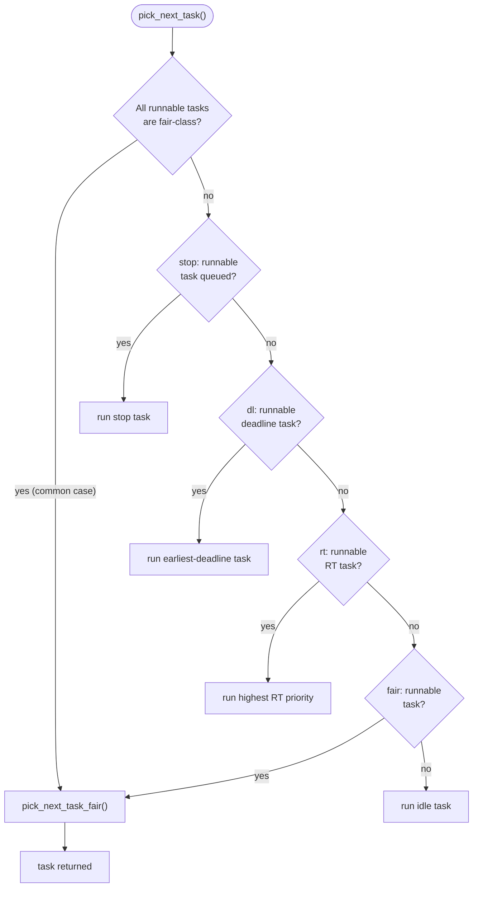

# Runqueues and Scheduling Classes

How does one scheduler support real-time tasks, deadline tasks, ordinary tasks, and the idle task all at
once? It does not. There are several schedulers, arranged in a strict priority order, and the thing
everyone calls "the scheduler" is a loop that asks each of them in turn whether it has anything to run.

## The per-CPU runqueue

Every CPU has exactly one `struct rq` (`kernel/sched/sched.h`), and it is the central piece of state the
whole chapter revolves around. It is not one queue — it is a container holding a sub-runqueue per
scheduling class (`struct cfs_rq cfs`, `struct rt_rq rt`, `struct dl_rq dl`, and, when
`CONFIG_SCHED_CLASS_EXT` is enabled, `struct scx_rq scx`) plus the bookkeeping that spans all of them:
`nr_running` (the total runnable count across every class on this CPU), `clock`/`clock_task` (the
runqueue's own notion of time, updated on every entry to the scheduler), and `curr`/`donor` (the task
currently executing).

Two things fall out of "per-CPU" immediately. First, it is lock-protected (`rq->__lock`) — reading or
modifying a runqueue's state means holding that lock, and the whole scheduler is written around
minimising how long it is held. Second, and more consequentially for anything built on top of this page:
waking a task that last ran on a *different* CPU is not a local list insertion, it is a cross-CPU
operation — taking that other CPU's runqueue lock (or arranging not to), touching cache lines that CPU
owns, and potentially sending it an IPI. This is why wakeup and migration are expensive relative to a
purely local reschedule, and it is the reason the load balancer in
[SMP Load Balancing](./smp-load-balancing.md) exists at all rather than every CPU simply pulling from one
shared list.

## The class hierarchy

Five scheduling classes exist in a strict, fixed priority order — not five options a task chooses between
freely, but five schedulers stacked on top of one another, each getting first refusal on the CPU before
the next is even consulted:

| Class | Schedules | Policies | Selection rule |
|---|---|---|---|
| `stop_sched_class` | The per-CPU stop-machine task | none user-settable | Runs if the stop task is queued at all — used to force this exact CPU idle immediately |
| `dl_sched_class` | Deadline tasks | `SCHED_DEADLINE` | Earliest-deadline-first among runnable deadline tasks |
| `rt_sched_class` | Real-time tasks | `SCHED_FIFO`, `SCHED_RR` | Highest static real-time priority; FIFO or round-robin among equals |
| `fair_sched_class` | Ordinary tasks | `SCHED_OTHER`, `SCHED_BATCH`, `SCHED_IDLE` | The EEVDF weighted-fairness rule — see [EEVDF](./eevdf.md) |
| `idle_sched_class` | The per-CPU idle task | none — never chosen by a real task | Runs only when nothing above has anything runnable |

A runnable task in a higher class always wins, unconditionally, over every task in a lower one. There is
no cross-class weighting or borrowing — that guarantee, and its consequences, is the subject of
"Strict priority has consequences" below.

## `pick_next_task`, and the fast path

`pick_next_task()` (`kernel/sched/core.c`) is conceptually a loop: walk the classes from highest to
lowest, ask each one for a task, and take the first one offered. Read literally, that is what happens on
the slow path — a `for_each_active_class()` iteration that calls each class's `pick_next_task` (or, on
the class-core-scheduling variant, `pick_task`) until one returns non-`NULL`, with the idle class
guaranteed to return something as the last resort.

But the actual function looks stranger than that description, because of an optimisation that matters for
reading the code: if every runnable task on this runqueue belongs to the fair class —
`rq->nr_running == rq->cfs.h_nr_queued` — and the previous task wasn't from a higher class, the function
skips the walk entirely and calls `pick_next_task_fair()` directly. This is the overwhelmingly common
case on an ordinary desktop or server with no real-time or deadline tasks runnable, so the fast path is
not a minor tweak — it is the path actually taken almost all the time, while the "walk every class"
description is what happens only when a higher-priority class has work, or on the (rarer) `sched_ext`
path.

## The class interface

`struct sched_class` (`kernel/sched/sched.h`) is a vtable, in the same sense
[Kobjects, sysfs, and the Object Model](../04-kernel-architecture-and-idioms/kobjects-sysfs-and-the-object-model.md)
used the term for a table of operations attached to a kind of object — except here the "object" is an
entire scheduling policy, and there are exactly five (six, counting `sched_ext`) instances of the table,
one per class, rather than one per task. The members that matter most for understanding what a class
actually has to implement:

| Member | Called when |
|---|---|
| `enqueue_task` | A task becomes runnable and needs to be added to this class's sub-runqueue |
| `dequeue_task` | A task stops being runnable (blocks, is migrated away, or exits) |
| `pick_next_task` | This class is asked "do you have a task to run, and if so which one" |
| `task_tick` | The periodic timer fires while a task of this class is current, to decide whether its slice is up |
| `select_task_rq` | A task is waking up or being created, to decide which CPU it should land on |
| `switched_to` / `switched_from` | A task's class changes (e.g. `sched_setscheduler()` moves it in or out) |

The full struct carries several more members (`balance`, `set_next_task`, `migrate_task_rq`,
`prio_changed`, and others) for load balancing, priority-inheritance, and cgroup bookkeeping — the table
above is the subset that answers "what must a scheduling class actually do," not the complete listing.

## Strict priority has consequences

A runnable `SCHED_FIFO` task at any real-time priority preempts and stays ahead of every fair-class task
on its CPU, indefinitely, for as long as it stays runnable and does not voluntarily yield. This is not a
bug, and it is not an edge case the kernel tries to soften by default — it is the literal meaning of
"strict priority order" from the table above. A CPU-bound `SCHED_FIFO` task with no yields is a completely
ordinary way to lock ordinary tasks off that CPU permanently.

Because that is dangerous — a single misbehaving or malicious real-time task can make a CPU, or with
enough such tasks a whole machine, unresponsive to everything else — RT throttling exists specifically to
put a bound on it. The mechanism itself, and how to tune it, is [Real-Time Scheduling](./real-time-scheduling.md).

## `sched_ext`, at the pinned version

`sched_ext` lets a scheduling policy be written as a BPF program and loaded at runtime, instead of being
compiled into the kernel as one of the four fixed classes above. Checked via context7 against the
`sched-ext/scx` documentation on 2026-09-08: it ships as `ext_sched_class`
(`kernel/sched/sched.h`, gated by `CONFIG_SCHED_CLASS_EXT`), sits between `fair_sched_class` and
`idle_sched_class` in the link-order priority table (`include/asm-generic/vmlinux.lds.h` at v6.18 lists
the section order as stop → dl → rt → fair → ext → idle), and can either coexist with the fair class or,
when a loaded BPF scheduler claims `SCX_OPS_SWITCH_PARTIAL` is not set, take over every fair-class task on
the system (`scx_switched_all()` — the same flag `pick_next_task`'s fast path above checks before
short-circuiting into `pick_next_task_fair()`). A BPF scheduler under `sched_ext` implements its policy
through an ops table with callbacks such as `select_cpu`, `enqueue`, `dispatch`, `runnable`, `running`,
`stopping`, and `quiescent` — a lifecycle interface, not the five-line `sched_class` vtable above, though
the kernel still exposes it to `__pick_next_task()` as one. It is loaded and unloaded like any other BPF
program (`scx_simple`, `scx_rusty`, and other reference schedulers ship in the `sched-ext/scx` repository)
and can be swapped out live without a reboot, which is the entire point: policies that would once have
needed a kernel patch and a rebuild can be iterated on as BPF programs instead. Treat this section as time
-stamped rather than settled — it is the fastest-moving piece of the scheduler, the set of shipped
reference schedulers and the ops table surface both continue to grow release over release, and the
authoritative source for "what does it look like right now" is the `sched-ext/scx` project itself, not
this page.

## The stop class, briefly

`stop_sched_class` sits above everything, including deadline tasks, for one narrow purpose: CPU hotplug
and active migration need the ability to preempt *absolutely anything* running on a specific CPU, right
now, with no exceptions — there is no scheduling policy, however high its priority, that hotplug is
willing to wait behind. The per-CPU stop-machine task exists to give that operation a way to force this
one CPU idle immediately. Without naming this class explicitly, the top of the priority table above would
just look like an unexplained oddity ahead of deadline scheduling.

*How the next task is chosen: five schedulers in strict priority order, and the shortcut taken when only
one of them has work.*

<KernelFacts
  structure={[["struct rq", "kernel/sched/sched.h"], ["struct sched_class", "kernel/sched/sched.h"]]}
  path="__schedule() → pick_next_task() → stop → dl → rt → fair → idle"
  observe="chrt -p $$ && cat /proc/self/sched | head    # the second needs CONFIG_SCHED_DEBUG"
  trap="The classes are strictly ordered, not weighted. One runnable SCHED_FIFO task will run instead of every ordinary task on its CPU for as long as it stays runnable — RT throttling is the only thing that stops a spinning RT task from making a CPU unusable." />

## References

- <Src file="kernel/sched/sched.h" symbol="sched_class" /> — the vtable, whose member list is the
  clearest statement of what a scheduling class must implement; verified at v6.18 (`enqueue_task`,
  `dequeue_task`, `pick_next_task`, `task_tick`, and `select_task_rq` all confirmed present under those
  exact names, alongside `balance`, `pick_task`, `wakeup_preempt`, and others not covered in the table
  above).
- [`man 7 sched`](https://man7.org/linux/man-pages/man7/sched.7.html) — the policy-to-class mapping from
  user space, and the priority ranges each policy accepts.
- [sched-ext/scx documentation, via context7](https://github.com/sched-ext/scx) — checked 2026-09-08 for
  `sched_ext`'s current interface and status; the ops-table callback names and the "coexist or take over
  all fair tasks" behaviour above come from that check.
- [`docs.kernel.org` sched-ext documentation](https://docs.kernel.org/scheduler/sched-ext.html) — the
  in-tree documentation at the pinned v6.18 version, cross-checked against the `ext_sched_class` and
  `CONFIG_SCHED_CLASS_EXT` declarations in `kernel/sched/sched.h` and the section ordering in
  `include/asm-generic/vmlinux.lds.h` at that tag.
- LWN, ["sched: Implement BPF extensible scheduler class"](https://lwn.net/Articles/978911/) — coverage of
  the merge that landed `sched_ext` for 6.12, roughly six releases before this page's pinned v6.18; treat
  it as merge-window history rather than a description of the current interface, which has continued to
  grow since (see the cgroup sub-scheduler and sub-scheduler support that landed afterward).
- [What the Scheduler Must Decide](./what-the-scheduler-must-decide.md) — the three questions this page's
  class hierarchy exists to answer.
