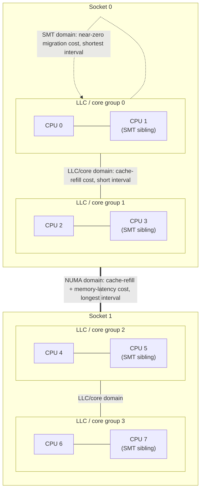

# SMP and Load Balancing

The load balancer lives in a permanent tension. Moving a runnable task onto an idle CPU puts otherwise
wasted hardware to work — that half of the trade is obvious. What is easy to miss is the cost on the
other side of the same move: the task leaves behind whatever of its working set was sitting warm in
that CPU's caches, and on a multi-socket machine it may also be separated from the physical memory it
was allocated near. An idle CPU is not free capacity in the way it looks; it is capacity with strings
attached. The balancer's entire job is guessing, continuously, when putting a task on idle hardware is
worth what it costs — and it guesses using an explicit model of the machine's topology, not a single
global "how busy is everything" number.

## Scheduling domains

The kernel does not see "N CPUs, some busier than others." It builds a hierarchy — `struct
sched_domain` (`include/linux/sched/topology.h`) — that mirrors the hardware's actual sharing structure,
typically several levels deep on real machines:

- **SMT siblings** — logical CPUs sharing one physical core's execution resources (Hyper-Threading on
  Intel, SMT on other vendors).
- **Cores sharing a last-level cache (LLC)** — a modern chip's L3 or equivalent, shared by several
  cores.
- **Sockets** — separate physical packages, each with their own LLC and, usually, their own local
  memory controller.
- **NUMA nodes** — the widest level, where crossing costs not just cache warmth but memory latency,
  because a NUMA node's local memory is faster to reach than another node's.

Each domain in the hierarchy is built from `struct sched_group` (`kernel/sched/sched.h`) members — one
group per set of CPUs the domain can balance across — and each level carries its own balancing
interval and its own notion of what a migration across that level costs. Moving a task between SMT
siblings is nearly free: same core, same caches below the L1/L2, no meaningful warmth lost. Moving it
between sockets is not: different LLC, likely different NUMA node, a real chance of paying both a
cache-refill cost and a memory-latency cost at once. The hierarchy exists specifically so the balancer
can tell these two moves apart instead of treating "CPU 3" and "CPU 47" as interchangeable integers.

## Where the topology comes from

The hierarchy above is not guessed at boot — it is read from firmware tables (ACPI's SRAT/SLIT on
x86-64, describing which CPUs and memory ranges belong to which NUMA node and how far apart the nodes
are) and exposed to userspace under `/sys/devices/system/cpu/cpuN/topology/`: `core_id`,
`physical_package_id`, `thread_siblings_list`, `core_siblings_list`, and related files let a program —
or a curious reader — reconstruct the same picture the kernel built at boot, CPU by CPU. What that
topology means physically — why crossing a socket is slower, why NUMA distance is a real number and not
a rough label — is [NUMA and Memory Topology](../../computer-science/memory-hierarchy/numa-and-memory-topology.md)'s
subject; this page only needs that the kernel has that map and balances against it.

## Two kinds of balancing

Two genuinely different mechanisms move tasks between CPUs, triggered differently and dominant in
different workload shapes:

- **Periodic balancing** — tick-driven. `scheduler_tick()` calls `sched_balance_trigger()`
  (`kernel/sched/core.c`), which — if this CPU's `rq->next_balance` has come due — raises
  `SCHED_SOFTIRQ`. The softirq handler, `sched_balance_softirq()`, calls `sched_balance_domains()`,
  which walks this CPU's domains bottom-up and calls `sched_balance_rq()` at each level whose interval
  has elapsed, pulling work from a busier domain into this one. This is the background mechanism that
  keeps long-run load roughly even without anyone asking for anything.
- **Idle (newidle) balancing** — event-driven. A CPU about to go idle — `pick_next_task()` found
  nothing to run — calls `sched_balance_newidle()` (`kernel/sched/fair.c`), which tries to steal work
  from a nearby domain *before* actually going idle, on the theory that a CPU sitting idle for even a
  short window is capacity being wasted right now.

For most interactive and mixed workloads, the newidle path dominates in practice — it fires far more
often than the tick-driven pass, because CPUs go idle constantly on anything that isn't fully
saturated. It is also the more latency-sensitive of the two: it runs synchronously in the path of a CPU
about to go idle, so it deliberately limits how much domain-walking it will do before giving up and
letting the CPU idle anyway — an unbounded search for work would cost more in decision latency than
the work it might find is worth.

## Wake affinity, and its failure modes

When a task wakes up, the scheduler picks which CPU it lands on from among a small set of candidates:
the CPU that just woke it (the *waker's* CPU — good if waker and wakee share data, since it keeps them
on the same cache), the task's own previous CPU (good for the wakee's own cache warmth), or an idle CPU
found by scanning the LLC domain (good for latency — the task runs immediately instead of queueing).
`WF_SYNC` (`kernel/sched/sched.h`) is the wakeup flag a caller sets when it knows it is about to sleep
right after waking the other task — a hint that biases placement toward the waker's CPU, because the
waker is about to vacate it.

Two classic failure modes come from this same set of heuristics working against a specific access
pattern:

- **A producer-consumer pair pulled onto different LLCs.** If the two tasks that should share a cache
  keep landing on CPUs behind different last-level caches — because the idle-CPU scan found a "better"
  idle candidate elsewhere, or because migration happened to separate them — every handoff between them
  now crosses a cache-coherence boundary that used to be free. The fix is usually to make the
  relationship explicit (affinity, or a cgroup that keeps both tasks in the same LLC-scoped set) rather
  than trusting wake placement to keep rediscovering it every time.
- **A thundering wake placing many tasks on one CPU.** When a single event wakes a large number of
  waiters at once (a futex broadcast, a lock release with many waiters, a barrier), the LLC idle-scan
  can funnel several of them onto the same CPU or the same small group of CPUs before the runqueue
  lengths there are updated to reflect the tasks that just landed — the scan is a snapshot, not a
  transaction. The result looks like the opposite of load balancing: a pile-up on one CPU while others
  sit idle, self-correcting only once the periodic or newidle balancer catches up.

## Migration cost

The balancer will not casually move a task that ran very recently on its current CPU, on the
assumption that a task which just ran still has a warm cache footprint there, and moving it throws that
warmth away for nothing — the migration cost this section is named after. At v6.18 that assumption is
encoded as a
tunable, `sysctl_sched_migration_cost` (`kernel/sched/fair.c`), defaulting to `500000` — 500,000
nanoseconds, half a millisecond — and exposed at `/sys/kernel/debug/sched/migration_cost_ns` (requires
`CONFIG_SCHED_DEBUG` and debugfs mounted, not a plain `/proc/sys` sysctl). A task that last ran less
than this many nanoseconds ago is treated as still cache-hot and is a much less attractive migration
candidate; raising the value makes the balancer more reluctant to move recently-run tasks, lowering it
makes migration more aggressive.

## `cpusets`, affinity, and isolation

Three mechanisms let something outside the balancer's own heuristics decide where a task can run,
at increasing scope:

- **`sched_setaffinity()`** — per-task. Pin one task (or restrict it) to an explicit CPU set; the
  balancer will never place it outside that set, full stop.
- **`cpuset` cgroups** — per-group. The cgroup v2 `cpuset` controller does the same thing for an entire
  group of tasks at once, which is how containers get their "these are your CPUs" boundary — see
  [cgroup CPU Control](./cgroup-cpu-control.md) for the weight/quota side of the same controller family.
- **`isolcpus` and `nohz_full`** — boot-time, per-CPU. These remove a CPU from the balancer's reach
  almost entirely rather than restricting which tasks may use it: `isolcpus` keeps the general scheduler
  from placing ordinary tasks there at all, and `nohz_full` additionally stops the periodic timer tick
  on that CPU when it has only one runnable task — see
  [The Tick and NOHZ](../10-interrupts-time-and-deferred-work/the-tick-and-nohz.md) for what the tick
  actually does and what stopping it changes — so a task pinned there is not just balancer-isolated but
  also freed from routine timer-interrupt jitter. Combined, they are how a latency-critical task gets a
  CPU that behaves less like part of a general-purpose scheduler's domain and more like a dedicated
  core.

## "My thread moved CPUs and got slower"

**Confirm it first**, don't guess: `perf stat -e migrations,context-switches -- ./workload` reports
how many times the task actually migrated during a run, and the same per-CPU counters are visible over
time in `/proc/<pid>/status` (`voluntary_ctxt_switches` / `nonvoluntary_ctxt_switches`, from
[The Context Switch](./the-context-switch.md)) and via `/sys/devices/system/cpu/cpu*/topology/` if the
question is *which* CPUs it bounced between and how far apart they are in the domain hierarchy. A
migration count that tracks a latency regression is real evidence; a slow run with no elevated migration
count means look elsewhere.

**What to do about it**, once confirmed, is genuinely two different answers depending on cause:

- If the task is being bounced by wake-affinity heuristics fighting its access pattern (the
  producer-consumer or thundering-wake cases above), pin it — `sched_setaffinity` or a `cpuset` — and
  stop asking the balancer to keep re-deriving a placement decision it can't get right from the
  information it has.
- If the task is being *legitimately* moved because the machine is genuinely imbalanced — some CPUs
  idle, this task's CPU oversubscribed — pinning it just trades "occasionally migrated" for
  "permanently starved of a CPU that would otherwise have picked it up." The balancer was doing its job.

The test that tells the two apart: pin the task and measure again. If throughput or tail latency
improves, the migrations were the problem and the pin is the fix. If pinning makes it *worse* — more
time spent waiting for its now-single CPU than it ever lost to migration — the balancer was moving it
for a good reason, and the real fix is giving the workload enough CPUs that it does not need to compete
for the one it is pinned to. Pinning is often the right answer and often the wrong one; only the
before/after measurement says which, for this workload, on this machine.

*The domain hierarchy the balancer walks, and why a migration's cost depends entirely on which level it
crosses.*

<KernelFacts
  structure={[["struct sched_domain", "include/linux/sched/topology.h"], ["struct sched_group", "kernel/sched/sched.h"]]}
  path="scheduler_tick() → sched_balance_trigger() → raise_softirq(SCHED_SOFTIRQ) → sched_balance_softirq() → sched_balance_domains() → sched_balance_rq()"
  observe="perf stat -e migrations,context-switches -- ./workload && cat /sys/devices/system/cpu/cpu0/topology/thread_siblings_list"
  trap="An idle CPU is not free capacity. Pulling a task onto it costs the task its warm caches, and on a two-socket machine it can cost the task its local memory too — which is why the balancer deliberately leaves CPUs idle." />

## References

- [Scheduling Domains](https://docs.kernel.org/scheduler/sched-domains.html) — the in-tree description
  of the domain hierarchy and the flags at each level.
- <Src file="kernel/sched/fair.c" symbol="sched_balance_rq" /> — the balancing pass itself. Verified
  against Elixir at v6.18: defined at `kernel/sched/fair.c`, called from both
  `sched_balance_domains()` (the periodic path) and `sched_balance_newidle()` (the newidle path). Note
  that older material still names the two functions above it in the call chain as `trigger_load_balance`
  and `run_rebalance_domains` — both have since been renamed, per the `path` card above.
- Lozi et al., ["The Linux Scheduler: a Decade of Wasted Cores"](https://people.ece.ubc.ca/sasha/papers/eurosys16-final29.pdf),
  EuroSys 2016 — four real load-balancing bugs found by building the right tooling; predates the pinned
  kernel by close to a decade, and the function names it discusses are stale, but the *method* — build
  instrumentation, don't guess — is the lasting contribution.
- [`man 2 sched_setaffinity`](https://man7.org/linux/man-pages/man2/sched_setaffinity.2.html) and
  [`man 7 cpuset`](https://man7.org/linux/man-pages/man7/cpuset.7.html) — the override mechanisms.
