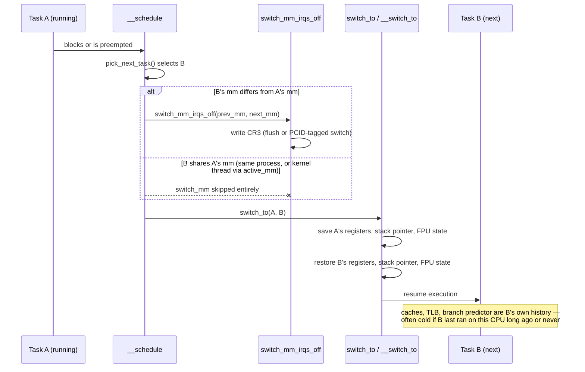

# The Context Switch

A context switch is both smaller and larger than people think. The part with a name — saving one
task's registers and loading another's — is a few dozen instructions, done in a few hundred
nanoseconds. The part that actually shows up in a profile has no name and is paid by someone else: the
incoming task starts running with cold caches, cold TLB entries, and a branch predictor trained on a
different program, and it pays that cost gradually, instruction by instruction, in a place no sampling
profiler attributes back to the switch. This page walks the small, nameable part first, then measures
the large, invisible one.

## The three steps

Every context switch on this CPU goes through the same three stages, and it matters to keep them
separate because they have completely different costs:

1. **`__schedule`** picks the next task to run — the subject of
   [Runqueues and Scheduling Classes](./runqueues-and-scheduling-classes.md) and
   [EEVDF](./eevdf.md). This is bookkeeping: runqueue lookups, no register or address-space state
   touched yet.
2. **`context_switch`** swaps the address space, *if it changed*. This is the expensive, conditional
   half — see [`switch_mm`, and when it is skipped](#switch_mm-and-when-it-is-skipped) below.
3. **`switch_to`** swaps the register state and the kernel stack pointer unconditionally, every single
   switch, address space or no. This is the cheap, unconditional half — see
   [`switch_to`, and what the hardware does not do](#switch_to-and-what-the-hardware-does-not-do).

`context_switch()` (`kernel/sched/core.c`) is the function that runs steps 2 and 3 in order, once
`__schedule` has decided who runs next.

## `switch_mm`, and when it is skipped

Step 2 is conditional on one question: does the next task use a different `mm_struct` than the task
being switched out? If the next task is a thread of the *same* process — same address space, same page
tables — the answer is no, and `switch_mm_irqs_off()` returns almost immediately without touching
`CR3` at all. If the next task is a kernel thread, it has no `mm` of its own and borrows the outgoing
task's via `active_mm`, which is also a skip. Only a switch between two tasks with genuinely different
address spaces — the ordinary case of switching between two different processes — pays the full cost
below.

This is the concrete, measurable sense in which "switching between threads is cheaper than switching
between processes" is not a vague performance folk-belief: it is one `if` statement's worth of
difference, and the branch it takes removes an entire category of hardware work.

## The TLB consequence

When `switch_mm_irqs_off()` (`arch/x86/mm/tlb.c`) does have to act, the mechanism is a write to `CR3`
pointing at the next task's page tables — and on x86-64 that write's cost depends on whether PCID
(Process-Context Identifiers) is in use. Without PCID, a `CR3` write is a global TLB flush: every
translation the CPU cached, for every address space, is thrown away, and the next task refills its
working set of translations one page-fault-free walk at a time as it touches memory. With PCID, each
address space carries a small tag, TLB entries are tagged with it, and a `CR3` write can leave
same-tag entries intact — the switch invalidates far less. This page states the shape of the cost
only; the tagging mechanism, the invalidation rules, and how to observe it are
[TLB and Address-Space Switching](../08-memory-management/tlb-and-address-space-switching.md)'s subject,
not this page's.

## `switch_to`, and what the hardware does not do

x86-64 Linux does not use the hardware task-switch mechanism the architecture offers (the TSS-based
hardware task gate) — it never has been the fast path, and the kernel does the entire register save and
restore itself in software. `__switch_to()` (`arch/x86/kernel/process_64.c`) saves the outgoing task's
callee-saved general-purpose registers onto its kernel stack, saves a handful of segment-related and
FS/GS-base fields into `struct thread_struct` (`arch/x86/include/asm/processor.h`), switches the stack
pointer to the incoming task's kernel stack, and restores the mirror image for the incoming task.

The detail that makes the code disorienting to read the first time: `switch_to()` does not return to
its caller in the normal sense. It swaps the stack pointer mid-function and then "returns" — but the
return address it pops now belongs to a *different task's* saved context, possibly one that was itself
in the middle of its own `switch_to()` the last time it was switched out. A task can call
`schedule()` and, instructions later, resume execution as if `switch_to()` had simply returned,
having spent an arbitrary amount of wall-clock time — and had other tasks run on this CPU entirely —
in between. This is also why the FPU handling below sits where it does in the source: it has to happen
around this stack-pointer swap, not before or after it as an independent step.

## FPU and extended state

A task's floating-point and vector register state (SSE, AVX, and — on hardware with AVX-512 — a
considerably larger state area) is saved and restored with `XSAVE`/`XRSTOR` family instructions,
sized to whatever extended state the running CPU actually implements. This is real, per-switch cost,
and unlike the general-purpose register save in `__switch_to()`, it does not have a fixed size: a
workload that touches AVX-512's wide registers has more state to save than one that never leaves the
legacy SSE registers, so the same switch costs measurably more on a wide-vector workload than on a
scalar one.

The kernel does not save and restore this state unconditionally on every switch if it can avoid it.
The extended-state area is tracked lazily where possible — a task that has not used the FPU since it
was last scheduled does not need a fresh restore — so the actual per-switch FPU cost is workload-
dependent: near zero for a task that never touches vector registers, and the full `XSAVE`/`XRSTOR`
cost, scaled to the state size in use, for one that does.

## What actually happens

**Predicted, from the source above:** the *direct* cost of one switch — the register save/restore in
`__switch_to()` plus the surrounding `__schedule()`/`context_switch()` bookkeeping, with `switch_mm`
skipped — should be small: high hundreds of nanoseconds to low microseconds on modern x86-64 hardware,
consistent with "a few dozen instructions" scaled up by the kernel-entry and scheduler-decision
overhead around them.

**Measured, in this sandbox** — an Intel Core i5-12600KF (12th Gen, x86-64), 10 logical CPUs visible
to this environment (it is a WSL2 virtual machine on that host, not bare metal — see the note below),
kernel 6.18.33-microsoft-standard-WSL2. Direct cost, via a ping-pong benchmark: two processes pinned to
separate CPUs (`taskset`-equivalent `sched_setaffinity`) exchange a single byte over a pair of pipes in
a tight loop. Each round trip forces at least two context switches — the reader blocks and is woken
twice — so round-trip time divided by two approximates one switch's direct cost:

```text
$ ./pingpong 200000        # 200,000 round trips, warm-up excluded
iterations: 200000
round-trip: 24320.2 ns
per-context-switch (round-trip/2): 12160.1 ns
```

Five repeated runs landed in a tight 12.16–12.33 µs band. That is well above the "few hundred
nanoseconds" a bare-metal x86-64 box typically shows for this exact benchmark, and the gap is honestly
attributable to the environment: this is a Hyper-V-backed WSL2 VM, and every one of these switches also
pays a guest/host boundary cost (VM-exit-adjacent overhead in the wakeup and scheduling path) that a
native kernel does not. The number is real and reproducible in this sandbox; it should not be read as
"what a context switch costs on x86-64 in general," only as this virtualized environment's honest
answer to the same question the direct-cost benchmark is designed to isolate.

**Indirect cost**, measured by comparing a cache-resident workload pinned to one CPU against the same
workload forced to migrate CPUs before every pass: repeatedly summing a 256&nbsp;KiB buffer (sized to
stay resident in L2, not L1) for 20,000 passes, warm-up excluded.

```text
$ ./migrate pinned            # stays on CPU 0 the whole run
mode: pinned to cpu0
ns per pass: 3454.1

$ ./migrate migrate           # sched_setaffinity(cpu0 <-> cpu2) before every pass
mode: migrate every pass (cpu0<->cpu2)
ns per pass: 17644.8
```

Pinned, one pass costs ~3.45 µs. Forced to migrate every pass — which, mechanically, means this
thread's caches on the CPU it just left are cold on the CPU it lands on — one pass costs ~17.6 µs, a
**5.1× slowdown**, for a workload whose instruction count did not change at all. That gap is the
indirect cost this section opened by predicting: not the switch itself, but what the incoming context
finds cold. It dwarfs the ~12 µs direct cost measured above, and on hardware without this sandbox's
virtualization tax the gap between direct and indirect cost would be even more lopsided, because the
direct cost would shrink toward its bare-metal few-hundred-nanosecond figure while the cache-refill
cost stays governed by cache and memory latency, not by the hypervisor.

The practical consequence: a program trying to go faster by "reducing context switches" is very often
solving the wrong problem. What it actually wants is fewer *wakeups* — fewer times a task blocks and
is later woken, each of which both costs a direct switch and risks landing the task somewhere its
caches are cold. Batching work to avoid blocking, or avoiding unnecessary cross-thread signaling, moves
the number that matters; making the switch machinery itself faster does not exist as a lever a userspace
program can pull.

## Voluntary versus involuntary

`/proc/<pid>/status` exposes two running counters that classify every context switch a task has been
through:

| Field | Incremented when | Indicates |
|---|---|---|
| `voluntary_ctxt_switches` | The task blocks itself — a syscall that sleeps: I/O wait, a lock, `sleep()`, waiting on a futex | The task ran out of *work*, not out of time |
| `nonvoluntary_ctxt_switches` | The task is still runnable but is preempted — its slice ran out, or a higher-priority task became runnable | The task ran out of *CPU*, not out of work |

```bash
grep -E 'voluntary_ctxt|nonvoluntary_ctxt' /proc/self/status
```

Reading the ratio is a first, cheap diagnostic step. A task dominated by voluntary switches is
I/O-bound or blocking-bound by design — a server thread waiting on the network, a worker waiting on a
queue — and a high voluntary count there is not evidence of a problem. A task that is supposed to be
CPU-bound but shows a rising *involuntary* count is being preempted more than expected, which points at
contention: too many runnable tasks for the CPUs available, or a higher-priority class (real-time,
deadline) crowding it out — see
[Diagnosing Scheduling Latency](./diagnosing-scheduling-latency.md) for the next step past this counter.

## Misconceptions

1. **"Context switches are expensive because saving registers is slow."** The register save/restore in
   `__switch_to()` is the cheap, nameable part — a few dozen instructions, measured above at low
   single-digit microseconds even in a virtualized sandbox. The expense is almost entirely the *indirect*
   cost paid afterward by cold caches and a cold TLB, which the register save itself has nothing to do
   with.
2. **"A thread switch is free."** It skips the address-space switch — `switch_mm` — which is real
   savings and the one legitimate sense in which thread switches are cheaper than process switches. But
   `switch_to()` still runs unconditionally, the CPU's caches and branch predictor still hold whatever
   the *previous* task left there, and the FPU/vector state may still need saving and restoring. Cheaper
   than a process switch, not free.
3. **"High context-switch counts are bad."** A high *voluntary* count usually means a workload that is
   correctly I/O-bound or event-driven — it is asking to block, getting what it asked for, and doing
   exactly what it should. The number worth watching with suspicion is a high or rising *involuntary*
   count, which is the one that indicates the task wanted the CPU and didn't get it promptly.



*One context switch, with the address-space step that a thread-to-thread switch skips entirely.*

<KernelFacts
  structure={[["struct task_struct", "include/linux/sched.h"], ["struct thread_struct", "arch/x86/include/asm/processor.h"]]}
  path="__schedule() → context_switch() → switch_mm_irqs_off() → switch_to() → __switch_to()"
  observe="grep ctxt /proc/stat && grep -E 'voluntary_ctxt|nonvoluntary_ctxt' /proc/self/status"
  trap="The measurable cost of a context switch is paid *after* it, by the task that just started running and finds its caches cold. Benchmarks that measure the switch itself measure the small part." />

## References

- <Src file="arch/x86/kernel/process_64.c" symbol="__switch_to" /> — the x86-64 register and segment
  work, with the FPU handling visible; confirmed defined here at v6.18 (also present, separately, in
  `process_32.c` for the 32-bit build).
- <Src file="arch/x86/mm/tlb.c" symbol="switch_mm_irqs_off" /> — the address-space switch and the PCID
  logic; confirmed as the x86-64 definition at v6.18 (other architectures define their own
  `switch_mm_irqs_off`, each in its own `mmu_context.h`).
- Li, Ding & Shen, ["Quantifying the Cost of Context Switch"](https://www.cs.rochester.edu/u/cli/research/switch.pdf),
  ExpCS 2007 — the paper that separated direct from indirect cost experimentally; old, and the
  methodology (measure a cache-resident workload with and without forced migration) is exactly what
  this page's indirect-cost benchmark above reproduces.
- [`man 5 proc`](https://man7.org/linux/man-pages/man5/proc.5.html), the `status` fields — for the two
  context-switch counters and what each one means.
