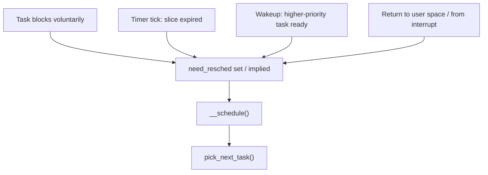

# What the Scheduler Must Decide

"The scheduler" is not one algorithm answering one question. It answers three: which runnable task
should this CPU run next, how long should it run before we reconsider, and which CPU should this task
be on at all. They have different inputs, different time scales, and different code, and treating them
as one thing is why scheduler documentation is so often confusing.

[Process States and Wait Queues](../06-processes-and-threads/process-states-and-wait-queues.md) already
established the boundary this folder starts from: `TASK_RUNNING` means *runnable*, not running, and which
runnable task actually gets a CPU is "the scheduler's business" — this is that business, in full.

## Three questions, three mechanisms

| Question | Time scale | Answered by | Answered badly, you get |
|---|---|---|---|
| Which runnable task runs next on this CPU? | Nanoseconds — every reschedule | `pick_next_task()`, walking the scheduling classes | The wrong task runs while a higher-priority one waits |
| How long should it run before we reconsider? | Milliseconds — one time slice | The scheduler tick and the per-class slice calculation | Either excessive context-switch overhead (slices too short) or unresponsive interactive tasks (slices too long) |
| Which CPU should this task be on? | Tens of milliseconds — periodic rebalancing, plus wakeup time | The load balancer and `select_task_rq` | Idle CPUs sit idle while others queue up, or cache-hot state gets migrated away for nothing |

Each row is a separate piece of code, tuned against a separate cost. Confusing them — asking "why did the
scheduler pick this task" when the actual question is "why did the load balancer put it on this CPU" — is
the single most common way to get lost reading this part of the kernel.

## What the scheduler is actually optimising

Four things pull against each other: throughput, latency, fairness, and power. None of them can be
maximised without cost to at least one of the others, and every scheduler discussed in this folder is a
position on that trade-off, not a solution to it.

The clearest instance of the conflict: minimising context switches — letting each task run to completion,
or for as long as possible, before switching — maximises throughput, because every switch costs a
pipeline flush, a cache-cold restart, and (with a full address-space change) a TLB flush. That same
choice maximises latency for everyone else waiting, because the CPU is unavailable to them for longer.
There is no scheduling policy that improves both at once for a fixed set of runnable tasks; a scheduler
can only choose where on that line to sit, and can choose differently for different tasks (interactive
versus batch) or differently under different administrator settings.

## What it does not decide

Naming the boundary makes the rest of the folder tractable. The scheduler does not decide:

- **When a task blocks.** The task does, by calling something that puts it on a wait queue —
  [Process States and Wait Queues](../06-processes-and-threads/process-states-and-wait-queues.md) covers
  the mechanism in full. The scheduler is *entered* as a consequence of a block; it does not initiate one.
- **When a task becomes runnable.** A wakeup does — `wake_up()` / `try_to_wake_up()` moving a task off a
  wait queue and onto a runqueue. The scheduler decides what happens once the task is there, not whether
  or when it arrives.
- **Priority policy.** `sched_setscheduler()` (and the `nice`/`sched_setattr` family behind it) sets what
  class and priority a task is in. The scheduler enforces that assignment; it does not choose it.

## Where the scheduler is entered from

There are four distinct paths into the scheduler, and only the first is a "call to the scheduler" in the
way people usually imagine it:

1. **Voluntary block.** A task calls something that cannot proceed — `read()` on an empty pipe, a mutex
   already held, `sleep()` — and that call eventually invokes `schedule()` directly, giving up the CPU on
   its own initiative.
2. **Tick preemption.** The periodic timer interrupt calls `sched_tick()`, which asks the current task's
   scheduling class whether it has had its slice; if so, `TIF_NEED_RESCHED` is set and the reschedule
   happens at the next opportunity below.
3. **Wakeup preemption.** A task becomes runnable (case above) and turns out to outrank whatever is
   currently running; the wakeup path sets `TIF_NEED_RESCHED` on the CPU running the lower-priority task,
   but — critically — a wakeup does not call `schedule()` itself. It only flags that a reschedule is due.
4. **Return-to-user / return-from-interrupt check.** Every exit back to user space, and every return from
   an interrupt handler to a preemptible context, checks `TIF_NEED_RESCHED` and calls `schedule()` if it
   is set. This is where cases 2 and 3 actually take effect.

All four converge on the same function, `__schedule()`, which in turn calls `pick_next_task()` to answer
the first of the three questions above.

## Preemption is the whole difficulty

Preemption — interrupting a running task before it volunteers to stop — is what makes cases 2 and 3
possible, and it is the source of nearly every hard trade-off in this folder. It costs a context switch
and everything that comes with one: a cold cache, a cold TLB, a cold branch predictor, for the task being
switched in. What it buys is bounded latency — a guarantee that a high-priority task will not wait
indefinitely behind a low-priority one that never blocks. Where the kernel allows itself to be preempted,
and where it deliberately does not, is its own subject: [Preemption Models](./preemption-models.md).

## What this folder covers, and what CS owns

The algorithmic theory of scheduling — round robin, multilevel feedback queues, fair queueing as a
concept, the theory behind deadline scheduling — is owned by
[Scheduling](../../computer-science/operating-systems/scheduling.md) in the computer-science section, and
this folder does not re-teach it. What follows here is what Linux actually implements: the data
structures, the class hierarchy, the concrete algorithms (CFS/EEVDF, the real-time classes,
`sched_ext`), and how to observe and debug them on a running system.

*The four events that reach the scheduler, and the one path they all converge on.*

<KernelFacts
  structure={[["struct rq", "kernel/sched/sched.h"], ["struct task_struct", "include/linux/sched.h"]]}
  path="blocking call / tick / wakeup / return-to-user → need_resched → __schedule() → pick_next_task()"
  observe="grep -E 'ctxt|processes|procs_running|procs_blocked' /proc/stat"
  trap="There is no scheduler thread. schedule() runs in the context of whatever task is giving up the CPU, which is why scheduling cost is charged to the task that was descheduled rather than to a system process you can find in top." />

## References

- [Scheduler documentation](https://docs.kernel.org/scheduler/index.html) — the scheduler documentation
  index at the pinned version, and the entry point for every claim in this folder.
- [`man 7 sched`](https://man7.org/linux/man-pages/man7/sched.7.html) — the user-visible model: policies,
  priorities, and the guarantees each policy makes.
- <Src file="kernel/sched/core.c" symbol="__schedule" /> — the function all four entry points reach;
  verified at v6.18, its header comment enumerates the same three entry mechanisms described above
  (explicit blocking, the `TIF_NEED_RESCHED` check on interrupt/syscall return, and wakeups that only set
  the flag rather than calling `schedule()` themselves).
- [Scheduling](../../computer-science/operating-systems/scheduling.md) — the algorithmic theory this
  folder deliberately does not repeat.
