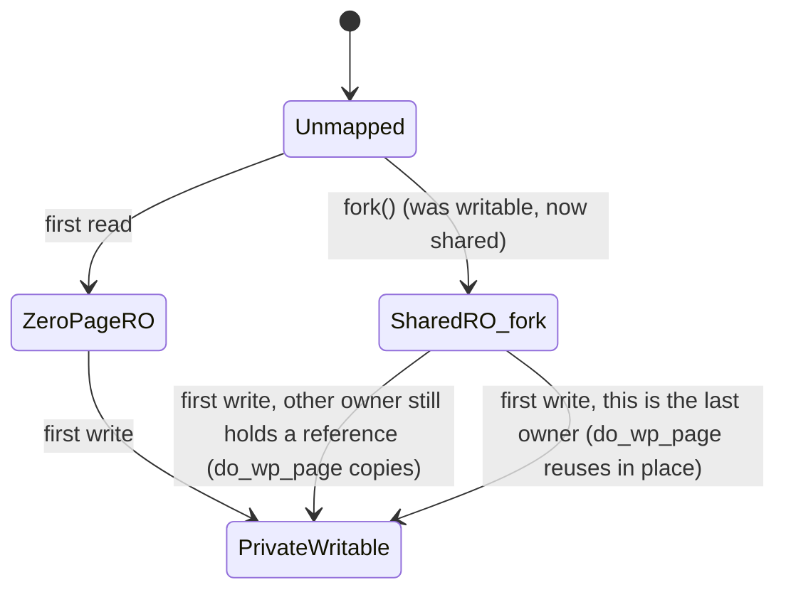

# Demand Paging and Copy-on-Write

[The Page Fault Handler](./the-page-fault-handler.md) named `do_anonymous_page()` and `do_wp_page()` as
two leaves of its classification tree without dwelling on them. This page is that dwelling — it's the
policy those two functions implement, stated plainly: **never do work until someone proves they need it.**
Address space is free — a VMA is bookkeeping, a handful of bytes in a maple-tree node — and physical pages
are not. Linux issues the first liberally, on the promise that most of it will never be touched. This is
also, directly, why memory accounting on Linux confuses almost everyone who first encounters it: `top`,
`ps`, and `/proc/PID/status` are each answering a slightly different question, and the confusion is a
straight consequence of a deliberate design choice, not an accident of bad tooling.

## First touch

`mmap()` — directly, or via `malloc()`'s large-allocation path — creates a VMA and maps **no pages**. The
first *read* of a freshly mapped anonymous page doesn't allocate anything either: `do_anonymous_page()`
maps the shared [zero page](#the-zero-page) into the faulting address, read-only. Only the first **write**
allocates a real, private, zeroed physical page.

This read/write asymmetry is worth stating explicitly, because it has a consequence programmers routinely
get wrong: a program that `mmap()`s a large region and only *reads* it — scanning for a value, say, without
writing — uses almost no physical memory no matter how large the region is. The first write is the event
that actually costs something.

## The zero page

`empty_zero_page` is one physical page, filled with zeros, shared read-only by every process on the
system for every untouched anonymous read. Defined in `arch/x86/kernel/head_64.S`:

```asm
__PAGE_ALIGNED_BSS
SYM_DATA_START_PAGE_ALIGNED(empty_zero_page)
    .skip PAGE_SIZE
SYM_DATA_END(empty_zero_page)
EXPORT_SYMBOL(empty_zero_page)
```

`do_anonymous_page()` maps it in for a read fault with `pfn_pte(my_zero_pfn(address), ...)` — the *same*
physical frame, mapped read-only into however many processes have touched however many untouched pages.
It's cheap (one physical page, system-wide, no matter how many mappings point at it) and elegant (it
requires no special-casing anywhere else: the PTE that results looks like an ordinary present, read-only
entry to everything downstream), and it's the reason `calloc()` of a large region can be nearly free —
`calloc` promises zeroed memory, and mapping the zero page read-only satisfies that promise for every page
the caller never writes to, without allocating or zeroing anything real.

## COW after fork

[folder 06](../06-processes-and-threads/the-process-address-space.md) described `fork()`'s
copy-on-write behavior from the process side; this is the same mechanism in `mm` terms. `fork()` doesn't
duplicate physical pages — it duplicates the parent's page tables, marking every writable anonymous PTE
**read-only** in both the parent's and the child's tables (both processes now share the same physical
pages, temporarily, neither with write access). The first write by either process — `X86_PF_WRITE` set,
[The Page Fault Handler](./the-page-fault-handler.md#the-classification-tree)'s "present, read-only, write
access" leaf — lands in `do_wp_page()`.

`do_wp_page()` doesn't unconditionally copy. It first checks whether this process is provably the *only*
remaining owner of the page — `PageAnonExclusive()`, or a folio refcount/mapcount check
(`wp_can_reuse_anon_folio()`) confirming no other mapping references it — and if so, **reuses the same
physical page in place**, just flipping the PTE back to writable. Only when the page is genuinely shared
does it allocate a fresh page and copy (`wp_page_copy()`). This distinction is worth a paragraph on its
own, because it's exactly why a `fork()`-then-immediately-`exit()` child (the shape of every `system()`
call, every shell pipeline, every process-per-request server before it execs something else) costs almost
nothing: by the time the parent or child writes anything at all, the *other* side has often already
released its reference, and the write becomes a cheap in-place reuse rather than a copy.



*One anonymous page's states, and the two events that move it: the first read, and the first write.*

## What actually happens

Take `malloc(100 * 1024 * 1024 * 1024)` — a 100 GiB allocation — on a machine that does not have 100 GiB
of RAM, and walk what actually happens, with real numbers from the machine this page was written on
rather than an invented transcript.

**This machine:** `MemTotal` 20481144 kB (≈19.5 GiB), `SwapTotal` 10485760 kB (10 GiB) — call it ≈29.5 GiB
of RAM+swap combined — with `vm.overcommit_memory = 0` (the default heuristic mode; see [Overcommit
modes](#overcommit-modes) below).

glibc's `malloc()` routes any allocation past `M_MMAP_THRESHOLD` (a few hundred KB) directly to `mmap()`
rather than extending the heap with `brk()`. A real 100 GiB request on this machine:

```text
$ ./malloc_demo 100
Requesting malloc of 107374182400 bytes (100 GiB)
malloc FAILED (returned NULL)
```

It fails — and this is itself the honest, real result on a machine with ≈29.5 GiB of RAM+swap, not a
manufactured "succeeds on 8 GB" scenario. Under overcommit mode 0, the kernel's `__vm_enough_memory()` heuristic refuses an "obvious"
overcommit — roughly, a request too large relative to total RAM+swap — and 100 GiB against ≈29.5 GiB of
combined RAM+swap trips that refusal. Binary-searching the actual boundary on this machine:

```text
$ ./malloc_demo 30   →  malloc FAILED (returned NULL)
$ ./malloc_demo 28   →  malloc succeeded, base address = 0x742169dff010
```

28 GiB — comfortably past the 19.5 GiB of physical RAM, safely under the ≈29.5 GiB RAM+swap ceiling —
succeeds. That number *is* this page's "100 GB malloc on an 8 GB machine": a successful allocation for far
more memory than physically exists, made possible because a successful `mmap()` is a promise about address
space, not a guarantee of physical pages. The `maps` entry and RSS immediately after:

```text
maps entry: 742169dff000-742869e00000 rw-p 00000000 00:00 0
--- after malloc, before touching anything ---
VmSize: 29362908 kB   (≈28 GiB — the full request, reserved)
VmRSS:      1892 kB   (≈1.8 MB — this process's baseline; none of it is the new mapping)
VmData:  29360360 kB
```

`VmSize` already reflects the entire 28 GiB — the address space exists. `VmRSS` — the resident set,
physical pages actually backing this process — is unchanged from before the call: the mapping is real to
the page tables' *absence* of entries, and to nothing else yet.

Then, touching one byte per gigabyte (28 touches, one per GiB of the mapping) and reading `VmRSS` after
each:

```text
touched byte 1  (offset  0 GiB) -> VmRSS = 1892 kB
touched byte 2  (offset  1 GiB) -> VmRSS = 1896 kB
touched byte 3  (offset  2 GiB) -> VmRSS = 1900 kB
touched byte 4  (offset  3 GiB) -> VmRSS = 1904 kB
   ...
touched byte 28 (offset 27 GiB) -> VmRSS = 2000 kB
--- after touching one byte per GiB, all touches done ---
VmRSS: 2000 kB
```

RSS rises by exactly 4 kB — one `PAGE_SIZE` (`getconf PAGESIZE` confirms 4096 on this machine) — per touch,
for 27 of the 28 touches (1892 → 2000 kB is a 108 kB rise, 27 × 4 kB). The first touch (offset 0 GiB)
shows no visible rise: glibc's `mmap`-backed allocator writes a small chunk header into the start of a
large `mmap()`-obtained region as part of `malloc()`'s own bookkeeping, so the very first page of this
particular allocation was already resident *before* the demo ever wrote to it — a real, if slightly
surprising, artifact of glibc's allocator rather than a discrepancy in the kernel's accounting. Every
subsequent touch lands on a genuinely untouched page and costs exactly one page of RSS, matching
[First touch](#first-touch) precisely: a successful `malloc()` reserved 28 GiB of address space instantly,
and each gigabyte only became real, physical memory the instant this code wrote to it.

## Overcommit modes

`vm.overcommit_memory` (`/proc/sys/vm/overcommit_memory`) controls how strictly the kernel enforces the
"can I actually back everything I've promised" question at allocation time, not at fault time:

- **`0` — heuristic (the default, and this machine's setting).** The kernel refuses allocations it judges
  an "obvious" overcommit — the `__vm_enough_memory()` check demonstrated above — but is otherwise
  permissive: normal-sized allocations, even ones that collectively exceed physical RAM, are allowed on
  the expectation that most memory promised is never fully touched at once.
- **`1` — always overcommit.** No accounting check at all; every `mmap()`/`brk()` extension is allowed
  regardless of how much has already been promised. Useful for workloads (some scientific/HPC code) that
  deliberately reserve far more address space than they'll ever use and would rather never see `malloc`
  fail.
- **`2` — strict.** Total committed address space across the system is capped at `swap +
  physical_RAM × overcommit_ratio / 100` (`vm.overcommit_ratio`, default 50 on this machine — or
  `vm.overcommit_kbytes` for an absolute figure instead of a percentage). Once that cap is reached,
  allocation requests fail outright.

The practical guidance is worth stating honestly rather than diplomatically: mode 2 moves allocation
failure from "the OOM killer picks a victim process at some unpredictable later moment, possibly not even
the process that over-allocated" to "`malloc()` returns `NULL` right now, at the call site that asked for
too much." That's exactly what some workloads (databases, anything that must never be silently killed)
want — and it's also a mode most ordinary software is not written to handle, because most software treats
"`malloc` never really fails" as an unstated assumption baked into decades of C and C++ code that never
checks the return value.

## `MAP_POPULATE`, `mlock`, and pre-faulting

Three ways to demand physical pages *now*, at mapping time, instead of paying for each one lazily at first
touch:

- **`mmap(..., MAP_POPULATE, ...)`** asks the kernel to pre-fault the entire mapping as part of the
  `mmap()` call itself — the pages are resident by the time `mmap()` returns, at the cost of `mmap()`
  itself now doing all the work every future touch would otherwise have spread out.
- **`mlock()`/`mlockall()`** goes further: it pre-faults *and* pins the pages, preventing reclaim from
  ever evicting them. `MAP_POPULATE` alone doesn't stop the pages from later being reclaimed under memory
  pressure and re-faulted.
- **Manual pre-faulting** — simply looping over the region writing a byte per page yourself — achieves the
  same resident-and-mapped effect as `MAP_POPULATE` without a dedicated flag, useful when the mapping
  already exists and can't be re-created with the flag.

Worth it for real-time or latency-sensitive work specifically, where a page fault mid-critical-section is
a latency spike the workload cannot tolerate — audio processing, some trading systems, anything with a
hard deadline. The cost is exactly what demand paging was designed to avoid: paying for pages that might
never be touched, up front, unconditionally.

## Where the accounting goes wrong

`/proc/meminfo`'s `Committed_AS` — the sum of everything the kernel has *promised*, across every process,
under the current overcommit accounting rule — and `CommitLimit` — the ceiling that promise is checked
against under mode 2 (informational under modes 0 and 1) — are the two fields that actually answer "is
this machine over-promised," and neither is what most people reach for first. `VSZ` (virtual size, `ps`'s
`VSZ` column, `VmSize` above) is nearly meaningless as a "how much memory is this process using" answer
precisely because of everything on this page: it counts address space reserved, not physical memory
resident, and a process can have a `VSZ` in the hundreds of gigabytes while genuinely using a few
megabytes. The full treatment of what to trust instead — RSS's own caveats included — belongs to
[What `free` and RSS Really Tell You](./what-free-and-rss-really-say.md), not here.

## Misconceptions

- **"`malloc` allocates memory."** It reserves address space. [First touch](#first-touch) is what actually
  allocates a physical page, one page at a time, on the first write — `malloc()`'s return isn't the moment
  memory becomes real, it's the moment a promise is made.
- **"If `malloc` succeeded, the memory is mine."** Under the default heuristic overcommit policy (mode 0,
  this machine's setting), a successful `malloc()` is a promise the kernel may not be able to keep in
  full. If the system as a whole is over-committed when the pages are actually touched, the failure
  doesn't arrive as a `NULL` from `malloc` — it arrives later, as a page fault the kernel cannot satisfy,
  and then as the [OOM killer](./the-oom-killer.md) choosing a process to kill, which is not necessarily
  the process that asked for too much.
- **"COW means `fork()` is free."** It defers the cost, it doesn't eliminate it. [COW after
  fork](#cow-after-fork) marks pages read-only and shares them — cheap — but the first write to each
  shared page still costs exactly what an ordinary first-touch write costs, deferred to whenever that
  write happens rather than paid all at once at `fork()` time.

<KernelFacts
  structure={[["struct vm_fault", "include/linux/mm.h"], ["empty_zero_page", "arch/x86/kernel/head_64.S"]]}
  path="first write → handle_pte_fault() → do_anonymous_page() → alloc_anon_folio() → set_pte_at()"
  observe="cat /proc/meminfo | grep -E 'Committed_AS|CommitLimit' && cat /proc/sys/vm/overcommit_memory"
  trap="A successful malloc is not a guarantee of memory. Under the default overcommit policy the kernel has promised address space, and the bill arrives later — as a page fault that cannot be satisfied, and then as the OOM killer." />

## References

- [Overcommit accounting](https://docs.kernel.org/mm/overcommit-accounting.html) — the kernel's own
  definition of the three modes, including exactly what the mode 0 heuristic checks.
- <Src file="mm/memory.c" symbol="do_anonymous_page" /> — the first-touch path, including the zero-page
  shortcut for reads verified against v6.18 source above.
- `man 2 mmap`, the `MAP_NORESERVE` and `MAP_POPULATE` sections — the interface-level controls over this
  behaviour.
- `man 5 proc`, the `/proc/meminfo` section — for `Committed_AS` and `CommitLimit`.
