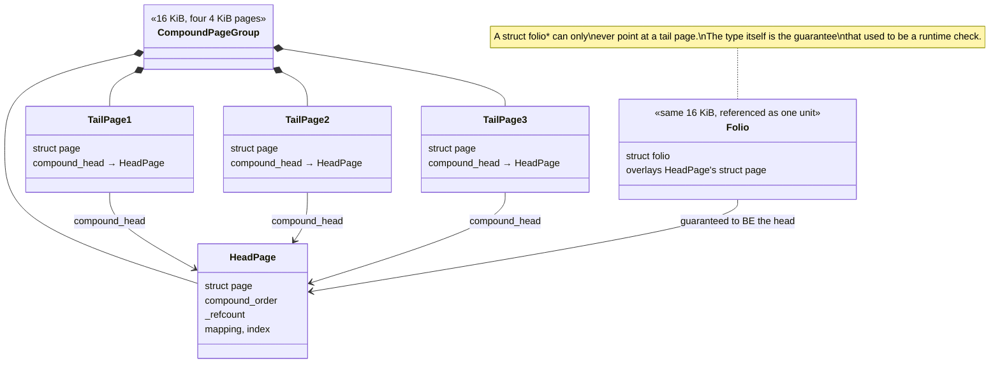

# Folios and Compound Pages

`struct page` describes one 4 KiB frame of physical memory, and there is one `struct page` for every
frame — on a large machine, millions of them, in an array whose per-entry size is jealously guarded
because a few extra bytes there costs real memory system-wide. But almost nothing the kernel does with
memory happens one page at a time any more: [the page allocator](./the-page-allocator.md) itself hands out
runs of 2ⁿ contiguous pages, the page cache wants to hold a whole 64 KiB chunk of a file as one object, and
huge pages exist specifically to stop treating a 2 MiB mapping as 512 separate units. Expressing "this
group of pages, treated as one thing" through a data structure designed to describe a single page produced
a decade of ambiguity: handed a `struct page *`, is it the whole object a caller cares about, or one piece
of a larger one? The **folio** is the kernel's answer.

## Compound pages, and the ambiguity

Before folios, a multi-page allocation was a **compound page**: an order-*n* block from the buddy
allocator, with the first page designated the **head** and every page after it a **tail**. The head page
carries the group's real metadata — reference count, mapping, index, the compound order — and each tail
page's `struct page` mostly exists to point back at the head (`compound_head`) and mirror a couple of its
flags. This works, but it pushes an obligation onto every function that receives a `struct page *`: is
this pointer the head, or could it be a tail? Code that forgot to check, or checked and got the answer
wrong, produced a real and recurring class of kernel bugs — operating on a tail page's stale or
uninitialized fields as though it were the head, or updating only one tail's flags while the rest of the
group silently disagreed. The pointer type gave no static guarantee about what was on the other end of it;
the guarantee had to be re-derived, defensively, at every call site that cared.

## What a folio is

A **folio** (`struct folio`, in `<Src file="include/linux/mm_types.h" symbol="folio" />`) is a type that is
*guaranteed to be a head page* — or an order-0 single page, which is trivially its own head. Structurally,
a `struct folio` overlays the same memory as the `struct page` array; the kernel does not allocate a
second, parallel bookkeeping structure per folio. What changes is the type the compiler will accept.
`folio_get()`, `folio_test_uptodate()`, and every other `folio_*` function take a `struct folio *`, and a
`struct folio *` can only ever come from a head page — the type system now enforces at compile time the
invariant that used to be a runtime discipline nobody could fully verify. This is the single most useful
thing to understand about the whole conversion: **folios are primarily a type-system change, not a
data-structure change.** The bytes barely moved; what moved is which questions the compiler answers for
you and which ones a function body used to have to ask itself.

## What it buys

- **Unambiguous APIs.** A function that takes a `struct folio *` cannot be handed a tail page — there is
  no tail-page constructor for the type. The "is this a head or a tail" branch that used to open so many
  `mm/` functions simply has nothing left to check.
- **Less per-page overhead in the page cache.** Before folios, caching 64 KiB of a file meant sixteen
  separate `struct page` entries in the XArray, sixteen sets of per-page LRU and refcount bookkeeping, and
  sixteen lock/unlock cycles for operations that were logically about one 64 KiB unit. A folio holding that
  same 64 KiB is *one* entry, one refcount, one set of dirty/uptodate/writeback flags — the accounting
  shrinks by the same factor the folio's order grows.
- **Larger units for I/O.** A read or write against a multi-page folio is naturally one I/O against one
  contiguous range, instead of the filesystem and block layer having to notice and re-coalesce adjacent
  single pages after the fact.
- **A path toward large block sizes and large anonymous folios.** Once "a caching unit bigger than one
  page" is a first-class, unambiguous type, both the page cache and anonymous memory can use bigger units
  without every consumer having to be individually taught about compound pages — see
  [Anonymous large folios](#anonymous-large-folios) below and [Hugepages and THP](./hugepages-and-thp.md).

## Reading code from either side

Because the conversion is still in progress at v6.18 (next section), any reader of `mm/`, page-cache, or
filesystem code will meet both vocabularies in the same file, sometimes in the same function. The names
differ; the underlying operation is usually the same one, retargeted at the head/folio:

| Old (page-based) | New (folio-based) | Notes |
|---|---|---|
| `page_cache_get(page)` | `folio_get(folio)` | The old name predates even this conversion — it was long ago folded into plain `get_page()`, which is itself now commonly a call to `folio_get(page_folio(page))` under the hood. Seeing `page_cache_get` in code or documentation is a sign of a genuinely old source. |
| `set_page_dirty(page)` | `folio_mark_dirty(folio)` | `folio_mark_dirty()` looks up the folio's `address_space` and calls its `->dirty_folio()` operation (falling back to a no-op if the folio has no mapping) — verified against `<Src file="mm/page-writeback.c" symbol="folio_mark_dirty" />` at v6.18. `set_page_dirty()` is still declared in `include/linux/mm.h` as a real, callable entry point for code that has not been converted. |
| `PageUptodate(page)` | `folio_test_uptodate(folio)` | At v6.18 `PageUptodate()` is a direct one-line wrapper — `return folio_test_uptodate(page_folio(page));` — rather than one of the generic `TESTPAGEFLAG`-macro-generated pairs most other flags use, because the uptodate flag also carries a `smp_rmb()` ordering requirement that has to live in one place. |

That middle column — `page_folio(page)` to go from a `struct page *` to its folio, and `&folio->page` (or
`folio_page(folio, n)` for page *n* within it) to go back — is the seam the whole compatibility layer runs
through. Wherever you see an old-style `Page*`/`page_*` name still compiling, look for exactly this pattern
underneath it: convert to a folio, call the real folio-based implementation, return.

## Where the conversion stands at v6.18

**Checked via context7 (Linux kernel documentation corpus, `/websites/kernel_doc_html`) and cross-referenced
against `include/linux/mm_types.h`, `include/linux/page-flags.h`, `include/linux/pagemap.h`, and
`mm/page-writeback.c` at the v6.18 tag on 2026-09-08.** As of that check:

- The **page cache core is folio-based.** `struct address_space` stores folios directly in its `i_pages`
  XArray (see [The Page Cache](./the-page-cache.md)), and the read path (`filemap_read()` →
  `filemap_get_folio()`/`__filemap_get_folio()`) works in folios throughout, only ever handing a
  `struct page *` back out at the boundary where an older caller still needs one.
- The `address_space_operations` table itself has been converted at its core methods: `read_folio`,
  `dirty_folio`, `migrate_folio`, and related callbacks are folio-typed in the vfs operations struct — a
  filesystem implementing these today writes folio code, not page code, for the common paths.
- **Page-based compatibility wrappers are deliberately kept, not stripped out.** `PageUptodate()`,
  `set_page_dirty()`, `attach_page_private()` (documented as wrapping the folio-based
  `folio_attach_private()`), and equivalents remain real, working entry points precisely so that filesystem
  and driver code that has not yet been converted continues to compile and behave correctly. The
  compatibility layer is not a deprecation shim scheduled for near-term removal; it is how a tree this size
  converts incrementally without a flag-day rewrite.
- **The conversion is explicitly incremental and ongoing**, not complete. Not every subsystem's internal
  data structures and call chains use folios throughout yet — some in-tree filesystems and drivers still
  operate mostly in `struct page` terms and rely on the wrappers above at their boundary with the
  now-folio-based core. context7's documentation corpus and the source both describe this as continuing
  work rather than a finished migration, and gave no fixed completion date — treat any claim that the
  conversion is "done" as of a date after this check as unverified until re-checked against a current tree.

Because this is a moving target, re-run this same context7 + source check before trusting a specific
subsystem's conversion status in a kernel newer than v6.18.

## Anonymous large folios

The same idea extends past the page cache to anonymous (non-file-backed) memory: instead of one 4 KiB
`struct page` per fault, an anonymous mapping can be backed by a **large folio** — still a plain 4 KiB-page
allocation strategy underneath in the common case, but grouped and tracked as one multi-page unit, which
cuts per-page fault and reclaim overhead the same way a multi-page cache folio does for file data. This is
a distinct mechanism from **transparent huge pages**: THP specifically targets the fixed 2 MiB (`PMD`-sized)
granularity that gets its own hardware TLB entry, while anonymous large folios can be smaller,
variable-order groupings chosen for cache-line and fault-overhead reasons rather than TLB reach. The two
compose — a THP is one particular, large, aligned case of "an anonymous large folio" — but the policy of
when the kernel chooses which size, and the trade-offs involved, belongs to
[Hugepages and THP](./hugepages-and-thp.md), not here.

## The practical consequence for a reader

When you are reading `mm/`, page-cache, or filesystem code and see `struct page *` and `Page*`/`page_*`
names, the first useful question is not "what does this do" but "has this code been converted yet" — the
answer tells you whether you are looking at the current core implementation or at a compatibility wrapper
one call away from it. When you are writing new code that touches cached or multi-page memory, write it in
folios: `folio_get()`, not `page_cache_get()`; `folio_mark_dirty()`, not `set_page_dirty()`;
`folio_test_uptodate()`, not `PageUptodate()`. The wrappers exist so that old code keeps working, not as an
invitation to write new code against them.

*The same sixteen kilobytes, seen as five `struct page`s with an ambiguity, and as one folio without it.*

<KernelFacts
  structure={[["struct folio", "include/linux/mm_types.h"], ["struct page", "include/linux/mm_types.h"]]}
  path="folio_alloc() → alloc_pages() → head page → folio_test_*/folio_mark_* operate on the head"
  observe="grep -c folio /proc/kallsyms"
  trap="A folio is not a huge page. It is a group of pages of *any* power-of-two order, including one — most folios in a running system are a single page, and the type says nothing about size." />

## References

- `https://docs.kernel.org/mm/folio.html` — **checked 2026-09-08: returns HTTP 404, does not exist at
  v6.18.** The mm documentation index (`https://docs.kernel.org/mm/index.html`, same check date) has no
  dedicated folio page either; folio material is distributed across the page-cache, slab, and core-api
  (`mm-api.html`) documentation pages instead of collected in one place.
- Matthew Wilcox's folio talks, and LWN's ["Clarifying memory management with
  folios"](https://lwn.net/Articles/849538/) — the rationale in the proposal author's own framing. This
  article is from the *proposal* period; the API names it discusses were not all final, and code today
  should be checked against the table above rather than against that article's naming.
- <Src file="include/linux/mm_types.h" symbol="folio" /> — the definition itself, whose comment block
  ("A folio is a physically, virtually and logically contiguous set of bytes... a power-of-two in size,
  aligned to that same power-of-two") is the clearest statement of the invariant this page describes.
- context7 query for the current folio API surface, `/websites/kernel_doc_html` — **queried 2026-09-08**,
  cross-checked against `include/linux/mm_types.h`, `include/linux/page-flags.h`,
  `include/linux/pagemap.h`, and `mm/page-writeback.c` at the v6.18 tag; see
  [Where the conversion stands at v6.18](#where-the-conversion-stands-at-v618) above for what it found.
