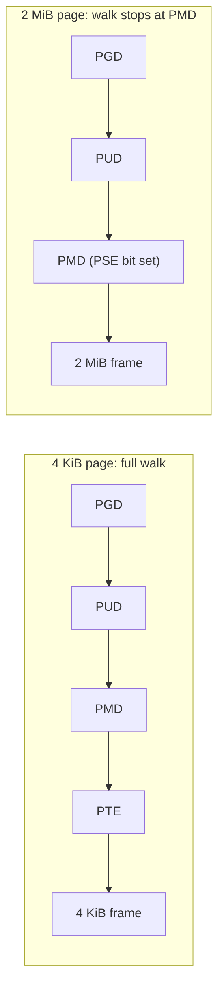

# Huge Pages and THP

A TLB holds a fixed number of entries, and its **reach** — the amount of address space it can translate
without a walk — is simply entries × page size. A couple of thousand 4 KiB entries covers a few
megabytes; the same handful of thousand entries at 2 MiB apiece covers gigabytes. A workload whose working
set exceeds ordinary TLB reach spends a measurable, non-trivial fraction of its time doing page-table
walks the hardware would otherwise have skipped entirely — and huge pages are the only fix, because no
amount of software tuning changes how many entries a physical TLB has.

## Sizes, and where they come from

On x86-64 there are two huge sizes: **2 MiB**, produced by a PMD entry that terminates the walk instead of
pointing at a PTE table, and **1 GiB**, produced the same way one level up, by a PUD entry that terminates
the walk instead of pointing at a PMD table. [Page Tables and the Walk](./page-tables-and-the-walk.md#huge-pages-as-a-stopped-walk)
already establishes the mechanical fact this page builds on: **a huge page is not a special kind of
object** the kernel allocates differently — it is an ordinary walk that stops one (or two) levels early
because the page-size bit is set in a PMD or PUD entry, mapping the entire region that level's fan-out
would otherwise have covered (512 PTE-mapped 4 KiB pages become one 2 MiB PMD entry; 512 PMD-mapped 2 MiB
regions become one 1 GiB PUD entry). Fewer table-walk steps per translation, and fewer table pages spent on
bookkeeping, follow directly from stopping early — but as the misconceptions section below points out,
that's not actually where most of the benefit comes from.

## Two mechanisms, not one

Most of the bad advice about huge pages comes from treating "huge pages" as a single feature, when Linux
actually has two, with opposite reliability and configuration models:

- **hugetlbfs** — explicit, reserved, pre-allocated. An administrator (or an application at startup)
  requests a pool of huge pages up front; once reserved, they're taken out of the general page allocator
  entirely, never reclaimed, never swapped, and never silently given back. An application has to know it
  wants them and ask for them by name.
- **THP (Transparent Huge Pages)** — automatic and opportunistic. The kernel promotes anonymous memory to
  huge pages on its own, at fault time or via a background scanner, with no application changes required
  and no guarantee that a given region actually ends up backed by one.

Everything below this section is organized around that split, because the two answer completely different
questions: hugetlbfs answers "I need a guaranteed pool of huge pages and I'm willing to configure for it";
THP answers "give ordinary applications some of the benefit without asking them to change anything."

## hugetlbfs

Pages are reserved either at boot (a `hugepages=N` kernel command-line argument, guaranteeing the pool
exists before fragmentation makes large contiguous allocations hard to find) or at runtime via
`/proc/sys/vm/nr_hugepages` (which can fail to allocate the full request if memory is already
fragmented — checking `nr_hugepages` against what was actually requested afterward is worth doing). Once
reserved, the pool is exposed through the `hugetlbfs` filesystem — mounted, and files created in it are
backed by huge pages — and applications opt in explicitly with `mmap(..., MAP_HUGETLB, ...)` or by mapping
a file on a `hugetlbfs` mount.

This is why databases and hypervisors reach for hugetlbfs specifically rather than relying on THP:
**guaranteed availability** (the pool exists at the size requested or the reservation fails up front,
loudly, instead of silently falling back), **no reclaim** (a hugetlbfs page is never a reclaim candidate,
so it can't be taken back under memory pressure the way a THP page can be split or paged out), and **no
surprise** (the memory footprint and huge-page count are exactly what was configured, not something that
drifts based on `khugepaged`'s current scanning state).

## THP

`khugepaged` is a kernel thread that periodically scans eligible anonymous VMAs looking for regions where
enough physically-contiguous, appropriately-aligned small pages already exist to collapse into a single
huge page — and does the collapse in the background when it finds one. The complementary path is
fault-time allocation: when a THP-eligible VMA takes a page fault and no page exists there yet, the fault
handler can allocate a huge page directly instead of a single 4 KiB page, if the current `enabled` /
`defrag` policy and the system's ability to find or produce a contiguous 2 MiB region allow it.

That policy is set in `/sys/kernel/mm/transparent_hugepage/enabled`. **Verified against
`Documentation/admin-guide/mm/transhuge.rst` at v6.18, checked 2026-09-08** — the values are:

| Value | Meaning (from the v6.18 documentation) |
|---|---|
| `never` | THP is disabled — mostly for debugging purposes. No anonymous memory is promoted to a huge page through this knob. |
| `madvise` | THP is only enabled inside regions that have used `madvise(MADV_HUGEPAGE)`, to avoid the risk of consuming more memory resources than an application asked for. |
| `always` | THP is enabled system wide, for all eligible anonymous memory, not just `MADV_HUGEPAGE`-marked regions. |
| `inherit` | Per-size setting only, under `hugepages-<size>kB/enabled` — adopts the top-level `enabled` value instead of setting its own. This is the default for PMD-sized (2 MiB) THP; every other huge page size defaults to `never`. |

The v6.18 documentation doesn't pin a single default for the top-level `enabled` knob itself — that's a
function of boot-time kernel configuration. `madvise` is nonetheless the value most distributions ship in
practice, and the reasoning follows directly from the "two mechanisms" framing above: it confines THP to
applications that explicitly ask for it (`MADV_HUGEPAGE`) rather than applying it — and any fault-path cost
that comes with it, covered in the next section — to applications that never asked and may be
latency-sensitive in ways they never tuned for THP at all. `khugepaged` at v6.18 collapses only to
PMD-sized (2 MiB) THP; no other huge size is a collapse target.

## What actually happens

**Why databases disable THP** is one of the most durable pieces of operational folklore in this area, and
it has a real mechanism behind it, plus a real update to the story that most of that folklore predates.

The mechanism: with `enabled=always`, a latency-sensitive process's *ordinary* page fault can trigger an
attempt to satisfy it with a 2 MiB huge page instead of a 4 KiB one. If a physically contiguous, aligned
2 MiB region isn't immediately available, satisfying that request means **direct compaction on the fault
path** — migrating other pages out of the way to assemble a contiguous 2 MiB run, synchronously, inside
the faulting thread, before the fault can complete. The symptom this produces is exactly what made THP
infamous for latency-sensitive workloads: occasional multi-millisecond stalls on an otherwise ordinary page
fault, with no corresponding disk I/O to explain them in a trace — because the stall is compaction, not
I/O.

The more nuanced, current position is that **`defrag`, not `enabled`, is what actually controls this cost**
— and it is a separate knob at `/sys/kernel/mm/transparent_hugepage/defrag`. **Verified against
`Documentation/admin-guide/mm/transhuge.rst` at v6.18, checked 2026-09-08** — the values are:

| Value | Meaning (from the v6.18 documentation) |
|---|---|
| `always` | An application requesting THP will stall on allocation failure and directly reclaim pages and compact memory in an effort to allocate a THP immediately. |
| `defer` | An application will wake `kswapd` in the background to reclaim pages and wake `kcompactd` to compact memory so that THP is available in the near future — the fault itself is not stalled waiting for it. |
| `defer+madvise` | Direct reclaim and compaction like `always`, but only for regions that have used `madvise(MADV_HUGEPAGE)`; all other regions get the `defer` behaviour (background `kswapd`/`kcompactd`, no fault-path stall). |
| `madvise` | Direct reclaim only for regions that have used `madvise(MADV_HUGEPAGE)`. |
| `never` | No defragmentation attempts at all. |

So `enabled=always` paired with `defrag=defer` behaves very differently from the configuration that earned
THP its reputation in the first place (historically, `enabled=always` defaulted to a `defrag` policy that
*did* stall on the fault path): the huge-page *allocation* still happens opportunistically, but the
*compaction* needed to produce a free 2 MiB region is decoupled from the faulting thread and pushed to
background kernel threads instead. The honest summary: "disable THP" as unconditional advice is a snapshot
of one configuration and one era, and the `defrag` controls are the actual lever — see the misconceptions
below for how this gets overgeneralized in practice.

## Memory waste

The other real cost, separate from latency, is space. A 2 MiB huge page backing a 4 KiB working region
inside it wastes the other 2044 KiB — and `khugepaged` collapsing a *sparse* region (one where only a
handful of the 512 constituent 4 KiB pages are actually touched) can measurably inflate a process's RSS,
because the collapse pulls in and maps the whole 2 MiB range as resident even where nothing was resident
before. This is exactly why `AnonHugePages` in `/proc/meminfo` and the `AnonHugePages` line in a mapping's
`smaps` entry are worth checking specifically when a process's memory use looks unexpectedly high relative
to what it should be doing — the gap is frequently THP collapse, not a leak.

## Measuring whether it helps

The honest answer to "should THP be on for my workload" is **measure it**, because the answer genuinely
differs between a database, a JVM heap, and a compiler — their access patterns, working-set sizes, and
latency sensitivity are different enough that no single blanket recommendation is safe. The relevant
signals:

- `perf stat -e dTLB-load-misses` (and the matching `iTLB` counters) — the most direct evidence of whether
  TLB reach is actually the bottleneck for this workload, before and after a THP configuration change.
- `AnonHugePages` in `/proc/PID/smaps` (or aggregated in `/proc/meminfo`) — how much of a process's
  anonymous memory is actually huge-page-backed right now, versus assumed.
- `/proc/vmstat`'s `thp_fault_alloc` (huge pages allocated directly at fault time) and
  `thp_collapse_alloc` (huge pages produced by `khugepaged` collapsing existing small pages) — the two
  different paths to a THP mapping, counted separately, so a workload that benefits from one but not the
  other is visible instead of averaged away.

## Misconceptions

1. **"Huge pages help because there are fewer page-table levels to walk."** The walk depth *above* the
   terminating level is unchanged — a 2 MiB mapping still needs a PGD and PUD lookup, exactly like a 4 KiB
   one; only the last one or two levels are skipped. The actual benefit is TLB **reach**: far more address
   space covered per cached entry, so far fewer walks happen *at all* for a given working-set size — not
   that each individual walk got dramatically shorter.
2. **"THP should always be disabled."** That advice reflects a specific configuration (`enabled=always`
   with a `defrag` policy that stalled on the fault path) from a specific era. The `defrag` controls
   described above change that trade-off materially — `defer`-family settings decouple allocation from
   fault-path compaction — so blanket-disabling THP forfeits the TLB-reach benefit for workloads it would
   actually have helped, based on a cost that a different `defrag` setting may no longer impose.
3. **"hugetlbfs and THP are the same feature with different names."** They have opposite reliability and
   configuration models: hugetlbfs is an explicit reservation an application must ask for by name, never
   reclaimed and never a surprise; THP is opportunistic, kernel-driven, and can be present or absent for
   the exact same piece of code depending on fragmentation and policy at the moment of the fault. Tuning or
   troubleshooting one using assumptions from the other is a common source of confusion.

**A current vendor position, for calibration:** MongoDB's production-notes documentation (checked
2026-09-08) recommends disabling THP for `mongod`/`mongos` and recommends `madvise` as the value if it
can't be disabled outright — that guidance predates the widespread operational use of the `defrag=defer`
family described above and does not itself distinguish `enabled` from `defrag`, which is a good concrete
example of exactly the "specific configuration, specific era" pattern the second misconception describes:
treat vendor THP guidance as dated unless it explicitly addresses the `defrag` controls.

## TLB reach

Using a plausible modern L2 TLB size as a **stated example, not a specification** — actual TLB sizes vary
by microarchitecture and should be read from `cpuid`/vendor documentation for a real machine, not assumed
from this table:

| Page size | Example L2 TLB entries | Reach (entries × page size) | Working set that fits |
|---|---|---|---|
| 4 KiB | ~1,536 | ~6 MiB | A modest hot loop, a small hash table |
| 2 MiB | ~1,536 | ~3 GiB | A database buffer pool, a JVM young generation |
| 1 GiB | ~16 (a separate, much smaller structure on most parts) | ~16 GiB | A large in-memory dataset mapped once and scanned repeatedly |

The shape of the table is the point, not the specific counts: the same number of cached entries covers
roughly 500× more address space at 2 MiB than at 4 KiB, and again roughly 500× more at 1 GiB than at 2 MiB
— because reach scales with page size at (roughly) fixed entry count, not because the TLB grew.

*The same address-space depth, but the 2 MiB path terminates one level early — one fewer memory read per
translation, and the region a single TLB entry now covers is 512× larger.*

<KernelFacts
  structure={[["struct hstate", "include/linux/hugetlb.h"]]}
  path="fault on a THP-eligible VMA → do_huge_pmd_anonymous_page() → vma_alloc_anon_folio_pmd() at PMD_ORDER (order 9, 2 MiB) → PMD entry, walk stops early"
  observe="cat /sys/kernel/mm/transparent_hugepage/enabled /sys/kernel/mm/transparent_hugepage/defrag && grep -E 'AnonHugePages|HugePages_Total' /proc/meminfo"
  trap="THP's cost is not the huge pages, it is the *compaction* that sometimes has to happen to produce one — on the fault path, in your latency-sensitive thread. The defrag setting, not the enabled setting, is what controls that." />

## References

- `https://docs.kernel.org/admin-guide/mm/transhuge.html` — the definitive description of every `enabled`
  and `defrag` value; the authority for this page's values, checked directly against
  `Documentation/admin-guide/mm/transhuge.rst` at v6.18, 2026-09-08.
- `https://docs.kernel.org/admin-guide/mm/hugetlbpage.html` — the explicit-reservation mechanism and its
  interfaces (`nr_hugepages`, `hugetlbfs`, `MAP_HUGETLB`).
- Intel SDM Vol. 3A, ch. 4 — the page-size bit in a PMD/PUD entry, the hardware mechanism this whole
  feature is built on.
- MongoDB Production Notes, "Disable Transparent Huge Pages (THP)" — a current database-vendor position on
  THP, checked 2026-09-08; recommends disabling THP (or `madvise` if it can't be disabled) and does not
  itself distinguish the `defrag` controls from the `enabled` setting.
