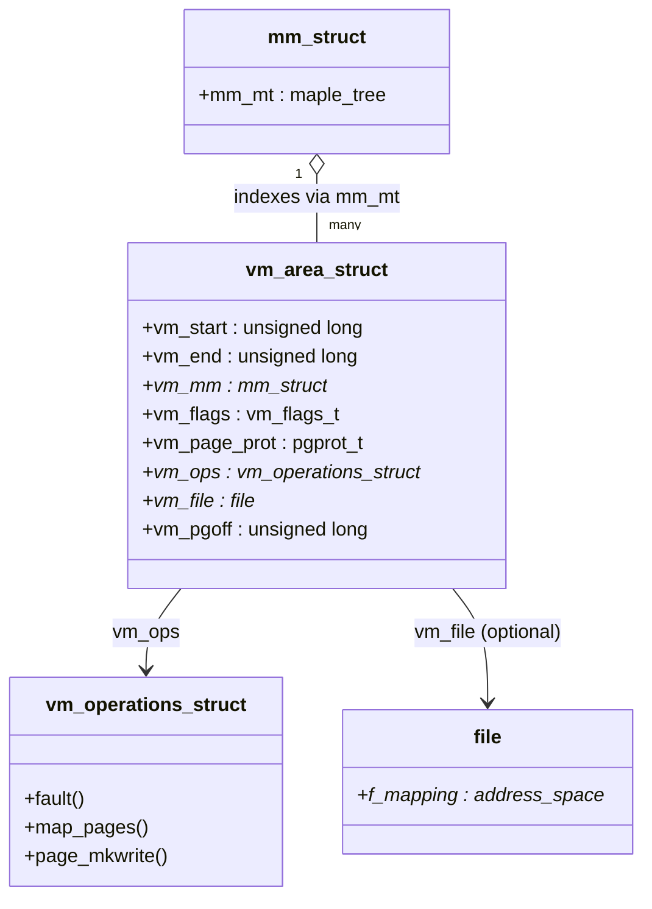

# `mm_struct` and VMAs

[The Virtual Address Space](./the-virtual-address-space.md) described the layout a process's pointers
live in. This page describes the kernel's own bookkeeping for that layout — and it is worth being precise
about what that bookkeeping is *not*. The page tables say what is mapped **right now**: a set of
translations a hardware walker can consume directly. They are not, however, what the kernel consults when
a process calls `mmap`, `mprotect`, or takes a page fault. For that, the kernel keeps a second structure —
one **`vm_area_struct`** ("VMA") per contiguous range of address space with uniform properties — that
describes what the process is *entitled* to have mapped, and on what terms. A `mmap` of a gigabyte creates
a VMA in microseconds and touches no page table at all; the translations get filled in lazily, one fault
at a time. Almost everything a process does to its own memory is first an operation on the VMA list, and
the page tables catch up afterward.

## `mm_struct`

There is one `mm_struct` per address space, and every thread in a multi-threaded process shares the same
one — it is the structure that makes threads threads, in the sense
[Task Struct: the Anatomy of a Task](../06-processes-and-threads/task-struct-the-anatomy-of-a-task.md)
used the word: separate `task_struct`s, one `mm_struct`. It carries the VMA collection described below,
the top-level page-table pointer, and the address-space layout fields (`start_code`, `end_data`,
`mmap_base`, and so on).

Its lifetime is governed by **two** reference counts, not one, and the split is a genuinely instructive
piece of design once folder 04's refcounting vocabulary is in hand:

- **`mm_users`** counts *userspace* references — one per thread actually running with this address space
  loaded, plus anything else that needs the address space to remain semantically valid (a `ptrace`r
  reading its memory, for example). Modified with `mmget()` / `mmget_not_zero()` / `mmput()`. When
  `mm_users` reaches zero, the address space itself is torn down: VMAs are removed, page tables freed,
  file mappings dropped — the process's memory footprint actually goes away.
- **`mm_count`** counts references to the **`mm_struct` allocation** — the C struct's storage, independent
  of whether the address space it describes is still "live." Modified with `mmgrab()` / `mmdrop()`. When
  `mm_users` drops to zero the `mm_struct` still isn't freed; it drops one `mm_count` reference instead.
  The struct is only actually freed when `mm_count` *also* reaches zero.

The reason for two counters rather than one is [Lazy TLB](./tlb-and-address-space-switching.md#lazy-tlb):
a kernel thread that borrows an exiting process's `mm` as its `active_mm` needs that allocation to stay
valid — dereferencing a freed `mm_struct` from an interrupt context would be a use-after-free — but it has
no business keeping the address space's actual mappings alive, and it must not be the reason `exit_mmap()`
never runs. `mm_count` answers "is it safe to still point at this struct," `mm_users` answers "is this
address space still somebody's home." A borrowing kernel thread holds the first without needing the
second.

## `vm_area_struct`

A VMA describes one contiguous range with uniform properties: where it starts and ends, what the process
may do with it, and — for a file-backed mapping — which file and what offset into it. The fields that
matter for everything else on this page:



`vm_start`/`vm_end` are the half-open range `[vm_start, vm_end)`. `vm_flags` (below) carries the
permission and behaviour bits; `vm_page_prot` is the architecture-specific page-table protection value the
kernel derives from those flags. `vm_ops` and `vm_file` are both optional — an anonymous mapping (plain
heap or stack memory, `MAP_ANONYMOUS`) has neither.

## The maple tree

At v6.18, `mm_struct` indexes its VMAs with a **maple tree** — `struct maple_tree mm_mt` — not the
red-black tree plus doubly-linked list that older kernel documentation, and most books still in print,
describe. This is worth stating plainly because it is the kind of detail that makes previously-correct
knowledge actively wrong: a reader who goes looking for `vma->vm_next`, expecting to walk the list the way
older `find_vma()` write-ups describe, will not find that field — it does not exist in the current
`struct vm_area_struct`. The rbtree-plus-linked-list scheme was replaced during the 6.1 development cycle
specifically because it required updating two structures to keep them consistent and locking the whole
list for any walk; a maple tree is a single B-tree-like structure that supports RCU-safe, lock-free
lookups and gives better cache behaviour by packing several ranges per node instead of one node per
pointer chase.

The lookup and iteration API changed to match. The functions worth knowing:

- **`find_vma(mm, addr)`** — still exists, with its historical name and behaviour: return the VMA
  containing `addr`, or if none does, the first VMA starting above it. Internally it is now a maple-tree
  lookup (`mt_find(&mm->mm_mt, ...)`) rather than an rbtree walk, but the caller-facing contract is
  unchanged.
- **`vma_lookup(mm, addr)`** — the stricter sibling: returns the VMA containing `addr`, or `NULL` if
  `addr` falls in a gap. Useful where "the next VMA" is not an acceptable answer.
- **A `struct vma_iterator`** (`VMA_ITERATOR(vmi, mm, addr)`) replaces `vma->vm_next` for ordered walks.
  `vma_next(vmi)` and `vma_prev(vmi)` step through the maple tree via `mas_find()`/`mas_prev()`
  underneath; code that needs "the VMA after this one" now carries an iterator instead of following a
  pointer.

None of this changes what a VMA *means* — only how the kernel finds one. But any code sample or
explanation that dereferences `vm_next` directly is describing a pre-6.1 kernel, not this one.

## VMA flags

A `vm_flags_t` bitmask on each VMA, set from userspace requests and consulted throughout the mm code:

| Flag | Meaning | Set by |
|---|---|---|
| `VM_READ` / `VM_WRITE` / `VM_EXEC` | The permissions the range grants | `PROT_READ`/`PROT_WRITE`/`PROT_EXEC` in `mmap()`/`mprotect()` |
| `VM_SHARED` | Writes are visible to other mappers of the same file/object, not just this process | `MAP_SHARED` in `mmap()` |
| `VM_GROWSDOWN` | The range may auto-extend downward on a faulting access just past its start | set on the stack VMA at process creation, and available via `MAP_GROWSDOWN` |
| `VM_LOCKED` | Pages in this range must stay resident — never reclaimed or swapped | `mlock()`/`mlockall()`, or `MAP_LOCKED` |
| `VM_DONTCOPY` | Excluded from the child's address space across `fork()` | `madvise(MADV_DONTFORK)` |
| `VM_HUGEPAGE` | A hint that Transparent Huge Pages should be used for this range | `madvise(MADV_HUGEPAGE)` |

## What actually happens

**[WAH]** An `mprotect()` call that changes permissions on part of a VMA — not all of it — cannot simply
flip a bit. The VMA's whole point is that every address in `[vm_start, vm_end)` shares one set of
properties, so if the new permissions apply to only the middle of that range, the kernel has to **split**
the VMA into three: an unchanged prefix, a new VMA covering the changed middle with the new flags, and an
unchanged suffix. Each of the three then gets its own page-table update for the pages already faulted in
within its range, and because permissions changed, [a TLB shootdown](./tlb-and-address-space-switching.md)
follows for the CPUs that might have cached the old translation.

Here it is for real: a tiny C program `mmap`s three pages as one anonymous, read-write region, dumps the
lines of `/proc/self/maps` that fall inside it, `mprotect`s only the middle page to read-only, and dumps
the same lines again. (Two `PROT_NONE` guard pages bracket the region so the kernel has no adjacent,
flag-compatible mapping to merge it with — see [Merging](#merging) below for why that precaution matters
for a clean before/after.)

```c
long pagesize = sysconf(_SC_PAGESIZE);      // 4096
size_t total = pagesize * 3;                // 3 pages = 12 KiB

void *region = mmap(NULL, pagesize * 5, PROT_NONE,
                     MAP_PRIVATE | MAP_ANONYMOUS, -1, 0);
void *base = (char *)region + pagesize;
mmap(base, total, PROT_READ | PROT_WRITE,
     MAP_PRIVATE | MAP_ANONYMOUS | MAP_FIXED, -1, 0);

/* ... dump /proc/self/maps ... */

void *middle = (char *)base + pagesize;
mprotect(middle, pagesize, PROT_READ);

/* ... dump /proc/self/maps again ... */
```

Actually compiled (`gcc -O0`) and run in this task's sandbox — real output, not reconstructed:

```text
pagesize=4096  base=0x718e5aef7000  total=12288 bytes (3 pages)

===== BEFORE mprotect (one VMA, 3 pages) =====
718e5aef7000-718e5aefa000 rw-p 00000000 00:00 0

===== AFTER mprotect(middle page, PROT_READ) =====
718e5aef7000-718e5aef8000 rw-p 00000000 00:00 0
718e5aef8000-718e5aef9000 r--p 00000000 00:00 0
718e5aef9000-718e5aefa000 rw-p 00000000 00:00 0
```

One line — `ef7000-efa000 rw-p` — became three: the unchanged `rw-p` prefix, a new `r--p` middle VMA, and
an unchanged `rw-p` suffix, exactly matching the split described above. (Without the guard pages, the
first run of this program showed the "before" line as *larger* than the 12 KiB requested — the kernel had
transparently merged the new mapping with an adjacent, flag-identical anonymous VMA already in the address
space. That was not a bug in the demo; it was [Merging](#merging) happening on the very first `mmap`.)

The lesson generalizes beyond this one call: `/proc/PID/maps` line count is a function of how much a
process has fiddled with permissions on its mappings, not of how many logically distinct regions it
believes it has. A program that `mprotect`s different sub-ranges of a large mapping in a loop — a
JIT toggling `PROT_EXEC` on and off per code page is a realistic example — can accumulate thousands of
VMAs from what conceptually is one region. That has a real cost: `find_vma()` and `fork()` (which must
copy the whole VMA collection) both walk the collection, so a process with degenerate VMA fragmentation
measurably slows down operations that have nothing to do with the fragmenting calls themselves.

## Merging

The reverse operation happens automatically, not on request: when a new mapping is created immediately
adjacent to an existing VMA, and the two have identical flags, protection, and a compatible backing file
(same file, contiguous offset, or both anonymous), the kernel merges them into one VMA instead of creating
a second. This is why two back-to-back `mmap()` calls sometimes show up as a single `/proc/PID/maps` line
and sometimes as two, in a way that looks arbitrary until this rule is known: it depends entirely on
whether the flags and backing matched at the moment of creation. The guard-page precaution in the demo
above exists specifically to defeat this — without it, the address space allocator can hand back an
address next to an unrelated, flag-compatible mapping, and the two merge before the demo's own splitting
behaviour has a chance to run.

## `vm_ops`, and file-backed mappings

A file-backed VMA (anything created by `mmap()` on a real file rather than `MAP_ANONYMOUS`) carries a
`vm_ops` table — a `const struct vm_operations_struct *` — supplied by the filesystem or driver that owns
the file. Three members matter most for what comes next:

- **`fault`** — called when a page in this VMA is accessed but not yet present; the filesystem is
  responsible for bringing the right page into memory and returning it.
- **`map_pages`** — an optional batch path: fault in and map several nearby pages at once when it is cheap
  to do so, reducing the number of individual faults a sequential access pattern generates.
- **`page_mkwrite`** — called when a read-only, file-backed page is about to become writable (the
  private-mapping COW case, or the first write to a shared mapping), giving the filesystem a chance to
  prepare for the write (allocate backing blocks, for instance) before the kernel marks the page-table
  entry writable.

This table is the hook [The Page Fault Handler](./the-page-fault-handler.md) calls into for anything that
isn't plain anonymous memory — it is named here because that page assumes it already exists.

## `mmap_lock`

VMA changes — inserting, removing, splitting, or merging entries in `mm->mm_mt` — are serialized by
`mmap_lock`, a per-`mm` reader-writer semaphore (`struct mm_struct`'s `mmap_lock` field; see
[Reader-Writer Locks](../09-concurrency-and-locking/rwlocks-and-rwsems.md), which uses exactly this lock as
its canonical example of a `rw_semaphore`). Historically this single lock was a serious scalability
problem: any page fault needed at least a read-mode acquisition to consult the VMA it faulted in, and any
`mmap`/`munmap`/`mprotect` needed write mode, so a multi-threaded process doing heavy `mmap` churn on one
thread could stall page faults on every other thread.

At v6.18, **per-VMA locking** (`CONFIG_PER_VMA_LOCK`, mainline and enabled in most configurations since
the 6.4/6.5 development cycle) addresses the common case directly: `struct vm_area_struct` carries its own
`vm_refcnt` and sequence-counter fields, and the page-fault fast path can take a per-VMA read lock
(`lock_vma_under_rcu()`, under RCU) instead of `mmap_lock` itself, falling back to the full `mmap_lock`
only when the per-VMA path can't proceed (a VMA structural change in flight, for instance). This lets
concurrent faults into *different* VMAs of the same `mm` proceed without contending on one process-wide
lock, while `mmap`/`munmap`/`mprotect` — which change the VMA collection's structure — still require
`mmap_lock` in write mode.

<KernelFacts
  structure={[["struct mm_struct", "include/linux/mm_types.h"], ["struct vm_area_struct", "include/linux/mm_types.h"]]}
  path="mmap() → get_unmapped_area() → vma_merge_new_range() (extend an existing VMA) or a new vm_area_struct → inserted into mm->mm_mt via the VMA iterator → no page tables touched yet"
  observe="wc -l /proc/self/maps && grep -c '' /proc/1/maps"
  trap="A VMA is not memory and not a page-table entry. It is a promise about a range, and the page tables for that range may be entirely empty — which is why mmap of a gigabyte is instant and why the first touch of each page is not." />

## References

- <Src file="include/linux/mm_types.h" symbol="vm_area_struct" /> — the definition, with the comments
  that explain the flag and locking-field groups; verified against v6.18 source (`vm_start`/`vm_end`,
  `vm_flags`, `vm_ops`, `vm_file`, `vm_pgoff`, and the `CONFIG_PER_VMA_LOCK` fields `vm_refcnt`/
  `vm_lock_seq` are all present at this version; `vm_next` is not).
- [Maple Tree](https://docs.kernel.org/mm/process_addrs.html) — the kernel's own process-address-space
  documentation, describing the maple-tree-based VMA collection that replaced the rbtree/linked-list
  scheme; check the exact page name at v6.18, as `docs.kernel.org`'s mm section has been reorganized more
  than once.
- `man 2 mmap` and `man 2 mprotect` — the syscalls that create and split VMAs, and the source of the
  `PROT_*`/`MAP_*` flags this page's VMA-flags table maps to `VM_*` bits.
- LWN, [\"Introducing maple trees\"](https://lwn.net/Articles/845507/) — the data structure's design
  rationale (RCU-friendly lookups, better cache locality than an rbtree-plus-list); most existing writing
  about `mm_struct` and VMAs predates this change and should be read with that in mind.
