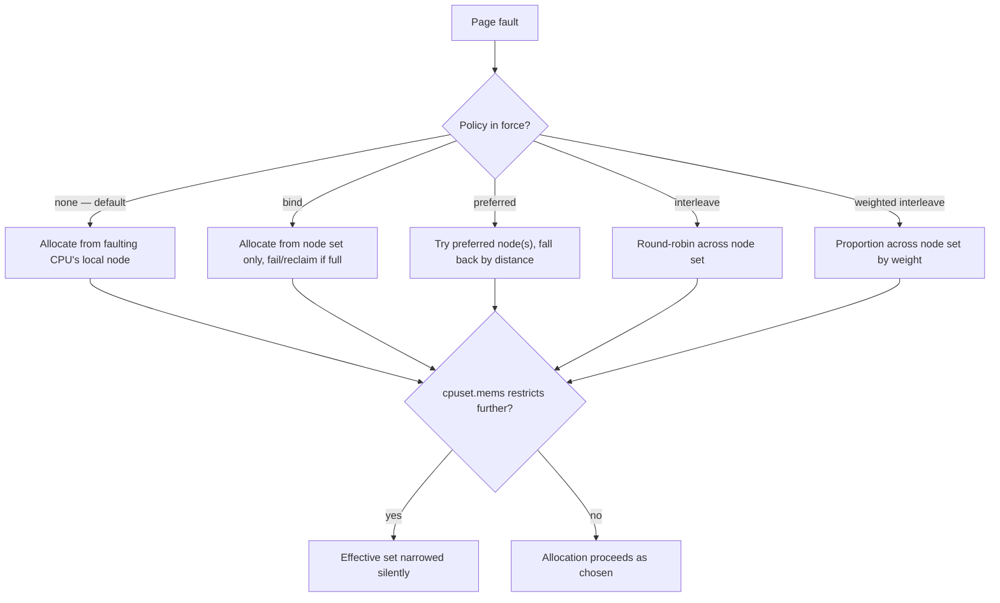

# NUMA and Memory Policy

Node-local allocation by default, the policies that override it, and when NUMA effects are a red herring.

Faced with a page fault on a multi-node machine, the kernel has a default answer to a hard question,
and it's usually right: allocate the frame from the node the faulting CPU belongs to. The faulting CPU
is, in the common case, the CPU that is about to use the memory — so **first-touch local allocation**
gets the placement right without anyone specifying anything. Every policy on this page exists to
override that default for the specific cases where it gets the placement wrong.

## First touch, restated in kernel terms

A virtual address doesn't own physical memory until something faults it in — see
[Demand Paging and COW](./demand-paging-and-cow.md) for the fault path itself. When that fault
allocates a fresh frame, the allocator consults the running CPU's node and asks that node's zone
list first: `MemFree` on the local node, checked against the watermarks described in
[The Page Allocator](./the-page-allocator.md#watermarks). Only if the local node can't satisfy the
request does the allocator fall back to a remote node, chosen by distance — the same distance matrix
described in [NUMA and Memory Topology](../../computer-science/memory-hierarchy/numa-and-memory-topology.md#nodes-distance-and-the-interconnect),
where "distance" is the firmware's own SLIT-table statement of interconnect hops, not a guess the
kernel makes up.

This is why the rule from that page bears repeating in kernel terms: a page is bound to a node the
moment it is first written or read, not when `malloc` returns a pointer. Nothing about virtual memory
reservation touches physical placement; only the fault does.

## Policies

Every policy below answers the same question — "given a fault needing a frame, which node(s) may it
come from, and in what order?" — differently. **Verified against `Documentation/admin-guide/mm/numa_memory_policy.rst`
at v6.18 (fetched from `raw.githubusercontent.com/torvalds/linux/v6.18/...`, checked 2026-09-08):**
the document defines `MPOL_DEFAULT`, `MPOL_BIND`, `MPOL_PREFERRED`, `MPOL_INTERLEAVE`,
`MPOL_PREFERRED_MANY`, and — the one the brief for this page asked to verify rather than assume —
**`MPOL_WEIGHTED_INTERLEAVE` does exist at v6.18.** The document's own words: "This mode operates the
same as `MPOL_INTERLEAVE`, except that interleaving behavior is executed based on weights set in
`/sys/kernel/mm/mempolicy/weighted_interleave/`." A node weighted 5 against a node weighted 2 receives
pages in roughly that 5:2 ratio rather than strict round-robin — the fix for a machine whose nodes
have different memory bandwidth or capacity, where flat interleaving would spread load evenly across
unequal resources.

`MPOL_PREFERRED_MANY` is also present at v6.18 and is not in the brief's original list: it generalizes
`MPOL_PREFERRED` from one node to a set, preferring that set but falling back to any node under
pressure rather than failing.

| Policy | How pages are chosen | Set via | Fits | Failure mode when wrong |
|---|---|---|---|---|
| **Default** (`MPOL_DEFAULT`) | First-touch local, falling back by distance | No call needed — it's the absence of a policy | Almost everything; the baseline this whole page overrides selectively | Gets the placement right until a single thread front-loads all the touching, silently pinning everything to one node — [the classic mistake](#the-classic-mistake) below |
| **Bind** (`MPOL_BIND`) | Restricted to the given node set only — closest node in the set with room | `set_mempolicy(MPOL_BIND, ...)`, `mbind(2)`, `numactl --membind` | A workload that must never pay a remote hop, and would rather fail loudly than degrade silently | Allocation *fails* (or reclaims within the set) rather than spilling outside it — fails hard and loudly when the set can't serve the request |
| **Preferred** (`MPOL_PREFERRED`, `MPOL_PREFERRED_MANY`) | Tries the preferred node(s) first, then falls back to any node by distance if they can't satisfy the request | `set_mempolicy(MPOL_PREFERRED, ...)`, `mbind(2)`, `numactl --preferred` | A soft hint: place here if possible, but never fail the allocation over it | Degrades silently to a remote node — can hide a placement problem instead of surfacing it |
| **Interleave** (`MPOL_INTERLEAVE`) | Round-robin across the given node set, page by page | `set_mempolicy(MPOL_INTERLEAVE, ...)`, `mbind(2)`, `numactl --interleave` | A large structure genuinely shared with no natural owner — see [the CS page's interleaving section](../../computer-science/memory-hierarchy/numa-and-memory-topology.md#interleaving-and-what-it-trades) | Trades a possibly-avoidable remote hop for a predictable, evenly distributed one — never fails, but never optimizes a specific access pattern either |
| **Weighted interleave** (`MPOL_WEIGHTED_INTERLEAVE`, v6.18) | Same as interleave, but proportioned by per-node weights in `/sys/kernel/mm/mempolicy/weighted_interleave/` | `set_mempolicy(MPOL_WEIGHTED_INTERLEAVE, ...)`, `mbind(2)` | Nodes with unequal bandwidth or capacity, where flat interleaving would waste the larger/faster node | Same trade as interleave, proportionally distributed — a misconfigured weight file skews the ratio, it doesn't fail the allocation |

The failure mode column, read as a whole: bind fails hard when the set can't serve the allocation;
preferred degrades silently to a remote node, which can hide a placement problem instead of surfacing
it; interleave (weighted or not) trades a possibly-avoidable remote hop for a predictable, evenly (or
proportionally) distributed one; default gets it right until a single thread front-loads all the
touching, which is [the classic mistake](#the-classic-mistake) below.

## Scope: task, VMA, and cgroup

Policy applies at three different scopes, and they nest:

- **Task-wide** — `set_mempolicy(2)` sets the calling task's default policy, applied to any
  allocation that doesn't have a more specific policy of its own.
- **VMA-specific** — `mbind(2)` sets a policy on a range of a task's address space (a `struct
  vm_area_struct`, see [mm_struct and VMAs](./mm-struct-and-vmas.md)), overriding the task-wide
  policy for faults inside that range only.
- **cgroup-wide** — a cpuset's `cpuset.mems` (or the legacy `cgroup1` cpuset controller's `mems`)
  restricts which nodes *any* process in the group may allocate from at all, regardless of what
  `set_mempolicy` or `mbind` inside that group asks for.

The precedence that actually matters in practice: VMA policy overrides task policy, and the cpuset's
node set is a hard ceiling underneath both — a program calling `mbind(MPOL_BIND, node 3, ...)` inside
a cpuset whose `cpuset.mems` is `0-1` does not get node 3; the cpuset restriction wins, silently
narrowing the effective node set the policy can draw from. This is a common source of confusion
precisely because it's silent: the `mbind` call succeeds, the policy is recorded, and only the
resulting placement reveals that the cpuset already excluded the node the program asked for.

## Automatic NUMA balancing

Even with no policy set anywhere, the kernel makes its own attempt at fixing bad placement after the
fact: **automatic NUMA balancing**. Periodically, it unmaps a sample of a task's pages from its page
tables — not evicting them, just removing the mapping — so that the next access to each faults. That
fault is a **NUMA hinting fault**, and the kernel uses it to learn which node's CPUs are actually
touching a given page. If the pattern shows a page (or a task) is consistently accessed from a remote
node, the kernel migrates the page to the accessing node, or migrates the task to the node holding the
memory — whichever looks cheaper.

State the cost honestly: a hinting fault is a real fault, with the real cost of a fault — it is not
free instrumentation. A task under active automatic balancing takes measurably more faults than one
that isn't, in exchange for placement that (ideally) converges toward local. The tunable that disables
it is `kernel.numa_balancing` (`/proc/sys/kernel/numa_balancing`, also reachable via `sysctl`); turning
it off removes the hinting-fault overhead entirely and returns placement fully to first-touch plus
whatever explicit policy is in force — the right call for a workload that already places itself
correctly (see [the classic mistake](#the-classic-mistake)) and finds the hinting faults pure overhead.

## The tools

Four tools, in the order a real investigation actually uses them:

- **`numactl --hardware`** — the topology: node count, each node's CPUs, each node's memory, and the
  distance matrix. The starting point for knowing what you're placing memory on.
- **`numactl --membind=<nodes> --cpunodebind=<nodes> <command>`** — launches a command with an
  explicit policy and CPU affinity, for testing "what if this ran confined to one node" without
  changing the program itself.
- **`numastat`** — per-node hit/miss counters (`numa_hit`, `numa_miss`, `numa_foreign`,
  `local_node`, `other_node`), and with `-p <pid>`, a process's per-node memory footprint.
- **`/proc/PID/numa_maps`** — a per-VMA breakdown of where a running process's pages actually
  physically are, node by node, with counts of pages touched via each policy. This is the diagnostic
  that settles arguments: `numastat` says how much traffic crossed nodes in aggregate, but
  `numa_maps` says, for this specific mapping, exactly how many pages sit on node 0 versus node 1
  right now.

## Where NUMA effects actually show up

An honest, short list of where node placement is worth the tuning effort: large in-memory databases
holding a working set that doesn't fit any one node's cache hierarchy; HPC codes doing sustained
bandwidth-bound numerical work across many cores; and anything doing a parallel initialization of a
large shared array, where getting first-touch right or wrong for that one array decides the rest of
the run.

The counter-list, which is longer and matters more for triage: most ordinary services — web
backends, databases sized well under a single node's memory, anything I/O-bound rather than
bandwidth-bound — see a real but small effect from NUMA, if any measurable effect at all. Chasing NUMA
placement on a workload in the second category is a common way to spend tuning effort on something
that isn't the bottleneck; see [the CS page's "red herring" section](../../computer-science/memory-hierarchy/numa-and-memory-topology.md#when-numa-is-a-red-herring)
for the check that tells the two apart before committing to a fix.

## The classic mistake

A program initializes a large shared array — mallocs it, then has a single thread zero or populate
it — and then spawns worker threads across every node to process it in parallel. First-touch has
already decided the outcome by the time the parallel phase starts: the single initializing thread ran
on one node, so every page of that array is now local to that one node, and every other node's worker
threads read it remotely for the entire run.

The fix is **parallel first touch**: have each worker thread touch (write or read) the slice of the
array it is about to own, so first-touch places each slice on the node that will actually use it. This
is a program change, not a tuning knob — no `numactl` invocation or sysctl fixes it, because the
placement decision was made and finished before the tuning layer ever gets a chance to act. That is
why it earns its own section here rather than a footnote under "the tools": no tool on this page
un-places memory that first-touch already placed wrong.

## Interaction with the page cache

File-backed pages, tracked in [the page cache](./the-page-cache.md), follow the same first-touch rule
as anonymous memory — placed on whichever node's CPU faults them in — but "whoever faults a shared
file's pages in first" is close to arbitrary for a file genuinely shared across nodes: whichever
process happens to open and read it first wins the placement for every other reader afterward. This is
the one paragraph's worth of explanation for why NUMA tuning of a file-heavy, cache-dominated workload
so often does nothing measurable: the pages in question are shared cache, not private working set, and
no per-task or per-VMA policy changes who touched them first.

*Every policy answers the same question — which node(s), in what order — and the cpuset ceiling
applies after all of them, not instead of any of them.*

<KernelFacts
  structure={[["struct mempolicy", "include/linux/mempolicy.h"]]}
  path="page fault → vma_alloc_folio_noprof() → get_vma_policy() → alloc_pages_mpol() → policy_nodemask() → local node first, then by distance"
  observe="numactl --hardware && numastat -m | head -20 && head -5 /proc/self/numa_maps"
  trap="Memory is placed where it is first touched, not where it is allocated. A single thread that initializes a shared array has placed all of it on one node, and no amount of later thread placement will move it." />

## References

- `https://docs.kernel.org/admin-guide/mm/numa_memory_policy.html` — the definitive policy semantics,
  including the precedence rules between scopes; cross-checked against
  `Documentation/admin-guide/mm/numa_memory_policy.rst` at v6.18, checked 2026-09-08, which is where
  `MPOL_WEIGHTED_INTERLEAVE` and `MPOL_PREFERRED_MANY` were confirmed present.
- `man 2 mbind` and `man 2 set_mempolicy` — the interfaces, with the flag combinations that actually
  migrate existing pages versus only affecting future allocations.
- `man 8 numactl` and `man 8 numastat` — the tools and the counters, which is what a reader will
  actually run.
- `https://docs.kernel.org/admin-guide/sysctl/kernel.html`, `numa_balancing` — the automatic-balancing
  switch and what it costs.
