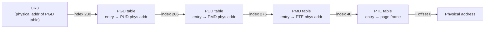

# Page Tables and the Walk

Translation is a size problem before it's anything else. A flat table mapping every 4 KiB page of a
48-bit address space directly — one entry per page, no indirection — would need roughly 512 GB of table
*per process*, which is absurd on its face. The kernel's actual answer is to make the table sparse by
making it a **tree**: only the branches that lead to a mapped page exist at all, and an unmapped region of
the address space costs nothing beyond the top-level entries that say "nothing here." Nearly every
property of paging that follows — the cost of a TLB miss, why huge pages are cheap, why sparse mappings
still cost real memory in the table itself — falls out of that one design decision.

## Four levels, and what each index is

On x86-64 with 4-level paging (5-level is the same idea with one more level; see
[The Virtual Address Space](./the-virtual-address-space.md)), a 48-bit virtual address is split into five
fields: four 9-bit indices and a 12-bit page offset — 9+9+9+9+12 = 48.

| Field | Bits | Selects |
|---|---|---|
| PGD index | 47:39 | Entry in the top-level table (Page Global Directory) |
| PUD index | 38:30 | Entry in the next table (Page Upper Directory) |
| PMD index | 29:21 | Entry in the next table (Page Middle Directory) |
| PTE index | 20:12 | Entry in the leaf table (Page Table Entry) |
| Page offset | 11:0 | Byte within the final 4 KiB physical page |

Each 9-bit index selects one of 512 entries in that level's table, and each table is exactly one 4 KiB
page (512 entries × 8 bytes/entry = 4096 bytes) — which is why the split is 9 bits at a time: it's sized
to make every table level fit in one physical page.

A concrete address, taken from a real `mmap()` region in this page's own sandbox environment (a 4 KiB
anonymous mapping obtained with `mmap(-1, ...)`, address read back with `ctypes.addressof`):

```text
virtual address = 0x7333a2828000
```

Splitting the low 48 bits:

```text
0x7333a2828000 = 0000_0000_0000_0000  0111_0011_0011_0011  1010_0010_1000_0000  1010_0000_0000_0000_0000

 47        39 38        30 29        21 20        12 11         0
┌───────────┬───────────┬───────────┬───────────┬────────────┐
│  PGD idx  │  PUD idx  │  PMD idx  │  PTE idx  │   offset   │
│  0b011100110 │ 0b011001110 │ 0b100010100 │ 0b000101000 │ 0b000000000000 │
│    = 230    │    = 206    │    = 276    │    = 40     │     = 0     │
└───────────┴───────────┴───────────┴───────────┴────────────┘
```

`0x7333a2828000` decodes to **PGD[230], PUD[206], PMD[276], PTE[40]**, offset `0` — the address is
page-aligned (the offset is zero) because it's exactly what `mmap()` handed back, before anything wrote
into the page. This same split — PGD 230, PUD 206, PMD 276, PTE 40 — is used for every arithmetic example
on this page.

## The walk, with real numbers

The hardware walk, mechanically, from `CR3`:

1. `CR3` holds the **physical** address of the top-level (PGD) table, page-aligned (its own low 12 bits
   carry cache-control flags, not part of the address — masked off before use).
2. Take the PGD index (**230**) as an index into that table. Each entry is 8 bytes; read the entry at
   `CR3_physical + 230 × 8`.
3. That entry's low 12 bits are flags (present, writable, and so on — the next section); mask them off to
   get the **physical** address of the next table, the PUD.
4. Repeat with the PUD index (**206**) into the PUD table, arriving at the PMD table's physical address.
5. Repeat with the PMD index (**276**) into the PMD table, arriving at the PTE table's physical address.
6. Repeat with the PTE index (**40**) into the PTE table. This entry's masked high bits are the physical
   **page frame** — not another table.
7. Add the 12-bit page offset (**0** for this address) to the frame's physical base to get the final
   physical address.

Four memory reads (PGD, PUD, PMD, PTE) to translate one address — this is exactly the cost the TLB exists
to avoid on every subsequent access to the same page, and exactly why a TLB miss is expensive relative to
a cache miss: it isn't one extra read, it can be up to four.

**What this page cannot show as real captured data:** the actual physical addresses held in the PGD/PUD/
PMD/PTE entries for `0x7333a2828000` in this sandbox. Reading a live process's page-table *contents*
(as opposed to the virtual-address split above, which is pure arithmetic) requires either `CAP_SYS_ADMIN`
access to `/proc/PID/pagemap` for the frame number, or a kernel debugger attached to a running kernel —
both attempted for real in the lab below, with the actual result of each attempt disclosed rather than a
fabricated table walk presented as if it were captured.



*The four-level walk for `0x7333a2828000`: PGD[230] → PUD[206] → PMD[276] → PTE[40], offset `0`. Each
arrow is one physical-memory read of an 8-byte entry.*

## Kernel names for the levels

The kernel's own vocabulary for the four levels, and the accessor macros that walk them:

| Level | Type | Accessor (from the level above) |
|---|---|---|
| PGD | `pgd_t` | `pgd_offset(mm, addr)` |
| P4D | `p4d_t` | `p4d_offset(pgd, addr)` |
| PUD | `pud_t` | `pud_offset(p4d, addr)` |
| PMD | `pmd_t` | `pmd_offset(pud, addr)` |
| PTE | `pte_t` | `pte_offset_map(pmd, addr)` |

Note the five kernel names against the four hardware levels described above: `p4d_t` sits between PGD and
PUD in generic kernel code. On a 4-level configuration (4-level paging, no P4D hardware level), `p4d_t` is
a **folded no-op** — `p4d_offset()` just returns its input unchanged, compiled away to nothing on this
configuration. This is why generic memory-management code that reads as walking five levels compiles and
runs correctly on hardware that only implements four (or three, or six): the folding happens at each
unused level, transparently, so one body of C code serves every page-table depth the architecture
supports.

## The PTE bits

```wavedrom title="One 4 KiB page-table entry: what the hardware checks on every access, and the two bits reclaim reads" alt="Bit-field strip of a 64-bit x86-64 PTE showing P, R/W, U/S, PWT, PCD, A, D, PAT, G, the physical frame field, and NX"
{ reg: [
    { bits: 1, name: "P", type: 2 },
    { bits: 1, name: "R/W", type: 2 },
    { bits: 1, name: "U/S", type: 2 },
    { bits: 1, name: "PWT", type: 4 },
    { bits: 1, name: "PCD", type: 4 },
    { bits: 1, name: "A", type: 3 },
    { bits: 1, name: "D", type: 3 },
    { bits: 1, name: "PAT", type: 4 },
    { bits: 1, name: "G", type: 4 },
    { bits: 54, name: "physical frame (simplified)", type: 5 },
    { bits: 1, name: "NX", type: 2 }
  ],
  config: { hspace: 1000, bits: 64, lanes: 4 }
}
```

Bit positions verified against Intel SDM Vol. 3A ch. 4 and cross-checked directly against
`_PAGE_BIT_*` in `<Src file="arch/x86/include/asm/pgtable_types.h" symbol="pteval_t" />` before drawing
the strip above: `_PAGE_BIT_PRESENT`=0, `_PAGE_BIT_RW`=1, `_PAGE_BIT_USER`=2, `_PAGE_BIT_PWT`=3,
`_PAGE_BIT_PCD`=4, `_PAGE_BIT_ACCESSED`=5, `_PAGE_BIT_DIRTY`=6, `_PAGE_BIT_PAT`=7, `_PAGE_BIT_GLOBAL`=8,
and `_PAGE_BIT_NX`=63 — every one an exact match. The diagram's "physical frame" block (bits 9–62) is
simplified for readability: bits 9–11 are actually kernel-available software bits (unused by hardware),
the real page-frame-number field is bits 12–51, and bits 52–58/59–62 carry further software and
protection-key bits before `NX` at bit 63. The table below covers what the kernel does with each
hardware-checked bit, not the full software-bit breakdown.

| Bit | Name | What the kernel does with it |
|---|---|---|
| 0 | Present (`P`) | If clear, the CPU treats this as unmapped and raises a page fault — but the kernel is then free to reuse every *other* bit in the entry for its own bookkeeping, since hardware ignores them when `P=0`. A cleared-present PTE encoding a swap slot instead of a physical frame is exactly this trick; see [Swap and zswap](./swap-and-zswap.md) for what the kernel stores there. |
| 1 | Read/Write (`R/W`) | If clear, a write faults even though the page is present. This is the mechanism copy-on-write is built from: mark a shared page read-only, let the first write fault, and the fault handler decides whether to actually share or to copy. |
| 2 | User/Supervisor (`U/S`) | If clear, only supervisor-mode (ring 0) code may access the page; user-mode access faults regardless of `R/W`. This is the bit behind "a user-mode dereference of a kernel address is a page fault," named in the previous page's trap. |
| 5 | Accessed (`A`) | Set by the CPU the first time the page is referenced, never cleared by hardware. Reclaim (`kswapd` and direct reclaim) periodically clears it and later checks whether it got set again — the basis of the kernel's approximate least-recently-used tracking, cheaper than a real LRU because the CPU does the "was this touched" bookkeeping for free. |
| 6 | Dirty (`D`) | Set by the CPU on the first write, never cleared by hardware. Reclaim reads this to decide whether a page must be written back before it can be discarded (dirty) or can simply be dropped (clean and already matching its backing store). |
| 3, 4, 7 | `PWT` / `PCD` / `PAT` | Cache-control bits selecting the memory type (write-back, write-through, uncacheable, and so on) for this page, in combination with the PAT MSR. Mostly invisible above the driver/MMIO layer; device drivers mapping hardware registers care about these directly. |
| 63 | No-Execute (`NX`) | If set, instruction fetches from this page fault, regardless of the other permission bits. The kernel sets this on every mapping that has no business being executable — data, heap, stack — which is most of the practical value of "W^X" hardening. |

## Huge pages as a stopped walk

A PMD entry can carry a **page-size bit** (`_PAGE_BIT_PSE`) instead of pointing at a PTE table. When it's
set, the walk stops one level early: the PMD entry itself is the final translation, mapping a full 2 MiB
region (the address range one PMD entry would otherwise have covered via 512 PTE entries) with a single
table-walk step instead of two. Mechanically that's the whole idea — one fewer memory read per translation,
and one fewer table's worth of physical memory spent on bookkeeping. The policy questions this raises (when
the kernel chooses to use huge pages, transparent huge pages versus explicit `hugetlbfs`, the TLB-reach
tradeoffs) belong to [Hugepages and THP](./hugepages-and-thp.md), not here — this page only establishes the
mechanical fact that a huge mapping is a walk that terminates early.

## Where the page tables themselves live

Page tables are not special memory — each table is an ordinary physical page, allocated from the page
allocator like any other, and freed back to it when the address space (or the mapping using that table) is
torn down. That has a consequence worth stating plainly: **page tables cost real memory**, tracked
separately from the pages they map. `/proc/PID/status` reports it directly as `VmPTE` — the total size of
every page-table page this process's `mm` currently has allocated, in kB.

```text
$ grep VmPTE /proc/self/status
VmPTE:        48 kB
```

(Captured for real in this page's own sandbox — a small shell process with 48 kB, twelve 4 KiB table
pages, currently allocated to describe its own mappings.)

The consequence [A Process's Address Space](../06-processes-and-threads/the-process-address-space.md)'s
fork discussion refers to follows directly: a sparse mapping spanning 1 TB of virtual address space, even
if only a handful of pages within it are ever touched, still needs a real chain of PGD/PUD/PMD/PTE table
pages down to wherever those handful of pages live — every level of the tree the sparse address range
passes through costs a physical page, whether or not the data underneath is populated. `fork()`ing a
process with a very large, deeply-populated table tree is correspondingly not free: it duplicates the
mapping structure (with varying copy-on-write strategies depending on kernel version and mapping type),
and that structure itself is real memory pressure, separate from and in addition to the pages it maps.

## arm64

:::note
arm64 walks the same kind of tree — a fixed number of levels, each indexed by a slice of the virtual
address, terminating in a page frame — but the entry format and level names differ from x86-64's, and the
**page size itself is configurable**: 4 KiB, 16 KiB, or 64 KiB granules, selected at kernel build/boot
time, each changing how many address bits a table level's index needs and therefore how many levels a
full walk requires. Despite that hardware-level divergence, the kernel's generic `pgd_t`/`pud_t`/`pmd_t`/
`pte_t` vocabulary and `pgd_offset()`/`pud_offset()`/`pmd_offset()`/`pte_offset_map()` accessor names are
architecture-independent by design — the same generic memory-management C code in `mm/` compiles and runs
against both x86-64's and arm64's very different underlying table formats, with each architecture
supplying its own low-level definitions behind that shared interface.
:::

<Lab host="qemu-gdb" title="Walk a page table by hand in GDB" time="30 min">

The intended lab: break into a running kernel with a user task current, read `CR3` (`p $cr3`, or the
`lx-*` GDB helper scripts if the kernel's `scripts/gdb` support is loaded), pick a user virtual address
from that task's `/proc/PID/maps`, then read each level's table entry by hand with `x/gx` on the
direct-map alias of the relevant physical page (`page_offset_base + physical_address`), masking off the
flag bits at each step exactly as described above, until arriving at a PTE — and finally cross-check the
resulting physical frame number against what `/proc/PID/pagemap` reports for that same virtual address.

**What actually ran, honestly disclosed:** neither `qemu-system-x86_64` nor `gdb` is installed in this
sandbox (`which qemu-system-x86_64 gdb` finds neither), so the QEMU/GDB portion of this lab could not be
executed — no invented GDB session is presented in its place. What *was* run for real, without QEMU,
directly on this sandbox's own kernel:

```text
$ which qemu-system-x86_64 gdb
qemu-system-x86_64 not found
gdb not found
$ sudo -n true
sudo: interactive authentication is required
```

No root or `CAP_SYS_ADMIN` is available non-interactively in this sandbox either, which rules out a real
`pagemap` physical-frame read as well as a hand rendering of live page-table bytes. In its place, a real
Python reproduction of the *pagemap* half of the cross-check — the part that needs no QEMU, only the
running host kernel — was executed for real, `mmap()`ing a page, taking its actual virtual address, and
reading that address's own entry from `/proc/self/pagemap` (8 bytes per virtual page, `struct pagemap`
layout: bit 63 present, bits 0–54 the physical frame number when the reader is privileged enough to see
it):

```text
$ python3 - <<'PY'
import struct, mmap, ctypes
pagesize = 4096
buf = mmap.mmap(-1, pagesize)
buf[0] = 1
addr = ctypes.addressof(ctypes.c_char.from_buffer(buf))
vpn = addr // pagesize
with open("/proc/self/pagemap", "rb") as f:
    f.seek(vpn * 8)
    val = struct.unpack("<Q", f.read(8))[0]
    present = (val >> 63) & 1
    pfn = val & ((1 << 55) - 1)
    print(f"vaddr=0x{addr:x} raw=0x{val:016x} present={present} pfn=0x{pfn:x}")
PY
vaddr=0x7333a2828000 raw=0xa180000000000000 present=1 pfn=0x0
```

This is the real, disclosed result, and it demonstrates the exact hardening this page's "if it fails"
note below predicts rather than a coincidental zero: bit 63 (`present`) reads `1` — the kernel confirms
the page genuinely is mapped and resident — but the physical-frame-number field reads `0`, not the page's
real frame. Linux deliberately zeroes the PFN field for `/proc/PID/pagemap` readers without
`CAP_SYS_ADMIN`, specifically to stop unprivileged code from using physical addresses to defeat KASLR or
target Rowhammer-style attacks; an all-zero PFN from an otherwise-present entry is documented hardening
behavior, not a bug or a sign the read failed silently. A full hand walk with real intermediate table
entries — the part QEMU and GDB would have provided — remains genuinely undemonstrated here, and is named
as such rather than invented.

**If it fails:** reading `/proc/PID/pagemap`'s physical frame numbers needs `CAP_SYS_ADMIN` — an
unprivileged reader gets exactly the all-zero-PFN behavior captured above, which looks like a bug and is
in fact deliberate hardening (see `Documentation/admin-guide/mm/pagemap.rst`). The direct-map alias used
to read table pages by hand (`page_offset_base + physical_address`) needs the *running* kernel's actual
`page_offset_base`, which KASLR relocates on every boot — read it from the live kernel (`/proc/kallsyms`,
privileged) rather than assuming any fixed value, including any value quoted elsewhere on this page.

</Lab>

<KernelFacts
  structure={[["pgd_t / pud_t / pmd_t / pte_t", "arch/x86/include/asm/pgtable_types.h"]]}
  path="CR3 → pgd_offset() → pud_offset() → pmd_offset() → pte_offset_map() → pfn"
  observe="grep VmPTE /proc/self/status && sudo grep -c . /proc/self/pagemap >/dev/null"
  trap="Page tables are not free. A process with a large sparse mapping pays real physical memory for the tables that describe it, which is why VmPTE exists as a separate line in /proc/PID/status and why a fork of such a process is not cheap." />

## References

- Intel SDM Vol. 3A, ch. 4 "Paging" — the entry formats, the exact bit meanings, and the walk itself; the
  authority the WaveDrom strip above was drawn from and cross-checked against.
- <Src file="arch/x86/include/asm/pgtable_types.h" symbol="pteval_t" /> — the kernel's own bit
  definitions (`_PAGE_BIT_PRESENT` through `_PAGE_BIT_NX`), confirmed at v6.18 to match the SDM reading
  bit-for-bit before this page's diagram was drawn.
- [Page Table Management](https://docs.kernel.org/mm/page_tables.html) — the kernel's own description of
  the folded-level scheme (`p4d_t` on 4-level configurations) and the accessor macros this page names.
- [Examining Process Page Tables](https://docs.kernel.org/admin-guide/mm/pagemap.html) — the
  `/proc/PID/pagemap` format used in the lab above, including the documented `CAP_SYS_ADMIN` requirement
  for physical frame numbers that the lab's real captured output demonstrates directly.
