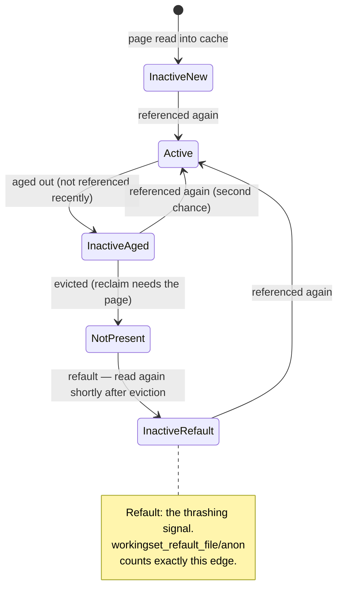

# Reclaim, LRU, and kswapd

[The Page Allocator](./the-page-allocator.md) hands out pages until it can't. A system that only
allocates eventually stops, so something must decide which pages to take back, and from whom, before
that happens. Reclaim is that decision. On a busy machine it runs constantly, almost always invisibly,
and whether it runs in the background or inside your allocating thread is the difference between a
healthy machine and one that stalls under load with memory still showing as free.

## What is reclaimable

Not all memory is equally available, and the categories drive everything else on this page:

| Category | Reclaim action | Cost to reclaim |
|---|---|---|
| Clean file-backed page (page cache, unmodified) | Drop it — the file on disk is already the source of truth | Cheap: no I/O, just remove from cache |
| Dirty file-backed page | Write it back first, then drop | A write, then cheap |
| Anonymous page (heap, stack, mmap'd private memory) | Only if swap exists — write to a swap device, then drop | A write to swap; see [Swap and zswap](./swap-and-zswap.md) |
| Slab objects (dentries, inodes, filesystem caches) | Ask the owning subsystem via a shrinker callback | Depends on the subsystem; see [Shrinkers](#shrinkers) |
| Kernel stacks, mlocked pages, most `GFP_KERNEL` allocations | Not reclaimable at all | N/A — pinned for the life of the thing using them |

Anonymous memory without swap is the sharp edge in that table: with no swap device, an anonymous page has
nowhere to go, and reclaim's only remaining lever against memory pressure is file-backed pages — including
pages that are somebody's executable text, about to be needed again immediately. See [Swap and
zswap](./swap-and-zswap.md#what-actually-happens) for exactly what that looks like.

## The LRU lists

Pages that can be reclaimed are tracked on **LRU lists** — but not a single strict least-recently-used
list. Each `struct lruvec` (`<Src file="include/linux/mmzone.h" symbol="lruvec" />`, per NUMA node and per
memory cgroup) keeps separate **active** and **inactive** lists, further split by file-backed versus
anonymous, so five lru_list types in total (`LRU_INACTIVE_ANON`, `LRU_ACTIVE_ANON`, `LRU_INACTIVE_FILE`,
`LRU_ACTIVE_FILE`, plus `LRU_UNEVICTABLE` for pages that can't be reclaimed at all but still need
tracking).

Reclaim scans the **inactive** list first — a page there is a candidate to be evicted outright. But a page
found to have been referenced again while sitting on the inactive list is not evicted; it gets a
**second chance**: promoted to the active list instead. Only a page that survives a scan on the inactive
list *without* being re-referenced is actually taken.

Two lists rather than one strict LRU order exist for a concrete reason: a single large sequential scan —
copying a huge file, say — would otherwise flood a true LRU with pages that are used exactly once and
never again, evicting everything genuinely hot in the process. The active/inactive split, combined with
the second-chance promotion, gives the reclaimer resistance to that specific failure mode: a page has to
earn its way onto the active list by being referenced *again*, not merely by having been touched once
recently.

## MGLRU at v6.18

The **multi-generational LRU (MGLRU)** is an alternative reclaim implementation: instead of two lists per
type, pages are organized into a small number of **generations**, aged primarily by scanning page-table
**accessed bits** directly rather than relying only on the reference-on-fault/reference-on-scan signal the
classic two-list scheme uses. The stated goal is better reclaim decisions under real memory pressure —
less scanning overhead, and access information that's fresher than "was this referenced since the last
scan happened to pass over it."

**Verified against the kernel source and documentation at v6.18, checked 2026-09-08:** MGLRU is a
compile-time option, not something every kernel ships with active. `mm/Kconfig` at v6.18 defines two
separate switches, and neither carries a `default y`:

```
config LRU_GEN
    bool "Multi-Gen LRU"
    ...
config LRU_GEN_ENABLED
    bool "Enable by default"
    depends on LRU_GEN
    help
      This option enables the multi-gen LRU by default.
```

`Documentation/admin-guide/mm/multigen_lru.rst`'s own "Quick start" confirms this is something a kernel
must be *built* with — `CONFIG_LRU_GEN=y` and `CONFIG_LRU_GEN_ENABLED=y` — and that the runtime kill
switch at `/sys/kernel/mm/lru_gen/enabled`'s default value "depends on `CONFIG_LRU_GEN_ENABLED`." So the
honest statement at v6.18 is: MGLRU exists upstream, is mature enough that some distributions build it in
and enable it by default, but it is **not** unconditionally on in every kernel — whether it's active on a
given machine is a question the sysfs file answers, not an assumption you can safely carry from one
kernel to another. On the machine this page was written on (a WSL2 kernel, `6.18.33.2-microsoft-standard-WSL2`),
`/sys/kernel/mm/lru_gen/` does not exist at all — confirming this kernel was not built with
`CONFIG_LRU_GEN`, and the classic two-list scheme above is what's actually running.

Check `/sys/kernel/mm/lru_gen/enabled` on any given machine — its presence tells you `CONFIG_LRU_GEN=y`
was set at build time, and its value tells you whether the kill switch is currently on.

## kswapd versus direct reclaim

This is the distinction that actually matters operationally. Each zone tracks watermarks, and reclaim can
happen two ways depending on which one is crossed (see [The Page Allocator](./the-page-allocator.md#watermarks)
for the watermark side of this):

- **`kswapd`** wakes when a zone drops below its **low** watermark and reclaims **in the background** — a
  dedicated per-node kernel thread doing work asynchronously while allocations continue to be satisfied
  from whatever's still available. This is the healthy case: pressure is building, and something is
  already working on it before anyone has to wait.
- **Direct reclaim** happens when the **min** watermark is hit: the allocating task itself is forced to
  reclaim memory synchronously, on its own time, before its own allocation can proceed. This is a latency
  event with an unbounded tail — the task doing the allocating is now doing reclaim work instead of its
  own work, for as long as reclaim takes.

The two are directly observable and distinguishable in `/proc/vmstat`: `pgscan_kswapd` counts pages
scanned by the background thread, `pgscan_direct` counts pages scanned by allocating tasks forced into
reclaim themselves. On the machine this page was written on, both currently read 0 (`pgscan_kswapd 0`,
`pgscan_direct 0`) — no reclaim pressure at capture time. PSI's memory pressure (`/proc/pressure/memory`,
`some` and `full` averages) is the complementary signal: rising `pgscan_direct` together with rising PSI
`full` is a machine whose allocating threads are stalled on reclaim, not merely busy.

This is exactly why "the machine has free memory but everything feels slow" is so often *not* a
contradiction: `MemFree` measures a snapshot of unused pages, and says nothing about whether the threads
trying to allocate right now are being routed through direct reclaim first. A machine can have gigabytes
of `MemFree` and still be doing direct reclaim if the free memory is fragmented in a way, or distributed
across zones in a way, that a specific allocation can't use without reclaiming first.

## Shrinkers

Reclaim doesn't only deal in pages it owns directly. Caches the page allocator has no visibility into —
the dentry cache, the inode cache, and every subsystem-specific object cache built on
[slab](./slab-slub-and-kmalloc.md) — register a **shrinker** (`struct shrinker`, `<Src
file="include/linux/shrinker.h" symbol="shrinker" />`): a pair of callbacks, one reporting how many
objects are currently freeable, one actually freeing a requested count. Reclaim calls into every
registered shrinker as part of the same pass that scans the LRU lists.

`vm.vfs_cache_pressure` (default 100, and 100 on the machine this page was written on) is the knob that
biases how aggressively shrinkers for directory and inode caches are invoked relative to page-cache and
swap-cache reclaim: 100 means "reclaim these at a rate that's fair relative to everything else"; lower
values bias the kernel toward keeping dentries and inodes around; higher values bias toward reclaiming
them faster. The honest note: cranking `vfs_cache_pressure` up in the belief that it frees "real" memory
for applications is usually counterproductive — dentry and inode caches are what make repeated path
lookups and file opens fast, and shrinking them aggressively trades a small amount of freed memory for
directory-traversal work that has to be redone from disk (or from a much colder cache) the next time
something walks that part of the filesystem.

## Refaults, and detecting thrashing

The single most useful reclaim measurement isn't "how much is being reclaimed" — it's whether reclaim is
**working**. A page reclaimed and then read back almost immediately did no good at all: it cost the write
(if dirty) or the cache-population I/O (on the way back in), for zero net memory saved, because something
still needed it. That evicted-then-immediately-refaulted pattern is called a **refault**, and it is the
direct, measurable signal that the working set no longer fits in available memory — the boundary between
"using memory efficiently" (page cache filling free space, evicted without complaint because nothing
needed it again) and **thrashing** (evicting pages that are still in active use, over and over).

`/proc/vmstat`'s `workingset_refault_file` and `workingset_refault_anon` count these directly — on this
machine, `workingset_refault_file` currently reads 621020 against a much smaller `workingset_refault_anon`
of 276, reflecting normal page-cache churn rather than active thrashing at capture time (a genuinely
thrashing machine shows these counters climbing rapidly, continuously, under load). PSI's memory `some`
(some task stalled on memory) and `full` (*all* runnable tasks stalled on memory at once) averages are the
complementary signal — `full` climbing is a much stronger sign of trouble than `some`, because it means
there was no other runnable work to hide the stall behind. This measurement — refault rate plus PSI
`full` — is what actually distinguishes a memory-pressured-but-fine machine from one that is thrashing;
free memory percentage alone cannot make that distinction.

## The reclaim/allocation loop

This closes the circle with [The Page Allocator](./the-page-allocator.md): a zone's watermarks trigger
reclaim (background via `kswapd`, or synchronous via direct reclaim), reclaim frees pages by the
mechanisms above, and the allocation that triggered direct reclaim (or was merely waiting on `kswapd`)
retries against the now-larger pool of free pages. Under ordinary pressure this loop just works — it's the
entire point of having reclaim at all. But the loop can fail to make progress: reclaim scans, finds
nothing left it's willing or able to take (everything reclaimable has already been reclaimed, or is being
reclaimed and hasn't completed, or there's no swap left for anonymous pages that need it), and the
allocation still cannot be satisfied. That is where [The OOM Killer](./the-oom-killer.md) takes over — the
exit from this loop when reclaiming harder stops being an option.



*One file page's life through the LRU lists, and the refault edge that tells you the working set no
longer fits.*

<KernelFacts
  structure={[["struct lruvec", "include/linux/mmzone.h"], ["struct shrinker", "include/linux/shrinker.h"]]}
  path="allocation below watermark → wake_all_kswapds() or direct reclaim → shrink_node() → shrink_lruvec() → shrink_folio_list()"
  observe="grep -E 'pgscan_kswapd|pgscan_direct|pgsteal|workingset_refault' /proc/vmstat && cat /proc/pressure/memory"
  trap="Free memory is not the metric. A machine at 99% memory use with no reclaim activity is fine; a machine with gigabytes free that is doing direct reclaim is stalling every allocating thread. Watch pgscan_direct and PSI, not MemFree." />

## References

- [Multi-Gen LRU](https://docs.kernel.org/admin-guide/mm/multigen_lru.html) — the MGLRU administration
  guide; confirmed present and current against `Documentation/admin-guide/mm/multigen_lru.rst` at v6.18,
  checked 2026-09-08.
- [Pressure Stall Information (PSI)](https://docs.kernel.org/accounting/psi.html) — memory pressure as the
  operational signal, and the difference between `some` and `full`.
- <Src file="mm/vmscan.c" symbol="shrink_folio_list" /> — where a page's fate is actually decided, one
  page at a time; present at v6.18 (`static unsigned int shrink_folio_list(...)`).
- `man 5 proc`, the `/proc/vmstat` fields — the counters this page tells the reader to watch.
