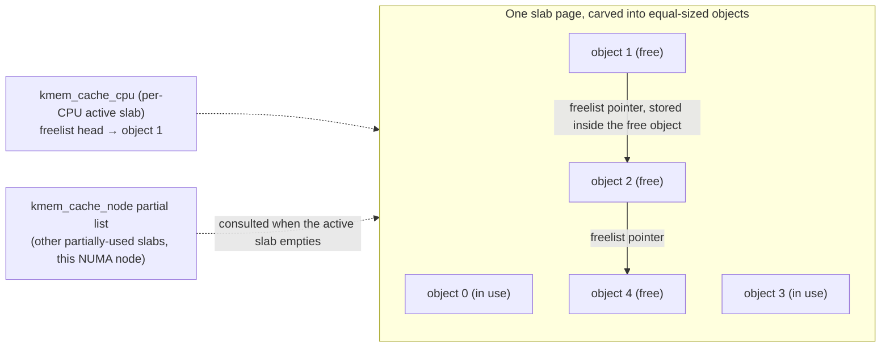

# Slab, SLUB, and `kmalloc`

[The Page Allocator](./the-page-allocator.md) deals in 4 KiB units. The kernel allocates `struct
dentry`s of roughly 192 bytes, millions of them, constantly, as the filesystem cache does its work.
Rounding every one of those up to a full page would waste well over 90% of the memory behind them, and
going all the way to the page allocator — with its zone lock and watermark logic — for every 192-byte
object would be far too slow for something this hot. The **slab layer** is the object cache that sits
between: it asks the page allocator for pages in bulk, carves them into same-sized objects, and hands
those out and takes them back far more cheaply than a fresh page allocation would cost.

## The idea

A **slab cache** is a pool dedicated to one object type or size class: pages carved into equal-sized
slots, a **freelist** threading the currently-unused slots together, and `alloc`/`free` operations that
push and pop that freelist instead of touching the page allocator on every call. An object returned by
`kmem_cache_free()` goes back to its cache's freelist, not back to the page allocator — the backing pages
themselves are only returned to `alloc_pages()` when a slab empties out and the cache decides to release
it.

Historically, the original slab design (Bonwick's allocator, which Linux's first slab implementation was
modeled on) also kept objects **constructed** between uses — a cache could register a constructor that
initialized an object once when its slab was created, so that repeated alloc/free cycles reused
already-initialized state instead of re-running setup each time. That idea survives only vestigially
today: `kmem_cache_create()` still accepts a `ctor` argument, but it is now called once per object when
its slab is created, not re-invoked to "reset" an object on every free — most caches pass `NULL` and
initialize fully on each allocation instead.

## SLUB

At v6.18, **SLUB is the only slab allocator left in the tree.** The original SLAB allocator (the
per-CPU-queue design layered over Bonwick's object-caching model) was removed from the kernel; SLOB (the
tiny embedded allocator aimed at systems with only a few megabytes of RAM) was removed earlier still. What
remains is SLUB itself, plus a **`CONFIG_SLUB_TINY`** build mode of the same allocator that trades some of
its per-CPU speed structures for a smaller memory footprint on the smallest systems — explicitly
documented in-tree as aimed at systems that used to reach for SLOB. There is no longer a three-way choice
between allocators to describe; older material that presents "SLAB vs. SLUB vs. SLOB" as a live decision
is describing a kernel that predates the removal (see the LWN coverage in the references).

SLUB's design:

- **Per-CPU active slabs.** Each CPU keeps one "active" slab per cache (`struct kmem_cache_cpu`, defined
  in `mm/slub.c` at v6.18 — it moved out of a public header once external code stopped needing to see it
  directly), so a same-CPU alloc/free pair on a hot cache touches no cross-CPU state and, on the fast
  path, no lock at all: allocation checks the active slab's freelist and pops one entry with a
  `cmpxchg`-style operation, and only falls to a slower, locked path when that freelist is empty or a
  migration/preemption invalidates the transaction ID SLUB uses to detect it.
- **A freelist threaded through the free objects themselves.** Rather than a separate metadata array
  recording which slots are free, each free object's own memory stores a pointer to the next free object
  — the freelist *is* the objects, reusing memory nobody is using for anything else. This is why there is
  no separate bookkeeping array to allocate, size, or keep in cache alongside the objects: freeing an
  object is "write a pointer into it and link it in," not "update a bitmap somewhere else."
- **Per-node partial lists.** When a CPU's active slab empties, SLUB looks for a **partially-used** slab
  on that NUMA node's partial list before asking the page allocator for a brand-new one — reusing
  memory that is already carved up and already has some free objects in it, rather than paying for a
  fresh page allocation when a perfectly good partial slab is available nearby.

## `kmalloc` and size classes

`kmalloc()` is not a general-purpose allocator of its own — it is a set of generic slab caches at
power-of-two sizes (plus two non-power-of-two classes, 96 and 192 bytes, added specifically to reduce the
waste at those common sizes), and a `kmalloc(n)` call rounds `n` up to whichever cache's object size is
the smallest one that still fits it. The classes, from `mm/slab_common.c` at v6.18: 8, 16, 32, 64, 96,
128, 192, 256, 512, 1024, 2048, 4096, and further powers of two up to 2 MiB (`kmalloc-2M`, the largest
class `kmalloc_index()` supports).

The consequence is one every kernel developer eventually re-learns the hard way: a 100-byte request gets
a 128-byte object, and the 28 bytes in between are gone — unusable by anyone else, charged against this
allocation regardless. Worse, the waste is worst right *after* a class boundary: a struct sized at 129
bytes gets rounded to 256, wasting very close to half its allocation, while a struct at 256 bytes exactly
wastes nothing. This is why the size of a hot, frequently-allocated structure is a real design
consideration in kernel code, not a micro-optimization — growing a struct from 128 to 136 bytes crosses
a class boundary and can increase its per-object memory cost by close to 100%, even though the struct only
grew by 8 bytes.

## `kmem_cache_create` for your own objects

`kmem_cache_create(name, size, align, flags, ctor)` builds a dedicated cache instead of routing through a
generic `kmalloc` size class. There are two reasons to bother:

1. **Exact sizing.** A generic `kmalloc` class rounds up; a dedicated cache is sized to exactly the
   object, with no rounding waste — worthwhile when the object is both large and extremely common (a
   filesystem's own inode structure, for instance, which typically wraps `struct inode` in a
   filesystem-specific superset and gets its own cache for exactly this reason).
2. **A named entry in `/proc/slabinfo`.** This is the practical reason developers actually reach for it.
   A generic `kmalloc-256` allocation is invisible in isolation — thousands of unrelated call sites share
   that cache, so nothing in `/proc/slabinfo` points at a leak. A dedicated cache with its own name shows
   up as its own line, growing on its own, findable with `slabtop` the moment it starts leaking instead of
   being lost in the generic-size-class noise.

## Where the objects come from

The slab allocator does not manufacture memory — every slab it hands out is backing pages it asked
`alloc_pages()` for, at whatever order that cache's slab size dictates (order 0 for most small-object
caches, higher for caches whose object size makes a multi-page slab more efficient). A slab cache that is
growing without bound is, one layer down, the page allocator handing out more and more order-0 (or
higher) allocations — a slab problem is eventually a page-allocator problem. This is exactly why
`slabtop` and `/proc/buddyinfo` are read together in practice: `slabtop` says *which* cache is growing,
`/proc/buddyinfo` says what that growth is doing to the zone's supply of contiguous free blocks.

## Debug options

`slub_debug` (a boot parameter, and per-cache configurable via `/sys/kernel/slab/<cache>/`) turns on a set
of correctness checks that cost real overhead and are normally off in production:

| Option | Catches | Cost |
|---|---|---|
| **Redzoning** (`R`) | Writes past the end of an object into its padding — a buffer overrun caught the moment the object is freed and its redzone checked. | Extra bytes per object, plus a check on every free. |
| **Poisoning** (`P`) | Use of a freed object (poison pattern overwritten means someone wrote after free) and use of an uninitialized object (poison pattern still present means it was read before write). | A memset on every free and alloc. |
| **Object/owner tracking** (`U`, `T`) | Records the allocation (and optionally free) call stack per object, so a corrupted or leaked object can be traced back to the code that allocated it. | Meaningful memory per object for the stack trace, plus the walk to capture it. |

Overhead scales with which of these are on and for which caches — `slub_debug=FZPU` globally is a
significant, deliberate slowdown reserved for chasing a specific corruption bug, not something left on in
production. Debug builds that combine slab poisoning with kernel address sanitizers go considerably
further still; that combination belongs to the sanitizers material later in this documentation, not here.

<Lab host="any-linux" title="Find where kernel memory is going" time="15 min">

1. **`sudo slabtop -o -s c`** — sorts caches by total bytes consumed (`-s c`) and prints once (`-o`)
   instead of the live-updating display. Expect `dentry`, `inode_cache`, and one or more `kmalloc-*`
   entries near the top on any machine that has done meaningful filesystem work.
2. **`sudo grep -E '^(dentry|inode_cache|kmalloc-)' /proc/slabinfo`**, read against the file's own header
   line (`# name <active_objs> <num_objs> <objsize> <objperslab> <pagesperslab> ...`) — decode each row:
   active objects, total objects, per-object size, objects per slab.
3. **Grow and shrink `dentry`/`inode_cache` on purpose.** Create a large number of small files in a
   `tmpfs` mount (`dentry` and inode structures for `tmpfs` files are ordinary slab objects like any
   other filesystem's), watch the two caches grow in `/proc/slabinfo`, then
   `echo 2 > /proc/sys/vm/drop_caches` and watch them shrink back down as reclaimable dentries and inodes
   are dropped.

:::warning
`echo 2 > /proc/sys/vm/drop_caches` (or `3`, which also drops the page cache) is not destructive — dirty
data is never discarded, only clean, reclaimable cache — but it is not free either. It throws away
genuinely useful cache that took real I/O to populate, and the machine will feel slower immediately
afterward as that cache has to be rebuilt from disk. Do not run this on a system anyone else is using, and
do not run it repeatedly "just to check."
:::

**If it fails:** `/proc/slabinfo` (and the `slabtop`/`slabinfo` tools that read it) is root-only on most
distributions — an ordinary user gets `Permission denied`, not empty output. A machine built with
`CONFIG_SLUB_TINY` will show a smaller, different cache set (some of the per-CPU speed structures this
page describes are compiled out), so an exact match to the sample output below should not be expected on
every kernel.

**What actually ran, honestly disclosed:** this task ran as an unprivileged user (`uid=1000`) with no
passwordless `sudo` available in this sandbox — `sudo slabtop`/`sudo grep /proc/slabinfo` both fail with
`Permission denied` here (confirmed: `cat /proc/slabinfo` → `Permission denied`, `slabtop -o -s c` →
`Unable to create slabinfo structure: Permission denied`), so steps 1 and 2 above could not be run for
real on this machine, and no invented `slabtop`/`slabinfo` output is presented in their place.

Step 3 *was* run for real, substituting `/proc/meminfo`'s aggregate `Slab:` line (world-readable) for the
per-cache `dentry`/`inode_cache` breakdown that `/proc/slabinfo` would show if it were accessible — a
coarser signal than the lab intends, but a real, measured one, and `/dev/shm` (already a `tmpfs`, already
writable by an unprivileged user) stood in for a fresh `tmpfs` mount, since mounting a new one needs
`CAP_SYS_ADMIN`:

```text
$ grep -i slab /proc/meminfo
Slab:             195984 kB

$ python3 -c "
import os
d='/dev/shm/labtest'
os.makedirs(d, exist_ok=True)
for i in range(200000):
    open(os.path.join(d, 'f%d'%i), 'w').close()
"
# real 0m0.919s

$ grep -i slab /proc/meminfo
Slab:             398912 kB

$ rm -rf /dev/shm/labtest
# real 0m0.307s

$ grep -i slab /proc/meminfo
Slab:             214080 kB
```

200,000 empty files in `tmpfs` — each one a `dentry` plus an inode — more than doubled total slab memory
(196 MiB → 399 MiB), and removing them dropped it most of the way back (to 214 MiB), not all the way to
baseline, because some dentries and inodes remain cached after removal until something actually reclaims
them (`drop_caches` could not be exercised here for the same root-only reason as step 2). The direction and
rough magnitude match what `dentry`/`inode_cache` growth in `/proc/slabinfo` would show; the per-cache
breakdown itself is the part this sandbox could not produce.

</Lab>



*A SLUB cache: the free list lives inside the free objects, which is why there is no separate metadata to
maintain.*

<KernelFacts
  structure={[["struct kmem_cache", "mm/slab.h"], ["struct kmem_cache_cpu", "mm/slub.c"]]}
  path="kmalloc() [alloc_hooks(kmalloc_noprof(...))] → kmalloc_caches[type][size class] → per-CPU freelist → slab page → alloc_pages() on miss"
  observe="sudo slabtop -o -s c | head -15"
  trap="kmalloc(96) does not allocate 96 bytes. It allocates the smallest size class that fits — 96 exactly, in this case, but a 100-byte request gets 128 — so a struct that grows past a class boundary can increase its memory use by close to 100% overnight." />

## References

- [SLUB Allocator](https://docs.kernel.org/mm/slub.html) — the in-tree SLUB documentation, including every
  `slub_debug` option and its single-letter code.
- <Src file="mm/slub.c" symbol="kmem_cache_alloc" /> — the fast path, short enough to read in one sitting,
  and it shows the per-CPU freelist check directly.
- `man 5 slabinfo` and `man 1 slabtop` — the field definitions used to decode the lab's `/proc/slabinfo`
  output.
- ["remove the SLAB allocator"](https://lwn.net/Articles/951272/), LWN — coverage of SLAB's deprecation
  (6.5) and removal (6.8), and ["What's next for the SLUB allocator"](https://lwn.net/Articles/974138/) —
  the reason older material describing three live allocators (SLAB/SLUB/SLOB) is out of date at v6.18;
  SLOB was removed earlier still, in the 6.4 merge window (["A slab allocator (removal)
  update"](https://lwn.net/Articles/932201/)).
