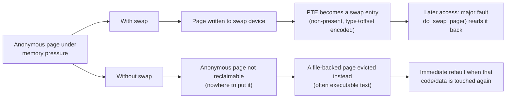

# Swap, zswap, and zram

Swap has an undeserved reputation. It is not "what happens when a machine runs out of memory" — it is
what makes anonymous memory reclaimable *at all*. [Reclaim, LRU, and kswapd](./reclaim-lru-and-kswapd.md#what-is-reclaimable)
already stated the consequence: without swap, an anonymous page has nowhere to go, and a system under
pressure has strictly fewer options — it must evict file-backed pages instead, including executable text
it is about to need again. A machine with swap has more ways to survive memory pressure gracefully than
one without it, not fewer.

## What swapping actually moves

Swapping moves **anonymous pages only** — heap, stack, and private `mmap()` regions with no backing file.
File-backed pages are never "swapped": a dirty file page is written back to the file it came from, and a
clean one is simply dropped, because the file itself is already durable storage for that data. Conflating
the two is the single most common source of confusion about this whole area, so it's worth saying plainly,
early, and separately from everything that follows: writeback of file pages and swapping of anonymous
pages are two different mechanisms that happen to both be triggered by the same reclaim pass.

## Swap entries live in the PTE

A swapped-out page doesn't require a separate lookup table to find where it went. When an anonymous
page is written to swap, the PTE that mapped it is rewritten in place: cleared of its present bit, and
repurposed to hold a **swap type** (which swap device) and **offset** (where on that device) encoded into
the bits the hardware ignores once a PTE is marked not-present. [Page Tables and the Page-Table
Walk](./page-tables-and-the-walk.md#the-pte-bits) covers the PTE bit layout this repurposing depends on.

This is why a swapped page is found by a **page fault**, not a search: the very PTE that would have
pointed at the physical page now points at the swap slot instead. A reference to that address faults,
the fault handler sees a non-present PTE that isn't simply unmapped (it decodes to a valid swap entry
`swp_entry_t`, `<Src file="include/linux/mm_types.h" symbol="swp_entry_t" />` — a typedef around a single
packed field, defined in `mm_types.h` at v6.18, not `swapops.h`, which instead holds the encode/decode
helpers built around it), and the fault is routed to bring the page back in.

## The fault back in

`do_swap_page()` (`<Src file="mm/memory.c" symbol="do_swap_page" />`, `vm_fault_t
do_swap_page(struct vm_fault *vmf)` at v6.18) is the handler for exactly that case. By definition this is
always a **major fault** — the data is not in RAM, so satisfying it requires I/O, unlike a minor fault
that's resolved purely by manipulating page tables. The kernel also performs **swap readahead**: reading
in some number of pages around the faulting offset speculatively, on the bet that anonymous memory near
this page will be touched soon too — the same logic that makes read-ahead effective for ordinary files.
Whether that bet pays off depends entirely on access locality: readahead that guesses right saves future
major faults; readahead that guesses wrong is wasted I/O and wasted cache pressure from pages nobody
touches.

## `swappiness`, precisely

`vm.swappiness` is not "how eager the kernel is to swap" in the sense most people read it. It is the
**relative IO cost the kernel assigns to reclaiming anonymous pages versus reclaiming file-backed
pages** — a bias in the reclaim decision, not a probability dial.

**Verified against `Documentation/admin-guide/sysctl/vm.rst` at v6.18** (the range described there is
worth flagging explicitly, because it has changed from what older references say): the value runs from
**0 to 200**, not the 0–100 range that's still widely quoted from older kernels and books.

- **At 100**, the VM treats anonymous and file-backed reclaim as equal IO cost and applies memory pressure
  to both roughly equally.
- **Below 100** (60 is the default, and this machine's current value), swap IO is treated as more
  expensive than filesystem paging, so the kernel biases toward reclaiming file-backed pages first and
  anonymous pages only once file-backed reclaim isn't enough.
- **At 0**, the kernel will not *initiate* swap of a runnable process's pages until the amount of free and
  file-backed memory drops below the zone's high watermark — an extreme bias against swapping, but **not**
  a disable switch; see [Misconceptions](#misconceptions).
- **Above 100** — this is the part that changed, and is exactly the kind of detail that goes stale: the
  v6.18 documentation explicitly describes values above 100 as meaningful for **fast, in-memory swap
  backends** — zram or zswap, or a hybrid setup with swap on a device faster than the filesystem it's
  competing against. If swap IO is genuinely cheaper than filesystem IO (a compressed in-RAM swap device
  against a slow network filesystem, for instance), a value above 100 tells the kernel to prefer reclaiming
  anonymous pages first. The documentation gives a worked example: swap twice as fast as filesystem I/O
  suggests `swappiness=133`.

## What actually happens

Swap disabled entirely, machine under sustained memory pressure. This is a walkthrough grounded in the
mechanism above — deliberately disabling swap and driving a machine into sustained thrashing isn't
something to stage destructively in this environment, and the point here is the mechanism, not a captured
transcript.

With no swap device, reclaim's options for anonymous memory are gone (see [What is
reclaimable](./reclaim-lru-and-kswapd.md#what-is-reclaimable)). Under pressure, reclaim can only take
file-backed pages — and that includes the executable text (`.text` segment mappings) of every running
program, which is file-backed, clean, and therefore the cheapest thing for reclaim to evict. So it does.
The immediate symptom: heavy **major-fault** counts as evicted executable pages are read straight back in
the moment a program executes the next instruction on that page, followed by heavy **refault** counts
(`workingset_refault_file` climbing continuously — see [Refaults, and detecting
thrashing](./reclaim-lru-and-kswapd.md#refaults-and-detecting-thrashing)) as those same pages get evicted
again almost immediately to make room for the next thing under pressure. The machine spends its time
evicting and re-reading the same small set of pages instead of doing useful work — the textbook definition
of thrashing.

Crucially, the [OOM killer](./the-oom-killer.md) does not arrive sooner because swap is off — it arrives
**later**, after a long period of this thrashing, because thrashing is not the same failure mode as
"nothing left to reclaim." Reclaim keeps finding *something* it can technically take (file pages, however
counterproductive re-evicting them is), so the reclaim/allocation loop keeps limping forward instead of
declaring defeat and invoking the OOM killer the way it would once truly nothing reclaimable is left.

The honest conclusion: **disabling swap does not prevent thrashing — it changes what thrashes.** With
swap, anonymous pages that genuinely aren't being used get moved out, and thrashing (if it happens at all)
shows up as the swap-in rate (`pswpin`) climbing. Without swap, the pressure doesn't go away; it moves to
the file-backed pages actively in use for *running the programs on the machine*, which is a worse thing
to have thrashing on and generally leaves the machine in a less recoverable state by the time something
finally kills a process.

## zram and zswap

Two different mechanisms people frequently conflate, both trading CPU time (compression) for memory
capacity:

| | zram | zswap |
|---|---|---|
| What it is | A compressed block device, used *as* a swap device (or any block device) | A compressed cache sitting in front of a real swap device |
| Where compressed data lives | In a RAM-backed block device the kernel treats like any other disk | In a dedicated in-kernel compressed pool |
| Needs a backing device? | No — it *is* the whole swap device | Yes — pages that don't fit the compressed pool write through to real backing swap |
| What happens when full | Bounded by its configured size; normal swap-full behavior once exhausted | Least-valuable pages in the pool are decompressed and written through to backing swap |
| Typical use | Small/embedded/no-disk-swap-available systems, or as the entire swap tier when total RAM saved matters more than avoiding disk entirely | Systems that already have real swap and want to absorb the *common case* (moderate pressure) in compressed RAM while still having a real fallback under sustained pressure |

The distinction that matters operationally: zram with no backing device is a hard ceiling — once it's
full, that's it, ordinary swap-full behavior applies. zswap always has backing swap to fall through to,
so it degrades rather than hard-caps, at the cost of needing a real swap device configured underneath it
in the first place.

## Swap on SSD versus on rotating media

The honest performance note: swap's usage pattern is essentially random small-block I/O — pages get
faulted in and written out individually, in whatever order access happens to demand, not sequentially.
Rotating media is specifically bad at exactly that pattern (seek-dominated), which is the real reason
"swap on spinning disk" earned its reputation for making a struggling machine feel catastrophically
worse rather than merely slower. SSDs, with no seek penalty, largely remove that specific cost — a swap-in
still costs I/O latency and competes for device bandwidth, but not the seek penalty that made rotating
swap so punishing.

`/sys/block/*/queue/rotational` is how the kernel (and readahead heuristics that consult it) knows which
kind of device it's dealing with — `0` for non-rotational (SSD, NVMe, RAM-backed), `1` for spinning media.
On the machine this page was written on, the SSD/NVMe-class and loop/ram devices report `rotational: 0`
while the `sd[abcd]` devices (this is a WSL2 VM, so these are virtualized rotating-media-class disks) show
`rotational: 1` — readahead and I/O scheduling decisions differ accordingly.

## When swap really is wrong

A page that only defends swap isn't credible, so the honest exceptions: a **latency-critical service**
where a major fault mid-request is unacceptable — trading systems, real-time audio, anything with a hard
deadline shorter than a swap-in can reliably deliver — should not be relying on swap to bail it out of
memory pressure; [pre-faulting and `mlock`](./demand-paging-and-cow.md#map_populate-mlock-and-pre-faulting)
is the correct tool there instead. And a **container platform** that would rather kill and reschedule a
misbehaving workload cleanly than let it degrade slowly and unpredictably under swap-driven thrashing has
a legitimate reason to disable swap for that workload — the tradeoff is deliberate and understood, not the
default "swap is bad, turn it off" reflex this page argues against.

## Misconceptions

- **"Swap is used only when RAM is full."** The kernel may swap out anonymous pages that are genuinely
  idle to make room for page cache *while RAM still has room* — this is correct, deliberate behavior, not
  a sign of trouble. An idle anonymous page swapped out and never touched again cost nothing to move and
  frees real memory for something actively useful.
- **"`swappiness=0` disables swap."** It strongly biases the kernel against initiating swap on a
  runnable process's pages, but swapping can still happen — the kernel documentation is explicit that 0
  changes the trigger condition, not whether swap is possible at all.
- **"Swap makes things slow."** Thrashing makes things slow. Swap is what the kernel does *before*
  thrashing becomes unrecoverable — see [What actually happens](#what-actually-happens) above for what
  the alternative (no swap at all) actually looks like under the same pressure.

*The same memory pressure, with and without swap: the pressure does not disappear, it moves to the pages
you were about to use.*

<KernelFacts
  structure={[["struct swap_info_struct", "include/linux/swap.h"], ["swp_entry_t", "include/linux/mm_types.h"]]}
  path="reclaim → add_to_swap() → __swap_writepage() → PTE becomes a swap entry → later fault → do_swap_page() → swap_read_folio()"
  observe="swapon --show && grep -E '^(Swap(Cached|Total|Free)):' /proc/meminfo && cat /proc/sys/vm/swappiness"
  trap="Swap usage is not a problem indicator. Pages swapped out and never touched again cost nothing; the number that matters is the swap-in rate (pswpin in /proc/vmstat), because that is the only part that costs latency." />

## References

- [zswap](https://docs.kernel.org/admin-guide/mm/zswap.html) and the
  [zram](https://docs.kernel.org/admin-guide/blockdev/zram.html) documentation — the definitive
  descriptions of both, and the difference between them.
- Chris Down, [*"In defence of swap"*](https://chrisdown.name/2018/01/02/in-defence-of-swap.html) — the
  clearest argument for why a swapless system has fewer options; a blog post by a kernel and systemd
  contributor, and correct.
- <Src file="mm/page_io.c" symbol="swap_writepage" /> — the write side; at v6.18 the public entry point is
  `__swap_writepage()`, dispatching to a filesystem-backed, synchronous-bdev, or async-bdev path
  depending on the swap device.
- `man 5 proc` and `man 8 swapon` — the counters and the interface for the observation commands.
- [`vm` sysctls](https://docs.kernel.org/admin-guide/sysctl/vm.html) — swappiness range and semantics,
  verified for this page against `Documentation/admin-guide/sysctl/vm.rst` at v6.18.
