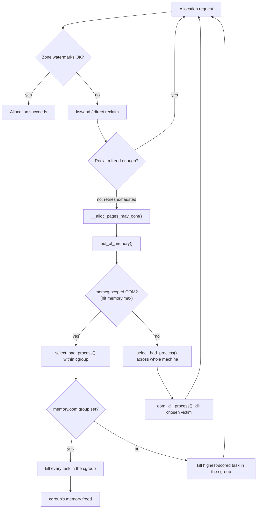

# The OOM Killer

By the time this code runs, every allocation path has already failed, reclaim has already been asked and
has already come back empty, and there is no correct answer left — only a choice between killing something
now and letting the machine deadlock on memory it will never get back. The OOM killer is a heuristic making
a decision nobody wants to make. Understanding it starts with accepting what it is: not a safety mechanism
that protects the system, but the visible end of one that already failed. [Reclaim, LRU, and
kswapd](./reclaim-lru-and-kswapd.md) covers everything that happens *before* this page — this is what
happens when that isn't enough.

## How it is reached

An allocation that can't be satisfied from free memory tries reclaim, and if reclaim frees enough, the
allocation retries and (usually) succeeds. The loop in [Reclaim, LRU, and kswapd](./reclaim-lru-and-kswapd.md#the-reclaimallocation-loop)
is exactly this: allocate, fail, reclaim, retry. What matters for this page is what happens when that loop
stops making progress — reclaim scans, finds nothing left it can take (every clean page already dropped,
every dirty page already under writeback, no swap left for anonymous pages that need it, shrinkers already
squeezed), and the allocation still can't be satisfied.

`__alloc_pages_slowpath()` is where this loop actually lives in the allocator. After enough failed
reclaim/retry cycles it calls `__alloc_pages_may_oom()`, which calls `out_of_memory()` — the function this
whole page is about (verified against `mm/page_alloc.c` and `mm/oom_kill.c` at v6.18: the exact chain is
`__alloc_pages_slowpath() → __alloc_pages_may_oom() → out_of_memory() → select_bad_process() →
oom_kill_process()`).

The important operational point is the one easy to miss from the code: **the machine is usually thrashing
badly for a long time before `out_of_memory()` ever runs.** Every one of those failed reclaim/retry cycles
costs real time — scanning lists, writing pages to swap, waiting on I/O — and a machine deep in that loop
feels unresponsive well before any process gets killed. That period, not the kill itself, is where PSI-based
intervention (see [User-space killers](#user-space-killers) below) actually helps: by the time the kernel's
own OOM killer fires, the expensive part has usually already happened.

## Choosing a victim

`out_of_memory()` calls `select_bad_process()`, which walks eligible tasks and scores each one with
`oom_badness()` (`<Src file="mm/oom_kill.c" symbol="oom_badness" />`). Read at v6.18, the function is
short enough to settle the question directly:

```c
points = get_mm_rss(p->mm) + get_mm_counter(p->mm, MM_SWAPENTS) +
         mm_pgtables_bytes(p->mm) / PAGE_SIZE;
task_unlock(p);

/* Normalize to oom_score_adj units */
adj *= totalpages / 1000;
points += adj;
```

The baseline score is a task's resident memory plus its swapped-out memory plus the memory its own
page tables consume, then shifted by `oom_score_adj`. That's the whole heuristic. It is explicitly **"who
will free the most memory,"** not "who caused the problem" — there is no field in this calculation for
fault, for how the memory got used, or for how recently it grew. This is exactly why the well-behaved
database holding a large, legitimate working set is such a common OOM victim while the small script that
is *actually* leaking, slowly, survives: at the moment reclaim finally gives up, RSS is what the scorer
sees, not history.

A task already marked unkillable, already OOM-reaped, mid-`vfork()`, or carrying `oom_score_adj ==
OOM_SCORE_ADJ_MIN` is excluded outright (`oom_badness()` returns `LONG_MIN` for these) — it is never even
compared against the rest.

## `oom_score_adj`

Each task's `/proc/PID/oom_score_adj` is an integer in **`[-1000, 1000]`** that linearly biases the badness
score above (`adj * totalpages / 1000`, added straight into the points total). `-1000` is
`OOM_SCORE_ADJ_MIN` — full immunity, the task is never selected by `select_bad_process()` at all, no matter
how much memory it holds. `+1000` pushes a task toward being chosen essentially first, regardless of size.
`/proc/PID/oom_score` is the read-only, already-computed result of `oom_badness()` for a task right now
— useful for inspecting the current ranking without triggering anything.

The practical policy this implies: **use `oom_score_adj` to protect the few things that genuinely must not
die** — an init process, a database that would rather everything else on the box die first, a monitoring
agent that needs to survive to report what happened — not as a way to encode blame about which processes
"deserve" to be killed. A system where every service sets an aggressive negative adjustment just moves the
victim onto whatever's left unprotected; it doesn't make OOM go away, it just relocates who pays for it.

## memcg OOM versus global OOM

Everything above describes a **global** OOM: `out_of_memory()` running against the whole machine's task
list because the whole machine's memory is exhausted. A cgroup with `memory.max` set gets a second, more
contained version: when a task inside that cgroup hits its own `memory.max`, the kernel triggers an OOM
kill **confined to that cgroup** — `select_bad_process()` only considers tasks inside it, so the kill can
only take out something that was already sharing the same memory budget. This is a much better failure
mode than a global OOM: a runaway container gets its own tasks killed instead of taking down an unrelated
process on the same host that happens to have a large RSS.

`memory.oom.group` (a cgroup v2 knob) changes the granularity of the kill itself: instead of picking one
victim task inside the cgroup by `oom_badness()`, setting it to `1` kills **every task in the cgroup
atomically** when that cgroup OOMs. This is what container platforms usually want — a container is meant
to live or die as a unit, and leaving some of its processes running after killing only the biggest one
tends to produce a half-alive, confusing failure rather than a clean restart. The mechanics of cgroup
memory limits, `memory.max`, and `memory.oom.group` in practice belong to the containers and virtualization
material later in this series — this page only establishes that the OOM path forks into a
cgroup-scoped variant with its own, narrower blast radius.

## What actually happens

**Honest disclosure on this section's anchor.** The brief for this page calls for a real OOM report
captured live in the QEMU lab described below. In this sandbox, `qemu-system-x86_64` is not installed
(confirmed: `which qemu-system-x86_64` finds nothing), and non-interactive `sudo` is unavailable
(`sudo -n true` fails with "interactive authentication is required"), which rules out both running a VM
and deliberately triggering a global OOM directly on the host this page was written on — doing that on
purpose would risk killing the very tools and shell this task depends on, which the task brief explicitly
warns against. This sandbox's own `dmesg -T` was also checked for a pre-existing, real OOM event
(`dmesg -T | grep -i 'oom\|killed process'`) and found none — this particular machine has never actually
hit an OOM in its history. So **no real captured `dmesg` OOM report is available for this page**, and none
is fabricated here in its place — the project's own convention (see the honest-disclosure note in [Page
Tables and the Walk](./page-tables-and-the-walk.md)'s lab) is that a report whose field layout might be
wrong is worse than admitting one couldn't be captured.

What follows instead is the report's structure described field by field, in prose and table form, from the
kernel source that produces it (`mm/oom_kill.c`'s `dump_header()` and `__oom_kill_process()`) rather than
presented as a transcript:

| Field | What it looks like | What it tells you |
|---|---|---|
| Invocation line | `<task> invoked oom-killer: gfp_mask=0x..., order=..., oom_score_adj=...` | Which task's allocation triggered `out_of_memory()`, the `GFP` flags and allocation order it was requesting, and that task's own `oom_score_adj` — this is **who asked**, not necessarily who gets killed. |
| Call trace | A kernel stack trace of the invoking task | Where in the kernel the failing allocation happened; mostly useful for diagnosing *why* memory was exhausted, not for picking the victim. |
| Memory-state dump | Per-zone free/min/low/high watermarks, and node-level page-state counters (`dump_header()` → `show_mem()` / `mem_cgroup_print_oom_meminfo()` for a memcg OOM) | The state reclaim was working against right before it gave up — confirms whether this was genuinely "nothing reclaimable left" versus a fragmentation/zone-constrained failure. |
| Per-task table | One row per eligible task: pid, UID, `tgid`, total VM size, RSS, page-table size, `oom_score_adj`, and name | The candidate pool `select_bad_process()` actually scored — this is where you can often work out `oom_badness()`'s outcome yourself before reading the next line. |
| Victim line | `Out of memory: Killed process <pid> (<name>) total-vm:..., anon-rss:..., file-rss:..., shmem-rss:..., UID:..., pgtables:..., oom_score_adj:...` | The chosen victim and the exact numbers `oom_badness()` scored it on — this is **who got killed**, and the presence/absence of a `memcg` field distinguishes global from cgroup-scoped. |

A reader who has internalized this table can answer the three questions the brief poses for any real
report: **who asked** for memory (the invocation line), **who got killed** (the victim line, with its RSS
breakdown), and **whether it was global or cgroup-scoped** (whether the memory-state dump and victim line
carry `memcg` context, versus a whole-machine zone dump).

## The panic option

`vm.panic_on_oom` (checked by `check_panic_on_oom()`, called from `out_of_memory()` right after the
allocation constraint is determined) changes what happens instead of picking a victim: at `1`, the kernel
panics rather than killing anything (except when the OOM is memcg-scoped, unless `panic_on_oom=2` also
covers that case); at `2`, it panics unconditionally, including for memcg OOMs. The reasoning some
deployments have for preferring this over letting the killer run: an OOM kill produces a machine that
*keeps running* but with one process gone — and if that process was load-bearing in a way its
`oom_score_adj` didn't capture, the result is a machine that's up but silently degraded, harder to
diagnose than one that's simply down. A panic (paired with a watchdog or `kdump` to capture the state)
trades availability for a clean, legible failure: reboot into a known state rather than limp along missing
an unknown piece.

## User-space killers

`systemd-oomd`, `earlyoom`, and `nohang` are all user-space daemons that kill processes *before* the
kernel's own OOM killer ever runs — and the reasoning for why that's the right place to act follows
directly from [How it is reached](#how-it-is-reached) above. The kernel's OOM killer is the *last* resort:
it only runs once reclaim has exhausted every option and the machine is likely to have already been
thrashing for a while. PSI (`/proc/pressure/memory`, or the cgroup-scoped `memory.pressure`) crosses into
concerning territory long before that point — while the machine is merely unhappy, not yet deadlocked. A
PSI-based killer acting on a sustained `full` average lets it choose a victim under much better conditions
than the kernel ever gets: before the thrashing period has cost minutes of wall-clock time, and often
before the workload driving the pressure has even become the biggest RSS holder yet. `systemd-oomd` is the
systemd-integrated option (units, `ManagedOOMMemoryPressure=`), `earlyoom` and `nohang` are standalone
daemons with the same PSI-driven premise. All three exist because the kernel's own algorithm, by design,
acts too late to be a good user experience — it acts *correctly*, just very late.

<Lab host="qemu" title="Cause and read an OOM kill" time="20 min">

:::danger
Do **not** run this lab on a machine you actually care about. An unprotected OOM can kill your login
session, your editor, or the display manager along with (or instead of) the intended test program, and on
a machine with no swap the thrashing phase described above can render the machine unresponsive for minutes
before anything is actually killed. The `qemu` host badge on this lab exists for exactly this reason —
run it inside a disposable VM, never on bare metal you're using for anything else.
:::

**Not executed for this page.** As disclosed under [What actually happens](#what-actually-happens) above,
`qemu-system-x86_64` is not available in the sandbox this page was written in, and non-interactive `sudo`
is also unavailable — both are needed to run this lab as designed, and deliberately triggering a global
OOM directly on the host without a VM boundary was avoided on purpose, per the danger notice above. The
steps below are the lab as designed, to be run in an environment where QEMU is actually available.

1. Boot a disposable VM with a small, fixed amount of RAM and no swap (so the thrashing phase stays short
   and the outcome is unambiguous).
2. In one terminal, watch `/proc/pressure/memory` (`watch -n1 cat /proc/pressure/memory`) so the `full`
   average climbing is visible in real time.
3. Run a small program that allocates and *touches* memory in a loop (touching matters — an allocation
   that's never written can be satisfied lazily and never forces reclaim) without bound, e.g. a loop that
   repeatedly `mmap()`s or `malloc()`s a chunk, writes to every page in it, and never frees anything.
4. Watch PSI climb, then watch the machine slow down, then let the OOM killer fire. Capture the full
   report with `dmesg -T | grep -A 40 'invoked oom-killer'` and read it against the [What actually
   happens](#what-actually-happens) table above — identify the invocation line, the per-task table, and
   the victim line in the real output.
5. Repeat inside a cgroup with `memory.max` set to something well below the VM's total RAM, and confirm
   the resulting OOM report is scoped to that cgroup (only tasks inside it appear in the per-task table,
   and only one of them is killed) rather than global.

**If it fails:** with `vm.overcommit_memory=2` set beforehand, the allocating loop's `malloc()`/`mmap()`
calls simply start failing once the overcommit limit is hit — the allocation fails cleanly in user space
and no OOM kill happens at all, which is itself worth observing (see the third misconception below). Inside
a container, the cgroup's own `memory.max` may be reached and trigger a memcg-scoped kill before the VM's
global limit is ever approached, which is also a valid, informative outcome — it just isn't the *global*
OOM the first four steps are aimed at.

</Lab>

## Misconceptions

1. **"The OOM killer kills the process that caused the problem."** It doesn't evaluate cause at all — it
   kills the task whose death is scored to free the most memory, per `oom_badness()`. A process that leaks
   slowly for hours can survive an OOM that kills the large, well-behaved process that happened to be
   holding the biggest RSS at the moment reclaim gave up.
2. **"An OOM kill means the machine ran out of RAM."** It means a specific allocation request could not
   be satisfied after reclaim was exhausted — that can happen with free memory sitting unused in the wrong
   zone (a `DMA`/`DMA32`-constrained request when only `Normal`/`Highmem` is free), or with plenty of free
   4 KiB pages but no free run long enough to satisfy a high-order request. "Free" as reported in aggregate
   and "usable for this allocation" are not the same fact.
3. **"You can prevent OOM by disabling overcommit."** Setting `vm.overcommit_memory=2` doesn't remove the
   underlying scarcity — it moves the failure earlier and relocates it to `malloc()`/`mmap()` returning
   `ENOMEM` in user space instead of a kernel-chosen kill. Most software handles an allocation failure no
   better than it handles being killed, and plenty of software doesn't check the return value at all — the
   problem is deferred, not solved.

## What actually happens (visual)



*A failing allocation's path from watermark check through reclaim retries to `out_of_memory()`, with the
memcg-scoped branch drawn separately from the global path.*

<KernelFacts
  structure={[["struct oom_control", "include/linux/oom.h"]]}
  path="__alloc_pages_slowpath() → __alloc_pages_may_oom() → out_of_memory() → select_bad_process() → oom_kill_process()"
  observe="dmesg -T | grep -A 40 'invoked oom-killer'"
  trap="The OOM killer is not a protection mechanism, it is the end of one. By the time it fires the machine has usually been thrashing for a long time — the useful intervention is a PSI-driven user-space killer acting well before this point." />

## References

- <Src file="mm/oom_kill.c" symbol="oom_badness" /> — the scoring function; verified at v6.18 to compute
  `get_mm_rss() + MM_SWAPENTS + mm_pgtables_bytes()/PAGE_SIZE`, then shift by `oom_score_adj * totalpages /
  1000`.
- [Memory Management Concepts Overview](https://docs.kernel.org/admin-guide/mm/concepts.html) and the
  [cgroup v2](https://docs.kernel.org/admin-guide/cgroup-v2.html) memory-controller documentation — for
  memcg OOM and `memory.oom.group`.
- `man 5 proc`, the `oom_score` and `oom_score_adj` sections — the user-space interface and its
  `[-1000, 1000]` range.
- [`systemd-oomd.service`](https://www.freedesktop.org/software/systemd/man/latest/systemd-oomd.service.html)
  — the PSI-based alternative and its configuration.
