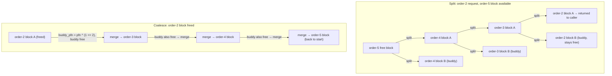

# The Page Allocator

Every other allocator in the kernel — slab, `vmalloc`, the page cache, the stack allocator — ultimately
asks this one for physical pages. It sits at the bottom of the stack and has to answer under constraints
nothing above it has: it cannot fail silently, it may be called from a context that cannot sleep, and it
must keep contiguous memory available for the callers who genuinely need it. Everything else in this
folder is built on top of what this page describes.

## Zones, and why they exist

Physical memory is not one uniform pool. Some hardware can only address a subset of it, and the kernel
partitions memory into **zones** so an allocation that needs a restricted range asks the right pool
instead of hoping:

| Zone | What it's for |
|---|---|
| `ZONE_DMA` | The lowest physical range, for the small set of devices that can only address 16 MiB or less. Mostly a legacy-hardware concern by now. |
| `ZONE_DMA32` | Devices limited to 32-bit physical addresses — still common, since a lot of PCIe hardware without 64-bit DMA support falls here. |
| `ZONE_NORMAL` | Directly mapped, no addressing restriction, no highmem juggling. Where most allocations land on 64-bit machines. |
| `ZONE_MOVABLE` | Pages the kernel promises to keep migratable — memory hot-unplug and huge-page compaction depend on a pool it can always empty. |
| `ZONE_HIGHMEM` | 32-bit only: physical memory the kernel cannot keep permanently mapped in its own address space and must map on demand. |

On a modern x86-64 machine the zones that matter day to day are `DMA32` and `NORMAL`; `ZONE_HIGHMEM`
does not exist on 64-bit builds at all (`CONFIG_HIGHMEM` is 32-bit-only) — it survives only in older books
and in `mem_map`-era war stories. `ZONE_DEVICE` also exists in the `zone_type` enum for device-managed
memory (persistent memory, GPU memory) but is a special case outside ordinary allocation and outside the
scope of this page.

## The buddy allocator

Within a zone, free pages are tracked as a **buddy system**: an array of free lists, one per **order**,
where order *n* holds blocks of 2ⁿ contiguous pages. Two invariants make it work:

- **Splitting.** A request for order *k* that finds order *k*'s free list empty looks at order *k*+1
  instead. If that has a block, the allocator splits it in half — one half satisfies the request, the
  other half is pushed onto order *k*'s free list. This repeats upward until a non-empty order is found.
- **Coalescing.** When a block is freed, the allocator checks whether its **buddy** — the other half of
  the block it would have been split from — is also free. If so, the two merge back into a single block
  at order *k*+1, and the check repeats one order up. Coalescing stops the moment a buddy is found still
  in use.

The trick that makes coalescing cheap is how the buddy's address is found. Two blocks of order *k* that
split from the same parent differ in exactly one bit — bit *k* of their page-frame number (page index,
counted in units of 2ᵏ pages) — because that is precisely the bit the split decision fixed. So the buddy
of a block starting at page frame number `pfn` is:

```c
buddy_pfn = pfn ^ (1 << order);
```

One XOR, no search, no metadata lookup beyond the frame number itself. That is what makes coalesce-on-free
an O(1) operation instead of a scan: the allocator does not look *for* the buddy, it computes exactly
where it must be.

## Orders, and what asks for what

| Order | Size | Typical requester |
|---|---|---|
| 0 | 4 KiB (one page) | Almost everything — ordinary `alloc_pages(order=0)`, most slab-page backing. |
| 1–3 | 8–32 KiB | Kernel stacks (order 2 on x86-64, i.e. 16 KiB across four pages, historically order 1), some slab caches whose object size makes a multi-page slab worthwhile. |
| 9 | 2 MiB | A transparent huge page — the point at which "order" and "huge page" become the same number on x86-64. |

`MAX_ORDER` bounds how high the buddy system goes (`NR_PAGE_ORDERS` orders, 0 through the configured
maximum) — high-order requests are serviced from the top of that range and get progressively less
reliable the longer the system has been up. That decline *is* the fragmentation story: a freshly booted
system has enormous free blocks because nothing has carved them up yet; hours or days into uptime, small
long-lived allocations scattered across every large block make a high-order request fail even when the
zone's total free memory would easily cover it. See [Fragmentation, and compaction](#fragmentation-and-compaction)
below.

## GFP flags

The bits below select what the allocator is *allowed to do on your behalf* to satisfy a request — not a
performance knob, a permission grant.

```wavedrom title="The low GFP bits — verified against gfp_types.h at v6.18" alt="Bit-field strip of the low 8 GFP bits: DMA, HIGHMEM, DMA32, MOVABLE, RECLAIMABLE, HIGH, IO, FS"
{ reg: [
    { bits: 1, name: "DMA", type: 2 },
    { bits: 1, name: "HIGHMEM", type: 2 },
    { bits: 1, name: "DMA32", type: 2 },
    { bits: 1, name: "MOVABLE", type: 4 },
    { bits: 1, name: "RECLAIMABLE", type: 4 },
    { bits: 1, name: "HIGH", type: 3 },
    { bits: 1, name: "IO", type: 3 },
    { bits: 1, name: "FS", type: 3 }
  ],
  config: { hspace: 800, bits: 8, lanes: 1 }
}
```

*The GFP bits that decide what the allocator is allowed to do to satisfy you.*

Verified directly against `<Src file="include/linux/gfp_types.h" />` at v6.18: `___GFP_DMA`=bit 0,
`___GFP_HIGHMEM`=bit 1, `___GFP_DMA32`=bit 2, `___GFP_MOVABLE`=bit 3, `___GFP_RECLAIMABLE`=bit 4,
`___GFP_HIGH`=bit 5, `___GFP_IO`=bit 6, `___GFP_FS`=bit 7 — an exact match to the diagram above. These
positions are not architectural constants; the header itself has reordered them across kernel versions,
which is exactly why this page verifies them fresh rather than trusting an older source.

The first three bits (`DMA`, `HIGHMEM`, `DMA32`) select a zone; `MOVABLE` and `RECLAIMABLE` are
placement/migration-type hints, not zone bits. The composite flags built from these and the higher bits
are what call sites actually use:

| Flag | Permits | Forbids | Exists to prevent |
|---|---|---|---|
| `GFP_KERNEL` (`__GFP_RECLAIM \| __GFP_IO \| __GFP_FS`) | May sleep, may start I/O, may call back into a filesystem, may run direct reclaim. | Nothing — the unrestricted default for process context. | N/A — this is the "I can wait" baseline every other flag narrows. |
| `GFP_ATOMIC` (`__GFP_HIGH \| __GFP_KSWAPD_RECLAIM`) | Waking `kswapd` to reclaim asynchronously; dipping into a small emergency reserve below the normal watermark. | Sleeping, direct reclaim, I/O. | Blocking in a context that cannot block — an interrupt handler or a spinlock holder calling this must never wait. |
| `GFP_NOWAIT` (`__GFP_KSWAPD_RECLAIM \| __GFP_NOWARN`) | Waking `kswapd`; a quiet failure (no allocation-failure splat). | Sleeping, direct reclaim, physical I/O, filesystem callbacks. | The same "cannot block" case as `GFP_ATOMIC`, without dipping into the atomic reserve — a plain "give me a free page right now or tell me no." |
| `GFP_NOFS` (`__GFP_RECLAIM \| __GFP_IO`) | May sleep, may run direct reclaim, may issue block I/O. | Re-entering *any* filesystem callback. | A filesystem allocating memory during its own writeback path that triggers reclaim that calls back into that same filesystem — a lock-ordering deadlock, not just slow. |
| `GFP_NOIO` (`__GFP_RECLAIM`) | May sleep, may run direct reclaim against clean, already-resident pages. | Filesystem callbacks *and* starting new physical I/O. | The block-layer analogue of `GFP_NOFS` — code in the I/O completion path allocating memory must not trigger reclaim that issues more I/O and waits on itself. |
| `__GFP_ZERO` | Combine with any of the above: the returned page is zeroed before use. | N/A (a modifier, not a base flag). | Callers hand-zeroing pages themselves, and the bugs that come from forgetting to. |
| `__GFP_NOWARN` | Suppress the kernel's allocation-failure warning splat for this call site. | N/A. | Log noise from call sites that expect and correctly handle failure as routine (a `GFP_NOWAIT` speculative allocation, for instance). |
| `__GFP_RETRY_MAYFAIL` | Retry reclaim more persistently than the default before giving up, when there is evidence progress is being made. | Retrying forever — it still can and will return `NULL`. | The two bad extremes at once: giving up too early on a large allocation that reclaim could still satisfy, and looping forever on one that reclaim genuinely cannot. |

## Watermarks

Each zone tracks three watermarks — `min`, `low`, `high` — that turn "how much free memory is left" into
allocator behavior:

- Free memory above **`high`**: allocate normally, no reclaim triggered.
- Crossing **`low`** from above: `kswapd` is woken to reclaim asynchronously in the background while
  allocations continue to proceed from the pages still available.
- Crossing **`min`**: an allocating task is forced into **direct reclaim** itself — it reclaims memory
  synchronously, on its own time, before its allocation can proceed.
- Below `min`: only reserved for allocations flagged not to fail, drawing on the small emergency reserve
  that `GFP_ATOMIC`/`__GFP_HIGH` requests are allowed to touch.

Watermarks are the interface between allocation and reclaim: this page owns the allocation side of that
line; [Reclaim, the LRU, and `kswapd`](./reclaim-lru-and-kswapd.md) owns what happens on the reclaim side
once `kswapd` or direct reclaim is triggered.

## Fragmentation, and compaction

**External fragmentation** is free memory that exists but is not usable — plenty of order-0 pages free,
no order-5 block available because every large block has at least one page still in use. It is the
specific failure mode of high-order allocations, and order-0 requests are essentially immune to it.

The kernel fights this in two ways:

- **Migration types.** Every page is tagged `MOVABLE`, `RECLAIMABLE`, or `UNMOVABLE`, and the buddy
  allocator groups free blocks by type. Grouping like with like means a block full of movable pages can
  be compacted (below) instead of being permanently pinned by one unmovable neighbor.
- **Compaction** actively defragments: it migrates movable pages out of a region to consolidate free
  space into higher-order blocks, the mirror image of what the buddy allocator does on free.

Transparent huge page allocation is the main consumer of compaction and the main source of its latency
cost — an order-9 THP request that cannot be satisfied from already-free blocks can trigger synchronous
compaction, which is real, visible latency on the allocating thread. This is one of the standing
trade-offs [Hugepages and THP](./hugepages-and-thp.md) has to weigh.

## Per-CPU page lists

The zone lock protecting the buddy free lists would be a serious bottleneck if every order-0 allocation
and free had to take it — order-0 is by far the highest-volume traffic through this allocator. So each
CPU keeps a small per-CPU cache of free order-0 pages (per zone, per migration type) that ordinary
allocations and frees hit without touching the zone lock at all; only when a per-CPU list empties or
overflows does it refill from, or drain to, the shared buddy lists under the lock. This is the same
"eliminate the shared cache line" idea that [Per-CPU Data](../09-concurrency-and-locking/per-cpu-data.md)
generalizes into a whole category of kernel data structures — the page allocator is simply the first place
most readers meet it.



*Serving an order-2 request out of an order-5 block by repeated splitting, then walking the same path
in reverse — one XOR-computed buddy check per level — on free.*

<KernelFacts
  structure={[["struct zone", "include/linux/mmzone.h"], ["struct free_area", "include/linux/mmzone.h"]]}
  path="alloc_pages() [alloc_hooks(alloc_pages_noprof(...))] → get_page_from_freelist() → watermark check → buddy split → per-CPU list or free_area"
  observe="cat /proc/buddyinfo && cat /proc/zoneinfo | head -30"
  trap="GFP_ATOMIC is not 'faster' — it means 'I cannot sleep, so you may not reclaim on my behalf'. It buys access to a small reserve and a much higher chance of returning NULL, which is why every GFP_ATOMIC call site must handle failure." />

## References

- <Src file="include/linux/gfp_types.h" /> — the flag definitions with the best comments in mm; the
  authority for both the strip and the table above, verified at v6.18: `___GFP_DMA`=0, `___GFP_HIGHMEM`=1,
  `___GFP_DMA32`=2, `___GFP_MOVABLE`=3, `___GFP_RECLAIMABLE`=4, `___GFP_HIGH`=5, `___GFP_IO`=6,
  `___GFP_FS`=7.
- <Src file="include/linux/gfp.h" symbol="alloc_pages" /> — at v6.18 the public `alloc_pages()` is a
  macro (`alloc_hooks(alloc_pages_noprof(...))`) wrapping a `_noprof` implementation; allocation-tagging
  infrastructure added the `_noprof`/`alloc_hooks()` layer, so the symbol a debugger actually stops in is
  `alloc_pages_noprof`, not `alloc_pages` itself.
- `https://docs.kernel.org/mm/page_frags.html` and the mm documentation index — for the surrounding
  allocator documentation at v6.18.
- `https://docs.kernel.org/admin-guide/mm/concepts.html` — zones and watermarks explained by the kernel
  for administrators, which is the right level for this page's zone section.
- Mel Gorman, *Understanding the Linux Virtual Memory Manager* — `https://www.kernel.org/doc/gorman/`.
  Free, and the clearest long-form treatment of the buddy allocator; written against 2.4/2.6, so
  structural claims (zone list, exact field names) must be checked against v6.18 while the algorithm it
  describes is unchanged.
