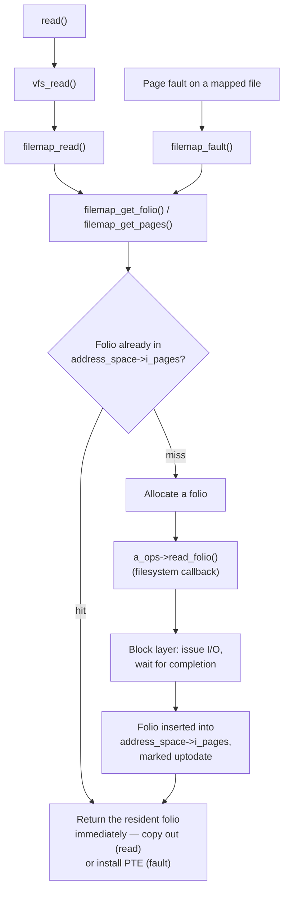

# The Page Cache

This is the single most consequential piece of Linux memory management, and the one most misread by
monitoring tools. Every byte of file data that passes through a normal (non-`O_DIRECT`) read or write
passes through a cache held in RAM. That cache is allowed — encouraged — to grow until it fills whatever
memory nothing else is using, and a machine with almost no `MemFree` and gigabytes of `Cached` is not in
trouble; it is doing exactly what it should. Understanding why that is correct, and how to read the numbers
that describe it, is what the rest of this page is for.

## The structure

Every open, cacheable file has a `struct address_space` (`<Src file="include/linux/fs.h"
symbol="address_space" />`) hanging off its inode. Verified at v6.18: the fields that matter here are
`i_pages`, an **XArray** indexing the folios currently cached for this file; `host`, the owning inode;
`a_ops`, the filesystem's `address_space_operations` table (`read_folio`, `dirty_folio`, and friends);
`nrpages`, the folio count; and `gfp_mask`, the allocation flags used when the cache needs a new folio.

The critical detail is *what* the XArray is indexed by: **file offset**, in page units — not disk block,
not physical address. Two consequences follow directly from that one design choice:

- **The same underlying data cached for two different files is two separate copies.** A hard-linked file
  has one inode and one `address_space`, so its cache is shared correctly; two files that happen to contain
  identical bytes but are genuinely different inodes are cached independently, because the cache has no
  notion of content, only of "offset within this file."
- **A sparse file costs nothing for the holes.** An `address_space` only has entries for the offsets that
  have actually been read or written; a 10 GiB file with 4 KiB of real data at the start has a cache
  footprint of one folio; there is no wasted bookkeeping for the 10 GiB of hole in between.

## `read()` and `mmap()` reach the same place

A buffered `read()` and a fault on a mapped region of the same file are not two different caches that
happen to agree — they are two different *paths to the same folios*.

- A **buffered read** looks up the folio at the requested offset in the file's `address_space`. If it is
  there and up to date, the kernel copies bytes out of it directly into the caller's buffer. If it is
  missing, the kernel allocates a folio, asks the filesystem to fill it (`read_folio`, below), and then
  copies out — but the folio it just filled stays in the cache for the next reader.
- A **fault on a `mmap()`ed region backed by that file** finds or creates the *same* folio through the same
  `address_space`, and instead of copying bytes anywhere, installs a page-table entry in the faulting
  process pointing directly at that folio's physical memory. The process reads (or, for a shared writable
  mapping, writes) the cache itself, with no copy in between.

The consequence is concrete and easy to demonstrate: `read()` a file and `mmap()` the same file
concurrently, and both see the same physical memory. A write through one path is visible to a reader on the
other the moment it happens, because there was never a second copy to fall out of sync — both paths always
terminate at the one folio the `address_space` holds for that offset.

## What actually happens

The second `grep` (or `cat`, or `read()`) of a large file is dramatically faster than the first, and the
reason is not caching magic — it is the literal absence of I/O the second time. Real numbers, measured on
the machine this page was written on, using a genuinely fresh 2 GiB file written with `oflag=direct` so the
write itself did not pre-populate the cache:

```text
$ dd if=/dev/urandom of=testfile.bin bs=1M count=2048 oflag=direct status=progress
2147483648 bytes (2.1 GB, 2.0 GiB) copied, 4.4164 s, 486 MB/s

--- before any read ---
$ grep -E 'Cached|MemAvailable' /proc/meminfo
MemAvailable:   19210684 kB
Cached:          2098408 kB

--- first read: cold, must come from the block device ---
$ time cat testfile.bin > /dev/null
0.00s user 0.49s system 78% cpu 0.629 total

--- after first read ---
$ grep -E 'Cached|MemAvailable' /proc/meminfo
MemAvailable:   19212924 kB
Cached:          4195564 kB

--- second read: same file, nothing else changed ---
$ time cat testfile.bin > /dev/null
0.00s user 0.01s system 98% cpu 0.011 total

--- after second read ---
$ grep -E 'Cached|MemAvailable' /proc/meminfo
MemAvailable:   19213028 kB
Cached:          4195612 kB
```

**0.629 s cold, 0.011 s warm — roughly 57× faster the second time, for the identical `cat` of the identical
2 GiB file.** `Cached` grew by almost exactly 2 GiB between the "before" and "after first read" snapshots
(2,098,408 → 4,195,564 kB, a rise of 2,097,156 kB) — the entire file, now resident as folios in this file's
`address_space`, is what accounts for the speedup: the first run paid for 2 GiB of real device I/O
(`system` time, not `user` time — the kernel doing the work, not this process), and the second run paid for
nothing but memory copies. `MemAvailable` barely moved at all across the same interval, which is the first
concrete instance of [Cache is not "used" memory](#cache-is-not-used-memory) below: 2 GiB of `Cached` did
not cost this machine 2 GiB of headroom.

**The `drop_caches` step could not be run in this sandbox.** The brief calls for
`echo 3 > /proc/sys/vm/drop_caches` between the warm read and a repeat cold-timing run, to show the fast
number revert to the slow one on demand. `/proc/sys/vm/drop_caches` is `--w-------`, owned by `root`, and
this sandbox has no passwordless `sudo` (`sudo -n true` fails with "interactive authentication is
required"; writing to the file directly returns `Permission denied`) — confirmed by direct attempt, not
assumed. What the timings above *do* show for real is the mechanism `drop_caches` would reset: the
difference measured is entirely the presence or absence of the data in RAM, and dropping the cache is
nothing more than deliberately forcing every folio back to "absent," so that the next read pays the cold
cost again. No `drop_caches` output is fabricated to fill this gap.

## Readahead

A single-page cache miss on a sequential access pattern would be wasteful: issue one 4 KiB I/O, wait, issue
the next, wait again — paying the device's per-request latency over and over for data the access pattern
already telegraphs is coming. **Readahead** detects a sequential pattern (successive reads landing at
increasing, contiguous offsets) and issues large *asynchronous* reads ahead of where the caller currently
is, so that by the time the caller's `read()` reaches offset *N*, the folios covering it are usually already
in flight or already resident. The window size adapts — it grows while the pattern keeps looking
sequential, and resets when it stops.

Two explicit controls exist for code that knows its own access pattern better than the heuristic can guess:
`posix_fadvise()` (`man 2 posix_fadvise`) with `POSIX_FADV_SEQUENTIAL` to widen readahead proactively,
`POSIX_FADV_RANDOM` to disable it, or `POSIX_FADV_DONTNEED` to explicitly ask the kernel to drop cached
pages for a range once they are known to be unneeded; and `madvise()` (`man 2 madvise`) with the equivalent
hints for a mapped region.

Readahead's failure mode is **read amplification**: an access pattern that *starts* sequential — enough to
trigger the heuristic's window to grow — and then jumps randomly defeats it in the worst possible way, since
the kernel has already issued I/O for pages the caller never asked for and will never read. The bytes
transferred from the device can end up several times the bytes actually consumed. This is exactly the case
`POSIX_FADV_RANDOM` exists to pre-empt when the caller knows its own pattern in advance.

## Writes land here too

A `write()` to an ordinary file does not, by itself, touch the storage device at all. It finds or creates
the folio at the target offset in the file's `address_space`, copies the caller's bytes into it, marks the
folio dirty (`folio_mark_dirty()` — see the [old/new name table](./folios-and-compound-pages.md#reading-code-from-either-side)),
and returns. At the moment `write()` returns success, the data exists in RAM and *only* in RAM — the device
still holds whatever was there before. This is deliberate, and it is fast precisely because a system call
that had to wait for a physical write every time would be catastrophically slower for the common case of
many small writes to hot, quickly-rewritten data. What guarantees eventually get that dirty data onto the
device — background writeback, `fsync()`, what a crash mid-write can lose — is a whole subject on its own,
and belongs entirely to [Writeback and fsync](./writeback-and-fsync.md), not here.

## `O_DIRECT`, in one paragraph

`O_DIRECT` is the escape hatch: a file opened with it bypasses the page cache entirely, transferring data
straight between the caller's userspace buffer and the block layer. Databases and other systems that
implement their own buffer management (a database already keeps its own carefully tuned, application-aware
cache of hot pages) use it to avoid **double buffering** — paying for the same data to sit in both the
kernel's cache and the application's own cache, doing the kernel's readahead and writeback heuristics no
favors when the application's access pattern is nothing like the general case those heuristics are tuned
for — and to get precise, synchronous control over when data actually reaches the device. What is given up
is everything this page describes: no free readahead, no write-behind buffering, and strict alignment
requirements on buffer address, offset, and length that ordinary buffered I/O never had to think about.
Folder 12 (block I/O) owns the mechanism in full; it is named here only so the trade-off this page has been
describing has its counterpoint on the record.

## Cache is not "used" memory

Page cache memory is **reclaimable**: every clean (non-dirty) folio in it can be dropped instantly the
moment something else needs the physical page, with no work beyond removing the XArray entry — the data is
still safely on the device it came from and can simply be re-read later. `/proc/meminfo` reports it
separately, as `Cached` (plus `Buffers` for block-device-level caching), specifically so that it is never
confused with memory something is actually holding onto. And it is folded into `MemAvailable`, the kernel's
own estimate of memory obtainable for a new allocation without swapping, precisely *because* it can be
handed back on demand. A machine reporting low `MemFree` and high `Cached` has simply used the RAM nothing
else wanted for something useful instead of leaving it idle — the number that actually answers "can this
machine start another process right now" is `MemAvailable`, not `MemFree`. Completing this picture —
distinguishing page-cache `Cached` from a process's own resident set, and reading `/proc/meminfo` and
`/proc/<pid>/status` correctly side by side — is exactly what
[What free and RSS really say](./what-free-and-rss-really-say.md) does next.

<Lab host="root-required" title="Watch the page cache fill and be dropped" time="20 min">

**The intended lab:** (1) create a 2 GiB file with `dd`; (2) `grep -E 'Cached|MemAvailable' /proc/meminfo`
before and after reading it once; (3) time the read twice — cold, then warm; (4)
`echo 3 > /proc/sys/vm/drop_caches` and time a third read to confirm it reverts to the cold number; (5) use
`vmtouch` if installed, or `mincore()` via a short program, to show *which pages* of the file are currently
resident.

**What actually ran, honestly disclosed:** this sandbox has no root and no passwordless `sudo` — confirmed
directly (`sudo -n true` → "interactive authentication is required"; `echo 3 > /proc/sys/vm/drop_caches` →
`permission denied`, and `/proc/sys/vm/drop_caches` is mode `--w-------` owned by `root`). Step 4 could not
be run for real, and no `drop_caches` output is invented in its place. `vmtouch` is not installed in this
sandbox either (`which vmtouch` → not found), and there is no package manager access to install it, so step
5 used a short C program against `mincore(2)` instead, exactly as the brief allows as a fallback.

Steps 1–3 and the `mincore` residency check **did** run for real, against a genuine ext4 filesystem
(`/dev/sdd` mounted at `/`, not a `tmpfs`), and produced the timings already shown in
[What actually happens](#what-actually-happens) above: 0.629 s cold vs. 0.011 s warm for a 2 GiB file,
`Cached` rising by essentially exactly the file's size. The `mincore` check adds the residency dimension
those timings don't show directly — *which* pages, not just *how fast*:

```c
/* mincore_check.c — report what fraction of a file's pages are
 * resident in the page cache right now, via mmap() + mincore(). */
#include <sys/mman.h>
#include <fcntl.h>
#include <stdio.h>
#include <unistd.h>
#include <sys/stat.h>

int main(int argc, char **argv) {
    int fd = open(argv[1], O_RDONLY);
    struct stat st; fstat(fd, &st);
    size_t size = st.st_size;
    void *addr = mmap(NULL, size, PROT_READ, MAP_SHARED, fd, 0);
    long pagesize = sysconf(_SC_PAGESIZE);
    size_t nr_pages = (size + pagesize - 1) / pagesize;
    unsigned char *vec = malloc(nr_pages);
    mincore(addr, size, vec);
    size_t resident = 0;
    for (size_t i = 0; i < nr_pages; i++) if (vec[i] & 1) resident++;
    printf("pages resident: %zu/%zu (%.1f%%)\n",
           resident, nr_pages, 100.0 * resident / nr_pages);
}
```

```text
$ gcc -O2 -o mincore_check mincore_check.c

--- testfile.bin, just read twice above: fully cached ---
$ ./mincore_check testfile.bin
pages resident: 524288/524288 (100.0%)

--- testfile2.bin: a second 2 GiB file, written with oflag=direct, never read ---
$ dd if=/dev/urandom of=testfile2.bin bs=1M count=2048 oflag=direct status=none
$ ./mincore_check testfile2.bin
pages resident: 0/524288 (0.0%)
```

Two files of identical size, on the same machine, at the same moment: one at 100% resident because it had
been read, the other at 0% because it had only been written with `O_DIRECT` and never touched by a buffered
`read()`. This is the same fact the timing numbers show, seen from the other side — presence in the cache,
not just the speed presence buys.

:::warning
`echo 3 > /proc/sys/vm/drop_caches` is not destructive — it never discards dirty data, only clean,
reclaimable cache — but it is not free either. It evicts *everything* the machine had cached, not just the
file you are experimenting with, and the next few minutes on that machine will be measurably slower as
every other process's working set is re-read from storage. Do not run this on a shared or production
machine, and do not run it repeatedly "just to check."
:::

**If it fails:** on a machine with less than roughly 4 GiB of free memory, a 2 GiB test file may not stay
fully resident under memory pressure from other work, and the timing gap will be smaller and noisier than
shown above. On a filesystem with transparent compression or deduplication, the file `dd` writes may not
occupy the size you asked for on disk, which can distort the "before/after `Cached`" comparison; use
`/dev/urandom`, as above, specifically because it defeats compression.

</Lab>



*Two very different-looking operations, one cache: `read()` and a fault on a mapping meet at the same
folio.*

<KernelFacts
  structure={[["struct address_space", "include/linux/fs.h"], ["struct folio", "include/linux/mm_types.h"]]}
  path="read() → vfs_read() → filemap_read() → filemap_get_pages() → folio in the XArray, or filemap_create_folio()/filemap_update_page() → a_ops->read_folio() → block layer"
  observe="grep -E '^(Cached|Buffers|MemAvailable|Dirty):' /proc/meminfo"
  trap="A machine with almost no free memory and a large page cache is a healthy machine. Cached is memory doing useful work that will be handed back the moment anything else needs it — MemAvailable, not MemFree, is the number that answers 'can I start another process'." />

## References

- <Src file="mm/filemap.c" symbol="filemap_read" /> — the buffered read path; verified at v6.18:
  `filemap_read()` calls `filemap_get_pages()` for each folio, which finds a cached folio or, on a miss,
  reaches `filemap_create_folio()`/`filemap_update_page()` → `filemap_read_folio()` →
  `mapping->a_ops->read_folio()` to fill it before copying out.
- `https://docs.kernel.org/admin-guide/mm/concepts.html` — the kernel's own description of the page cache
  and its reclaimability, at the right level for the closing section above; checked 2026-09-08.
- `man 2 posix_fadvise` and `man 2 madvise` — the explicit readahead and eviction controls, including the
  exact semantics of `POSIX_FADV_DONTNEED`.
- `man 5 proc`, the `/proc/meminfo` entry — the definitions of `Cached`, `Buffers`, and `MemAvailable` this
  page and [What free and RSS really say](./what-free-and-rss-really-say.md) both rest on.
