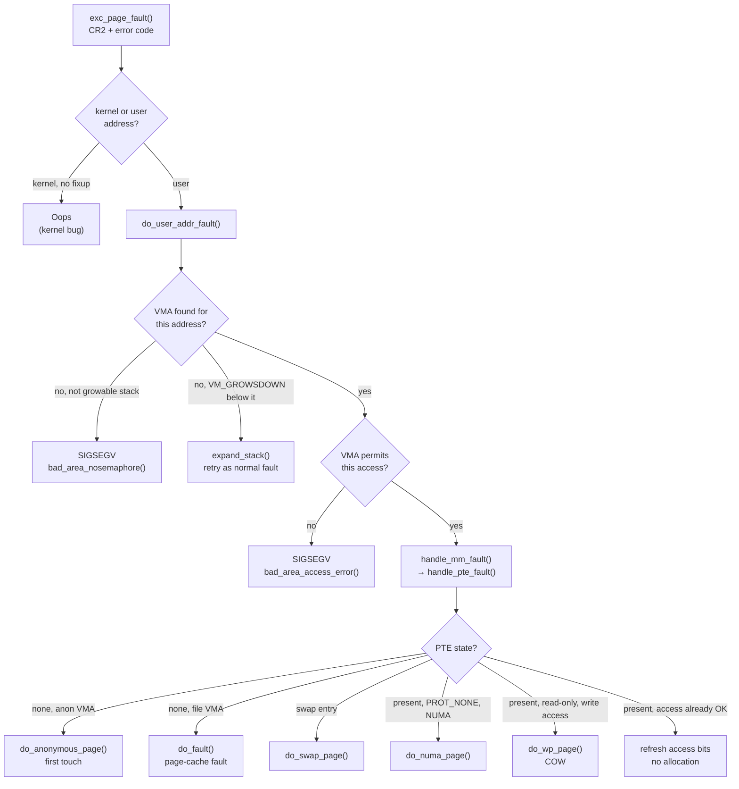

# The Page Fault Handler

[The Life of a Page Fault](../02-guided-traces/the-life-of-a-page-fault.md) told this story shallowly, as
a single ordinary first touch. This page tells it in full, with the branches that story skipped.

Start by discarding the framing a page fault's name invites. A page fault is not an error. It is the
mechanism by which almost all memory in Linux is actually allocated: [Page Tables and the
Walk](./page-tables-and-the-walk.md) showed a PTE whose present bit is clear stops the hardware walk cold
— and the fault handler's job, most of the time, is not "report a problem" but "finish a job that was
deliberately left unfinished" when [`mmap`](./mm-struct-and-vmas.md) created a VMA and postponed every
physical page behind it. The `SIGSEGV` case — the process actually did something wrong — is the *rare*
branch of the tree below, one leaf out of many, not the headline.

## From the exception to C code

The CPU raises a page fault (vector 14) the instant a memory access can't be completed by the hardware
walk described in the previous page: no translation exists, or one exists but its permissions forbid the
access. Before handing control to the kernel, the CPU does two things: it pushes a 32-bit **error code**
onto the stack describing *why*, and it loads the faulting linear address into **`CR2`**. Both are
consumed almost immediately.

The IDT vector reaches `exc_page_fault()` (`arch/x86/mm/fault.c`), which reads `CR2` (or, on hardware new
enough to use FRED event delivery, an equivalent field carried in the event data instead of `CR2`) and
calls `handle_page_fault()`. That function's entire job is one branch: **is the faulting address a kernel
address or a user address?**

```c
if (unlikely(fault_in_kernel_space(address)))
    do_kern_addr_fault(regs, error_code, address);
else
    do_user_addr_fault(regs, error_code, address);
```

Everything below this page's classification tree concerns the user-address branch, `do_user_addr_fault()`
— the ordinary case. The kernel-address branch is covered in [Where a SIGSEGV is actually
decided](#where-a-sigsegv-is-actually-decided) below, because its failure mode isn't a `SIGSEGV` at all.

The error code's bits are what the handler's very first decisions are made from, before a VMA has even
been looked up. Verified against `arch/x86/include/asm/trap_pf.h` at v6.18:

| Bit | Name | Meaning when set |
|---|---|---|
| 0 | `X86_PF_PROT` | A protection violation (a translation exists, but permissions forbid this access). Clear means no translation was found at all. |
| 1 | `X86_PF_WRITE` | The access was a write. Clear means a read. |
| 2 | `X86_PF_USER` | The access came from user mode (CPL 3). Clear means kernel mode. |
| 3 | `X86_PF_RSVD` | A reserved bit was set in a page-table entry the walk traversed — almost always a corrupted table, not user error. |
| 4 | `X86_PF_INSTR` | The access was an instruction fetch (only meaningful with NX/SMEP support). |
| 5 | `X86_PF_PK` | A protection-key check blocked the access (Memory Protection Keys). |
| 6 | `X86_PF_SHSTK` | The access was a shadow-stack access that violated CET shadow-stack protections. |
| 15 | `X86_PF_SGX` | The fault occurred inside an SGX enclave page. |
| 31 | `X86_PF_RMP` | The access violated an RMP check (AMD SEV-SNP). |

This reproduces Intel SDM Vol. 3A ch. 4.7's error-code layout for bits 0, 1, 2, and 3 exactly; bits 4
(instruction fetch, requires NX/SMEP), 5 (protection-key), and 6 (shadow-stack, CET) match the SDM's later
extensions to the same error code. Bits 15 and 31 are vendor/technology-specific additions the kernel also
decodes (SGX and AMD SEV-SNP respectively) that sit outside the SDM's baseline description of the format.

`X86_PF_USER` and `X86_PF_WRITE` in particular gate almost every later decision: whether this can possibly
be a legitimate demand-paging fault, and whether a present-but-read-only PTE means "copy-on-write, handle
it" or "this really is read-only, kill the process."

## The classification tree

This is the heart of the page — the decision `do_user_addr_fault()` and the functions it calls make,
starting from nothing but the faulting address and the error code:

1. **Is there a VMA covering this address?** [`mm_struct` and VMAs](./mm-struct-and-vmas.md)'s maple tree
   is consulted (via `lock_vma_under_rcu()` or, on the slow path, `find_vma()` under `mmap_lock`). No VMA
   → almost certainly `SIGSEGV`, *unless* the address is just below a `VM_GROWSDOWN` stack VMA, in which
   case `expand_stack()` grows it and the fault is retried as a normal one.
2. **Do the VMA's permissions allow this access?** A write to a VMA without `VM_WRITE`, or an instruction
   fetch from one without `VM_EXEC`, is `access_error()` returning true → `SIGSEGV` via
   `bad_area_access_error()`. This is a VMA-level permission check, independent of what the PTE currently
   holds.
3. **Permissions are fine — what does the PTE itself say?** Control passes into `handle_mm_fault()` →
   `__handle_mm_fault()` → `handle_pte_fault()`, which classifies on the PTE's actual state:
   - **PTE has no entry at all (`pte_none`)** → `do_pte_missing()`, which itself splits: an anonymous VMA
     → `do_anonymous_page()` (first touch of anonymous memory); a file-backed VMA → `do_fault()` (fault
     into the page cache, allocating and populating a page from the backing file if it isn't cached yet).
   - **PTE holds a swap entry (not `pte_present`)** → `do_swap_page()` — the page was reclaimed and must
     be read back in, [Swap and zswap](./swap-and-zswap.md)'s territory.
   - **PTE is present but marked `PROT_NONE` for NUMA hinting, on an accessible VMA** → `do_numa_page()` —
     not a real permission fault at all, just the kernel's mechanism for sampling which node is touching
     this page; see [NUMA and memory policy](./numa-and-memory-policy.md).
   - **PTE is present, valid, and the access is a write to a read-only entry** (or an unshare request) →
     `do_wp_page()` — the copy-on-write path, covered in depth in [Demand Paging and
     COW](./demand-paging-and-cow.md).
   - **PTE is present and the access is already permitted** → the common non-fault race case: another
     thread raced ahead and already fixed the PTE up; the access flags are refreshed and the fault
     resolves with no allocation at all.



*Every branch a page fault can take, and the one leaf out of eight that means your program did something
wrong.*

## Locking, and the fast path

Historically every page fault took `mmap_lock` for reading before doing anything else — a single
reader/writer semaphore per address space, shared by every thread in that process. Under a fault-heavy
multithreaded workload (many threads all faulting in different, unrelated parts of a large heap
simultaneously) that lock becomes a serialization point even though the faults have no data dependency on
each other: a page fault in thread A's private buffer has to wait behind thread B's unrelated fault purely
because both threads share one `mm_struct`.

**At v6.18, per-VMA locking is the default, not an opt-in.** `do_user_addr_fault()` (`arch/x86/mm/fault.c`)
tries the fast path first for any user-mode fault:

```c
if (!(flags & FAULT_FLAG_USER))
    goto lock_mmap;

vma = lock_vma_under_rcu(mm, address);
if (!vma)
    goto lock_mmap;
```

`lock_vma_under_rcu()` (`mm/mmap_lock.c`) walks the VMA maple tree under `rcu_read_lock()` (no `mmap_lock`
taken at all), finds the candidate VMA, and calls `vma_start_read()` to take *that VMA's own* per-VMA
lock — retrying if the VMA was concurrently detached. It then re-checks the faulting address still falls
inside `[vm_start, vm_end)` before handing the locked VMA back; a failure at any step (no VMA, a
concurrent modification, address now out of range) falls through to `lock_mmap`, the traditional path that
takes `mmap_lock` for reading via `lock_mm_and_find_vma()`. So the fast path is best-effort: it never
blocks waiting for a writer, and anything it can't handle cleanly degrades to the slow, always-correct
path rather than failing the fault.

The feature is gated by `CONFIG_PER_VMA_LOCK`, and at v6.18 that option is `def_bool y` in `mm/Kconfig` —
**default enabled**, not opt-in — conditioned only on `ARCH_SUPPORTS_PER_VMA_LOCK && MMU && SMP`, all
three of which hold for an ordinary x86-64 SMP kernel. The per-VMA state this locking scheme relies on
(`vm_lock_seq`/`vm_refcnt` on each `vm_area_struct`) is real and live in a stock v6.18 build, not something
a distribution has to opt into separately.

## Minor and major

The distinction is precise, not a matter of degree: a **minor fault** is resolved without I/O — the page
was already resident somewhere the kernel could reach cheaply (the zero page, an already-allocated
physical frame, a page already sitting in the page cache) — while a **major fault** required reading from
a block device (a file-backed page not yet in cache, or a page that had to be read back from swap). The
kernel counts both separately, and `ru_minflt`/`ru_majflt` in `struct rusage` (visible via `getrusage(2)`
or the `M`/`R` columns of `ps`) report them per process.

What matters for reasoning about performance is the **ratio**, not the absolute count. A process taking
hundreds of thousands of minor faults during startup — as its binary's `.text` and `.data` get demand-paged
in, as its heap grows, as libraries get mapped — is behaving exactly as designed; none of that touched a
disk. A handful of major faults is a different story, because each one is, at minimum, an I/O round trip.

## Where a SIGSEGV is actually decided

Readers reasonably expect the answer to be "the MMU" — the hardware caught an illegal access, so surely
the hardware decides the outcome. It doesn't. The MMU only *reports*: it raises the exception and supplies
the error code and `CR2`. Every actual decision about what that report means happens in software, in
`bad_area()` and its relatives (`bad_area_nosemaphore()`, `bad_area_access_error()`) inside
`do_user_addr_fault()` — the functions named at leaves 1 and 2 of the classification tree above. A raw
hardware fault becomes a `SIGSEGV` only after the kernel has looked up the VMA (or failed to find one) and
checked its permissions; the MMU's report is an input to that decision, not the decision itself.

The kernel-address case (`do_kern_addr_fault()`, from the very first branch in [From the exception to C
code](#from-the-exception-to-c-code)) doesn't go through this machinery at all, and doesn't produce a
`SIGSEGV`. A fault on a kernel address that isn't covered by an exception-table entry — the mechanism
[Copying Data Across the
Boundary](../05-syscalls-and-the-boundary/copying-data-across-the-boundary.md) described for
`copy_to_user`/`copy_from_user` surviving a bad user pointer — is instead an **oops**: the kernel prints a
diagnostic and, depending on context, kills the offending kernel thread or panics. There is no userspace
process to signal; the fault happened in kernel mode against an address the kernel had no legitimate reason
to expect might be unmapped.

## The path is simplified

This page elides several real branches to keep the tree above readable: **hugepage faults** (a separate
PMD/PUD-level fault path with its own functions), **`userfaultfd`** (faults deliberately handed off to a
userspace handler instead of resolved in-kernel, glimpsed above only as `handle_userfault()` calls inside
`do_anonymous_page()`), **KFENCE** (the sampling-based out-of-bounds/use-after-free detector, which
intercepts faults on its own guard pages before the ordinary tree runs), and the various **retry** cases
(`VM_FAULT_RETRY`, where the fault handler drops a lock and asks the caller to re-enter from scratch — the
comment in `handle_mm_fault()` about the VMA no longer being safe to dereference after `__handle_mm_fault()`
returns is this mechanism's fingerprint). None of these change the shape of the classification tree; they
add cases beside it. <Src file="mm/memory.c" symbol="handle_mm_fault" /> is the real, unsimplified entry
point every one of them ultimately goes through.

<Lab host="qemu-gdb" title="Break on a real page fault" time="25 min">

1. Boot the lab kernel under QEMU with GDB stub support (`-s -S`) and connect: `gdb vmlinux -ex "target
   remote :1234"`.
2. Set a breakpoint on the architecture-independent entry point: `break handle_mm_fault`.
3. `continue`. A stock kernel takes page faults constantly — during its own boot, from every user process
   that starts — so this breaks almost immediately, and not necessarily on a fault worth looking at.
4. Once stopped, print the faulting address and the VMA: `print vmf->real_address`, `print *vmf->vma`. The
   VMA's `vm_start`/`vm_end`/`vm_flags` tell you what kind of mapping this is.
5. `finish` out to the caller, or `step` into `__handle_mm_fault()` → `handle_pte_fault()`, watching which
   branch is taken. For a first touch of freshly `mmap()`ed anonymous memory, the branch lands in
   `do_anonymous_page()`; confirm with `bt` and `print vmf->vma->vm_flags & VM_WRITE`.

**What actually ran, honestly disclosed:** neither `qemu-system-x86_64` nor `gdb` is installed in this
sandbox —

```text
$ which qemu-system-x86_64 gdb
qemu-system-x86_64 not found
gdb not found
```

— so, as with the page-table walk lab on the previous page, the QEMU/GDB portion of this lab could not be
executed here, and no invented GDB transcript is presented in its place. This matches the same tooling gap
already disclosed for Tasks 9, 13, and 19 in this plan's ledger; it is a property of this sandbox, not of
the lab's design.

**If it fails:** an unconditional `break handle_mm_fault` fires *immediately and constantly* — page faults
are among the most frequent events in a running kernel, and the breakpoint will trip on boot-time faults,
unrelated daemons, and interrupt-context work long before a process you actually care about runs. Set a
condition on the current task's `comm` instead of breaking unconditionally:

```text
(gdb) break handle_mm_fault if $_streq(vma->vm_mm->owner->comm, "target_process")
```

(the exact field path from `handle_mm_fault`'s `vma` argument to the owning task's `comm` may need
adjusting per-kernel-version — `vma->vm_mm` is stable, but which task field carries `comm` for a
multithreaded `mm` depends on `mm_struct`'s exact layout at the kernel version under test). Without a
condition like this, single-stepping to find the one fault you wanted among thousands is impractical
rather than merely slow.

</Lab>

<KernelFacts
  structure={[["struct vm_fault", "include/linux/mm.h"], ["struct vm_area_struct", "include/linux/mm_types.h"]]}
  path="exc_page_fault() → do_user_addr_fault() → lock_vma_under_rcu() or mmap_read_lock() → handle_mm_fault() → handle_pte_fault() → do_anonymous_page()"
  observe="perf stat -e page-faults,minor-faults,major-faults -- ls"
  trap="A page fault is the normal way memory gets allocated, not an error condition. A process taking a hundred thousand minor faults during startup is behaving exactly as designed." />

## References

- <Src file="mm/memory.c" symbol="handle_mm_fault" /> — the architecture-independent core, and the
  function every architecture's fault handler converges on.
- <Src file="arch/x86/mm/fault.c" symbol="do_user_addr_fault" /> — the x86-64 half, where the error code
  is decoded and the decisions about `SIGSEGV` are made.
- Intel SDM Vol. 3A, ch. 4.7 "Page-Fault Exceptions" — the error-code bit definitions this page's table
  reproduces, cross-checked directly against `arch/x86/include/asm/trap_pf.h`'s `enum x86_pf_error_code`.
- [LWN: "Making the kernel's page-fault handling more scalable"](https://lwn.net/Articles/906851/) and
  [LWN: "Fixing the per-VMA lock code"](https://lwn.net/Articles/932298/) — why the fault path stopped
  serialising on `mmap_lock`, and what per-VMA locking changed. At v6.18, `CONFIG_PER_VMA_LOCK` is
  `def_bool y` in `mm/Kconfig` (gated only on `ARCH_SUPPORTS_PER_VMA_LOCK && MMU && SMP`) — enabled by
  default on a stock x86-64 SMP build, not an opt-in feature.
