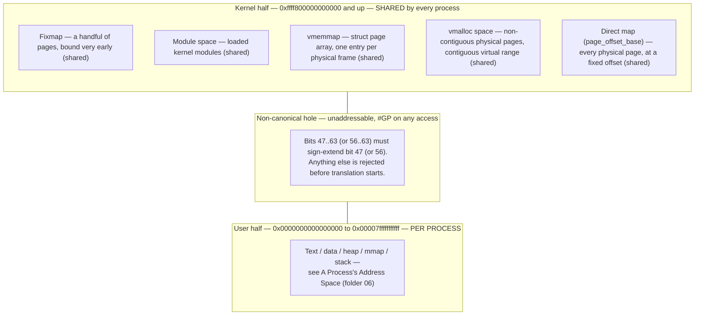

# The Virtual Address Space

A pointer on x86-64 is a 64-bit value, but the address space it names is not a 64-bit space. Implementing
a full 64-bit translation would need six levels of page table and a walk nobody wants to pay for on every
memory access, so the hardware implements a subset instead — 48 bits, 57 with a newer extension — and
leaves the unimplemented middle as a hole. That hole has consequences that leak all the way up to user
space: some bad pointers crash one way, some crash another, and the difference is exactly where in this
layout they point. [A Process's Address Space](../06-processes-and-threads/the-process-address-space.md)
named the regions a process sees from the outside; this page is the machinery underneath — the actual
64-bit layout, in bits, that the kernel builds and the MMU walks.

## Canonical addresses and the hole

x86-64 implements 48 bits of virtual address (57 with 5-level paging, covered below), not 64. The
remaining high bits are not simply ignored — they must be a **sign extension** of bit 47 (bit 56 for
5-level), all zeros or all ones matching that bit. An address satisfying this rule is **canonical**;
one that doesn't is **non-canonical**. Because the top bits must copy the top implemented bit, valid
addresses fall into exactly two ranges — a low half starting at `0x0000000000000000` and a high half
ending at `0xffffffffffffffff` — with an enormous gap in between that no valid address can ever name.

The practical consequence is the one worth remembering: a pointer with garbage in the high bits — an
off-by-a-lot integer treated as an address, a tagged-pointer scheme's tag bits left uncleared, an
uninitialized register — does not fault as an ordinary page fault. The CPU rejects it before translation
even starts, with a general-protection fault (`#GP`), because the *address itself* is malformed, not
merely unmapped. This is why some bad pointers oops one way (`#GP`, non-canonical) and others oops a
different way (page fault, canonical but unmapped) — the two failure modes tell you which side of the
hole the bad value landed on.

## The user/kernel split

The low canonical half belongs to the process; the high canonical half belongs to the kernel. Concretely,
addresses from `0x0000000000000000` to `0x00007fffffffffff` are user space, and
`0xffff800000000000` upward is kernel space (48-bit split; five-level paging below moves the boundary
outward, not the shape of the split). What makes this split load-bearing rather than incidental: the
kernel's upper half is **the same mapping in every process's page tables**. It isn't copied per process
and it isn't switched on entry — it's simply always there, present but inaccessible to user-mode code
(enforced by the supervisor bit on each entry, not by absence).

That single fact is why an ordinary syscall does not need a page-table switch at all: the kernel's code
and data are already mapped into the current process's tables, so trapping into the kernel changes the
privilege level, not the address space. It is also why **KPTI** (kernel page-table isolation, the
Meltdown mitigation that unmaps most of the kernel half while running in user mode) is expensive — it
turns every kernel entry and exit into the page-table switch this design normally avoids.

## The kernel's own regions

The kernel half is not one undifferentiated block; it is carved into named regions, each existing
separately because each has a different purpose and different rules for what can map into it:

| Region | Holds | Rough size | Why separate |
|---|---|---|---|
| Direct map (`page_offset_base`) | Every physical page of RAM, at a fixed offset from its physical address | Up to the installed RAM | See below — this is what makes physical-to-virtual translation a subtraction |
| vmalloc space | Virtually-contiguous kernel allocations backed by physically scattered pages | Large, several TB of address space reserved | `vmalloc()` needs a range it can carve non-contiguous physical pages into; the direct map can't serve that because it mirrors physical layout exactly |
| vmemmap | The `struct page` array, one entry per physical page frame | Proportional to installed RAM | A dedicated, densely-packed region so `page_to_pfn`-style arithmetic is a simple index, not a lookup |
| Module space | Loadable kernel module code and data | A few hundred MB | Kept near the kernel image so direct (non-PLT) calls between core kernel and module code stay in branch-instruction range |
| Fixmap | A small number of compile-time-fixed virtual addresses bound to physical addresses that must be known very early (APIC registers, early console) | A handful of pages | Needed before the general-purpose allocators (vmalloc included) are even up |

The direct map deserves its own two sentences, because it is the region everything else leans on: every
physical page of RAM has a permanent, standing kernel virtual address in this region, computed by a fixed
offset rather than looked up. That is what makes `virt_to_phys()`/`phys_to_virt()` on a direct-map address
plain subtraction and addition against `page_offset_base` — no page-table walk required, because the
mapping is linear by construction.

## KASLR

The base address of each region above is **randomised at boot** — kernel address space layout
randomisation. This is why any documentation of the layout (including the table above) gives symbolic
names and relative order rather than fixed hex constants, and why an address you read from `/proc/kallsyms`
or a crash dump on one boot means nothing on the next: the offsets move, though the *shape* — which
region sits relative to which — does not. `nokaslr` on the kernel command line disables this for
debugging, when a stable, reproducible address is worth more than the hardening KASLR provides. The early
page tables that exist before KASLR's final layout is settled are set up in
[Early Boot and Architecture Setup](../03-boot-and-init/early-boot-and-arch-setup.md).

## Five-level paging

57-bit virtual addresses are opt-in, not the default: the kernel detects at boot whether the CPU supports
5-level paging (`CR4.LA57`) and whether the running configuration wants it, and only then extends the
canonical boundary from 47 bits to 56. Critically, even on a 5-level-capable kernel, an ordinary `mmap()`
still only ever hands back addresses within the old 47-bit range **unless the caller explicitly asks for
more** — passing a hint address above the 47-bit boundary opts a mapping into the wider space. This
compatibility rule exists for exactly the reason folder 05's ABI-stability discussion predicts: software
that packs tag bits into the unused high bits of a pointer (a real, shipped technique) would silently
break the moment a "real" address could appear up there, so the kernel keeps the old default and only
grows the space for callers who ask for it by name.

## arm64

:::note
arm64 solves the user/kernel split differently at the hardware level: instead of one page-table root
covering the whole address space, it has **two** translation base registers — `TTBR0_EL1` for the user
(low) half and `TTBR1_EL1` for the kernel (high) half — selected automatically by the top bit of the
address being translated. Because the two halves are described by genuinely separate tables rather than
one table containing both, arm64 never needed anything like KPTI's trampoline to hide the kernel half from
user mode for the same underlying reason x86-64 did: there was no single shared table to leave partially
unmapped in the first place.
:::

## Where to read the real numbers

This page's table is a map, not the map. The kernel ships its own authoritative layout document,
`Documentation/arch/x86/x86_64/mm.rst`, with the actual boundaries for the running configuration
(4-level vs. 5-level, KASLR on or off). When a real address needs interpreting, that file — not this page,
not a diagram from a different kernel version — is the thing to check.

*The x86-64 address space, and the one property that matters most: the top half is the same in every
process.*

<KernelFacts
  structure={[["page_offset_base", "arch/x86/kernel/head64.c"], ["struct mm_struct", "include/linux/mm_types.h"]]}
  path="virtual address → canonical check → CR3 → four-level walk → physical address"
  observe="sudo cat /proc/kallsyms | head -3 && cat /proc/self/maps | tail -3"
  trap="The kernel half of the address space is not 'the kernel's memory'. It is a set of *mappings* present in every process's page tables, permission-checked by the supervisor bit — which is why a user-mode dereference of a kernel address is a page fault rather than a successful read." />

## References

- [x86-64 Memory Layout](https://docs.kernel.org/arch/x86/x86_64/mm.html) — the authoritative layout
  table, updated per release; cite it rather than reproducing constants that KASLR moves anyway.
- Intel SDM Vol. 3A, ch. 4 "Paging" — canonical addressing, 4- and 5-level paging, and the exact rule
  for when a non-canonical address raises `#GP`.
- [Memory Management Documentation](https://docs.kernel.org/mm/index.html) — the index this folder
  repeatedly returns to for the primary-source version of everything summarized here.
- LWN, ["Five-level page tables"](https://lwn.net/Articles/717293/) — why the opt-in behaviour above the
  47-bit boundary exists, which is otherwise a baffling design choice in isolation.
- <Src file="arch/x86/kernel/head64.c" symbol="page_offset_base" /> — verified against Elixir at v6.18:
  `page_offset_base` is defined here (`__ro_after_init`, `EXPORT_SYMBOL`), not in `kaslr.c` as an earlier
  draft of this page assumed; `kaslr.c` only randomizes it at boot.
