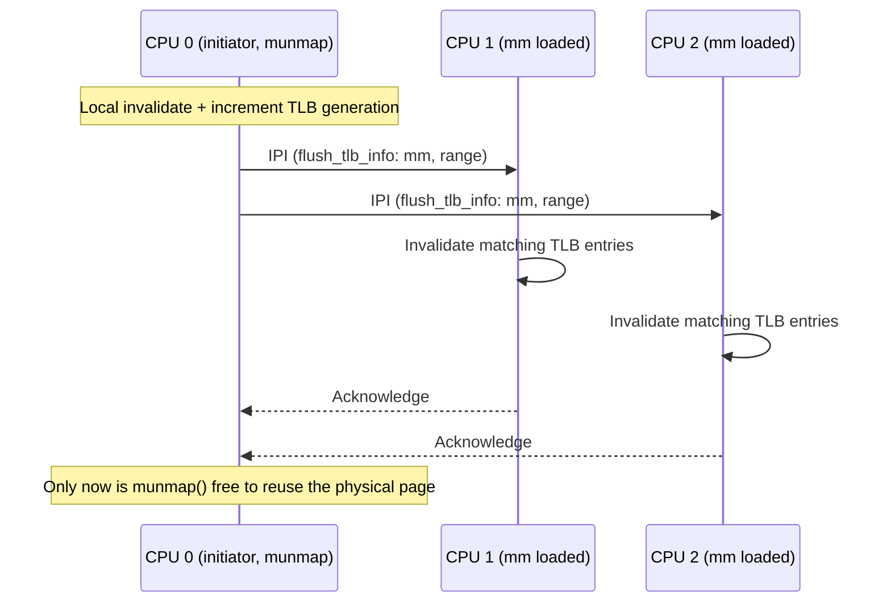

# The TLB and Address-Space Switching

[Page Tables and the Walk](./page-tables-and-the-walk.md) established that a translation costs up to
four memory reads. The TLB exists so almost no access pays that cost twice — it caches recent
translations, transparently, and for most of a program's life it is invisible. It stops being invisible
the moment the kernel changes what a virtual address means: unmaps a page, revokes a permission, reuses
a physical frame. At that instant every CPU that has ever cached the old translation is holding a stale
answer, and nothing in the hardware notices on its own. Software has to find every cached copy and throw
it away — and on x86-64, unlike some other architectures, there is no instruction that broadcasts an
invalidation to other CPUs. The kernel has to do that part itself. Everything on this page is the
consequence of that one missing instruction.

## What the kernel must invalidate, and when

The direction of the change decides whether a stale entry is dangerous or merely wasteful:

| Change | Must invalidate? | Why |
|---|---|---|
| Unmap a page | Yes | A stale entry lets a CPU keep translating and accessing memory that is no longer owned by this mapping — a correctness and security hazard, not just staleness. |
| Reduce permissions (e.g. RW → RO) | Yes | A stale entry would let a write through that the new, stricter permissions forbid. |
| Increase permissions (e.g. RO → RW) | Usually not | A stale, *more restrictive* entry only causes a spurious fault on the next access — the fault handler re-walks the table, finds the real (looser) permission, and installs the correct entry. Slower, never wrong. |
| Change the physical frame the address maps to | Yes | A stale entry points at the wrong physical page entirely — silently reading or writing the wrong data is worse than a fault. |
| Free a page-table page itself | Yes, and subtly | If a lower-level table is freed and its physical page reused for something else, a CPU that still has a cached translation walking through the *old* table structure (on some microarchitectures, intermediate walk state can be cached too, not just the final leaf) can be pointed at attacker- or kernel-controlled memory reinterpreted as page-table bytes. This is why freeing page tables gets its own invalidation discipline, not just the leaf-page case. |

The asymmetry is the whole story in miniature: tightening a mapping is a correctness requirement,
loosening it is a performance optimization the kernel is free to skip. Most of the invalidation code in
the kernel exists to handle the "must" rows precisely and cheaply, and to *avoid* invalidating on the
"usually not" row wherever it safely can.

## Local invalidation

Before any cross-CPU concern, there is the local case: this CPU changed a mapping it might itself have
cached.

- **`INVLPG`** invalidates the cached translation for one virtual address on the executing CPU. Cheapest
  option when exactly one page changed.
- **A `CR3` reload** flushes every non-global entry for the whole address space on the executing CPU —
  the blunt instrument, used when many entries changed or a full switch is happening anyway (see below).
- **The global bit (`PGE`)** marks a translation as surviving an ordinary `CR3` reload — used for the
  kernel's own mappings, which are identical in every process and have no reason to be re-cached on every
  address-space switch. A global entry needs an explicit, separate invalidation (or a `CR4.PGE` toggle) to
  remove, precisely because an ordinary switch is defined not to touch it.

## Shootdown

Local invalidation only clears the executing CPU's cache. If the `mm` being changed is (or recently was)
loaded on other CPUs — true of any multi-threaded process running on more than one core — their cached
translations are stale too, and the kernel cannot reach into another CPU's TLB directly. The protocol
that solves this is called a **TLB shootdown**:

1. Find which CPUs might have this `mm`'s translations cached. The kernel tracks this with `mm_cpumask(mm)`
   rather than assuming "all CPUs," so an unmapping in a process that only ever ran on two cores does not
   have to interrupt every core in the system.
2. Send an inter-processor interrupt (IPI) to each CPU in that mask.
3. Each recipient CPU invalidates the relevant entries in its own TLB and acknowledges.
4. The initiating CPU waits for every acknowledgment before it can consider the invalidation complete —
   before, for example, it can safely let the freed physical page be reused for something else.

The cost shape follows directly: an IPI round trip per targeted CPU, and in the worst case those round
trips serialize. A `munmap` on a mapping shared by many active threads is therefore not "free a range of
addresses" — it is bookkeeping *plus* a synchronous, cross-CPU operation whose latency scales with how
many CPUs currently have the mapping loaded. `mmap`, by contrast, only has to make an entry appear; there
is nothing stale to chase down on other CPUs, so it pays none of this cost. That asymmetry — mapping is
cheap, unmapping is not — is why `munmap` shows up in profiles of multi-threaded workloads in a way
`mmap` rarely does.

## PCID, and how Linux uses it

[Address-space tags: ASID and PCID](../../computer-science/memory-hierarchy/tlb-and-address-translation-hardware.md#address-space-tags-asid-and-pcid)
covers what the tag is and why it exists in hardware terms; this section is only about what Linux does
with it. The kernel treats its narrow PCID space as a small pool of hardware slots recycled across
recently-used `mm`s per CPU — switching back to an `mm` that still owns a live PCID slot on this CPU can
skip the flush a plain `CR3` reload would otherwise force.

It is a smaller win than it first sounds, for two reasons the kernel has to account for:

- **The tag space is small.** There are far fewer PCIDs than there are processes a busy system runs, so
  entries get recycled and the "was this mm's translation still cached" question is not always yes.
- **A shootdown must now invalidate *tagged* entries specifically**, not just "the current address
  space's entries" — more bookkeeping per invalidation, in exchange for fewer invalidations overall on
  the switch path.

## KPTI's cost lands here

Kernel page-table isolation (the Meltdown mitigation, named in
[The Virtual Address Space](./the-virtual-address-space.md)) unmaps most of the kernel from a process's
page tables while running in user mode, and remaps it on entry to the kernel. Without PCID, that means
every kernel entry and every return to user mode reloads `CR3` — and a `CR3` reload flushes the
non-global TLB. With PCID, the user-mode and kernel-mode halves of an address space can carry distinct
tags, so their cached entries can coexist and survive the switch instead of being thrown away and
re-walked on the very next instruction. This is the concrete, mechanical reason KPTI's overhead varies so
much between machines: a CPU with PCID support (and a kernel configured to use it) pays a much smaller
tax per syscall than one without. See
[The Entry Path](../05-syscalls-and-the-boundary/the-entry-path.md) for the crossing itself; this page
only explains why that crossing's TLB cost is what it is.

## Lazy TLB

A kernel thread has no user-space mappings of its own — its address space is irrelevant to what it does.
When the scheduler switches *to* a kernel thread, there is nothing to gain from loading a fresh `mm` and
paying a `CR3` write for it, so the kernel doesn't: the kernel thread simply borrows whichever `mm` was
already active on this CPU, recorded in `active_mm`
([Task Struct: the Anatomy of a Task](../06-processes-and-threads/task-struct-the-anatomy-of-a-task.md)
introduced this field). No switch happens, no `CR3` write, no TLB entries lost. If a shootdown later
targets that borrowed `mm`, the CPU running the kernel thread still needs to invalidate — it has that
`mm`'s translations cached even though it isn't "using" the address space in any meaningful sense — which
is part of why `mm_cpumask` bookkeeping has to track lazy users too, not only CPUs actually running the
process's own code.

## Measuring it

Two different signals, two different diagnoses:

```text
perf stat -e dTLB-load-misses,iTLB-load-misses,dTLB-loads -- ./workload
```

A high **miss rate** relative to loads suggests the workload's active working set exceeds what the TLB
can cover at the page size in use — the conversation that leads to
[Hugepages and THP](./hugepages-and-thp.md), since a huge page covers far more address space per TLB
entry.

A high **shootdown rate** — visible via the `tlb_flush` tracepoint (present at v6.18, recording a reason
code and page count per flush) — points the other way: an unmapping-heavy workload, repeatedly
`munmap`ing or `mprotect`ing memory shared across threads, paying the IPI cost described above over and
over.

## arm64

:::note
arm64 solves the shootdown problem in hardware — see [Invalidation, and why it is
expensive](../../computer-science/memory-hierarchy/tlb-and-address-translation-hardware.md#invalidation-and-why-it-is-expensive)
for arm64's broadcast `TLBI` mechanism itself. The consequence for this page's subject: arm64's `flush_tlb_*` implementations
read so much simpler than the x86-64 shootdown path above precisely because there is no cross-CPU
coordination left for software to write — no IPI, no `mm_cpumask` targeting, no acknowledgment wait —
because the hardware already did it.
:::



*A TLB shootdown on x86-64: the unmapping CPU cannot proceed until every other CPU that might have the
translation has thrown it away.*

<Lab host="root-required" title="Watch a shootdown-heavy vs. mapping-heavy workload diverge" time="15 min">

The intended lab: run two small multi-threaded workloads on a real multi-core machine — one that
`mmap`s and touches memory repeatedly, one that `mmap`s the same amount but then `munmap`s or
`mprotect`s it in a loop from multiple threads sharing the `mm` — under `perf stat -e dTLB-load-misses`
and the `tlb_flush` tracepoint, and show the second workload's shootdown count and wall-clock cost
diverging sharply from the first's even though both move the same amount of memory.

**What actually ran, honestly disclosed:** this task's sandbox is single-process and does not expose
`perf` or tracepoint access (no `CAP_PERFMON`, no `/sys/kernel/debug/tracing`), so the comparative
multi-core measurement above could not be executed here — no invented `perf` output is presented in its
place. The mechanical claims above (shootdown protocol, `mm_cpumask`, PCID tagging) are drawn from the
verified v6.18 source cited in the references below, not from a measurement this sandbox could take.

**If it fails:** `perf stat` needs either root or `kernel.perf_event_paranoid` relaxed; the `tlb_flush`
tracepoint needs `CONFIG_TRACING` and access to `/sys/kernel/debug/tracing/events/tlb/tlb_flush/enable`,
typically root-only as well.

</Lab>

<KernelFacts
  structure={[["struct mm_struct", "include/linux/mm_types.h"], ["struct flush_tlb_info", "arch/x86/include/asm/tlbflush.h"]]}
  path="munmap() → zap_page_range_single() → flush_tlb_mm_range() → flush_tlb_multi() → IPI to mm_cpumask(mm) → local invalidate on each CPU"
  observe="perf stat -e dTLB-load-misses,dTLB-loads -- ./workload"
  trap="Unmapping memory is more expensive than mapping it. mmap is bookkeeping; munmap is bookkeeping plus a synchronous cross-CPU operation, which is why allocator designs go to such lengths to avoid returning memory to the kernel." />

## References

- <Src file="arch/x86/mm/tlb.c" symbol="flush_tlb_mm_range" /> — the shootdown entry point; decides
  between a local flush and `flush_tlb_multi()` across `mm_cpumask(mm)`, verified against v6.18 source.
- <Src file="arch/x86/mm/tlb.c" symbol="flush_tlb_multi" /> — the IPI dispatch, delegating to the
  platform's `native_flush_tlb_multi()` via `on_each_cpu_mask()`/`on_each_cpu_cond_mask()`; verified at
  v6.18.
- Intel SDM Vol. 3A, ch. 4.10 "Caching Translation Information" — what the hardware caches, what
  invalidates it, and the PCID rules this page's PCID section summarizes.
- LWN, ["The current state of kernel page-table isolation"](https://lwn.net/Articles/741878/) — the cost
  model for KPTI and why PCID matters so much to it; the mitigation mechanism this describes is unchanged
  at v6.18.
- [Kernel Page Table Isolation](https://docs.kernel.org/arch/x86/pti.html) — the in-tree PTI
  documentation; path confirmed current at v6.18.
