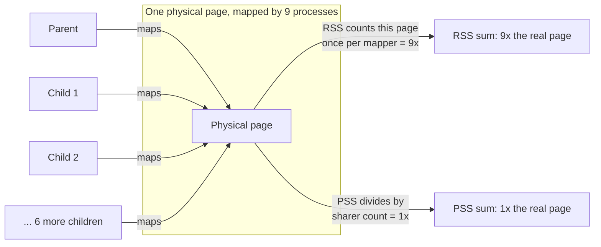

# What `free` and RSS Really Tell You

How to actually answer "how much memory is this using", and why every simple answer to that question is wrong.

"How much memory is this using?" is the question this whole folder has been building toward, and it
has no single answer. Memory is shared between processes, cached on the assumption it'll be needed
again, deferred until something actually forces the write, and reclaimable the instant something else
needs the space more. Any single number you report is a choice about how to attribute all four of
those at once. This page's job isn't to hand over one number — it's to make that choice explicit, so
you pick the right number for the question you're actually asking.

## Reading `free` correctly

`free -h`'s columns, one at a time:

- **`total`** — physical RAM installed, full stop.
- **`used`** — `total` minus `free` minus `buff/cache` (roughly): memory not idle and not cache.
- **`free`** — memory doing *nothing at all* — not allocated, not cached, not buffered.
- **`shared`** — memory backing `tmpfs` and other shared/anonymous mappings counted here.
- **`buff/cache`** — block-device buffers plus page cache; see [buffers versus cache](#buffers-versus-cache)
  below for why these are one column now.
- **`available`** — an estimate of what a new process could actually get without swapping: free
  memory plus the portion of `buff/cache` that's cheaply reclaimable.

The rule, stated once and plainly: **`free` is not the number you want; `available` is.** A machine
reporting a small `free` and a large `buff/cache` is not short of memory — the kernel is using memory
that would otherwise sit idle to cache file data, on the entirely reasonable assumption that idle RAM
helping nobody is worse than RAM holding something that might be read again. `available` is the
kernel's own estimate of what survives giving that cache back; `free` counts none of it.

## `/proc/meminfo`, the fields worth knowing

`free` is a summary of a handful of these fields; the file itself has far more. The ones actually
worth knowing, with what each measures and where it overlaps another:

| Field | What it means |
|---|---|
| `MemTotal` | Total physical RAM the kernel manages |
| `MemFree` | Truly idle memory — nothing allocated, nothing cached |
| `MemAvailable` | The kernel's own estimate of memory available to a new process without swapping; the number `free`'s `available` column reports |
| `Buffers` | Raw block-device I/O buffers — small today, see below |
| `Cached` | Page cache for file-backed data, minus swap cache; overlaps almost entirely with `Active(file)` + `Inactive(file)` |
| `SwapCached` | Pages that are in both swap and RAM at once — written to swap but not yet dropped from RAM, or read back from swap and not yet modified |
| `Active(anon)` / `Inactive(anon)` | Anonymous (heap, stack, private mmap) pages on the active vs. inactive LRU list; see [Reclaim, LRU, and kswapd](./reclaim-lru-and-kswapd.md#the-lru-lists) |
| `Active(file)` / `Inactive(file)` | File-backed pages on the active vs. inactive LRU list; together, most of `Cached` |
| `Dirty` | Pages modified in memory but not yet written back to their backing store |
| `Writeback` | Pages currently being written back right now — see [Writeback and fsync](./writeback-and-fsync.md) |
| `AnonPages` | Anonymous pages actually mapped into a process's page tables — overlaps `Active(anon)` + `Inactive(anon)` |
| `Mapped` | File-backed pages mapped into some process's address space via `mmap`, a subset of `Cached` |
| `Shmem` | `tmpfs` and `shmem`-backed pages — counted in both `Cached` and, confusingly, is neither purely anonymous nor purely file-backed |
| `Slab` (`SReclaimable` + `SUnreclaim`) | Kernel object caches — dentries, inodes, and everything else built on [slab](./slab-slub-and-kmalloc.md); the reclaimable half responds to memory pressure via shrinkers, the unreclaimable half doesn't |
| `KernelStack` | Memory backing every task's kernel-mode stack |
| `PageTables` | Memory spent on page tables themselves — see [Page tables and the walk](./page-tables-and-the-walk.md) |
| `Committed_AS` | The sum of every outstanding memory *commitment* the kernel has promised, whether or not it's been touched yet — can legitimately exceed `MemTotal` under overcommit |

The note that matters more than any single row: **these fields are not a partition, and adding them
up is meaningless.** `Cached` overlaps `Active(file)`/`Inactive(file)`; `AnonPages` overlaps
`Active(anon)`/`Inactive(anon)`; `Shmem` is counted inside `Cached` while also being neither cleanly
anonymous nor cleanly file-backed. `MemTotal` is not `MemFree` + a clean sum of the rest — it's
`MemFree` plus several overlapping views of the same underlying pages, sliced by different criteria
(LRU state, whether it's mapped, whether it's dirty). Treat each field as answering its own question,
not as a component of a total.

**Verified against a real `/proc/meminfo` on this machine, checked 2026-09-08:** every field name
above is present verbatim (`MemTotal`, `MemFree`, `MemAvailable`, `Buffers`, `Cached`, `SwapCached`,
`Active`/`Inactive` with `(anon)`/`(file)` variants, `Dirty`, `Writeback`, `AnonPages`, `Mapped`,
`Shmem`, `Slab`/`SReclaimable`/`SUnreclaim`, `KernelStack`, `PageTables`, `Committed_AS`) — none of
these are aspirational or version-dependent field names.

## Buffers versus cache

The historical distinction: `Buffers` was raw block-device I/O — data cached at the block layer,
below any filesystem — while `Cached` (the page cache proper) held file contents at the filesystem
layer. They were genuinely separate caching mechanisms decades ago. They have been unified into
essentially the same mechanism for a long time now; `Buffers` today is a small residue — metadata and
raw block I/O that doesn't go through a filesystem's page cache path — while `Cached` holds the
overwhelming majority of what a machine is actually caching. Say it plainly because everyone asks the
first time they see both numbers: no, you don't need to add them together to get "the real cache
size," and no, a `Buffers` value much smaller than `Cached` is not a sign anything is wrong.

## Per-process: VSZ, RSS, PSS, USS

Four numbers, each answering a different question about one process, with sharply different
double-counting behavior:

| Metric | Includes | Double-counts | Question it answers | Worked example (this lab) |
|---|---|---|---|---|
| **VSZ** (virtual size) | Every mapped region in the address space, whether backed by memory or not | N/A — not a memory-consumption number at all | Nearly meaningless for memory use; includes reserved-but-unfaulted address space, memory-mapped files, guard pages | 528,244 kB per process (parent and every child alike — the mapping is the same size whether or not it's resident) |
| **RSS** (resident set size) | Physical pages currently resident for this process | Yes — a page shared with N other processes counts fully in every one of their RSS | "How many resident pages does this process's page table currently point at" | Summed across the parent + 8 idle children: 4,666,184 kB ≈ 4557 MB — roughly 9x the ~500 MB actually allocated |
| **PSS** (proportional set size) | Resident pages, each divided by its number of sharers | No — this is the point of PSS | The only per-process number that sums correctly across processes into a true total | Summed across the same 9 processes via `smaps_rollup`: 521,335 kB ≈ 509 MB — matches the real ~500 MB allocation and the ~0.5 GiB `free` delta |
| **USS** (unique set size) | Private pages only — resident and not shared with anything | No — by construction, nothing here is shared | "What would be freed if I killed this process right now" | Not captured separately in this run — approximated by each child's `Pss` minus its share of the parent's touched pages, since the children never wrote to the buffer |



*Why RSS overstates shared memory and PSS does not: nine processes mapping the same copy-on-write page
each report it in full for RSS, while PSS divides it by the number of sharers before summing — the
mechanism behind the 9x discrepancy measured below.*

## What actually happens

The demonstration that makes the RSS double-counting concrete rather than theoretical: measure the
memory use of a forked worker pool — a parent that allocates and touches 500 MB, then forks eight
idle children that share those pages via copy-on-write.

**Run for real on this machine, checked 2026-09-08** (unprivileged user, no sandbox `sudo` — every
number below is a genuine measurement, not illustrative):

A Python parent allocated a 500 MB `bytearray`, wrote to every page of it (forcing real residency, not
just a virtual reservation), then `fork()`ed eight children that idle without touching the buffer
again — sharing the parent's pages via copy-on-write the whole time.

```text
$ ps -o pid,ppid,vsz,rss,comm -p 8253,8255,8256,8257,8258,8259,8260,8261,8262
    PID    PPID    VSZ   RSS COMMAND
   8253     323 528244 522312 python3   <- parent
   8255    8253 528244 518032 python3
   8256    8253 528244 518032 python3
   8257    8253 528244 517968 python3
   8258    8253 528244 517968 python3
   8259    8253 528244 517968 python3
   8260    8253 528244 517968 python3
   8261    8253 528244 517968 python3
   8262    8253 528244 517968 python3
```

Every one of the nine processes reports roughly 500 MB of RSS — because every one of them genuinely
does have ~500 MB of pages mapped into its page tables, even though eight of those nine are sharing
the exact same physical pages with the parent via copy-on-write. Summing the `RSS` column:

```text
$ ps -o rss= -p 8253,8255,8256,8257,8258,8259,8260,8261,8262 | awk '{s+=$1} END {print s, "KB =", s/1024, "MB"}'
4666184 KB = 4556.82 MB
```

**4.56 GB of "used" memory, reported by summing a standard tool's own numbers, on a machine that
actually allocated about 500 MB for this workload** — roughly a 9x overstatement, from a single
family of nine processes sharing one heap. `free -h` before and after the fork confirms the real
delta was nowhere near 4.5 GB:

```text
$ free -h   # before spawning the pool
               total        used        free      shared  buff/cache   available
Mem:            19Gi       1.2Gi        16Gi       8.9Mi       2.1Gi        18Gi

$ free -h   # after spawning the pool
               total        used        free      shared  buff/cache   available
Mem:            19Gi       1.7Gi        15Gi       8.9Mi       2.1Gi        17Gi
```

`used` rose by roughly 0.5 GiB — matching the ~500 MB actually allocated, not the ~4.5 GB the naive
RSS sum implied. Now the same nine processes, read via `smaps_rollup` instead of `ps`:

```text
$ for p in 8253 8255 8256 8257 8258 8259 8260 8261 8262; do
    grep -E '^(Rss|Pss):' /proc/$p/smaps_rollup
  done
pid 8253 (parent):  Rss: 522312 kB   Pss:  60367 kB
pid 8255:           Rss: 518032 kB   Pss:  57648 kB
pid 8256:           Rss: 518032 kB   Pss:  57645 kB
pid 8257:           Rss: 517968 kB   Pss:  57613 kB
pid 8258:           Rss: 517968 kB   Pss:  57610 kB
pid 8259:           Rss: 517968 kB   Pss:  57610 kB
pid 8260:           Rss: 517968 kB   Pss:  57614 kB
pid 8261:           Rss: 517968 kB   Pss:  57614 kB
pid 8262:           Rss: 517968 kB   Pss:  57614 kB
```

Summing the `Pss` column: 60367 + 57648 + 57645 + 57613 + 57610 + 57610 + 57614 + 57614 + 57614 =
**521,335 kB ≈ 509 MB** — matching both the ~500 MB actually touched and the ~0.5 GiB rise `free`
reported, to within the overhead of nine separate Python interpreters and their shared libraries.
Killing all nine processes returned `free`'s `used` column to its exact starting value (1.2Gi),
confirming this pool — and nothing else — was the source of the measured delta.

This is the single most useful demonstration in this page: a standard tool (`ps`, summed the obvious
way) produced an answer off by a factor of roughly nine, and the fix isn't "use `ps` more carefully" —
it's "use a tool that was built to sum correctly in the first place."

## `smaps_rollup`, the practical tool

`/proc/PID/smaps_rollup` gives the aggregate `Rss`, `Pss`, and swap figures for an entire process in
one cheap read — the kernel walks every VMA once, internally, and hands back the sums, rather than
requiring the caller to parse and total `/proc/PID/smaps`'s much longer per-VMA listing itself.
`smaps` still exists for when you need the per-VMA breakdown (which mapping is holding the memory);
`smaps_rollup` is what you reach for when the question is just "what's this process's real number,"
which is most of the time.

## cgroup accounting

`memory.current` is a cgroup's total charged memory, and `memory.stat` breaks that total down.
**Verified against `Documentation/admin-guide/cgroup-v2.html`'s memory controller section, checked
2026-09-08:** `memory.stat` exposes (among others) `anon`, `file`, `kernel`, `kernel_stack`,
`pagetables`, `percpu`, `sock`, `shmem`, `slab`, `file_mapped`, `file_dirty`, `anon_thp`, and
`file_thp` — the same anon/file/kernel-object split `/proc/meminfo` makes system-wide, scoped to one
cgroup.

The crucial point, and the one that causes the most confusion in practice: **`memory.current`
includes page cache charged to the cgroup.** A container reporting `memory.current` at 2 GB against a
`memory.max` of 2 GB is not necessarily one instruction away from being OOM-killed — if `memory.stat`
shows `file: 1900000000` (1.9 GB), the overwhelming majority of that "usage" is reclaimable page
cache, which the kernel will happily evict under pressure before it kills anything. This is exactly
why container memory alerts fire so often and so uselessly: an alerting rule that watches
`memory.current` against `memory.max` with no reference to `memory.stat`'s `file` field is alerting on
cache size, not on genuine memory pressure.

## Answering the actual question

The page's real deliverable — which number answers which question:

- **"Will another process fit?"** → `MemAvailable` (system-wide) — it already accounts for
  reclaimable cache.
- **"What would killing this process free?"** → `USS`, or `smaps_rollup`'s `Private_Clean` +
  `Private_Dirty`.
- **"How do I attribute total usage across many processes without double-counting shared pages?"**
  → `PSS`, summed — it's the only one of the four per-process numbers built to sum correctly.
- **"Is this container about to be OOM-killed?"** → `memory.current` against `memory.max`, read
  together with `memory.stat`'s `file` field (how much is reclaimable cache, not genuine pressure)
  and PSI (`memory.pressure` inside the cgroup) for whether anything is actually stalling on it.

<Lab host="any-linux" title="Measure the same process four ways" time="20 min">

1. Write a small program that allocates 500 MB, touches every page of it (a plain write loop —
   allocation alone doesn't fault pages in, see [Demand Paging and COW](./demand-paging-and-cow.md)),
   then forks four (or more) children that idle without touching the buffer again.
2. `ps -o pid,vsz,rss,comm -p <all five+ pids>` — note that every process reports close to the full
   500 MB in `RSS`.
3. Sum the `RSS` column and compare against `free -h`'s `used` before and after starting the pool —
   the RSS sum should overstate the real delta by roughly the number of processes sharing the heap.
4. `grep -E '^(Rss|Pss|Private)' /proc/PID/smaps_rollup` for each process and sum the `Pss` column —
   it should land close to the real 500 MB and close to `free`'s actual delta, not the inflated RSS
   sum.

**If it fails:** `smaps_rollup` for a process you don't own needs matching credentials or root — for
your own forked children this isn't an issue, since they're your own processes. If the children
*touch* the memory (rather than staying idle) after forking, copy-on-write breaks their sharing with
the parent and their individual `Pss` rises accordingly — that divergence is itself worth showing,
since it demonstrates PSS tracking a real change in sharing, not a static property of the mapping.

**What actually ran, and the real numbers:** this lab was run for real on this machine (unprivileged
user, `uid=1000`, no sandbox `sudo`) using a Python parent that `bytearray`'d and wrote 500 MB, then
forked eight idle children — the exact run captured under
[What actually happens](#what-actually-happens) above. To restate the arithmetic in the lab's own
terms:

- **RSS sum, nine processes:** 4,666,184 kB (≈ 4557 MB)
- **PSS sum, same nine processes, via `smaps_rollup`:** 521,335 kB (≈ 509 MB)
- **`free`'s actual `used` delta:** ≈ 500 MB (1.2Gi → 1.7Gi, back to 1.2Gi after killing the pool)
- **Discrepancy:** RSS overstated real usage by roughly **9x** — one parent plus eight children is
  nine "copies" of the same 500 MB in the naive sum, and PSS divided the shared pages by their true
  sharer count instead.

</Lab>

## Misconceptions

1. **"Low free memory means the machine is short of memory."** Page cache is memory doing useful
   work, not memory sitting idle — a `MemFree` near zero with a large `buff/cache` is normal and
   healthy. Read `available`, not `free`.
2. **"Summing RSS across processes gives total memory usage."** It double-counts every shared page —
   badly for forked worker pools (as measured above) and for anything linking common shared
   libraries. PSS is the number built to sum correctly.
3. **"A container using its full memory limit is about to be OOM-killed."** Most of that usage may be
   reclaimable page cache charged to the cgroup — `memory.stat`'s `file` field says how much, and the
   kernel will reclaim it under pressure before it starts killing.

<KernelFacts
  structure={[["struct percpu_counter rss_stat[NR_MM_COUNTERS]", "include/linux/mm_types.h"]]}
  path="read /proc/PID/smaps_rollup → show_smaps_rollup() → walk every VMA via smap_gather_stats() → sum Rss/Pss/Private per page's mapcount"
  observe="free -h && grep -E '^(MemTotal|MemFree|MemAvailable|Cached|Shmem):' /proc/meminfo && cat /proc/self/smaps_rollup"
  trap="RSS counts a shared page in full for every process that maps it. Add up the RSS of eight forked workers and you will 'account for' several times the memory the machine actually contains — PSS is the only per-process number that sums to something true." />

## References

- `man 5 proc`, the `/proc/meminfo` and `smaps`/`smaps_rollup` sections — the field definitions, the
  only authority worth citing for this page; every field name used above was cross-checked against a
  real `/proc/meminfo` on this machine, checked 2026-09-08.
- `man 1 free` — the column definitions and the `available` estimate's basis.
- [The `/proc` Filesystem](https://docs.kernel.org/filesystems/proc.html) — the kernel's own account of
  `smaps` and `smaps_rollup`, including which fields require matching credentials or root for another
  process.
- [Control Group v2](https://docs.kernel.org/admin-guide/cgroup-v2.html), the memory controller's
  `memory.stat` — field list (`anon`, `file`, `kernel`, `kernel_stack`, `pagetables`, `percpu`, `sock`,
  `shmem`, `slab`, `file_mapped`, `file_dirty`, `anon_thp`, `file_thp`) verified current against this
  document, checked 2026-09-08.
