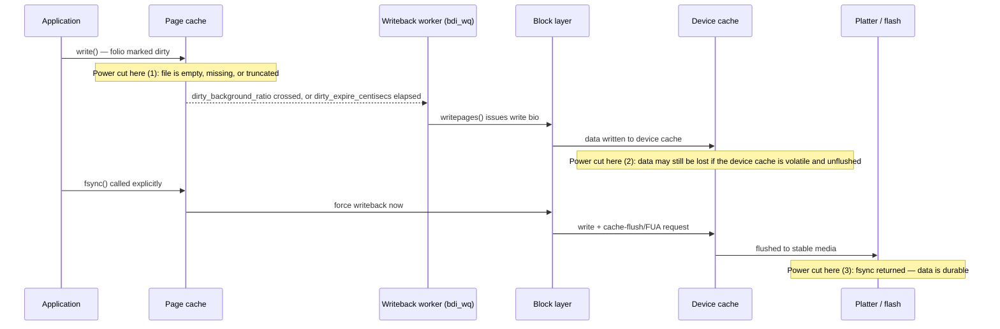

# Writeback, Dirty Pages, and `fsync`

There is a gap between "the write returned" and "the data is safe", and most data-loss incidents live
in it. A successful `write()` means the kernel now holds a copy of your data in RAM — a folio in the
[page cache](./the-page-cache.md) has been updated and marked dirty. Nothing more. It says nothing about
a disk platter, a flash cell, or a device's own volatile cache. Everything on this page is about who
eventually moves that copy to a device, when, and — the part that actually matters when the power goes
out — what you must do yourself to know it arrived.

## Dirty tracking

The moment a write modifies a page-cache folio, the filesystem's `dirty_folio` operation
(`address_space_operations`) marks it dirty: set in the folio's own flags, and reflected in per-node and
per-`address_space` dirty-page counters. A dirty folio is a promise the kernel has not yet kept — data
that exists only in RAM and differs from what's on the backing device.

Two sysctls turn "how much dirty data has accumulated" into behavior, both expressed as a percentage of
available memory (free pages plus easily reclaimable pages, not raw `MemTotal`):

- **`dirty_background_ratio`** (default 10 on the machine this page was written on) — the threshold at
  which the kernel wakes background flusher threads to start writing dirty data out. Crossing it does not
  block anything; it just starts work in the background.
- **`dirty_ratio`** (default 20 here) — the threshold at which a process that is *itself* generating the
  dirty data is made to write some of it out before its own write can proceed.

That second one is the one that surprises people. A program doing a large sequential write — copying a
big file, say — will run at full speed while dirty pages accumulate below `dirty_ratio`, then suddenly
appear to stall. That stall is `balance_dirty_pages()` (`<Src file="mm/page-writeback.c"
symbol="balance_dirty_pages" />`, `static int balance_dirty_pages(struct bdi_writeback *wb, ...)` at
v6.18) throttling the writing process directly — sleeping it, in bounded increments, until enough dirty
data has been written back that the ratio comes back under the limit. It is not a bug, not disk
contention from something else, and not swapping. It is deliberate backpressure: the kernel will not let
one process's dirty pages consume an unbounded share of memory, so it slows the process down to the rate
the device can actually absorb.

## Who does the writing

Actual writeback happens in per-BDI (backing-device-info, one per underlying block device) worker
threads, queued onto the `bdi_wq` workqueue and driven by `wb_workfn()` (`<Src file="fs/fs-writeback.c"
symbol="wb_workfn" />`, `void wb_workfn(struct work_struct *work)` at v6.18) — see
[Workqueues](../10-interrupts-time-and-deferred-work/workqueues.md) for the general mechanism a
`wb_workfn()` instance is an example of. A worker is scheduled for three distinct reasons:

1. **Threshold crossed** — `dirty_background_ratio` or `dirty_ratio` triggers work as described above.
2. **Periodic expiry** — `dirty_expire_centisecs` (default 3000, i.e. 30 seconds, on this machine) bounds
   how long a dirty page is allowed to sit unwritten even under light load. A page dirtied and never
   touched again still gets written back once it's "old enough", so an idle machine doesn't quietly
   accumulate an unbounded amount of unflushed data.
3. **Explicit request** — `sync`, `fsync`, `umount`, and similar callers ask for specific data to be
   written now, out of band from the periodic and threshold-driven passes.

`dirty_writeback_centisecs` (default 500, i.e. 5 seconds, here) is the separate knob for how often the
flusher threads wake up at all to check whether anything needs writing, independent of how old any single
page is.

## What `fsync` actually guarantees

`fsync(fd)` guarantees that, when it returns success, the file's data *and* the metadata needed to find
that data (size, block mapping, mtime — whatever the filesystem needs to reconstruct the file) have been
handed to the device with a cache-flush or `FUA` (force-unit-access) request, so the device's own
volatile write cache is not the last line of defense. Without that flush request, "written to the device"
can still mean "sitting in a cache that a power cut erases" — see [Barriers and FUA](#barriers-and-fua).

Two close relatives, easy to reach for by habit instead of by requirement:

- **`fdatasync(fd)`** does the same thing but skips metadata updates that don't affect the ability to
  retrieve the data afterward — an updated access time, for instance. Cheaper when you don't need it,
  identical to `fsync` when the metadata in question does matter (a changed file size, for example, is
  never skipped).
- **`sync(2)`** (or the `sync` command) schedules *all* dirty data and metadata system-wide for writeback,
  but only *initiates* it — POSIX does not require `sync` to wait for completion, and on Linux it does
  wait for the writeback it schedules, but it gives you no per-file guarantee and no error return you can
  act on for a specific file.

None of the three guarantee something people routinely assume they do: that the **directory entry**
pointing at a newly created file is itself durable. Creating a file adds an entry to its parent directory,
and that directory entry is *its own piece of metadata*, dirtied independently of the file's data.
`fsync`ing the file guarantees the file's bytes and its own metadata are safe; it says nothing about
whether the directory now durably contains the name pointing at it. This is the single most common real
bug in "careful" file-writing code — see the walkthrough below.

## What actually happens

A program writes a file and exits. Ten seconds later, the power cuts. What survives depends entirely on
which of the following sequences the program followed — this is a walkthrough grounded in the mechanism
above, not a live capture (staging an actual power cut in this environment isn't something that can be
done safely or meaningfully), but every step follows directly from `balance_dirty_pages()`,
`dirty_expire_centisecs`, and what `fsync` does and does not touch.

**The naive sequence — what most code does by default:**

1. `open()` a new file, `write()` its contents. The data lands in page-cache folios, marked dirty. The
   directory entry for the new file is created and *also* marked dirty. Nothing has left RAM.
2. The process `close()`s the file descriptor and exits. `close()` does not flush anything — see
   [Misconceptions](#misconceptions) — so this step changes nothing about durability.
3. Ten seconds pass. `dirty_expire_centisecs` (30 seconds by default here) has not elapsed, and nothing
   crossed `dirty_background_ratio`, so the periodic flusher may not have run at all, or may have started
   and not finished.
4. Power cuts. **Result:** on reboot, the file may not exist, may exist with zero length, or may exist
   truncated partway through — whatever writeback had or hadn't gotten to. This is not a kernel bug. The
   kernel never promised anything past "it's in RAM" until asked.

**The correct sequence — write, then prove it:**

1. `write()` the file's contents. Still just dirty page-cache folios — no stronger guarantee yet than
   the naive case.
2. `fsync(fd)` on the file. This forces the file's data and its own metadata to the device with a
   cache-flush/FUA request. **After this step, the file's contents are durable** — but the directory
   entry pointing at the file may not be, if this is a newly created file.
3. `fsync()` on the **parent directory's** file descriptor. This is the step almost everyone forgets. It
   forces the directory entry — the fact that this name now points at this inode — to the device.
   **After this step, the file is durably findable by its name**, not just durably full of the right
   bytes.
4. If using the write-to-temporary-file-then-`rename()` pattern (the standard way to make an update look
   atomic to any reader): write the temp file, `fsync` the temp file, `rename()` it over the target, then
   `fsync` the **directory** again — the rename changed the directory's contents a second time, and that
   change needs its own durability proof, exactly as file creation did in step 3.

The honest summary: durability is not a property of `write()`, `close()`, or even `fsync()` on the file
alone. It is the file's `fsync`, *and* the containing directory's `fsync`, in that order, for any
operation that changes what a directory points at.

## The `fsync` error problem

For a long time, a writeback failure (the device rejects a write, runs out of space, or otherwise cannot
complete it) was recorded once, on the `address_space`, and then cleared the moment *any* process called
`fsync` and observed it — including a process that had no idea an error had occurred. A second `fsync`
call after that point could return success, even though the actual dirty data behind the original error
had already been dropped from the page cache and could never be written. A program that checked `fsync`'s
return value, got an error, retried, and got success back had no way to know the retry's success was
reporting on data that no longer existed.

PostgreSQL hit this in production and the resulting write-up — "fsyncgate"
(`https://wiki.postgresql.org/wiki/Fsync_Errors`) — is the reason the whole industry now treats this as a
settled question rather than folklore. The kernel fix introduced `errseq_t`: each observer of an error
gets its own sequence cursor, so an error is reported to *every* file descriptor that hasn't already seen
it, not consumed by whichever one calls `fsync` first.

The rule that survives, and that the errseq fix does not undo: **an `fsync` failure is not retryable.**
Once `fsync` has returned an error, the pages behind that write may already be gone from the cache — there
may be nothing left to retry. Rebello et al., *"Can Applications Recover from fsync Failures?"* (USENIX
ATC 2020), studied this systematically across real applications and databases, and the answer is mostly
no: application-level recovery from an `fsync` error is rare and usually wrong when attempted. Treat an
`fsync` failure as data loss to be handled at a level above "try again" — a fresh write of known-good data,
or surfacing the failure to whoever can decide what to do about it.

## Barriers and FUA

The guarantee an `fsync` cache-flush or `FUA` request provides depends entirely on the device honoring
it. The block layer issues a flush (or tags individual writes `FUA`, forcing them straight past any
cache) specifically so a device's own volatile write cache — DRAM on the drive's controller, there to
absorb bursts and reorder for throughput — is not the last place your data can silently vanish from. But
if a device claims to support a flush and doesn't actually honor it (rare, but it has happened with some
consumer hardware and misconfigured virtual disks), no amount of kernel-side care changes anything: the
kernel's guarantee ends at the request it issues, not at what the hardware actually does with it. The
block layer's side of this — how a flush request is represented and scheduled — belongs to folder 12,
not here.

## Tuning, honestly

Four sysctls, and what each one actually shifts:

| Sysctl | What it changes | What it does *not* change |
|---|---|---|
| `dirty_background_ratio` | When background writeback starts | Whether any given write is durable |
| `dirty_ratio` | When the writing process itself is throttled | Whether any given write is durable |
| `dirty_expire_centisecs` | The maximum age of an unwritten dirty page | Whether any given write is durable |
| `dirty_writeback_centisecs` | How often the flusher threads wake to check | Whether any given write is durable |

Lowering `dirty_ratio` trades throughput for smoother, more predictable latency — dirty data is written
back sooner and in smaller bursts, so a big write is less likely to produce one long stall later. It is a
real and useful tuning move for latency-sensitive workloads. It is not a durability improvement in any
sense: a lower `dirty_ratio` still leaves an arbitrary window, bounded only by `dirty_expire_centisecs`,
during which a write that returned successfully is only in RAM. **Durability comes only from `fsync`** (and
its directory-entry companion above) — no sysctl on this list substitutes for calling it.

## Misconceptions

- **"`write()` returning means the data is written."** It means the data is in RAM, in a dirty page-cache
  folio. Whether and when it reaches the device is entirely up to the writeback machinery described
  above, unless the caller explicitly forces it with `fsync`.
- **"Closing the file flushes it."** `close()` does not imply `fsync` and never has, on Linux or on any
  POSIX system. A file descriptor can be closed with dirty data still sitting unwritten in the page cache,
  and the [naive sequence](#what-actually-happens) above is exactly what that looks like.
- **"`fsync` on the file is enough for a new file."** It durably writes the file's data and its own
  metadata. It says nothing about the directory entry that makes the file findable by name — that needs
  its own `fsync`, on the directory, as [the correct sequence](#what-actually-happens) shows.

*Where the data is at each moment after `write()` returns, and what a power cut at each point costs you.*

<KernelFacts
  structure={[["struct backing_dev_info", "include/linux/backing-dev-defs.h"], ["struct writeback_control", "include/linux/writeback.h"]]}
  path="write() → folio_mark_dirty() → balance_dirty_pages() → wb_workfn() → writepages() → bio"
  observe="grep -E '^(Dirty|Writeback):' /proc/meminfo && cat /proc/sys/vm/dirty_ratio /proc/sys/vm/dirty_background_ratio"
  trap="An fsync that returns an error must not be retried and treated as success. The pages may already have been dropped, so a subsequent successful fsync says nothing about the data you lost." />

## References

- `man 2 fsync` and `man 2 fdatasync` — the guarantees as specified, including the directory-entry caveat.
- `https://docs.kernel.org/admin-guide/sysctl/vm.html` — the definitive description of the four dirty-page
  sysctls; verified at v6.18 against `Documentation/admin-guide/sysctl/vm.rst` for this page.
- PostgreSQL's "fsyncgate" summary (`https://wiki.postgresql.org/wiki/Fsync_Errors`) — the incident that
  clarified error semantics for the whole industry; essential reading for [the error
  section](#the-fsync-error-problem).
- Rebello et al., *"Can Applications Recover from fsync Failures?"*, USENIX ATC 2020 — the systematic
  study; the answer is mostly no, and the paper explains why.
- <Src file="mm/page-writeback.c" symbol="balance_dirty_pages" /> and <Src file="fs/fs-writeback.c"
  symbol="wb_workfn" /> — verified present at v6.18, signatures as quoted above.
