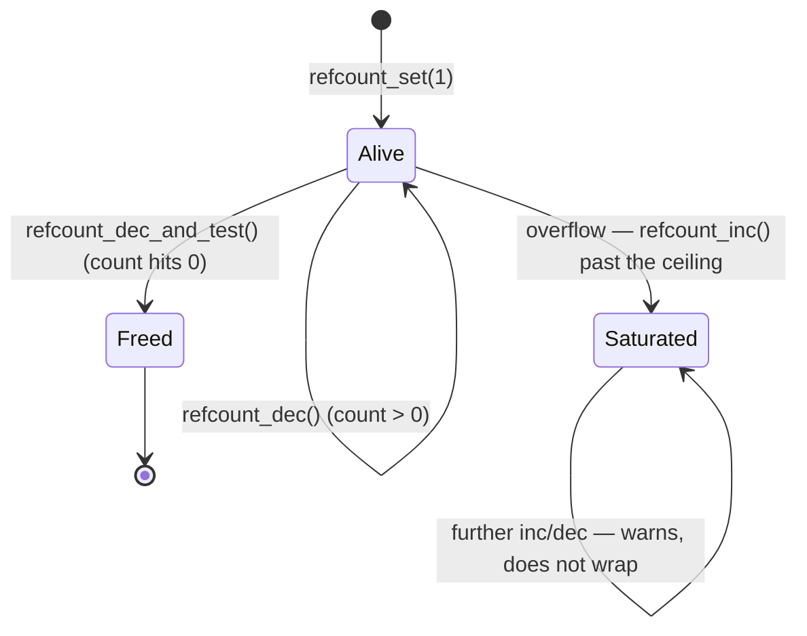

# Atomic Operations

`atomic_t`, the operation families, the ordering each does and does not carry, and why `refcount_t` exists separately.

The atomic types are the smallest synchronisation primitive in the kernel, and the one most often
misused. An atomic operation guarantees indivisibility — no other CPU observes the read, modify, and
write as anything but one step — and, by itself, nothing else. In particular it does not, by default,
order anything happening around it: a plain `atomic_inc()` followed by a plain store can be reordered
by the CPU exactly as freely as two unrelated plain accesses. A great deal of subtly broken kernel code
comes from assuming "it's atomic" answers "is it safe," when it only answers "can it be seen half-done."
[Memory Ordering and Barriers](./memory-ordering-and-barriers.md) covers the general ordering machinery
this page assumes; this page is about the one family of primitives where atomicity and ordering are
easy to conflate because some members of the family carry ordering and some do not.

## `atomic_t` and `atomic64_t`

Both types are deliberately opaque:

```c
typedef struct {
    int counter;
} atomic_t;

#ifdef CONFIG_64BIT
typedef struct {
    s64 counter;
} atomic64_t;
#endif
```

Wrapping a plain `int`/`s64` in a single-member struct looks unnecessary until you notice what it
prevents: a bare `atomic_t` variable cannot be read or written with ordinary C operators. `x + 1`,
`x = 5`, or `x++` on an `atomic_t` are compile errors, because `x` is a struct, not an integer — the
only way to touch `.counter` is through the `atomic_*()` API, which is precisely the point. A plain
`int` counter shared between CPUs invites exactly the unprotected `counter++` race described in
[Why Kernel Concurrency Is Different](./why-kernel-concurrency-is-different.md): two CPUs read the
same old value, both compute the same new value, and one increment is lost. Making the type opaque
turns "I forgot to use the atomic accessor" from a silent race into a build failure.

## The operation families

| Family | Examples | Returns | Ordering (unadorned form) |
|---|---|---|---|
| Set / read | `atomic_set()`, `atomic_read()` | — | Unordered (plain store/load, not RMW) |
| Add / sub, inc / dec (no return) | `atomic_add()`, `atomic_inc()`, `atomic_dec()` | Nothing | Unordered |
| Add / sub, inc / dec (return the new value) | `atomic_add_return()`, `atomic_inc_return()` | New value | Fully ordered |
| Fetch forms (return the old value) | `atomic_fetch_add()`, `atomic_fetch_or()`, `atomic_fetch_dec()` | Old value | Fully ordered |
| Test-and-branch | `atomic_dec_and_test()`, `atomic_sub_and_test()`, `atomic_inc_and_test()` | Boolean: did the result hit zero | Fully ordered |
| Compare-and-swap | `atomic_cmpxchg()`, `atomic_try_cmpxchg()` | Old value / boolean success | Fully ordered on success; unordered on failure |

This table is the anchor for the page — the ordering column is the thing worth remembering, and the
next section explains the rule that generates it rather than asking you to memorize it row by row.

## Ordering, per operation

The rule that catches people, stated as plainly as the kernel's own normative document states it:
**a read-modify-write operation that returns no value is unordered; one that returns a value is fully
ordered.** Non-RMW operations (`atomic_set()`, `atomic_read()`) are unordered regardless, because they
are a plain store or load, not a read-modify-write at all. A conditional RMW (`atomic_cmpxchg()`,
`atomic_try_cmpxchg()`) is fully ordered on success and unordered on failure — a failed compare-and-swap
didn't modify anything, so there is nothing to order.

`atomic_inc()` is the operation people get wrong most often: it returns nothing, so by the rule above
it implies no barrier at all, even though "atomic" sounds like it should mean something stronger. If
code needs a full fence around a non-value-returning atomic, the kernel provides
`smp_mb__before_atomic()` and `smp_mb__after_atomic()` for exactly that (see
[Memory Ordering and Barriers](./memory-ordering-and-barriers.md#the-barrier-family)) — they exist
specifically because the plain `_inc`/`_dec`/`_set` forms carry none.

Every ordered primitive also comes in explicitly weaker flavors, chosen by suffix:

- `_relaxed` — no ordering against other memory locations at all, even though the operation returning
  a value would otherwise imply full ordering. The weakest, and the fastest on architectures where the
  default is not free.
- `_acquire` — the read half of the RMW acts as an ACQUIRE barrier: nothing after it in program order
  can be reordered before it.
- `_release` — the write half acts as a RELEASE barrier: nothing before it in program order can be
  reordered after it.

The unsuffixed form (`atomic_add_return()`, with no `_relaxed`/`_acquire`/`_release`) is the fully
ordered default. Reach for a suffixed variant only when the surrounding algorithm can prove it needs
less than a full barrier — the same "say exactly what you need" discipline
[Memory Ordering and Barriers](./memory-ordering-and-barriers.md#acquire-and-release-which-is-what-you-should-reach-for)
recommends for `smp_store_release()`/`smp_load_acquire()`. `Documentation/atomic_t.txt` is the
definitive table of which operation implies which ordering — treat the table above as an orientation,
and that document as the authority to check any specific primitive against.

## `cmpxchg` and the retry loop

The standard shape for "read, compute a new value, install it only if nobody else changed it first":

```c
int old, new;

do {
    old = atomic_read(&v);
    new = compute_next(old);
} while (!atomic_try_cmpxchg(&v, &old, new));
```

`atomic_try_cmpxchg()` is the ergonomic form of `atomic_cmpxchg()`: it takes the expected value by
pointer, writes the *actual* current value back into it on failure, and returns a plain boolean —
which means a failed iteration doesn't need a separate re-read before retrying, `old` already holds
the fresh value the failed attempt observed. `atomic_cmpxchg()` instead returns the value that was
actually there, leaving the caller to compare it against `old` by hand; `atomic_try_cmpxchg()` is
almost always the one to write in new code.

The caveat every retry loop built on compare-and-swap inherits is ABA: if the value changes from `A`
to `B` and back to `A` between the read and the compare, `cmpxchg` sees `A` again and happily succeeds,
even though the object it names may no longer be the same object — freed and reallocated at the same
address, for instance. Value-based compare-and-swap cannot see that round trip. This is exactly the
failure mode that hands the problem to RCU (see the folder's RCU pages): RCU's
grace-period guarantee is what lets code reason about "has this object genuinely not been freed and
reused" rather than merely "does this value read back the same."

## `refcount_t`, and why it is not `atomic_t`

A reference count is not an ordinary counter — it decides when an object is freed, which means an
error in either direction is a memory-safety bug, not a wrong number. Two failure modes are specific
to reference counts: an increment from zero (racing with the code that is about to free the object,
because the count had already reached zero) and an overflow that wraps a large positive count back
through zero. Either one hands an attacker or a race condition a use-after-free primitive. Plain
`atomic_t`, used as a raw reference count, protects none of this — it happily wraps on overflow and
happily increments from zero, because it has no idea the number it holds means "this object is alive."

`refcount_t` is the type built specifically to close this: it saturates at a fixed value instead of
wrapping, and once saturated it stays saturated and reports the misuse (via a warning) rather than
silently continuing. The API mirrors `atomic_t`'s shape but changes the contract:

```c
void refcount_inc(refcount_t *r);                       /* caller already holds a reference */
bool refcount_dec_and_test(refcount_t *r);               /* true: count hit zero, free the object */
bool refcount_inc_not_zero(refcount_t *r);                /* false: object is already dying, back off */
```

The rule this section exists to state: **new code uses `refcount_t` for anything that is a reference
count controlling an object's lifetime, and `atomic_t` for a counter that is just a number** —
statistics, a count of in-flight requests, anything where wrapping or incrementing from zero is merely
wrong rather than a security boundary. [Reference Counting and Object
Lifetime](../04-kernel-architecture-and-idioms/reference-counting-and-lifetime.md) owns the broader
lifetime patterns (`kref`, the get/put convention) that `refcount_t` is the primitive underneath.



*`refcount_t`'s two safety properties over a plain `atomic_t`: it cannot wrap back through zero on
overflow (it saturates and warns instead), and `refcount_inc_not_zero()` refuses to resurrect an object
already on its way to `Freed`.*

## `refcount_inc_not_zero` and the lookup race

The pattern that connects atomics to RCU: code finds an object by walking a lock-free or RCU-protected
structure — a hash table, a list — and wants to take a reference before using it. Between "found the
pointer" and "took a reference," another CPU can be running the object's teardown path, and if the
teardown has already dropped the count to zero, a plain `refcount_inc()` here would resurrect an object
that is already committed to being freed. `refcount_inc_not_zero()` (and its lower-level cousin
`atomic_inc_not_zero()`, seen in kernel documentation's own RCU reference-counting example) closes this
by making "check it's still alive" and "take the reference" one atomic step: if the count is already
zero, the increment simply fails and the caller treats the lookup as a miss. This is the shape every
"find it in a table, then take a reference" path in the kernel needs, and it's why `refcount_t` and RCU
show up together constantly — RCU makes the lookup itself safe, and `refcount_inc_not_zero()` makes
turning that lookup into a live reference safe.

## The cost

An uncontended atomic operation is, in the common case, a cache hit plus one locked instruction — on
x86-64, a `LOCK`-prefixed RMW that costs roughly the same as a handful of ordinary instructions once
the cache line is already owned by this CPU. A *contended* atomic is a different animal: the cache line
has to change ownership (see [Cache Coherence and
MESI](../../computer-science/memory-hierarchy/cache-coherence-and-mesi.md)), which costs one to two
orders of magnitude more than the uncontended case, and gets worse, not better, as more CPUs pile onto
the same line.

The practical consequence: a single global atomic counter incremented by every CPU in the system is a
scalability bug waiting to be found, not a performance detail — every increment forces the cache line
to bounce to whichever CPU incremented last, and the bouncing gets strictly worse as core counts grow,
regardless of how cheap any one increment looks in isolation. The fix is not a smarter atomic
operation; it is not sharing the line at all. [Per-CPU Data](./per-cpu-data.md) is the folder's answer:
give every CPU its own counter, and pay the cost of combining them only when someone actually needs the
total.

## Bit operations

`set_bit()`, `clear_bit()`, and `test_and_set_bit()` extend the same atomicity guarantee to individual
bits within a word: each is atomic *per bit*, not per word, so two CPUs setting different bits in the
same `unsigned long` do not race even though they touch the same memory location. Every one of these
has a non-atomic `__` counterpart (`__set_bit()`, `__test_and_set_bit()`) that is faster but gives no
cross-CPU guarantee at all — correct only when the caller already holds a lock or otherwise knows no
other CPU can touch the same word concurrently. These are brief to cover here because they are
everywhere in driver code — flag words, feature bitmaps, per-device state — rather than because they
are a minor topic.

<KernelFacts
  structure={[["atomic_t", "include/linux/types.h"], ["refcount_t", "include/linux/refcount.h"]]}
  path="refcount_dec_and_test() → reaches zero → caller frees → refcount_inc_not_zero() elsewhere fails safely"
  observe="grep -rn 'refcount_t' /usr/src/linux/include/linux/ | head, or read include/linux/refcount.h directly"
  trap="An atomic operation with no return value orders nothing. atomic_inc() followed by a store can be reordered by the CPU, which is why the kernel has explicit smp_mb__before_atomic() and why 'it is atomic so it is safe' is not an argument." />

## References

- <Src file="Documentation/atomic_t.txt" /> — the normative table of which operations imply which
  ordering, verified present at this exact path at the v6.18 tag; the single most useful document for
  this page. Its core rule, quoted above: RMW operations with no return value are unordered, RMW
  operations that return a value are fully ordered, and a conditional RMW is unordered only on failure.
- <Src file="include/linux/refcount.h" /> — the header comment explains the saturation semantics
  (`REFCOUNT_SATURATED`, positioned so a runaway increment or decrement cannot wrap back through a live
  range) and the threat model better than any secondary source.
- LWN, [*Two approaches to reference count
  hardening*](https://lwn.net/Articles/693038/) — why the type was introduced and the exploit class
  (use-after-free via a reference-count overflow or an increment-from-zero race) it closes.
- context7 (`/websites/kernel_doc_html`, `core-api/refcount-vs-atomic.rst`) — checked 2026-09-09 for
  current `refcount_t`/`atomic_t` guidance; confirms the ordering differences this page states
  (`refcount_inc_not_zero()` relies on a control dependency rather than an explicit barrier, assuming
  the caller keeps the object's memory stable) and the `kref_get_unless_zero()` lookup pattern used in
  the section above.
