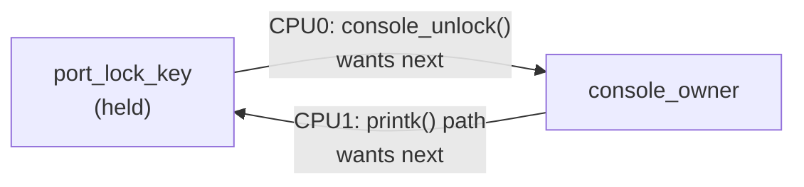

# Finding Locking Bugs

`lockdep` and what it proves, KCSAN for data races, and a real splat read line by line.

Locking bugs are uniquely nasty and uniquely tractable, in that order. Nasty, because the actual damage —
corrupted memory, a task that never wakes up — surfaces far from the acquire/release pair that caused it,
often months later, on one machine out of a fleet, under a timing window nobody reproduced on purpose.
Tractable, because deadlock is not really a runtime event at all — it is a *structural* property, a cycle
in the graph of "lock A was held while lock B was acquired." A machine can find a cycle in a graph without
ever needing the deadlock to actually happen. `lockdep` is that machine, and it is the reason kernel
locking bugs are usually caught in a test boot rather than in a customer's data center.

## What lockdep actually proves

Every time a lock is acquired, `lockdep` records which other locks were already held in that context, and
adds the resulting ordering to a global graph — not a graph of lock *instances*, but of lock *classes*
(see the next section). A cycle anywhere in that graph means some combination of contexts, timings, and
CPUs *could* deadlock. Critically, `lockdep` reports the cycle the moment the second ordering is
*observed*, on the very first boot that happens to exercise both orderings — **even though no deadlock
actually occurred**, and even though the two orderings may have run on different CPUs, hours apart, with
no task ever having actually blocked. This is the whole value proposition: catching a bug from evidence
that is far short of the failure itself.

## Lock classes, and why the distinction matters

`lockdep` does not track individual lock instances — it tracks *classes*, and by default every lock
initialized from the same call site (the same `spin_lock_init()`, the same static initializer inside the
same struct) is one class. This is exactly right for most code: two different `struct inode`s each have
their own `i_lock` instance, but the ordering rule "never take two `i_lock`s while holding a third" is a
statement about the *class*, not about which two particular inodes are involved.

It breaks down for the legitimate cases where a natural hierarchy exists between multiple instances of the
same struct — a "whole disk" block device and one of its partitions, both `struct block_device`, both
using the same lock class by default. Taking the whole-disk lock and then the partition lock looks, to
`lockdep`, identical to taking one inode lock while already holding another inode lock: same class nested
inside itself, which is exactly the recursive-acquisition shape it is designed to flag. The kernel provides
an escape for this: `spin_lock_nested()` (and `mutex_lock_nested()`, `lockdep_set_class()`) let code tell
`lockdep` "this instance is deliberately a different sub-class, at a known position in a real hierarchy."
This is why a real `lockdep` report sometimes needs a moment's thought rather than a reflexive fix — the
cycle it found may be a genuine bug, or it may be a natural hierarchy that was never annotated.

## Reading a splat, line by line

The report below is a real, previously-published `lockdep` splat — not one produced in this sandbox (see
the Lab section for why) — reproduced from [a Red Hat Knowledgebase
article](https://access.redhat.com/solutions/6186801) documenting a known deadlock between the serial
console's port lock and `console_owner`, hit on a RHEL 8.4 debug kernel
(`4.18.0-305.7.1.el8_4.x86_64+debug`). It has the same five parts every "possible circular locking
dependency" splat has, and the two lines worth reading *first* are marked ⑤ below — the header naming the
two locks, and the "possible unsafe locking scenario" diagram — because between them they tell you the
entire story before you read a single stack trace.

```text title="possible circular locking dependency — port_lock_key vs console_owner"
======================================================                                    // ①
WARNING: possible circular locking dependency detected
4.18.0-305.7.1.el8_4.x86_64+debug #1 Not tainted
------------------------------------------------------
swapper/6/0 is trying to acquire lock:
ffffffffb82382e0 (console_owner){-...}-{0:0}, at: console_unlock+0x409/0x9b0

but task is already holding lock:
ffffffffbb581ff8 (&port_lock_key){-.-.}-{2:2}, at: serial8250_handle_irq.part.15+0x1e/0x1d0

which lock already depends on the new lock.

the existing dependency chain (in reverse order) is:                                      // ②③

-> #1 (&port_lock_key){-.-.}-{2:2}:
       lock_acquire+0x1b1/0x8a0
       _raw_spin_lock_irqsave+0x4c/0x90
       serial8250_console_write+0x611/0x760
       console_unlock+0x602/0x9b0
       register_console+0x54c/0xab0
       univ8250_console_init+0x24/0x27
       console_init+0x2ef/0x45a
       start_kernel+0x4e6/0x7ba
       secondary_startup_64_no_verify+0xc2/0xcb

-> #0 (console_owner){-...}-{0:0}:
       check_prevs_add+0x3ce/0x1650
       __lock_acquire+0x223c/0x2da0
       lock_acquire+0x1b1/0x8a0
       console_unlock+0x46b/0x9b0
       vprintk_emit+0x158/0x490
       printk+0x9f/0xc5
       __handle_sysrq.cold.11+0x4d3/0x579
       serial8250_read_char+0x2bd/0x6b0
       serial8250_rx_chars+0x25/0xb0
       serial8250_handle_irq.part.15+0x142/0x1d0
       serial8250_default_handle_irq+0x82/0xe0
       serial8250_interrupt+0xdd/0x1b0
       __handle_irq_event_percpu+0xfa/0x820
       handle_irq_event_percpu+0x73/0x150
       handle_irq_event+0xa1/0x12d
       handle_edge_irq+0x20a/0xa40
       handle_irq+0x3e/0x50
       do_IRQ+0x9a/0x200
       ret_from_intr+0x0/0x22
       cpuidle_enter_state+0x256/0x1160
       cpuidle_enter+0x50/0xa0
       do_idle+0x3ef/0x4a0
       cpu_startup_entry+0xcb/0xd4
       start_secondary+0x48b/0x600
       secondary_startup_64_no_verify+0xc2/0xcb

other info that might help us debug this:                                                 // ④

 Possible unsafe locking scenario:                                                        // ⑤

       CPU0                    CPU1
       ----                    ----
  lock(&port_lock_key);
                               lock(console_owner);
                               lock(&port_lock_key);
  lock(console_owner);

 *** DEADLOCK ***

4 locks held by swapper/6/0:                                                              // ⑥
 #0: ffff897b126adc30 (&i->lock){-.-.}-{2:2}, at: serial8250_interrupt+0x30/0x1b0
 #1: ffffffffbb581ff8 (&port_lock_key){-.-.}-{2:2}, at: serial8250_handle_irq.part.15+0x1e/0x1d0
 #2: ffffffffb8273960 (rcu_read_lock){....}-{1:2}, at: __handle_sysrq+0x4d/0x100
 #3: ffffffffb82387e0 (console_lock){+.+.}-{0:0}, at: vprintk_emit+0x14b/0x490

stack backtrace:
CPU: 6 PID: 0 Comm: swapper/6 Kdump: loaded Not tainted 4.18.0-305.7.1.el8_4.x86_64+debug #1
Call Trace:
 <IRQ>
 dump_stack+0x8e/0xd0
 check_noncircular+0x30e/0x3c0
 check_prevs_add+0x3ce/0x1650
 __lock_acquire+0x223c/0x2da0
 lock_acquire+0x1b1/0x8a0
 console_unlock+0x46b/0x9b0
 vprintk_emit+0x158/0x490
 printk+0x9f/0xc5
 __handle_sysrq.cold.11+0x4d3/0x579
 serial8250_read_char+0x2bd/0x6b0
 serial8250_rx_chars+0x25/0xb0
 serial8250_handle_irq.part.15+0x142/0x1d0
 serial8250_interrupt+0xdd/0x1b0
 __handle_irq_event_percpu+0xfa/0x820
 handle_irq_event+0xa1/0x12d
 handle_edge_irq+0x20a/0xa40
 do_IRQ+0x9a/0x200
 </IRQ>
```

The five parts to find, in the order they matter, not the order they print:

- **① The header.** Names the class trying to be acquired (`console_owner`) and the class already held
  (`&port_lock_key`) — read this first, it is the whole bug in two names.
- **⑤ The "possible unsafe locking scenario" block.** The ABBA shape rendered as two columns — CPU0 takes
  `port_lock_key` then wants `console_owner`; CPU1 (here, a *different context on the same CPU*, since an
  IRQ interrupted a path already holding the console lock, but the graph doesn't distinguish that from a
  literal second CPU) takes `console_owner` then wants `port_lock_key`. This is the second line worth
  reading, because it is the same information as ① and ②③ combined into one diagram.
- **② and ③ The two lock chains** (`-> #1` and `-> #0`), each ending in a stack trace showing *how* that
  ordering was reached — `#1` shows `port_lock_key` taken while `console_owner` (via `console_unlock()`)
  was already held, back at boot during `register_console()`; `#0` shows the reverse order, reached later
  from a `sysrq` handler running inside a serial IRQ.
- **④ "other info that might help us debug this."** A fixed banner — its only job is marking where the
  unsafe-scenario diagram begins.
- **⑥ The final held-locks list and stack backtrace.** What was actually held at the moment `lockdep`
  caught the second ordering, and the call path that got there — useful for confirming the report matches
  the code path you expected, less useful for understanding the deadlock itself, which the first two
  items already explained.



*The cycle `lockdep` detected: `port_lock_key → console_owner` from `register_console()`'s boot-time path,
`console_owner → port_lock_key` from a later `sysrq`-triggered `printk()` inside the serial IRQ handler.
Either edge alone is fine; both existing in the graph is the deadlock.*

## The classes of report

<div style={{overflowX: "auto"}}>

| Report class | What it means | Usual fix |
|---|---|---|
| ABBA ordering inversion | Two contexts take the same two locks in opposite order (the splat above) | Pick one order, document it next to both lock definitions, fix the path that violates it |
| IRQ-unsafe vs. IRQ-safe ordering | A lock is taken in process context with interrupts enabled, and the *same class* is also taken from an interrupt handler — without `_irqsave`, a handler firing mid-section can self-deadlock | Take the lock with `spin_lock_irqsave()`/`spin_lock_irq()` everywhere it might also be taken from IRQ context |
| Recursive acquisition | The same lock class acquired twice by the same context without a `_nested()` annotation | If the nesting is a genuine bug, fix it; if it's a real hierarchy (whole-disk/partition), annotate with `lockdep_set_class()` or the `_nested()` variant |
| Held lock freed | Memory backing a still-locked lock is freed (or the lock left initialized in a stack frame that returns) | Ensure every acquire has a matching release *before* the memory holding the lock goes away |

</div>

## CONFIG_DEBUG_ATOMIC_SLEEP

This is a different check from `lockdep`'s ordering graph, and it looks similar enough in the log to
confuse the two: it catches a blocking call made from a context that must not block at all — inside a
spinlock's critical section, with preemption or interrupts disabled, or inside an RCU read-side section.
The report is headed **"BUG: sleeping function called from invalid context"**, not "possible circular
locking dependency." Real example, from a public
[syzkaller report](https://syzkaller.appspot.com/bug?extid=219127d0a3bce650e1b6) (arm64,
`6.1.129-syzkaller`, a softirq handler taking `down_write()` while preemption was already disabled):

```text
BUG: sleeping function called from invalid context at kernel/locking/rwsem.c:1572
in_atomic(): 1, irqs_disabled(): 0, non_block: 0, pid: 21, name: ksoftirqd/1
preempt_count: 100, expected: 0
RCU nest depth: 0, expected: 0
no locks held by ksoftirqd/1/21.
Preemption disabled at:
[<ffff8000081c3608>] handle_softirqs+0xe0/0xd58
CPU: 1 PID: 21 Comm: ksoftirqd/1 Not tainted 6.1.129-syzkaller #0
Call trace:
 dump_stack_lvl+0x108/0x170
 __might_resched+0x37c/0x4d8
 __might_sleep+0x90/0xe4
 down_write+0x28/0x88
 inode_lock
 jfs_fsync+0xa0/0x1c0
```

The three usual causes, all variations on "something that can block was called while something
non-blocking was held":

1. A `GFP_KERNEL` allocation (which can itself sleep to reclaim memory) made while holding a spinlock —
   the fix is `GFP_ATOMIC`, or restructuring to allocate before taking the lock.
2. A `struct mutex` acquired while a spinlock is already held — mutexes are the sleeping primitive
   [Choosing a Lock](./choosing-a-lock.md#the-decision-table) rules out the moment interrupts or a spinlock
   are already in the picture.
3. A `copy_to_user()`/`copy_from_user()` (which can fault, and a page fault can sleep) executed under a
   spinlock.

## KCSAN

`lockdep` and `DEBUG_ATOMIC_SLEEP` both reason about *locks* — they have nothing to say about two CPUs
touching the same plain variable with no lock involved at all. That is KCSAN's job: a sampling-based data
race detector that instruments ordinary loads and stores and watches for a concurrent, unsynchronized
access to the same memory where at least one side is a write. It reports both accesses — the one it
caught live and the one it raced against — which is often the first concrete evidence that a "this field
is basically read-only" assumption was never actually enforced anywhere. The cost is real: instrumentation
on every plain access it watches, plus sampling overhead, and it is aimed at races that are often
functionally harmless until they aren't (torn reads on architectures that don't guarantee natural
alignment is atomic, a stale cache of a flag). It belongs in a dedicated KCSAN test kernel run against
targeted code, not as a default in a general debugging build.

## The debug config

The exact fragment for a lab kernel, verified against `lib/Kconfig.debug` (all five options below live
there, not in a separate locking-specific Kconfig) and `kernel/rcu/Kconfig.debug` at v6.18:

```text
CONFIG_PROVE_LOCKING=y
CONFIG_DEBUG_ATOMIC_SLEEP=y
CONFIG_DEBUG_MUTEXES=y
CONFIG_DEBUG_SPINLOCK=y
CONFIG_LOCK_STAT=y
```

`CONFIG_PROVE_LOCKING=y` alone already `select`s `LOCKDEP`, `DEBUG_SPINLOCK`, `DEBUG_MUTEXES` (outside
`PREEMPT_RT`), `DEBUG_LOCK_ALLOC`, and `PREEMPT_COUNT` — the two lines above for `DEBUG_MUTEXES` and
`DEBUG_SPINLOCK` are listed anyway because the design spec for this lab config calls them out explicitly,
not because they add anything `PROVE_LOCKING` didn't already turn on. There is no separate
`CONFIG_PROVE_RCU=y` line to add: at v6.18, `kernel/rcu/Kconfig.debug` defines it as
`def_bool PROVE_LOCKING` — it is not an independent option, it comes along for free the moment
`PROVE_LOCKING` is on. The honest note on overhead: every one of these adds real per-acquire cost —
`lockdep` in particular is not something you leave on in production, and a kernel built with this fragment
should be treated as a debug/lab build, exactly like the config this section's [Building a
Kernel](../01-lab-and-toolchain/building-a-kernel.md) page already assembles for GDB.

<Lab host="qemu" title="Produce a lockdep splat and read it" time="30 min">

**Not executed for this page.** `qemu-system-x86_64` is not installed in the sandbox this page was
written in, and there is no kernel source tree or `/lib/modules/$(uname -r)/build` directory available to
build an out-of-tree module against — both are required to build and load the two modules this lab calls
for, and per this project's established practice, no dmesg output has been fabricated to fill the gap.
The splat quoted above is real, but it is a previously-published report from a RHEL 8.4 debug kernel, not
a capture from this lab's own modules — attributed at the point it's quoted, not presented as a live
result. What follows is the lab as designed, verified against the Kconfig options above rather than
invented.

1. **Boot a VM with the debug fragment above applied** and confirm it landed: `zcat /proc/config.gz | grep
   PROVE_LOCKING` or check `/boot/config-$(uname -r)`.
2. **Build and load a first module** that registers a `debugfs` file whose `write` callback takes two
   module-static spinlocks, `lock_a` then `lock_b`, and a second `write`-triggered path (a second
   `debugfs` file, or a parameter to the same one) that takes the same two locks in the opposite order,
   `lock_b` then `lock_a`. Trigger the first path, then the second, each with a plain `echo 1 >
   /sys/kernel/debug/<file>` — the second write should produce a "possible circular locking dependency"
   splat in `dmesg`, in the shape read above, naming `lock_a` and `lock_b` instead of `port_lock_key` and
   `console_owner`.
3. **Watch `dmesg -w`** for the splat immediately after the second trigger — `lockdep` reports synchronously,
   at the moment the second ordering is observed, not after a delay.
4. **Build and load a second, separate module** for the atomic-sleep case: a `debugfs` write callback that
   takes a spinlock and then, still holding it, calls `mutex_lock()` on a second, module-static mutex.
   With `CONFIG_DEBUG_ATOMIC_SLEEP=y`, this should produce a "BUG: sleeping function called from invalid
   context" report the moment the write is triggered, in the shape shown above.
5. **Reboot before trying step 4 if step 2 already ran in the same boot.** `lockdep` disables itself
   permanently after its *first* report in a given boot — this is a deliberate design choice (it assumes
   its own internal state may now be inconsistent) and it means a second, unrelated bug in the same boot
   produces no report at all. Test the ABBA module and the atomic-sleep module in separate boots, not back
   to back in the same one.

**If it fails:** the most common miss is triggering both test paths in one boot and only ever seeing the
first splat — see step 5. The second most common is forgetting `_irqsave` variants are unrelated to this
particular test: these two modules use plain process-context spinlocks on purpose, so no interrupt
handling is needed to reproduce either report.

</Lab>

<KernelFacts
  structure={[["struct lockdep_map", "include/linux/lockdep_types.h"], ["struct held_lock", "include/linux/lockdep_types.h"]]}
  path="lock acquired → lockdep records class and the held set → edge added to the order graph → cycle detected → splat, and lockdep disables itself"
  observe="dmesg | grep -A 40 'possible circular locking dependency'"
  trap="lockdep reports a deadlock that could happen, not one that did — and it turns itself off after the first report in a boot, so a second bug in the same boot is invisible. Always fix the first splat and reboot before concluding the kernel is clean." />

## References

- [Runtime locking correctness validator](https://docs.kernel.org/locking/lockdep-design.html) — the
  design document this page's class/graph/cycle explanation is drawn from.
- [The Kernel Concurrency Sanitizer (KCSAN)](https://docs.kernel.org/dev-tools/kcsan.html) — sampling
  mechanism, cost, and how to read a KCSAN report.
- [Lock statistics](https://docs.kernel.org/locking/lockstat.html) — `/proc/lock_stat`, the same
  `CONFIG_LOCK_STAT` this page's config fragment enables.
- [Kernel debugging tools](https://docs.kernel.org/dev-tools/index.html) — the wider debug-tooling index;
  a fuller tour of these tools, plus KASAN, KFENCE, and friends, is this project's own folder 17, not
  covered here.
- [Red Hat Knowledgebase: `port_lock`/`console_owner` deadlock](https://access.redhat.com/solutions/6186801)
  — the real splat quoted above, verbatim.
- [syzkaller bug report: sleeping function called from invalid context in
  `jfs_fsync`](https://syzkaller.appspot.com/bug?extid=219127d0a3bce650e1b6) — the real
  `DEBUG_ATOMIC_SLEEP` report quoted above, verbatim.
