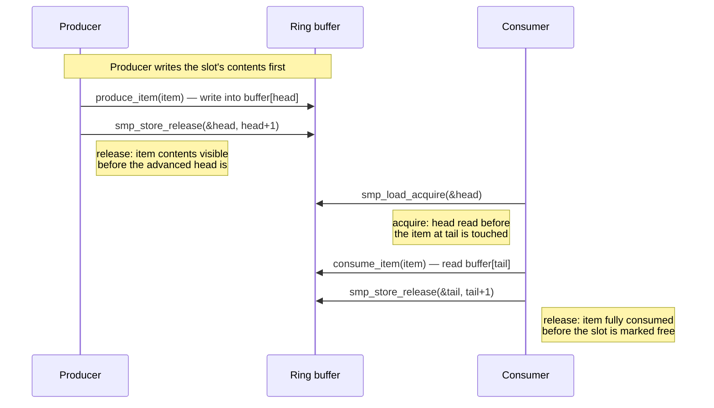

# Lock-Free Patterns

Where the kernel genuinely goes lock-free, and an honest account of why most kernel code should not.

An honest opening, because this topic attracts overreach: lock-free code is harder to write, far harder
to review, and rarely faster than a well-chosen lock. Ordinary spinlocks and mutexes are fast precisely
because contention is the uncommon case — most of the time a lock is uncontended, and taking it costs one
atomic instruction. The kernel goes lock-free in a small number of places where the constraints genuinely
demand it, mostly where one side of the interaction *cannot take a lock at all* — not because lock-free is
generally superior. This page is about those specific cases, not about lock-free programming as an
aspiration to bring to ordinary code.

## What "lock-free" actually means

The terms have precise, weaker-than-they-sound meanings from the progress-guarantee literature:

- **Lock-free** means the system as a whole always makes progress — *some* thread completes its operation
  in a bounded number of steps, even if any individual thread could in principle be starved forever by
  unlucky scheduling.
- **Wait-free** is the stronger property: *every* thread completes in a bounded number of steps,
  regardless of what any other thread does.

Most kernel code that gets called "lock-free" is really narrower than either of these: it's *one side*
of an interaction that is lock-free (or wait-free) while the other side still takes a lock, or is
constrained to a single writer so the question of contention among writers doesn't arise. That's a
weaker claim than "this whole algorithm is lock-free" — and it's also the more useful and far more common
property in real kernel code, because it's usually only one side (an NMI handler, an interrupt context, a
single hardware producer) that genuinely cannot block.

## The one pattern that carries the weight: SPSC rings

The pattern that shows up again and again, under different names, is the single-producer/single-consumer
ring buffer: one producer owns the head index and only ever advances it, one consumer owns the tail index
and only ever advances it, and the two sides coordinate through nothing but ordinary memory reads and
writes — no atomic read-modify-write, no lock shared between them. `Documentation/core-api/circular-buffers.rst`
gives the canonical shape (reproduced here, barrier placement verbatim from that file at the v6.18 tag):

```c
/* Producer */
spin_lock(&producer_lock);

unsigned long head = buffer->head;
/* The spin_unlock() and next spin_lock() provide needed ordering. */
unsigned long tail = READ_ONCE(buffer->tail);

if (CIRC_SPACE(head, tail, buffer->size) >= 1) {
        /* insert one item into the buffer */
        struct item *item = buffer[head];

        produce_item(item);

        smp_store_release(buffer->head,
                          (head + 1) & (buffer->size - 1));

        /* wake_up() will make sure that the head is committed before
         * waking anyone up */
        wake_up(consumer);
}

spin_unlock(&producer_lock);

/* Consumer */
spin_lock(&consumer_lock);

/* Read index before reading contents at that index. */
unsigned long head = smp_load_acquire(buffer->head);
unsigned long tail = buffer->tail;

if (CIRC_CNT(head, tail, buffer->size) >= 1) {
        /* extract one item from the buffer */
        struct item *item = buffer[tail];

        consume_item(item);

        /* Finish reading descriptor before incrementing tail. */
        smp_store_release(buffer->tail,
                          (tail + 1) & (buffer->size - 1));
}

spin_unlock(&consumer_lock);
```

Two things worth noticing before the barriers themselves. First, each side still takes a lock —
`producer_lock` and `consumer_lock` — but those locks only serialize *multiple producers among themselves*
or *multiple consumers among themselves*; there is no lock shared between the producer side and the
consumer side. That's the actual lock-free relationship here: producer and consumer never wait on each
other. Second, the buffer always leaves one slot empty, so the producer can never advance `head` onto a
slot the consumer hasn't finished reading yet even in the worst case.

Exactly two release/acquire pairs do the real work:

- The producer writes the new item's contents, then publishes the updated `head` with
  `smp_store_release()`. The release ensures every write that filled the item is visible to any CPU that
  subsequently observes the new `head` value — without it, the consumer could see the advanced index
  before it could see the data the index now claims is valid.
- The consumer reads `head` with `smp_load_acquire()` *before* touching the item at `tail`. The acquire
  ensures the item's contents are read only after the index confirming their validity has been observed —
  without it, the compiler or CPU could hoist the item read above the index read and see stale data.
- Symmetrically, the consumer's `smp_store_release()` on `tail` (after `consume_item()` finishes) tells
  the producer's next observation of `tail` that this slot has genuinely been vacated — not merely that
  the index changed, but that whatever the consumer was doing with the old contents is done, so the
  producer may safely overwrite that slot on a future wrap-around.

`READ_ONCE()`/`smp_load_acquire()` on the "opposition" index in both cases exist for the same reason: they
stop the compiler from caching or reloading the value in a way that would let it observe a torn or stale
read, independent of what the CPU's own memory model would otherwise allow.

## kfifo

The kernel's ready-made version of this pattern is `struct kfifo` (`include/linux/kfifo.h`). Its own header
comment is explicit about the scope of the guarantee: kfifo is lockless only in the strict
single-producer/single-consumer case. With one producer and one reader, no locking is required at all.
Add a second producer or a second consumer on the same fifo, and the API's own documentation says a lock
becomes necessary — `kfifo_in_spinlocked()`/`kfifo_out_spinlocked()` exist precisely for that case, taking
an explicit spinlock the caller supplies.

This is worth stating plainly because the name invites the opposite assumption: "FIFO" says nothing about
concurrency, and it is easy to hand the same `kfifo` to two writers, see it work under light testing, and
ship a corruption bug that only manifests under real contention. The API will not stop that misuse — the
locking discipline is a documented convention, not something the type system enforces.

## The BPF ring buffer

The instance of this pattern readers are most likely to actually meet today is the BPF ring buffer —
a shared memory region that the kernel writes into and user space reads out of directly, with a
reservation/commit protocol (a producer reserves space, writes into it, then commits) that lets multiple
kernel-side producers write concurrently without any of them taking a lock against the others. It's
mentioned here by name only; the mechanism belongs to the BPF section of this documentation, not here.

## Where else the kernel goes lock-free

- **The printk ring buffer** (`struct printk_ringbuffer`, `kernel/printk/printk_ringbuffer.h`) has to
  accept a write from NMI context, and inside an NMI handler there is no lock the kernel can safely take —
  the CPU it interrupted might already hold that very lock, and spinning would deadlock forever. Lock-free
  here isn't a performance choice; it's the only option available.
- **Tracing ring buffers** (the infrastructure behind ftrace and perf's data buffers) write trace records
  from contexts — interrupt handlers, deep inside the scheduler — where taking a lock either risks the
  same reentrancy problem or would perturb the very latency the tracer is trying to measure.
- **Some statistics paths** use lock-free per-CPU update patterns for the same reason [per-CPU
  data](./per-cpu-data.md) does: the writer is on a hot path where even an uncontended lock's overhead is
  something worth avoiding, and the data doesn't need cross-CPU consistency at every instant anyway.

In every one of these, naming the *reason* the lock was unavailable or unacceptable is the actual
criterion for going lock-free — not a general sense that lock-free code is faster.

## Why most code should not

A lock-free algorithm is only correct with respect to a specific memory model, and "I reasoned about it
carefully" is not a substitute for checking against that model formally — informal reasoning about
interleavings is exactly how experienced kernel developers have shipped lock-free bugs that survived for
years before a specific unlucky reordering on a specific architecture exposed them. This is precisely why
the kernel maintains formal memory-model tooling — `herd7` and `litmus7`, under `tools/memory-model/` —
built to check proposed orderings against the Linux kernel memory model exhaustively rather than by
inspection. The review burden for a genuinely lock-free data structure is enormous compared to the
equivalent locked version: reviewers must reason about every possible interleaving on every architecture
the kernel supports, not just the ones that happen to occur under testing. Treat "we made this lock-free"
as a claim that requires a litmus test proving the required orderings hold, not an assertion to take on
the strength of a clever-looking diff.

## The ABA problem in kernel terms

The classic hazard in lock-free data structures built around compare-and-swap is ABA: a thread reads a
pointer value A, gets preempted, some other thread frees the object at A and allocates a new one that
happens to land at the same address, and when the original thread resumes its CAS succeeds because the
pointer value still reads as A — even though it now points at a completely different object. The CAS
can't tell the difference between "nothing changed" and "something changed and then changed back."

The kernel's usual answer to this is RCU, and it resolves the problem structurally rather than by
detecting it: under [RCU](./rcu-the-idea.md), an object removed from a lock-free structure is not actually
freed until every CPU has passed through a quiescent state — a full RCU grace period — which means the
memory a stale pointer refers to cannot be reused for something else while any reader might still be
looking at it through the old pointer. ABA can't occur if the address in question never gets reassigned to
a different object during the window where a stale reference to it might still be read. That's the most
satisfying connection this page has to offer: a lock-free structure paired with RCU-deferred reclamation
doesn't need an ABA-avoidance trick bolted on separately, because the reclamation discipline already
removes the precondition ABA depends on.



*A single-producer ring: two barriers, each preventing one specific reordering, and no lock anywhere
between producer and consumer.*

<KernelFacts
  structure={[["struct kfifo", "include/linux/kfifo.h"], ["struct printk_ringbuffer", "kernel/printk/printk_ringbuffer.h"]]}
  path="producer: write slot → smp_store_release(head); consumer: smp_load_acquire(head) → read slot → smp_store_release(tail)"
  observe="Read the locking-requirements comment block at the top of include/linux/kfifo.h — it states outright when a lock is and isn't required."
  trap="kfifo is lockless only for one producer and one consumer. Two producers on the same kfifo without a lock is a corruption bug, and the API will not stop you." />

## References

- <Src file="include/linux/kfifo.h" /> — the header's own comment block on when locking is and isn't
  required, verified present at this path at the v6.18 tag.
- [Circular Buffers](https://docs.kernel.org/core-api/circular-buffers.html) — the source this page's SPSC
  example is taken from verbatim, including the exact barrier placement and its reasoning.
- <Src file="tools/memory-model/README" /> — the LKMM tooling documentation (`herd7`/`litmus7`), verified
  present at this path at the v6.18 tag.
- <Src file="kernel/printk/printk_ringbuffer.h" /> — `struct printk_ringbuffer` itself; there is no
  separate docs.kernel.org page for the ring-buffer internals, only the header. [Printk
  Basics](https://docs.kernel.org/core-api/printk-basics.html) documents the caller-facing `pr_*()` API
  the ring buffer sits behind.
