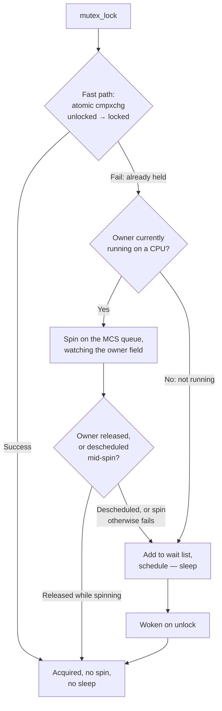

# Mutexes and Semaphores

Sleeping locks that spin first, owner tracking, and why semaphores are now rare.

There's a piece of folklore worth correcting before anything else: a Linux mutex does not immediately
put the caller to sleep. It spins first, on the working assumption that a lock held by a task currently
running on another CPU will be released within a few hundred cycles — and only falls back to sleeping
when that assumption turns out to be wrong. "Mutexes are slow because they sleep" describes an
implementation Linux has not had since the optimistic-spinning rewrite landed years ago. For a short
critical section, a contended mutex today costs close to what a contended spinlock costs, while still
being the one primitive of the two that's safe to hold across a sleep.

## What a mutex adds over a spinlock

The one capability that matters: a mutex may sleep, so it may be held across an allocation
(`kmalloc(GFP_KERNEL)`), across I/O, across `copy_to_user()` — anything a spinlock's absolute
no-sleep rule forbids (see [Spinlocks](./spinlocks.md#the-absolute-rule)). That single fact is the
reason to reach for a mutex instead of a spinlock. Everything else about a mutex — its API, its
debug checks, its interaction with `PREEMPT_RT` — is secondary to this one property.

## Optimistic spinning

A `struct mutex` records its current owner in an atomic field. When a second task contends for the
lock, it doesn't queue and sleep immediately — it first checks whether the recorded owner is presently
running on some CPU. If so, it spins, on the reasoning that a running task is likely to finish its
critical section and release the lock soon, and spinning avoids two full context switches (one to sleep,
one to wake back up) that would otherwise dwarf the cost of the critical section itself. The spinning
itself goes through an MCS queue (the same queuing idea [Spinlocks](./spinlocks.md#queued-spinlocks)
describes for `qspinlock`) rather than every contender hammering one shared field, so contention doesn't
turn into a coherence storm on the owner pointer. Only once the owner is observed to have been
descheduled — or the spin otherwise fails — does the waiter give up and join the real sleep path.

The consequence is the one worth internalizing: for a short critical section, a mutex performs close to
what a spinlock costs, because the contended case usually resolves in the spin phase without ever
reaching `schedule()`. "Use a spinlock instead of a mutex for speed" is, in most real cases, advice based
on an implementation Linux no longer has.

## The API

| Call | Use when |
|---|---|
| `mutex_lock()` | The default — the task cannot usefully do anything else while waiting, and being killed while waiting is not a concern worth handling separately. |
| `mutex_lock_interruptible()` | Any path a user might interrupt (Ctrl-C, a signal) while it's blocked — the wait must be abortable, and the caller checks the return value for `-EINTR`. |
| `mutex_lock_killable()` | Like the interruptible form, but only fatal signals wake the wait — useful when ordinary signals shouldn't abort the operation but a `SIGKILL` still must. |
| `mutex_trylock()` | The rare case where failing to acquire is an acceptable outcome for the caller to handle immediately — never as a substitute for getting lock ordering right, since a `trylock` failure due to ordering is a bug wearing a graceful-degradation costume. |

Any code reachable from a user-facing syscall that can block for an unbounded time should use the
interruptible (or killable) form; a straight `mutex_lock()` there means a user who wants out has no way
to signal that until whatever the mutex is waiting on finishes on its own.

## Rules the kernel enforces

Three rules, all checked by `CONFIG_DEBUG_MUTEXES` at runtime and silently tolerated by a production
build if violated:

- **Only the task that took the lock may release it.** Unlike a semaphore, a mutex has an owner, and
  handing `mutex_unlock()` to a different task than the one that called `mutex_lock()` is a bug, not a
  feature.
- **No use in interrupt context.** A mutex can sleep on the contended path, and interrupt context can
  never sleep — so a mutex acquired from a hard-IRQ handler is not merely discouraged, it's a design
  error the same class as sleeping under a spinlock.
- **No recursive locking.** A task calling `mutex_lock()` on a mutex it already holds deadlocks against
  itself the moment the fast path fails, since it is then waiting for an owner that is itself.

Because these are debug-build checks, not something the atomic fast path can catch in general, a bug of
this shape can run for a long time on a production kernel — silently corrupting invariants or occasionally
deadlocking — before someone reproduces it under `CONFIG_DEBUG_MUTEXES` and gets a clear splat pointing
at the actual violation.

## Semaphores, and why they faded

A semaphore is a counting primitive with no concept of ownership: whoever holds the count down can be
signalled up by a *different* task entirely. That's a genuinely different capability from a mutex (where
only the owner may unlock), and it's what let semaphores double as both a mutual-exclusion primitive
(count of 1, a "binary semaphore") and a one-shot notification mechanism (one task waits, another signals
it later). In modern code, both of those roles have a more specific, better-checked replacement: mutual
exclusion is a `mutex` (with its ownership rules enforced), and one-shot notification is a
`struct completion`. New code should reach for one of those, not a semaphore — a bare semaphore today is
usually either legacy code that predates the split, or code guarding a genuinely unusual pattern that
needs the no-owner property specifically.

## struct completion

The primitive for "one thing waits for another to finish," visible all over driver and subsystem code
wherever one task must block until a different task (or an interrupt handler) reaches a specific point:

```c
struct completion {
	unsigned int done;
	struct swait_queue_head wait;
};
```

The pattern is symmetric and small: one side calls `wait_for_completion(&c)` and blocks; the other calls
`complete(&c)` (or `complete_all(&c)` to wake every waiter) once the work it represents has actually
finished. It's easy to mistake for a semaphore at a glance — both involve one side blocking and another
signalling — but a completion carries no count semantics beyond "has this happened," and driver code
reads far more naturally once that distinction is clear: `wait_for_completion()` at the top of a probe
function waiting on firmware load, `complete()` at the bottom of the interrupt handler that firmware load
triggers, is a completion doing exactly its one job.

## Under PREEMPT_RT

Ordinary mutexes gain priority inheritance under `PREEMPT_RT` (backed by the `rt_mutex` machinery): if a
high-priority task blocks on a mutex held by a lower-priority one, the holder is temporarily boosted to
the waiter's priority so it can finish and release the lock promptly, rather than being preempted by some
unrelated medium-priority task and holding up the high-priority waiter indefinitely. This is what makes
RT scheduling priorities mean something in the presence of shared data — without it, [priority
inversion](../07-scheduling/real-time-scheduling.md) can make a task's assigned priority irrelevant
whenever it happens to block on a lock a lower-priority task holds.



*A mutex sleeps only as a last resort: three attempts to avoid a context switch before it gives in.*

<KernelFacts
  structure={[["struct mutex", "include/linux/mutex_types.h"], ["struct completion", "include/linux/completion.h"]]}
  path="mutex_lock() → __mutex_trylock_fast() cmpxchg → __mutex_lock_slowpath() → mutex_optimistic_spin() (MCS queue) → schedule()"
  observe="grep -E 'CONFIG_DEBUG_MUTEXES|CONFIG_MUTEX_SPIN_ON_OWNER' /boot/config-$(uname -r)"
  trap="A mutex is not the slow option. It spins before it sleeps, so for short critical sections it costs about what a spinlock costs — while remaining safe to hold across a sleep, which a spinlock never is." />

## References

- [Mutex design](https://docs.kernel.org/locking/mutex-design.html) — the in-tree description of the
  fastpath/midpath/slowpath split and the ownership rules `CONFIG_DEBUG_MUTEXES` enforces.
- <Src file="kernel/locking/mutex.c" symbol="mutex_lock" /> — the fast path, and the entry into
  `__mutex_lock_slowpath()` and `mutex_optimistic_spin()`.
- [Lock types](https://docs.kernel.org/locking/locktypes.html) — mutex behaviour under `PREEMPT_RT`,
  including priority inheritance.
- [Completions](https://docs.kernel.org/scheduler/completion.html) — the definitive reference for
  `struct completion` and its API.
