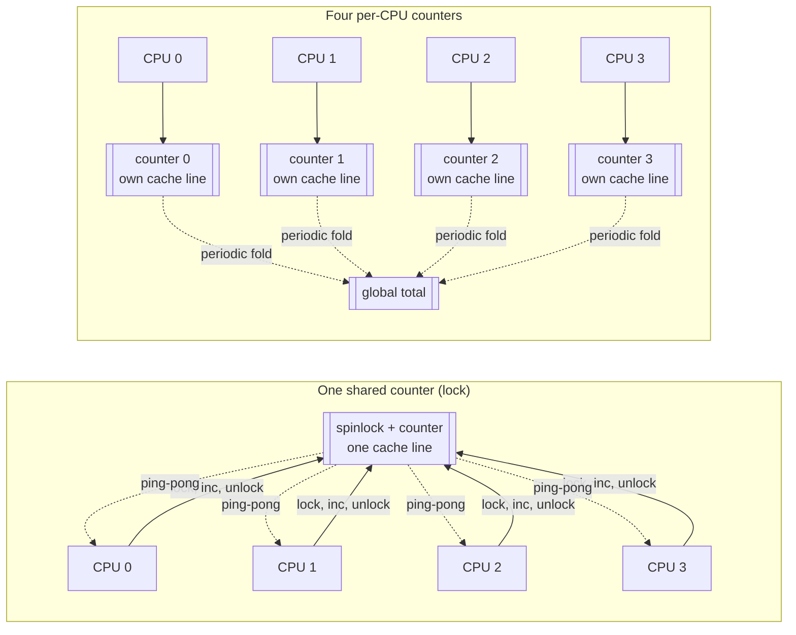

# Per-CPU Data

Eliminating sharing rather than protecting it, and what that costs in preemption discipline.

There is a strategy that beats every lock, and it applies whenever the data doesn't strictly need to be
shared: don't share it. Give each CPU its own copy, and there is no contention, no cache-line bouncing
between cores, and no lock to take, because there is nothing two CPUs are ever touching at once. The
kernel reaches for this everywhere it plausibly can — counters, freelists, run queues, softirq state —
and the entire remaining difficulty is what happens in the cases where the per-CPU copies eventually have
to be combined into one answer.

## Declaring and accessing

A per-CPU variable is declared once and the kernel allocates one instance of it per possible CPU. Access
from the *current* CPU goes through the `this_cpu_*` family; access to a specific *other* CPU's copy goes
through `per_cpu()`.

```c
/* Declaration — one instance per CPU, in a special per-CPU section */
DEFINE_PER_CPU(int, counter);

/* Referenced from another file */
DECLARE_PER_CPU(int, counter);

/* Access from the current CPU: */
this_cpu_write(counter, 0);
this_cpu_add(counter, 1);
int local = this_cpu_read(counter);

/* Access another CPU's copy explicitly: */
int remote = per_cpu(counter, 3);
```

`DEFINE_PER_CPU`/`DECLARE_PER_CPU` live in `include/linux/percpu-defs.h`; `this_cpu_read()`,
`this_cpu_write()`, and `this_cpu_add()` are defined there too, dispatching by operand size down to
architecture-specific ops in `include/asm-generic/percpu.h` (or an arch's own override). `per_cpu(var,
cpu)` is the escape hatch for the rarer case of touching a CPU that isn't the one currently running —
useful for aggregation, useless for anything that needs atomicity, since nothing stops that CPU from
touching its own copy at the same time.

## Why this_cpu_* is not just an array index

It's tempting to think of a per-CPU variable as sugar for `array[smp_processor_id()]`, but the `this_cpu_*`
operations promise something an array index does not: the read-modify-write is atomic *with respect to
preemption and interrupts on this CPU*. On x86-64 this is not a software guarantee bolted on top — a call
like `this_cpu_add()` compiles down to a single instruction with a segment-prefixed operand (the per-CPU
area is addressed relative to `%gs`), so there is no window in which the CPU has read the old value but not
yet written the new one.

That single-instruction property is exactly what makes it safe against interrupts. `array[id]++` decomposes
into a load, an increment, and a store; an interrupt landing between the load and the store runs to
completion, and if the interrupt handler also touches the same counter, one of the two increments is
silently lost when the original context resumes and stores its now-stale value. `this_cpu_add()` has no
such window on the architectures where it lowers to one instruction, and where it doesn't, the generic
fallback in `include/asm-generic/percpu.h` wraps the read-modify-write with `preempt_disable()`/
`local_irq_save()` to manufacture the same guarantee. Either way, the property being sold is not "fast
array access" — it's "safe against this CPU's own interrupts and preemption", which a raw array index
never was.

## get_cpu/put_cpu and preemption

The atomicity above only holds while the code stays on the CPU it started on. `this_cpu_ptr(var)` hands
back a pointer to *this* CPU's copy — but if the calling thread is then preempted and resumes on a
different CPU, that pointer now refers to the wrong copy, and every subsequent access through it corrupts
data that some other CPU may currently be using.

This is the single most common per-CPU bug: taking a pointer to a per-CPU variable, doing enough work
between taking it and using it that a preemption point can land in the middle, and never noticing in
testing because it only misbehaves under real scheduling pressure. `get_cpu_ptr()`/`put_cpu_ptr()` close
the window by disabling preemption for the pointer's whole lifetime:

```c
struct my_stats *s = get_cpu_ptr(&stats);   /* preempt_disable(), then this_cpu_ptr() */
s->count++;
put_cpu_ptr(&stats);                        /* preempt_enable() */
```

Verified against v6.18 (`include/linux/percpu-defs.h`): `get_cpu_ptr(var)` expands to
`preempt_disable(); this_cpu_ptr(var);` and `put_cpu_ptr(var)` expands to `preempt_enable()`. There is no
magic beyond that — the whole mechanism is "don't let the scheduler move you while you're holding this
pointer", and the moment code holds such a pointer across a call that can sleep or reschedule, the
guarantee is already broken.

## Under PREEMPT_RT: local_lock

All of the above assumes that disabling preemption is cheap and short, which is exactly the assumption
`PREEMPT_RT` challenges: on that configuration, most kernel code that would ordinarily run with preemption
disabled needs to remain preemptible to keep worst-case latency bounded, so the implicit protection that
`get_cpu_ptr()` buys elsewhere is no longer free to reach for casually. Code that genuinely needs to
serialize access to a per-CPU structure across preemption there takes an explicit `local_lock_t` instead —
a lock type that compiles to nothing but `preempt_disable()`/`preempt_enable()` (or
`local_irq_save()`/`local_irq_restore()`, for the IRQ-disabling variants) on a non-RT kernel, and to a real
per-CPU spinlock-like primitive under `PREEMPT_RT`, so the same source line means "disable preemption" on
one configuration and "take a lock" on the other.

This is why modern per-CPU code increasingly declares a `local_lock_t` alongside the data it protects,
where older code just wrapped the access in `preempt_disable()`/`preempt_enable()` directly: the newer
form documents *what* is being protected and against *what*, and degrades gracefully under RT instead of
silently keeping preemption disabled for a stretch that RT can no longer tolerate. See
[Preemption Models](../07-scheduling/preemption-models.md) for what `PREEMPT_RT` changes about preemption
in general — this is one direct consequence of that change landing on per-CPU code specifically.

## Per-CPU counters

`struct percpu_counter` (`include/linux/percpu_counter.h`) packages the fold-on-threshold pattern for
statistics that are updated constantly and read comparatively rarely: `percpu_counter_add()` bumps a
per-CPU local delta with no locking at all, and once that CPU's local delta exceeds a batch size
(`percpu_counter_batch`, tunable, defaulting to a value derived from the number of online CPUs), it is
folded into a spinlock-protected global count and the local delta resets to zero. Reading the counter
(`percpu_counter_read()`) looks only at that global value — it does not force a fold first.

The trade-off has to be stated plainly: the global value is only ever approximate between folds, and on a
machine with many CPUs each holding an unfolded residual, that approximation gets *worse* as CPU count
grows, not better. That is the right trade for something like a filesystem's free-block count or an mm
statistic that just needs to be roughly right for reporting or heuristics — nobody is hurt by
`df` being off by a batch's worth of blocks for a moment. It is the wrong trade for anything a correctness
decision actually depends on, such as an exact resource-limit enforcement check, where "approximate" and
"wrong at the worst possible moment" are the same failure.

## Where the kernel uses it

- The page allocator's **per-CPU page lists**, which hand out and take back single pages without touching
  the global zone lock on the common path — see
  [The Page Allocator](../08-memory-management/the-page-allocator.md).
- SLUB's **per-CPU freelists**, the fast allocation/free path that avoids the slab lock entirely when a
  CPU's local freelist has what it needs — see
  [Slab, SLUB, and kmalloc](../08-memory-management/slab-slub-and-kmalloc.md).
- The **per-CPU run queue**, `struct rq`, which is the scheduler's own per-CPU state and the reason most
  scheduling decisions touch no lock shared with another CPU — see
  [Run Queues and Scheduling Classes](../07-scheduling/runqueues-and-scheduling-classes.md).
- **Softirq state**, tracked per CPU so that each CPU's softirq processing never has to coordinate with
  any other CPU's — see [Softirqs](../10-interrupts-time-and-deferred-work/softirqs.md).

## The cache-line connection

Per-CPU data is the structural answer to false sharing, not a mitigation for it. Padding a shared counter
out to its own cache line (see
[Cache Coherence and MESI](../../computer-science/memory-hierarchy/cache-coherence-and-mesi.md)) stops
*unrelated* fields from bouncing a line back and forth, but a genuinely shared counter still bounces the
line between every CPU that increments it — padding only stops it from dragging its neighbors down with
it. Making the counter per-CPU removes the sharing itself: there is no line for two CPUs to fight over,
because each CPU's copy lives in a different line by construction. The kernel's per-CPU allocator
deliberately aligns each CPU's per-CPU area to a cache line boundary for exactly this reason — so that one
CPU's per-CPU data can never accidentally share a line with another CPU's copy of the same variable.

## When it does not work

- **Data that must be exactly consistent at every instant.** If any reader anywhere needs the true
  up-to-the-moment total, per-CPU replication is the wrong tool — that's a lock or an atomic, not a fold.
- **Data too large to replicate per CPU.** Multiplying a structure's size by `NR_CPUS` is fine for a
  counter and not fine for anything of real size; the memory cost scales with core count whether or not
  those cores are ever touching the data.
- **Workloads that migrate constantly between CPUs.** If a thread bounces between CPUs faster than it can
  amortize the benefit, it pays the cost of `get_cpu_ptr()`/preemption discipline on every access without
  ever getting to exploit locality — the whole point was staying on one CPU long enough to matter.



*The same counter, shared and per-CPU: the second version has no coherence traffic at all until the fold.*

<KernelFacts
  structure={[["DEFINE_PER_CPU", "include/linux/percpu-defs.h"], ["struct percpu_counter", "include/linux/percpu_counter.h"]]}
  path="this_cpu_add() → segment-prefixed instruction on this CPU's copy → periodic fold into the global counter"
  observe="grep -E 'per_cpu|percpu' /proc/kallsyms | head; cat /proc/meminfo | grep Percpu"
  trap="A pointer to a per-CPU variable is only valid while you stay on that CPU. Take one, get preempted, and you are now updating another CPU's copy — which is why get_cpu_ptr() disables preemption and why code that uses the raw accessor without it is broken in a way that only shows up under load." />

## References

- <Src file="include/linux/percpu-defs.h" /> — `DEFINE_PER_CPU`/`DECLARE_PER_CPU`, `this_cpu_*`, and
  `get_cpu_ptr()`/`put_cpu_ptr()`, verified present at these exact names at the v6.18 tag.
- [Semantics and Behavior of Local Atomic Operations](https://docs.kernel.org/core-api/local_ops.html) —
  the `local_t` family and how it relates to per-CPU atomicity.
- [Locking Types](https://docs.kernel.org/locking/locktypes.html), the `local_lock` section — what
  changes under `PREEMPT_RT` and why `local_lock_t` exists.
- [The search for fast, scalable counters](https://lwn.net/Articles/170003/) (LWN, 2006) — the original
  case for `percpu_counter`'s batched-fold design and its explicit accuracy/speed trade-off, which still
  describes the mechanism verified above.
