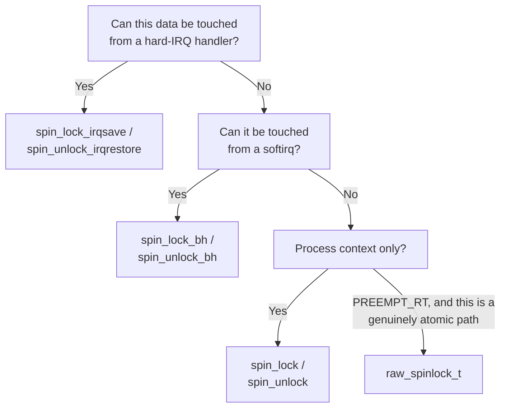

# Spinlocks

Busy-waiting and when it is right, the queued implementation, and the absolute rule against sleeping while holding one.

A spinlock burns CPU while it waits — the waiting CPU sits in a tight loop, re-checking the lock word,
instead of doing anything else. That sounds unconditionally wasteful until you notice what the
alternative costs: putting the waiter to sleep and waking it later means at least two context switches,
each of them hundreds to thousands of cycles of saving and restoring state and running the scheduler. If
the critical section is twenty instructions long, spinning for it is dramatically cheaper than sleeping
for it — the waiter would spend more cycles going to sleep and waking back up than the lock is ever held.
Spinlocks are the right answer for short critical sections, and they are the *only* answer in contexts
that cannot sleep at all, which [Why Kernel Concurrency Is
Different](./why-kernel-concurrency-is-different.md)'s context matrix identifies as most of the kernel
outside process context.

## When spinning is right

Two conditions, either one sufficient on its own: the critical section is short, or the context cannot
sleep. The rough guidance for the first: if the expected hold time is comparable to or shorter than a
context switch, spin — sleeping would cost more than the wait itself. If the section can ever block
(allocate with `GFP_KERNEL`, take a mutex, wait on I/O), it must not run under a spinlock in the first
place, which is really the second condition again: a context that cannot sleep has no choice but a
spinlock (or a fully lock-free construction), regardless of how long the section takes.

## The absolute rule

You may not sleep while holding a spinlock. Not `kmalloc(GFP_KERNEL)` (it can block on reclaim), not
`copy_to_user()` (it can fault on a paged-out user page), not a mutex (mutexes exist to sleep), not
`msleep()`. The rule is easy to state and easy to violate by accident, three calls deep in a function
that doesn't obviously sleep, which is why the consequence is worth understanding rather than only the
rule: taking a spinlock, on most kernel configurations, disables preemption on the CPU that took it. If
the code that holds it then sleeps, the CPU has no way to run anything else, including the scheduler
work needed to eventually wake the sleeper back up — and every other CPU spinning on that same lock
spins for as long as that never happens, which in the general case is forever. A blocked spinlock holder
does not just slow one path down; it can hang the machine.

## Queued spinlocks

The naive implementation of a spinlock is a single shared word: everyone who wants the lock spins on
that same location with a test-and-set instruction, and the moment it's released every spinner's cache
tries to reload it at once. That design collapses as core counts grow, because every attempt — success
or failure — forces the lock's cache line to bounce between CPUs (see [Cache Coherence and
MESI](../../computer-science/memory-hierarchy/cache-coherence-and-mesi.md)); with enough CPUs spinning,
the coherence traffic alone dominates, and the lock has no fairness guarantee either — whichever spinner
the hardware happens to grant the line to next wins, so a CPU can in principle starve.

The kernel's actual implementation at v6.18, `struct qspinlock` in `kernel/locking/qspinlock.c`, is
based on the MCS lock, adapted to still fit in the 4 bytes `spinlock_t` has always been. Rather than
every waiter spinning on the single shared lock word, each waiter beyond the first queues itself and
spins on a *per-CPU queue node* — its own cache line, not the lock's — while the lock word itself
encodes only the current owner and a compact pointer to the tail of the queue. Contention turns into a
FIFO queue instead of a free-for-all: the queue is fair (each waiter is granted the lock in the order it
arrived), and released cache-line traffic drops from "every spinner reacts to every unlock" to "the one
next-in-line node reacts." This is the design that makes the naive implementation's failure mode
comprehensible: what collapses at high core counts is specifically the shared-cache-line spinning, and
queuing is the fix because it gives each waiter something private to spin on instead.

## What actually happens

`spin_lock()` on an uncontended lock is genuinely cheap. The fast path, from
`include/asm-generic/qspinlock.h`:

```c
static __always_inline void queued_spin_lock(struct qspinlock *lock)
{
    int val = 0;

    if (likely(atomic_try_cmpxchg_acquire(&lock->val, &val, _Q_LOCKED_VAL)))
        return;

    queued_spin_lock_slowpath(lock, val);
}
```

An uncontended acquire is one `atomic_try_cmpxchg_acquire()` — a single locked compare-and-swap moving
the lock word from "unlocked" (`0`) to "locked, no waiters" — plus, on a `CONFIG_PREEMPT` kernel, a
`preempt_disable()`. That is the entire cost of taking a lock nobody else wants: a handful of
instructions and one cache-line acquisition, no queue node, no slow path ever entered. The MCS queue
described above only comes into play in `queued_spin_lock_slowpath()`, reached exclusively when the
fast-path `cmpxchg` fails because someone else already holds the lock. The point worth taking away: the
uncontended case is not "cheap for a lock," it is cheap in absolute terms, and the fear people have of
"locking overhead" is almost always really a fear of *contention* — many CPUs wanting the same lock at
once — which is a design problem about what the lock protects and how often, not an indictment of
spinlocks as a primitive.

## The interrupt variants

| Call | Use when | What it additionally does |
|---|---|---|
| `spin_lock()` / `spin_unlock()` | Data touched only from process context, on this CPU and others | Nothing beyond preemption disable |
| `spin_lock_irq()` / `spin_unlock_irq()` | You *know* interrupts were enabled before the call | Disables/re-enables interrupts on this CPU unconditionally |
| `spin_lock_irqsave()` / `spin_unlock_irqrestore()` | You don't know (or can't guarantee) the prior interrupt state — the safe default | Saves the current interrupt-enabled state and restores exactly that, rather than assuming it was on |
| `spin_lock_bh()` / `spin_unlock_bh()` | Data also touched from a softirq on this CPU | Disables softirq processing on this CPU for the duration |

`spin_lock_irqsave()` is the one to reach for whenever the caller can't prove interrupts were already
on — an unconditional `spin_lock_irq()` would wrongly re-enable interrupts on unlock if they had been
off before the call, which is exactly the same category of bug as the deadlock in [Why Kernel
Concurrency Is Different](./why-kernel-concurrency-is-different.md#the-interrupt-deadlock): that page's
diagram is this table's justification, not a separate concern — the whole reason the `_irqsave` variant
exists is to prevent a CPU from deadlocking against its own interrupt handler.

## `raw_spinlock_t`

Under `PREEMPT_RT`, ordinary `spinlock_t` stops being a real spinlock: it becomes a wrapper around
`rt_mutex_base` — a sleeping, priority-inheriting lock — so that most of the kernel's critical sections
become preemptible even while "holding a lock." `raw_spinlock_t` is the type that is exempted from this
transformation: it stays a genuine non-sleeping, non-preemptible spinlock on every configuration,
`PREEMPT_RT` included. This is why the scheduler's own internals, interrupt-handling core code, and a
few other places that must never become preemptible use `raw_spinlock_t` explicitly rather than plain
`spinlock_t` — code that says "spinlock" without qualifying which one is, on a `PREEMPT_RT` kernel,
usually not talking about the thing this page otherwise describes.

## Reading a spinlock in code

The conventions to recognise on sight: a lock embedded directly in the struct it protects —

```c
struct my_device {
    spinlock_t lock;
    int state;
};
```

— initialised once, dynamically, with `spin_lock_init(&dev->lock)` (never a static zero-initialised
struct member for anything that participates in lockdep tracking); taken and released in matched pairs
around the fields it guards; and, in code that wants to assert its own locking contract rather than
merely hope callers get it right, `lockdep_assert_held(&dev->lock)` at the top of a helper that must
only ever be called with the lock already held. Seeing `lockdep_assert_held()` in a function is a
reliable signal that the function's caller — not the function itself — is responsible for taking the
lock first.

## Misconceptions

- **"Spinlocks waste CPU, so mutexes are always better."** For a short critical section this is
  backwards: a mutex's sleep/wake path costs two context switches, which for a twenty-instruction
  section is far more expensive than however many cycles the spin actually took. Spinning is not a
  compromise for short sections, it is the cheaper option.
- **"`spin_lock_irqsave()` disables interrupts on all CPUs."** It disables interrupts only on the CPU
  executing the call. That's also the only CPU it needs to protect: the deadlock it exists to prevent is
  a CPU racing against its *own* interrupt handler, and another CPU spinning on the same lock in ordinary
  `spin_lock()` form is fine — it isn't waiting for itself, only for the first CPU to finish, which it
  now can, uninterrupted.
- **"A spinlock protects data from other CPUs."** It protects data from anything that takes the same
  lock — which includes this CPU's own interrupt handlers and softirqs only if the code took the
  variant that also excludes them (`_irqsave`, `_bh`). A plain `spin_lock()` does nothing to stop this
  CPU's own interrupt handler from running the interrupt deadlock scenario above if that handler also
  touches the same lock.



*Which spinlock variant, decided by who else can touch the data rather than by how long you hold it.*

<KernelFacts
  structure={[["spinlock_t", "include/linux/spinlock_types.h"], ["struct qspinlock", "include/asm-generic/qspinlock_types.h"]]}
  path="spin_lock() → preempt_disable() → queued_spin_lock() → fast path atomic, or MCS queue on contention"
  observe="sudo cat /proc/lock_stat | head -20 (requires CONFIG_LOCK_STAT)"
  trap="Holding a spinlock disables preemption on that CPU. Every instruction in the critical section is a delay imposed on every other task that CPU could have run, which is why 'hold it briefly' is a latency requirement, not a style preference." />

## References

- [Locking documentation: spinlocks](https://docs.kernel.org/locking/spinlocks.html) — the in-tree
  description of the variants and the rules for choosing between them.
- <Src file="kernel/locking/qspinlock.c" symbol="queued_spin_lock_slowpath" /> — the MCS queue
  implementation, with comments explaining the encoding packed into the 32-bit lock word; genuinely
  readable as source.
- [Lock types](https://docs.kernel.org/locking/locktypes.html) — the definitive statement of which lock
  types exist and how each behaves under `PREEMPT_RT`; the authority for the `raw_spinlock_t` section
  above.
- LWN, [*MCS locks and qspinlocks*](https://lwn.net/Articles/590243/) — why the implementation changed
  from the naive test-and-set spinlock and what specifically it fixed.
