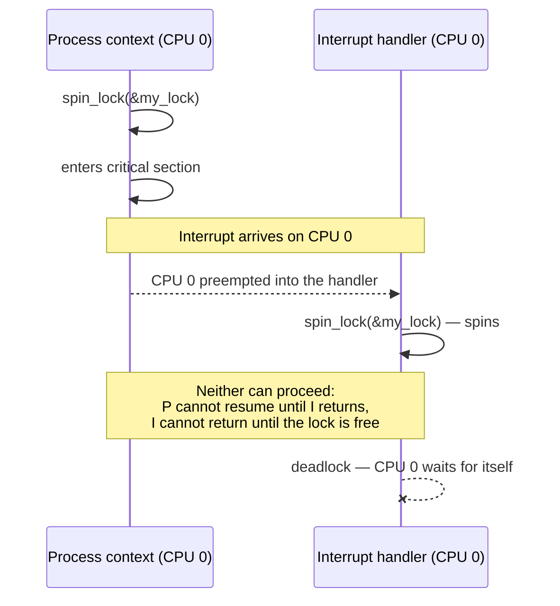

# Why Kernel Concurrency Is Different

Four independent sources of concurrency and the context matrix that determines every locking choice in the folder.

In a user-space program, concurrency means threads, and the answer is a mutex: block until the lock is
free, then proceed. That intuition does not survive contact with the kernel. Kernel code protecting a
data structure can be re-entered by another CPU running the same function on another core, by a
higher-priority task preempting this one on the same CPU, by a hardware interrupt landing in the middle
of the function on this CPU, and by a softirq running on interrupt return before this CPU gets back to
what it was doing. That is four independent sources of re-entrancy, not one — and in two of the four, the
code that runs may not sleep, which eliminates the mutex as an option before the design conversation even
starts. Locking in the kernel is not "pick a lock type"; it is "identify which of these four can happen
here, then pick the primitive that survives all of them."

## Four sources of concurrency

- **SMP.** Another CPU executes the same function at the same instant, on a genuinely different core, not
  merely an interleaved illusion. Two CPUs incrementing an unprotected counter with `counter++` can both
  read the same old value, both compute the same new value, and both write it back — one increment is
  lost. The fix is any lock or atomic operation that gives one CPU exclusive access: `spin_lock()`, an
  atomic type, or a lock-free algorithm built to tolerate the interleaving.
- **Preemption.** A higher-priority task preempts this one on the *same* CPU, mid-function, under
  `CONFIG_PREEMPT`. This looks like SMP corruption from the data structure's point of view — two logical
  executions touching the same memory — but the fix does not have to be a spinlock: `preempt_disable()`
  is enough to close the window, because the threat is a scheduling decision on this CPU, not a second
  CPU. Confusing the two leads to over-locking, taking a spinlock where disabling preemption alone would
  have been correct and cheaper.
- **Interrupts.** A hardware interrupt handler runs on this CPU, in the middle of whatever function was
  executing when the interrupt arrived, then returns to that exact point. If the interrupted code held a
  lock the handler also needs, the handler cannot proceed — this is the deadlock covered below, and it is
  the reason interrupt-safe locking exists as a distinct concern from ordinary SMP locking.
- **Softirqs and bottom halves.** Deferred work — network receive processing, timer expiry, block I/O
  completion — runs on interrupt return, still in atomic (non-sleeping) context, still on whatever CPU
  raised it. A data structure touched by both process context and a softirq needs `spin_lock_bh()`, which
  additionally disables softirqs on the local CPU, because a plain `spin_lock()` does not stop a softirq
  from running on the same CPU between two of the lock holder's own instructions.

## The context matrix

Every locking decision in this folder starts by placing the code in one row of this table. The columns
are the constraints that row imposes, verified against `Documentation/kernel-hacking/locking.rst` (the
in-tree "Unreliable Guide to Locking") and `include/linux/preempt.h` at the v6.18 tag.

| Context | May sleep? | May take a mutex? | May allocate `GFP_KERNEL`? | May be preempted? | What to use for locking |
|---|---|---|---|---|---|
| Process context | Yes | Yes | Yes | Yes, under `CONFIG_PREEMPT` (or at any voluntary preemption point) | `mutex_lock()`, or `spin_lock()`/`spin_lock_bh()`/`spin_lock_irqsave()` depending on what else touches the data |
| Softirq / tasklet / bottom-half context | No | No | No — use `GFP_ATOMIC` | No — softirqs run to completion on the CPU that raised them | `spin_lock()` between two softirqs; `spin_lock_bh()` if the same data is also touched from process context |
| Hard-IRQ (interrupt handler) context | No | No | No — use `GFP_ATOMIC` | No | `spin_lock_irqsave()`/`spin_unlock_irqrestore()` if the same data is touched from process context or another IRQ line; a plain `spin_lock()` is enough between one hardirq handler and softirqs it raises, since softirqs cannot run while this handler is still executing |
| NMI context | No | No | No | No | Only lock-free techniques (atomics, `READ_ONCE`/`WRITE_ONCE`) — even `spin_lock_irqsave()` is unsafe here, because an NMI can land while the very lock it wants is held by code that masked ordinary interrupts but cannot mask NMIs |

The pattern worth internalizing rather than memorizing cell by cell: every context except process context
forbids sleeping, forbids mutexes, and forbids `GFP_KERNEL` for the same underlying reason (see the next
section), and each context down the table is a strict subset of what the one above it permits — NMI
context is the most constrained context in the kernel, not merely "like an interrupt handler but worse."

## Why "may not sleep" is the hard constraint

Sleeping means calling `schedule()`, and `schedule()` means picking a different task to run and switching
to it. That only makes sense if there is a task to switch away from — something with its own kernel
stack, its own saved register state, and a place on a wait queue to be woken up from later. Process
context has exactly that: `current` is a real `task_struct`, and blocking it means marking it
`TASK_UNINTERRUPTIBLE` or `TASK_INTERRUPTIBLE`, putting it on a wait queue, and calling `schedule()` to
hand the CPU to something else until a wakeup puts it back on the runqueue.

Interrupt, softirq, and NMI context have no such task. A hardirq handler is not "the task that happens to
be running" — it borrows whatever task was interrupted, runs on top of its kernel stack (or a separate
per-CPU IRQ stack, depending on architecture and configuration), and has no independent identity to park
on a wait queue and resume later. Calling `schedule()` from that context does not block gracefully; there
is nothing coherent to block. This is why "you may not sleep in interrupt context" survives as a rule
even for engineers who have forgotten every context-matrix cell: the reason is structural, not a
policy choice the kernel could relax by fiat. Every downstream consequence in the matrix above — no
mutex, no `GFP_KERNEL`, no blocking I/O — is a restatement of the same fact: nothing to sleep *as*.

## `in_interrupt()` and friends

The kernel exposes helpers to ask "what context am I in right now" from `include/linux/preempt.h`, built
on the per-CPU `preempt_count` (see the closing facts card). At the v6.18 tag:

- `in_task()` — true in process context: `preempt_count()` has none of the NMI, hardirq, or softirq bits
  set. This is the modern, preferred way to ask "am I definitely in process context."
- `in_hardirq()` — true while a hardware interrupt handler is executing.
- `in_serving_softirq()` — true while a softirq handler specifically is running (narrower than "softirqs
  are merely disabled").
- `in_nmi()` — true in NMI context.
- `in_atomic()` — true whenever `preempt_count() != 0`, i.e. sleeping is currently forbidden for *any*
  reason — inside a spinlock, inside an interrupt, or inside an explicit `preempt_disable()` region, not
  only inside a literal hardirq.
- `in_irq()`, `in_softirq()`, and `in_interrupt()` still exist at v6.18 but are marked deprecated in the
  header itself — `in_irq()` is an older spelling of `in_hardirq()`, `in_softirq()` means "softirqs are
  disabled or a softirq is running" (a broader condition than `in_serving_softirq()`), and
  `in_interrupt()` means "NMI, hardirq, or softirq context, or BH disabled" — all still present for
  in-tree compatibility, none of them the macro to reach for in new code.

The honest caveat the kernel-hacking guide makes implicitly and is worth stating outright: code that
needs to *ask* what context it is in at runtime is often structured wrongly. The context a piece of code
runs in is normally a static property of how it is called — an interrupt handler, a softirq callback, a
syscall's process-context body — and should be handled by writing the correct primitive for that call
site, not by branching on `in_interrupt()` inside a function meant to be context-agnostic. These helpers
exist mainly for assertions (`WARN_ON(!in_task())` guarding a sleeping call) and for genuinely
dual-context code paths, not as the normal way to decide what lock to take.

## The interrupt deadlock

This is the concrete failure the context matrix exists to prevent, and it is *the* reason
`spin_lock_irqsave()` exists rather than a plain `spin_lock()` being sufficient everywhere:

1. Process context takes `spin_lock(&my_lock)` and enters the critical section.
2. A hardware interrupt arrives on the *same* CPU. Interrupts preempt process context unconditionally —
   the CPU does not consult whether a spinlock is held before delivering one.
3. The interrupt handler, still on the same CPU, tries to take `spin_lock(&my_lock)` — the same lock.
4. `spin_lock()` spins, waiting for the lock to become free. But the only code that can free it is the
   process-context path the interrupt itself preempted, and that path cannot resume until the interrupt
   handler finishes. The CPU is now waiting for itself, forever.

`spin_lock_irqsave()` closes this by disabling interrupt delivery on the local CPU for the duration of the
critical section — the interrupt in step 2 simply cannot arrive on this CPU until the lock is released,
so it either runs before the section starts or after it ends, never during. The `_irqsave` suffix saves
the prior interrupt-enabled state (rather than unconditionally enabling interrupts on unlock, which would
be wrong if interrupts were already disabled by an outer caller) and `spin_unlock_irqrestore()` restores
exactly that state. This only protects against interrupts on the *same* CPU; another CPU spinning on the
same lock in ordinary `spin_lock()` form is fine, because it is not waiting for itself, only for the first
CPU to finish — which it now can, uninterrupted.

*The deadlock that `spin_lock_irqsave()` exists to prevent: one CPU waiting for a lock only it can
release.*

## What PREEMPT_RT changes

`PREEMPT_RT` (see [Preemption Models](../07-scheduling/preemption-models.md)) rewrites nearly every cell
in the context matrix above by converting most `spinlock_t` uses into preemptible, priority-inheriting
mutexes under the hood and by running most interrupt handlers as threaded, schedulable kernel threads
rather than in true non-preemptible hardirq context. Under `PREEMPT_RT`, "I hold a spinlock" no longer
implies "I cannot sleep or be preempted" for most locks — it implies ordinary priority-based scheduling
with inheritance, and only a small, deliberately minimized set of raw spinlocks (`raw_spinlock_t`,
protecting things like the scheduler's own internals) keep the traditional non-preemptible, non-sleeping
semantics this page describes. Hard-IRQ context proper still cannot sleep even under `PREEMPT_RT` — what
changes is how much code actually runs there, because most of what used to run in hardirq context now
runs in a preemptible thread instead.

## What CS owns

The theory of mutual exclusion, race conditions, and deadlock in general — independent of any particular
kernel — is [Concurrency and Synchronization](../../computer-science/operating-systems/concurrency-and-synchronization.md).
This folder does not re-derive that theory; it owns Linux's specific primitives (spinlocks, mutexes,
RCU, per-CPU data, atomics) and the rules — the context matrix above chief among them — for choosing
between them.

<KernelFacts
  structure={[["preempt_count", "include/linux/preempt.h"]]}
  path="process context → spin_lock_irqsave() → interrupt masked locally → critical section → spin_unlock_irqrestore()"
  observe="grep -E 'CONFIG_PREEMPT|CONFIG_SMP|CONFIG_PROVE_LOCKING' /boot/config-$(uname -r)"
  trap="Locking correctly is not enough — you must also lock in a way your *context* permits. A mutex in an interrupt handler is not a slow choice, it is a bug that will hang the machine the first time it contends." />

## References

- [The Unreliable Guide to Locking](https://docs.kernel.org/kernel-hacking/locking.html) — the in-tree
  guide this page's context matrix and interrupt-deadlock scenario are checked against; the single best
  introduction to exactly this material.
- <Src file="include/linux/preempt.h" symbol="preempt_count" /> — the counter whose fields encode the
  current context, and therefore the machine-readable version of the matrix above.
- [Kernel locking documentation index](https://docs.kernel.org/locking/index.html) — the locking
  documentation index this folder cites repeatedly.
- [Concurrency and Synchronization](../../computer-science/operating-systems/concurrency-and-synchronization.md) —
  the general theory this page deliberately does not repeat.
