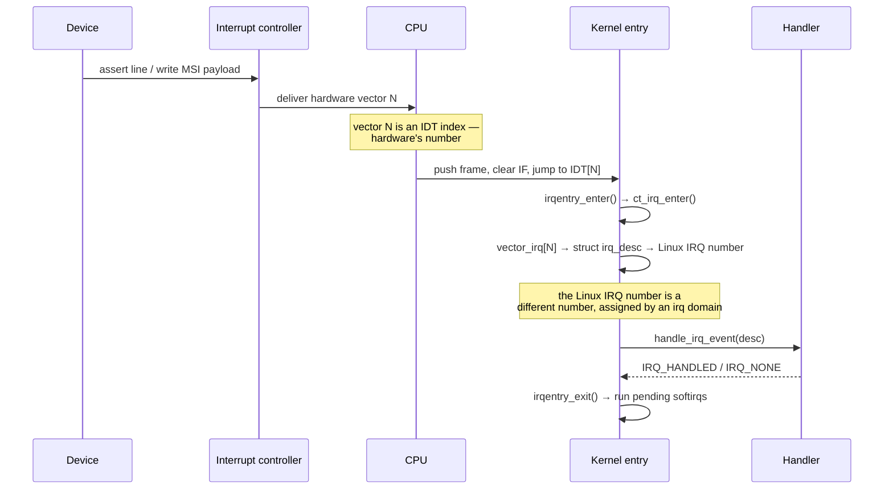

# How an Interrupt Reaches the Kernel

[The Entry Path](../05-syscalls-and-the-boundary/the-entry-path.md) told the syscall half of the entry
story: a process asks to enter the kernel, at an instant of its own choosing, from a stack it built
knowing that was coming. An interrupt is the other half, and it is the more unsettling one. Nothing
asked for it. A device on the far side of the machine changed state, an interrupt controller decided
which CPU should care, and that CPU takes the interrupt at whatever instruction boundary it happens to
be standing on — in the middle of a system call, in the middle of a context switch, in the middle of
another interrupt's handler on some architectures, or, most often, in the middle of an ordinary task
that has nothing whatsoever to do with the device that just fired.

That last detail is the one to hold onto: an interrupt handler runs *in the context of whatever task
was unlucky enough to be running*. It is not "the driver's turn to run" in any process sense — there is
no process for a device. It is a forced borrowing of the current task's stack and time, and every rule
in this folder — no sleeping in a hardirq handler, keep it short, defer the rest — falls directly out of
what it means to interrupt a stranger.

## The chain

One interrupt, from wire to handler, crosses several separately-owned pieces:

1. **The device** asserts a level or writes an edge onto the line it is wired to (or, for MSI, writes a
   payload to a memory address that the platform decodes as an interrupt request instead of a normal
   store).
2. **The interrupt controller** — an I/O APIC, an MSI mapping, or a GIC distributor, depending on
   architecture and connection type — decides which CPU should take it and which vector number to
   present. This routing decision, and the level-versus-edge distinction that shapes it, belongs to
   [Interrupt Controllers](../../computer-science/buses-and-io/interrupt-controllers.md); it is not
   repeated here.
3. **The CPU** takes the interrupt at the next instruction boundary where it is not masked, the same
   general mechanism [Exceptions, Traps, and Interrupts](../../computer-science/cpu-architecture/exceptions-traps-and-interrupts.md)
   describes for faults — see the next section for the interrupt-specific details.
4. **The vector table** (the IDT on x86-64) supplies the address of the kernel's entry stub for that
   vector.
5. **The entry stub** builds `pt_regs` and calls into the generic entry code, which calls
   `irqentry_enter()` before the handler runs and, on the way out, `irqentry_exit()` — see below.
6. **The handler** — `handle_irq_event()` and the driver's registered function — finally runs, and only
   at this point does anything resembling "the driver's code" execute.

Links 1 and 2 are owned by hardware and firmware/device-tree description; links 3 through 6 are what the
rest of this page is about.

*One interrupt from the wire to the handler, with the two different numbers it is known by on the way.*

## What the CPU does

On x86-64, taking a maskable interrupt is the same mechanical act as taking a fault: the CPU pushes
`SS`, the old `RSP`, `RFLAGS`, `CS`, and `RIP` onto a stack, switches to a new stack if the privilege
level is changing (ring 3 to ring 0 — the common case for a device interrupt arriving while a user
process runs), and clears `IF` in `RFLAGS` so that a second maskable interrupt cannot land on top of the
first before software has had a chance to set up state. Interrupts pushed no error code get one synthesized
by the entry stub for a uniform `pt_regs` shape; interrupts, unlike some faults, never carry a hardware
error code at all.

Three vectors cannot rely on "switch to the current task's kernel stack" the way an ordinary interrupt
does, because the thing that might be broken is the very state that decision depends on: **NMI**,
**double fault**, and **machine check**. Each of these instead switches to a small, fixed, per-CPU stack
named in the Interrupt Stack Table (IST) — a mechanism `SYSCALL`/ordinary interrupts do not use at all.
The reason is entry-code re-entrancy: if an NMI arrived in the middle of the ordinary entry stub, at the
exact instant after `swapgs` has run once but before the kernel's per-CPU state is fully trustworthy (see
[The Entry Path](../05-syscalls-and-the-boundary/the-entry-path.md#swapgs-and-finding-the-kernels-own-state)
for that window), an NMI handler that shared the interrupted stack could corrupt state the entry code
had not finished building, or that a double fault or machine check indicates is already corrupted.
Giving these three vectors their own always-valid stack, unconditionally, sidesteps the question of
whether the current stack can be trusted at all. `exc_double_fault()` is the canonical example: it runs
on an IST stack precisely because a double fault means the CPU already failed to deliver some other
exception, and the safest assumption is that nothing about the interrupted context, including its
stack, can be relied on.

## Vectors, and how Linux numbers them

Two numbers describe the same event, and they are not interchangeable:

- The **hardware vector** is the IDT index the interrupt controller told the CPU to use — an x86-64
  concept, one byte, chosen by whatever allocated that slot in the IDT (the kernel, at boot or at driver
  probe time for MSI/MSI-X).
- The **Linux IRQ number** is a software identifier assigned by an irq domain (see below) — it exists on
  every architecture Linux runs on, including ones with no concept of an IDT vector at all, and it is
  the number `/proc/interrupts`, `request_irq()`, and every driver actually deal in.

The entry stub's job, concretely, is to translate the first into the second: it reads the per-CPU
`vector_irq[]` array with the hardware vector as the index to find the `struct irq_desc` that carries
the Linux IRQ number, then dispatches through that descriptor. A driver never sees the hardware vector;
it only ever sees the Linux IRQ number it was handed by `request_irq()`. Conflating the two is a common
point of confusion precisely because both are called "the interrupt number" in casual conversation.

## `irqentry_enter()` and `ct_irq_enter()`

Being "in interrupt context" is not a fact the CPU records anywhere; it is a fact the kernel's own
bookkeeping constructs. On x86-64's actual device-interrupt path — `DEFINE_IDTENTRY_IRQ(common_interrupt)`
→ `call_irq_handler()` → `handle_irq()` → `generic_handle_irq_desc()` — that construction happens inside
`irqentry_enter()`/`irqentry_exit()` (`kernel/entry/common.c`), the wrapper every `DEFINE_IDTENTRY_IRQ`
site runs before and after the handler. `irqentry_enter()` calls `ct_irq_enter()`, the context-tracking
primitive that tells RCU this CPU is now definitely not in a quiescent state, so a grace period cannot
complete while a handler holds a reference read under `rcu_read_lock()` that started before the interrupt;
`irqentry_exit()` calls `ct_irq_exit()` to undo that on the way out. Alongside this, the hardirq bits of
`preempt_count` are added on entry and removed on exit — the entire mechanism behind `in_interrupt()`
returning true for the rest of the handler's run — and, if this is a `NOHZ_FULL` CPU or an idle CPU
waking up, the tick subsystem is poked as part of the same entry/exit bookkeeping. On exit — the detail
that connects this page to the rest of the folder — if nothing else has left the CPU still "in interrupt"
(no nested count remaining) and a softirq is pending, `invoke_softirq()` runs it right there, before the
interrupted context resumes. This is the hinge into [Softirqs](./softirqs.md): every softirq that runs
"right after the hardware handler" runs at exactly this point, on the way out of `irqentry_exit()`, not
asynchronously at some later scheduling opportunity.

A word of caution about names, because this area is an easy place to get the call chain wrong.
`irq_enter()`/`irq_exit()` (`kernel/softirq.c`) were never renamed away — they still exist today as their
own functions, doing much the same `preempt_count`/RCU/softirq bookkeeping described above, and they are
what `generic_handle_arch_irq()` (`kernel/irq/handle.c`) calls directly. That function is the generic entry
point used by architectures — arm64 among them — that route into the IRQ subsystem without an x86-style
idtentry mechanism of their own. `irq_enter_rcu()`/`irq_exit_rcu()` also exist in v6.18, but they are not
part of x86-64's `common_interrupt()` chain the way an older draft of this page claimed: the RCU-watching
duty on that path is done by `irqentry_enter()`'s call to `ct_irq_enter()`, not by a separate
`irq_enter_rcu()` call. Three different pairs of functions, doing overlapping bookkeeping for different
entry paths — conflating them is exactly the kind of mistake this page used to make.

## Whose stack, and whose time

On x86-64, the handler body itself does not run on the interrupted task's kernel stack — it runs on a
dedicated per-CPU IRQ stack (`irq_stack_backing_store`, mapped with a guard page under
`CONFIG_VMAP_STACK`), reached via `run_irq_on_irqstack_cond()` inside the `DEFINE_IDTENTRY_IRQ` wrapper.
This keeps a chain of nested interrupts, or an interrupt landing on a task whose own kernel stack is
already fairly full, from exhausting a stack that has other things depending on it.

The CPU time the handler consumes is accounted to `hi` (hardirq) in `/proc/stat`, not to whatever task
happened to be interrupted and not to any particular process at all. This is why a machine with a large,
growing `hi` figure in `top` is doing real, possibly expensive, work — but no process-level profiler,
including one that samples every task's stack, will ever show it: the time was never charged to a
process, because no process caused it and no process is entitled to see it blamed on someone else.
Finding out *which device* is driving a high `hi` figure means going to `/proc/interrupts` and watching
which line's count is climbing, not `perf top` or `ps`.

## Nesting, and why Linux does not

By default, taking an interrupt clears `IF`, and the entry path does not re-enable it before the handler
runs. That means a second maskable interrupt arriving while a handler is running simply waits — hardirq
handlers do not nest into each other on the running CPU. This was not always the guaranteed behaviour:
older kernels and older documentation describe interrupts being re-enabled during handler execution to
keep interrupt latency down, allowing a higher-priority interrupt to preempt a lower-priority one mid-
handler. Current Linux does not do this as routine policy — handlers are meant to be short specifically
so that a non-nesting model does not cost meaningful latency — but the non-maskable vectors (NMI, and by
construction anything using an IST stack) remain an exception: an NMI can and does interrupt a running
interrupt handler, which is exactly why NMI needs its own stack rather than trusting whatever the
interrupted handler left the current one in.

## arm64

:::note[Architecture: arm64]
arm64 has no 256-entry vector table indexed by an interrupt-controller-assigned number the way x86-64's
IDT is. Instead, the exception vector table has a small, fixed number of entries selected by *exception
category and origin* — synchronous exception, IRQ, FIQ, or SError, each further split by whether the
exception level and stack pointer changed — so all IRQs, regardless of which device or GIC input raised
them, land at the same one vector table entry. Once there, the handler reads the interrupt source itself
from the GIC's CPU interface acknowledge register (`ICC_IAR1_EL1` on GICv3), which both identifies which
interrupt fired and implicitly marks it active; finishing the handler requires writing the matching
end-of-interrupt register (`ICC_EOIR1_EL1`). x86-64's APIC has no equivalent split acknowledge/EOI
handshake tied to reading the interrupt identity in the same operation — this is a structural difference
in the controller protocol, not just a numbering convention.
:::

<KernelFacts
  structure={[["struct pt_regs", "arch/x86/include/asm/ptrace.h"], ["struct irq_desc", "include/linux/irqdesc.h"]]}
  path="device → APIC/GIC → IDT vector → common_interrupt() → irqentry_enter()/ct_irq_enter() → handle_irq_event() → handler → irqentry_exit()"
  observe="cat /proc/interrupts | head -20 && grep -E '^(intr|softirq)' /proc/stat"
  trap="An interrupt handler runs in the context of whatever task was unlucky enough to be on that CPU. Its CPU time is charged to `hi`, not to that task and not to the device's driver — which is why interrupt cost is invisible to every per-process profiler." />

## References

- <Src file="arch/x86/kernel/irq.c" symbol="common_interrupt" /> — the common entry point for external
  device interrupts, defined via `DEFINE_IDTENTRY_IRQ`.
- <Src file="arch/x86/include/asm/idtentry.h" symbol="DEFINE_IDTENTRY_IRQ" /> — the macro that wraps
  every IRQ vector's handler with `irqentry_enter()`/`irqentry_exit()` and the IRQ-stack switch.
- [*Core-api: Genirq*](https://docs.kernel.org/core-api/genericirq.html) — the generic IRQ layer this
  page is the hardware-facing half of; [The IRQ Subsystem](./the-irq-subsystem.md) covers the
  software structures on the other side of `handle_irq_event()`.
- [Interrupt Controllers](../../computer-science/buses-and-io/interrupt-controllers.md) — the routing
  decision and level/edge distinction this page hands off rather than repeats.
- Intel® 64 and IA-32 Architectures Software Developer's Manual, Vol. 3A, ch. 6 — interrupt and
  exception handling, including the IST mechanism.
