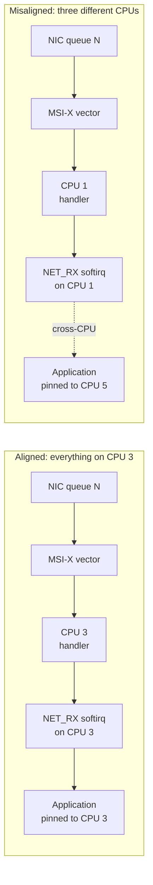

# Interrupt Affinity

`/proc/interrupts` read column by column, MSI-X vectors per queue, and why pinning an interrupt near its consumer matters.

An interrupt has to be taken by *some* CPU — the hardware routes it to one, whether or not anyone thought
about which one. Which CPU has real consequences downstream of the handler itself: the handler's own
cache footprint, the softirq the handler typically raises next ([Softirqs](./softirqs.md) covers that
handoff), and often the task that ultimately consumes whatever the interrupt delivered, all live
*somewhere* — and the closer those three are to each other, the cheaper the whole path is, in cache misses
avoided and cross-CPU traffic never generated. **Affinity** is how that placement is controlled, and the
kernel's and controller's defaults are frequently wrong for a high-rate device on a machine that is doing
one demanding thing, not many unrelated ones.

## What actually happens

Reading a real `/proc/interrupts` — captured in this sandbox, the same Hyper-V virtual machine [The IRQ
Subsystem](./the-irq-subsystem.md#what-actually-happens) already reads from. Stated as honestly there:
this VM has no NVMe controller and no multi-queue NIC, so the rows a bare-metal machine with either would
show are simply absent here — not fabricated to fill the gap:

```text
           CPU0       CPU1       CPU2       CPU3       CPU4       CPU5       CPU6       CPU7       CPU8       CPU9
  8:          0          0          0          0          0          0          0          0          0          0  IO-APIC   8-edge      rtc0
  9:          0          0          0          0          0          0          0          0          0          0  IO-APIC   9-fasteoi   acpi
 24:          0          1          0          0          0          0          0          0          0          0 HV-PCI-MSIX-5582:00:00.0   0-edge      virtio0-config
 25:          0          0       3718          0          0          0          0          0          0          0 HV-PCI-MSIX-5582:00:00.0   1-edge      virtio0-virtqueues
 26:          0          0          0          0          1          0          0          0          0          0 HV-PCI-MSIX-827f:00:00.0   0-edge      virtio1-config
 27:          0          0          0          0          0          1          0          0          0          0 HV-PCI-MSIX-827f:00:00.0   1-edge      virtio1-hiprio
 28:          0          0          0          0          0          0          0          0          0         10 HV-PCI-MSIX-827f:00:00.0   2-edge      virtio1-requests.0
RES:       6347       6213       6485       5719       5413       5993       6193       5022       6101       5473   Rescheduling interrupts
CAL:     109448      89581     103275      87796     105632      93312     100610     111362     101769     102441   Function call interrupts
```

Even this minimal virtio setup already demonstrates the pattern the brief's fuller machine would show more
dramatically. Line `28` — `virtio1-requests.0`, the block device's request queue — is a **queue-numbered
interrupt** (`.0` is the queue index) delivered over MSI-X, and its count (`10`) is concentrated
**entirely on CPU9** and nowhere else: this is one queue, one vector, one CPU, exactly the shape a
multi-queue device produces, just with a single queue instead of many. Line `25` shows the same pattern for
the general virtqueue interrupt, concentrated on CPU2. Compare that with lines `8` and `9` — the legacy
`IO-APIC` RTC and ACPI lines — which show zero counts everywhere in this idle capture but, when active on
real hardware, are delivered to whichever single CPU IO-APIC routing currently targets, not spread by
design the way MSI-X per-queue vectors are.

A real machine with an NVMe drive or a multi-queue NIC extends this same reading, with names this page can
cite precisely rather than invent, because the naming is fixed in driver source: the NVMe driver
(`drivers/nvme/host/pci.c`, `queue_request_irq()`, verified at v6.18) names each queue's interrupt
`nvme<ctrl>q<qid>` via `pci_request_irq(..., "nvme%dq%d", nr, nvmeq->qid)` — so a drive with eight I/O
queues shows eight rows, `nvme0q1` through `nvme0q8` (`q0` is the admin queue), each with its count
concentrated on a different CPU. A Mellanox mlx5-family NIC (`drivers/net/ethernet/mellanox/mlx5/core/pci_irq.c`)
names its per-ring completion vectors `mlx5_comp<N>`, one per receive/transmit ring pair, with the same
one-vector-per-queue, one-CPU-concentration shape. The reading skill transfers directly from what this
sandbox's single virtio queue already shows: **one row per hardware queue, MSI-X delivering each to a
distinct CPU, and a count column that is near-zero everywhere except that one CPU** is what "spread
correctly" looks like. A device that instead shows one row total, with a count piling up entirely on CPU0
regardless of how many queues the hardware actually has, is not using MSI-X per-queue delivery at all —
either the driver hasn't enabled it, `irqbalance` has never touched it, or (rarer today) the hardware only
ever had one legacy shared line to begin with. `RES` and `CAL` at the bottom of every capture are
architecture-level IPI counters, not tied to any device — [The IRQ
Subsystem](./the-irq-subsystem.md#what-actually-happens) covers them, unchanged here.

## `smp_affinity` and `smp_affinity_hint`

Each Linux IRQ number has its own directory under `/proc/irq/<N>/`. The two files that matter for
placement:

- **`smp_affinity`** (a hex bitmask) / **`smp_affinity_list`** (a CPU list, easier to read and write) — the
  mask of CPUs this interrupt is *permitted* to be delivered to. Reading one, from this sandbox:

  ```text
  $ cat /proc/irq/24/smp_affinity_list
  0-9
  ```

  All ten CPUs are currently permitted for IRQ 24 — the mask has not been narrowed. Writing a narrower
  list changes the permitted set:

  ```text
  # echo 3 > /proc/irq/24/smp_affinity_list
  ```

  restricts delivery to CPUs 2 and 3 only (a request, subject to what the controller can actually honor —
  see the lab below for what happens when it cannot).

- **`effective_affinity`** / **`effective_affinity_list`** — what the controller is *actually* using right
  now, which can be narrower than the requested mask. Some controllers, or some interrupt types under
  certain configurations, can only ever deliver to **one CPU at a time** regardless of how wide a mask is
  requested; for those, the effective mask collapses to a single CPU even if `smp_affinity` names several.
  From this sandbox:

  ```text
  $ cat /proc/irq/25/effective_affinity_list
  2
  ```

  matching exactly where line `25`'s counts landed in the capture above — the effective mask is where the
  interrupt is actually going, and is the file to trust when the two disagree.

- **`affinity_hint`** — set by the *driver*, not the administrator, as a suggestion for where the device
  would prefer its interrupts to land (a NIC driver commonly sets one hint per queue, matching its own
  internal notion of which CPU each queue's data belongs to). `irqbalance` reads hints and, by default,
  tends to honor them rather than overriding a driver's own placement judgment — the mechanism the next
  section covers.

## `irqbalance`

`irqbalance` is a user-space daemon that periodically redistributes interrupts across CPUs based on
measured load and topology (NUMA node, cache-sharing groups), rather than leaving every interrupt wherever
the controller happened to route it at boot. It is genuinely the right default for a **general-purpose
machine running a mix of devices and workloads nobody has hand-tuned** — it keeps one CPU from silently
absorbing every interrupt on the system while the other cores sit idle, without requiring an administrator
to reason about placement at all.

It is the wrong thing to leave running on **a tuned, latency-sensitive or throughput-sensitive machine**
where placements have been chosen deliberately — a dedicated packet-processing box, a database server with
its storage and network interrupts pinned to specific cores away from the CPUs running the database itself,
or any `nohz_full`/isolated-CPU setup (see "When pinning hurts" below). On such a machine, `irqbalance`
actively undoes the tuning: its whole job is to keep moving interrupts in response to load, which is
precisely what a deliberate, static placement does not want. `systemctl stop irqbalance` (and disabling it
so it doesn't restart on the next boot) is the standard way to get it out of the way before hand-tuning
affinity; the affinity lab below demonstrates exactly why skipping that step defeats a manual change.

`irqbalance` was not present to test in this sandbox (`which irqbalance` — not found, not installed), which
the lab below notes rather than fabricating a run against it.

## Multi-queue devices

One MSI-X vector per hardware queue is the design that makes a modern NIC or NVMe drive scale in the first
place: instead of one interrupt line shared across every queue's completions (forcing every CPU interested
in any queue's data to either poll or contend on a shared line), each queue gets its **own** interrupt, and
that interrupt can be routed to whichever CPU is supposed to consume that queue's data. The whole path —
device queue → its own MSI-X vector → the CPU handling that vector → the softirq that vector raises → the
task ultimately consuming the data — can be kept on **one core**, for one queue, independent of every other
queue's path doing the same for a different core. [NUMA and Memory
Policy](../08-memory-management/numa-and-memory-policy.md) and [NUMA and Memory
Topology](../../computer-science/memory-hierarchy/numa-and-memory-topology.md) cover the memory side of the
identical argument: a CPU accessing memory on its own NUMA node is cheaper than one reaching across an
interconnect, and interrupt affinity is the mechanism that decides, per queue, which node's memory a
completion handler ends up touching.

## The alignment argument

The practical rule this all cashes out to: **interrupt, softirq, and the consuming application on the same
CPU — or failing that, the same LLC, or failing that, the same NUMA node — beats any other arrangement for
throughput.** Every hop the data takes between CPUs on the way from "interrupt fired" to "application read
the data" is a cache line that has to travel, and on a busy system that cost is paid per packet, per
completion, continuously. This is exactly why network performance tuning material talks about **RSS**
(hardware spreading flows across queues), **RPS** (software-level spreading when RSS isn't enough or isn't
available), and **IRQ pinning** in the same breath — they are three layers of the same one alignment
argument, applied at the hardware queue level, the software steering level, and the interrupt-placement
level respectively. The network-specific mechanics of RSS/RPS belong to folder 13's networking material
(not yet written, named here in prose only); this page owns the interrupt-placement layer of that argument.

## When pinning hurts

Pinning is not free either, and gets it wrong in two opposite ways:

- **A pinned interrupt sharing a CPU that also runs the consuming application** competes directly with that
  application for the CPU — every interrupt is, from the application's point of view, an involuntary
  preemption. For a latency-sensitive application this can be worse than an unpinned interrupt that at
  least sometimes lands elsewhere.
- **A pinned interrupt on a CPU that has been isolated** (`nohz_full`, `isolcpus`, or similar) **defeats the
  isolation** outright — the entire point of an isolated CPU is that nothing involuntary interrupts the
  task running there, and a stray interrupt pinned onto it is exactly the involuntary interruption isolation
  exists to prevent.

The check in both cases is the same: **measure, do not assume.** `/proc/interrupts` deltas over a load
window, and the consuming application's own latency or throughput numbers before and after a pinning
change, say whether a given placement actually helped — intuition about "closer must be better" is not a
substitute for the measurement, since the two failure modes above are both intuitively plausible
"improvements" that make things worse in practice.

<Lab host="root-required" title="Move an interrupt and watch it move" time="20 min">

**Not executed for this page.** This sandbox has no root access — `sudo` requires interactive
authentication that isn't available here (`sudo -n true` fails with "sudo: interactive authentication
required") — and separately has neither a busy multi-queue NIC nor an NVMe drive to generate the kind of
per-queue load this lab is designed around (confirmed above: `/proc/interrupts` here shows only the
virtio lines already read). Writing to `/proc/irq/*/smp_affinity_list` and stopping a system service both
need root, so neither is something this sandbox can do regardless of the missing hardware. Per this
project's established practice, no output has been invented to stand in for a run that didn't happen. What
follows is the lab as designed against real kernel interfaces, verified above against v6.18 source (the
`-EPERM` behavior in particular — see the warning below), not a transcript.

1. **Identify a busy IRQ** from `/proc/interrupts` under load — a NIC queue while running `iperf3`, or an
   NVMe queue while running `fio` against the drive. The queue actually receiving traffic is the one whose
   count is visibly climbing between two `cat /proc/interrupts` captures a few seconds apart; that row's
   leftmost column is the IRQ number to target.
2. **Read its current placement**: `cat /proc/irq/<N>/smp_affinity_list` and
   `cat /proc/irq/<N>/effective_affinity_list` — the first is what's permitted, the second is what's
   actually happening, and per the "`smp_affinity` and `smp_affinity_hint`" section above they can differ.
3. **Generate load and watch the per-CPU counts** in `/proc/interrupts` — confirm which CPU(s) are
   currently absorbing this IRQ's interrupts, matching the effective-affinity read from step 2.
4. **Write a different CPU** to `smp_affinity_list` (a single CPU not currently in the effective mask, and
   not the CPU generating the load, to see the move cleanly) and re-run the load, watching the counts move
   to the new CPU.
5. **Stop `irqbalance` first**, and repeat the same write with it left running, to observe the daemon
   revert the change — `irqbalance`'s whole purpose (see above) is to keep moving interrupts by its own
   load-based judgment, which includes moving one an administrator just pinned by hand.

**⚠️ Warning:** moving an interrupt away from every CPU that can service it, or writing a mask the
controller cannot honor, produces a write error or a silently-ignored change — not hardware damage; but
stopping `irqbalance` on a machine other people depend on changes its interrupt-distribution behavior
until it is restarted, which is a real operational effect even though the affinity write itself is safe.

**If it fails:** some interrupts are **managed** — a multi-queue device's per-queue vectors, allocated and
placed by the kernel's own blk-mq/net-mq machinery rather than left to userspace to choose — and refuse
affinity changes from `/proc/irq`. Verified directly against v6.18 source
(`kernel/irq/proc.c`, `write_irq_affinity()`): the write path calls `irq_can_set_affinity_usr()`
(`kernel/irq/manage.c`) first, which for a managed interrupt (`irqd_affinity_is_managed()` true) returns
`false` before ever reaching `irq_set_affinity()` — the write returns **`-EPERM`** ("Operation not
permitted"), not `-EIO`. That correction matters if a lab guide or a script checks the errno specifically:
the kernel is refusing the write on purpose, by design, for exactly the reason [Multi-queue
devices](#multi-queue-devices) above describes — the kernel's own queue-to-CPU placement is the thing
making the device scale, and a blind userspace override would be as likely to break that placement as
improve it — not a bug to work around.

</Lab>



*Left: interrupt, softirq, and application share one CPU — no cross-CPU cache traffic anywhere on the path.
Right: the same path with three different CPUs involved, each arrow a potential cache-line bounce.*

<KernelFacts
  structure={[["struct irq_desc", "include/linux/irqdesc.h"], ["struct irq_affinity_desc", "include/linux/interrupt.h"]]}
  path="write /proc/irq/N/smp_affinity → irq_set_affinity() → irq_do_set_affinity() → chip->irq_set_affinity() → controller routing updated"
  observe="cat /proc/interrupts && cat /proc/irq/*/smp_affinity_list | head"
  trap="Interrupts spread across every CPU is not the goal. The goal is that the interrupt, the softirq it raises, and the task that consumes the data are on the same CPU — spreading them evenly is what `irqbalance` does when nothing has told it what the workload actually is." />

## References

- [*Core-api: IRQ affinity*](https://docs.kernel.org/core-api/irq/irq-affinity.html) — the `/proc/irq`
  interface and the `smp_affinity`/`smp_affinity_hint` semantics this page reads from.
- `man 5 proc`, the `/proc/interrupts` section — the column definitions this page's "What actually happens"
  reading relies on.
- <Src file="kernel/irq/proc.c" symbol="write_irq_affinity" /> — the `/proc/irq/N/smp_affinity` write path,
  and where the managed-interrupt `-EPERM` this page verifies is actually returned.
- [Irqbalance](https://github.com/Irqbalance/irqbalance) — the daemon's own source and documentation,
  including the policy it uses and the environment variables that ban specific CPUs from its
  redistribution.
- Red Hat, [*Optimizing Red Hat Enterprise Linux Performance by Tuning IRQ
  Affinity*](https://access.redhat.com/articles/216733) — a clear, RHEL-specific published statement of the
  interrupt/softirq/application alignment argument this page makes generally; its specific tool paths and
  package names are RHEL-family assumptions, not universal across distributions.
