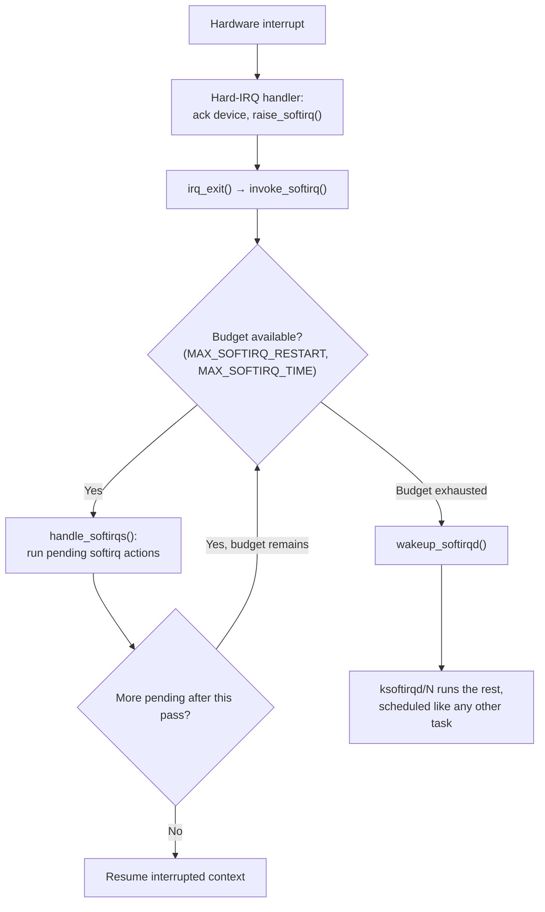

# Softirqs

The fixed set, why it is fixed, the budget that stops it starving everything else, and the `si` column in `top`.

[Hard IRQ Context](./hardirq-context.md) ended on a tension: a handler must be short, but the work it
started still has to happen, and much of it — processing a received packet, completing a block I/O —
cannot wait for a scheduler decision to come around. A softirq is the compromise. It is work that runs
with interrupts enabled again, on the same CPU that raised it, almost immediately after the hardware
handler returns — still atomic, still unable to sleep, but no longer blocking every other device on that
CPU the way the hard-IRQ handler that raised it did.

## A fixed set, and why

There are exactly ten softirq types, defined as a compile-time enum in `include/linux/interrupt.h` and
verified here at the v6.18 tag:

```c
enum {
    HI_SOFTIRQ = 0,
    TIMER_SOFTIRQ,
    NET_TX_SOFTIRQ,
    NET_RX_SOFTIRQ,
    BLOCK_SOFTIRQ,
    IRQ_POLL_SOFTIRQ,
    TASKLET_SOFTIRQ,
    SCHED_SOFTIRQ,
    HRTIMER_SOFTIRQ,
    RCU_SOFTIRQ,    /* Preferable RCU should always be the last softirq */
    NR_SOFTIRQS
};
```

`HI` and `TASKLET` are what [tasklets](./tasklets-and-their-replacement.md) run on; `TIMER` and
`HRTIMER` drive timer expiry; `NET_TX`/`NET_RX` drive network transmit/receive processing (NAPI polling
lives here); `BLOCK` and `IRQ_POLL` drive block I/O completion and polling; `SCHED` runs scheduler
housekeeping (load-balancing IPIs land here); `RCU` runs RCU callback processing and is deliberately kept
last in the enum so it is the last thing serviced in a pass.

This is a fixed set, not an extensible registration interface, and the two reasons are structural rather
than historical accident: dispatch is a bitmask scan over `NR_SOFTIRQS` bits (`local_softirq_pending()`),
which only stays cheap because the number of bits is small and known at compile time; and the kernel
deliberately does not want subsystems adding more of them. The comment directly above the tasklet
declaration in `include/linux/interrupt.h` says this outright: *"avoid to allocate new softirqs... for
almost all the purposes tasklets are more than enough"* — softirqs are a scarce, privileged resource
reserved for a handful of subsystems that genuinely need same-CPU, run-immediately semantics, and
everyone else is pointed at tasklets (historically) or, today, workqueues and threaded IRQs. The fixed set
is a policy decision, not a limitation nobody got around to lifting.

## Raising and running

`raise_softirq(nr)` sets bit `nr` in a per-CPU pending mask (`local_softirq_pending()`); it does not run
anything itself. That mask is checked at the end of hard-IRQ handling — `irq_exit()` →
`invoke_softirq()` — and, on the ordinary (non-`PREEMPT_RT`) path, run right there via `__do_softirq()`
unless `force_irqthreads()` says handlers are forced into threads, in which case `ksoftirqd` is woken
instead.

The important detail the next page turns on: a softirq raised by a handler running on CPU *N* is
processed by `local_softirq_pending()` on CPU *N*, so it **usually runs on the same CPU that raised it** —
per-CPU data touched only by a handler and the softirq it raises needs no lock between the two, since
nothing else can be executing on that CPU at the same instant. But "usually the same CPU" is not "only one
CPU at a time": nothing stops `NET_RX_SOFTIRQ` from raising and running independently, and genuinely
concurrently, on every CPU that has packets to process. **The same softirq type can run on multiple CPUs
simultaneously.** That is the property a tasklet is built on top of a softirq specifically to remove — see
[Tasklets](./tasklets-and-their-replacement.md).

## The budget

`handle_softirqs()` (`kernel/softirq.c`) is the run loop, and it is bounded on purpose: it processes all
currently-pending softirq bits, then re-checks the pending mask and loops again if there is more, but only
up to `MAX_SOFTIRQ_RESTART` (10) restarts, or until `MAX_SOFTIRQ_TIME` (`msecs_to_jiffies(2)`, i.e. 2ms)
has elapsed, or until `need_resched()` is set — whichever comes first. The in-tree comment states the
trade-off directly: *"we cannot loop indefinitely here to avoid userspace starvation, but we also don't
want to introduce a worst case 1/HZ latency to the pending events, so lets the scheduler to balance the
softirq load for us."* If the budget runs out with softirqs still pending, `wakeup_softirqd()` hands the
remainder to a kernel thread instead of continuing to loop on the interrupt-exit path. Neither
`MAX_SOFTIRQ_TIME` nor `MAX_SOFTIRQ_RESTART` is exposed as a runtime tunable at v6.18 — both are `#define`
constants in `kernel/softirq.c`, described in the source as values "established via experimentation," not
knobs meant for administrators to adjust.

## `ksoftirqd`

`ksoftirqd` is a per-CPU kernel thread (`ksoftirqd/N`), one per online CPU, created and managed through the
generic `smp_hotplug_thread` infrastructure. It is scheduled exactly like any other task — with a normal
priority, subject to the same scheduler as user processes — and that is the entire point of its existence.
Once work overflows onto `ksoftirqd`, it is no longer invisible, unaccountable time stolen from whatever
the interrupt-exit path preempted; it is a task the scheduler can see, measure, and run alongside
everything else, instead of a CPU spinning through an unbounded softirq loop while every ordinary process
on that CPU starves.

Seeing `ksoftirqd/N` at the top of `top` is not, by itself, evidence that anything is broken. It means "CPU
*N* is receiving more deferred softirq work than the interrupt-exit path's budget can absorb in one pass" —
a statement about *load*, not about a bug in the softirq mechanism. The fix, when one is needed, is
upstream of `ksoftirqd`: reduce the interrupt rate reaching that CPU (IRQ affinity, RSS/multi-queue
spreading — [Interrupt Affinity and Balancing](./interrupt-affinity-and-balancing.md)), reduce the work per
packet or per completion, or accept that the CPU is legitimately saturated with real work.

## What actually happens

The honest version of this section, captured in this sandbox rather than invented: this environment is a
WSL2 virtual machine with no root access and neither `iperf3` nor a flood-capable `ping` available (`ping
-f` requires `CAP_NET_RAW`-equivalent privilege this sandbox's user does not have), so a saturating,
sustained network load of the kind that drives `si` to double digits was not achievable here. What follows
is a real capture of a real, if modest, network download — not a fabricated "under load" number dressed up
to look bigger than it was.

`/proc/softirqs`, before and after roughly 6 seconds of downloading a ~29 MB file over this VM's
virtualized NIC:

```text
# before
NET_RX:       3548       1427       1218       4096       5353       2761       3396       9962       1887        632
# after (same CPU columns, same order)
NET_RX:       3567       1436       1227       4123       7219       2781       3413      11809       1900        632
```

Two CPUs did essentially all of the receive-side softirq work for this download: CPU4's `NET_RX` count rose
by 1,866 and CPU7's rose by 1,847, while the other eight CPUs moved by single or low double digits — this
VM's virtio-net queue affinity is landing receive interrupts, and therefore the softirqs they raise, on
just those two CPUs. `top -bn1` sampled mid-download, both aggregate and per-CPU, read `0.0` in the `si`
column on every CPU. That is a real, disclosed limitation, not a rounding error hidden on purpose: 1,800-ish
softirq invocations spread across 6 seconds and 10 CPUs, each invocation doing a small amount of packet
processing on a virtualized link, is not enough aggregate CPU-time to move a 1-decimal percentage in a
1-second sample window. `/proc/softirqs` is the counter that caught the real work; `top`'s `si` needs
either a higher packet rate, a longer sample, or fewer CPUs sharing it to register visibly, and this
sandbox could not produce the first of those.

The chain behind these numbers, walked once: packets arrive on the virtual NIC, the device raises a
hardware interrupt, the driver's hard-IRQ handler schedules NAPI polling and returns immediately (staying
inside the rules [Hard IRQ Context](./hardirq-context.md) sets out), the poll itself runs in `NET_RX`
softirq context and processes a batch of packets, the softirq budget above is what eventually exhausts and
either lets the loop restart or hands the rest to `ksoftirqd`. The reader's takeaway should be that `si` —
where it *does* register — is packet (or completion) processing, not a mysterious tax the kernel charges
for existing; the number to correlate a rising `si` with is the interrupt rate and packet rate on
`/proc/interrupts` and `/proc/net/dev`, not a separate investigation of "why is `si` high."

## The rules still apply

A softirq may not sleep, exactly as a hard-IRQ handler may not — this is the same prohibition, not two
different ones that happen to look similar. But the *reason* running through it is different in an
important way: hard-IRQ context cannot sleep because there is no task; softirq context cannot sleep because
it runs with `SOFTIRQ_OFFSET` added to `preempt_count()`, which marks it atomic regardless of whether a
"task" in some loose sense exists underneath it. [Why Kernel Concurrency Is
Different](../09-concurrency-and-locking/why-kernel-concurrency-is-different.md#the-context-matrix)'s
"Softirq / tasklet / bottom-half context" row is this page's row in that matrix: no sleep, no mutex, no
`GFP_KERNEL`, and — the detail specific to this context, not shared with hard-IRQ — no preemption either,
because a softirq runs to completion on the CPU that raised it once it starts. `spin_lock()` is enough
between two softirqs (neither preempts the other on the same CPU); `spin_lock_bh()` is what a piece of
process-context code needs if it touches the same data, because a plain `spin_lock()` does not stop a
softirq from running on the same CPU between two of the lock holder's own instructions.

## `local_bh_disable`

`local_bh_disable()`/`local_bh_enable()` is how process-context code excludes softirqs on its own CPU
without disabling hardware interrupts — it raises `SOFTIRQ_OFFSET` in `preempt_count()`, which makes
`in_softirq()` true and keeps a softirq from running on this CPU until the matching enable, but leaves
actual interrupt delivery alone. `spin_lock_bh()`/`spin_unlock_bh()` exist as the combined primitive
because "protect this data against both process context and a softirq on the same CPU" is common enough to
deserve one call instead of `local_bh_disable()` plus `spin_lock()` written out separately every time —
and, being one call, it cannot be gotten backwards the way two separate calls occasionally are.

## Misconceptions

- **"Softirqs are threads."** They usually are not. A softirq normally runs on the interrupt-exit path,
  inline, as part of `irq_exit()`/`invoke_softirq()` — no thread, no scheduling decision, nothing `ps`
  will ever show as "running." Only when [the budget](#the-budget) is exceeded does the remainder move to
  `ksoftirqd`, a real, schedulable thread. Most softirq execution, most of the time, is not that thread at
  all.
- **"High `si` means a kernel problem."** It usually means a high rate of packets or I/O completions,
  which is exactly what [What actually happens](#what-actually-happens) above walks through. `si` climbing
  under a genuine traffic spike is the softirq mechanism doing its job, not evidence the job is broken.
- **"A softirq runs on one CPU at a time."** False, and the misconception a [tasklet](./tasklets-and-their-replacement.md)
  exists to fix: the *same* softirq type — `NET_RX_SOFTIRQ`, for instance — can be raised and run on
  several CPUs at once, each processing its own CPU's packets independently. That is exactly why softirq
  handlers need locking around any data they share across CPUs, and exactly the property a tasklet's
  cross-CPU serialisation guarantee removes for code built on top of it.



*Where deferred work runs: on the interrupt-exit path until the budget runs out, then in a schedulable
thread.*

<KernelFacts
  structure={[["struct softirq_action", "include/linux/interrupt.h"]]}
  path="raise_softirq() → per-CPU pending mask → irq_exit() → invoke_softirq() → __do_softirq() → handle_softirqs() → the action, or wakeup_softirqd() if the budget runs out"
  observe="cat /proc/softirqs && top -bn1 | head -5"
  trap="`ksoftirqd` at the top of `top` is a symptom, not a cause. It means this CPU received more softirq work than it could process on the interrupt-exit path — the fix is upstream of it, in the interrupt rate or the work per packet." />

## References

- <Src file="kernel/softirq.c" symbol="handle_softirqs" /> — the run loop, the budget
  (`MAX_SOFTIRQ_TIME`/`MAX_SOFTIRQ_RESTART`), and the `wakeup_softirqd()` handoff, all in one function.
  `__do_softirq()` still exists at v6.18 too — it is now a thin wrapper, `handle_softirqs(false)` — so
  both names are correct to cite depending on which layer is being discussed; `handle_softirqs` is the one
  that actually contains the loop and the budget.
- [*Core-api: Genirq*](https://docs.kernel.org/core-api/genericirq.html) — the generic IRQ layer whose
  interrupt-exit path this page's dispatch hooks into.
- `man 5 proc`, the `/proc/softirqs` section — the per-CPU, per-type counters read in [What actually
  happens](#what-actually-happens) above.
- [*Software interrupts and realtime*](https://lwn.net/Articles/520076/), Jonathan Corbet, LWN.net,
  October 17, 2012 — coverage of `PREEMPT_RT`'s rework of softirq handling and Thomas Gleixner's
  aspiration to get rid of the global "softirqs disabled" flag entirely. By v6.18 that aspiration is
  substantially realized on `PREEMPT_RT` kernels specifically: `kernel/softirq.c` carries a distinct
  `CONFIG_PREEMPT_RT` implementation built on a per-CPU local lock (`softirq_ctrl`) rather than the single
  global disable count the non-RT path still uses, letting RT selectively serialize softirq execution
  instead of blanket-disabling all of them — the mechanism the article describes as still aspirational in
  2012. The non-`PREEMPT_RT`, mainline-default path this page otherwise describes is unchanged in kind.
