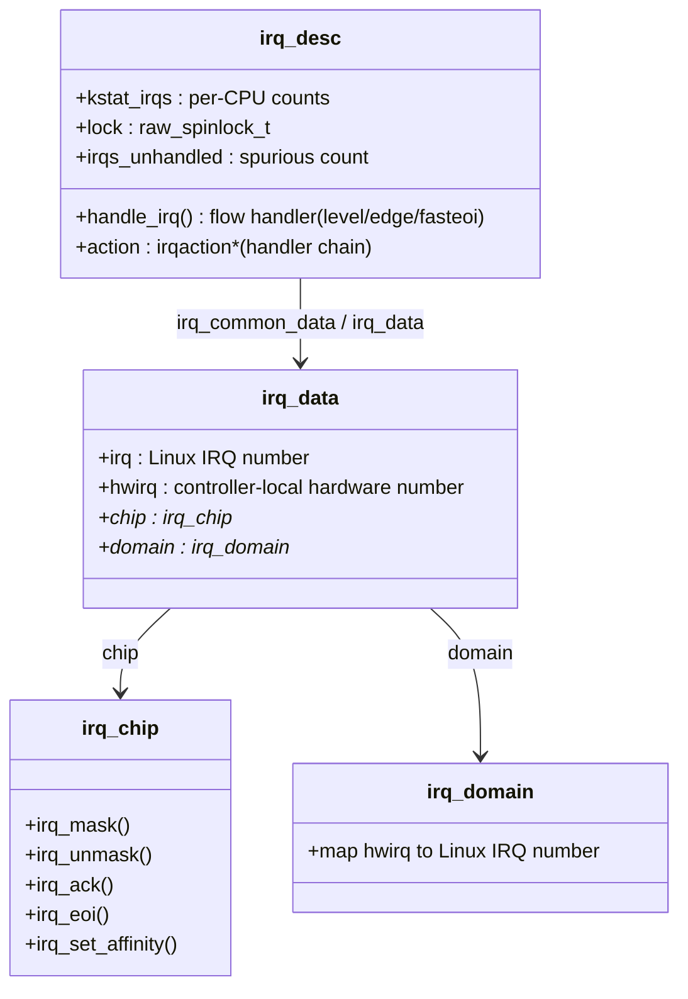

# The IRQ Subsystem

[How an Interrupt Reaches the Kernel](./how-an-interrupt-reaches-the-kernel.md) ended at
`handle_irq_event()` — the point where a hardware vector has already become a Linux IRQ number and a
generic entry stub is about to hand off to something driver-specific. What sits between that handoff and
the driver's own function is the generic IRQ layer, and it exists to solve one abstraction problem: a
driver wants to say "call me when my device needs attention," and the machine underneath might present
that need as an x86 I/O APIC line, an MSI-X message, or a two-level arm64 GIC hierarchy with an
SoC-specific combiner in front of it. `request_irq()` has to mean the same thing regardless of which of
those is actually there, and every structure in this page is shaped by that requirement.

## `irq_desc`

One `struct irq_desc` exists per Linux IRQ number, and it is the object that ties everything else
together: the chip that controls the hardware line, the flow handler that sequences mask/ack/unmask for
that chip, the list of registered handlers (the "action chain"), per-CPU interrupt statistics, and the
lock that serializes all of it against concurrent `request_irq()`/`free_irq()`/interrupt delivery. Every
lookup that begins with a Linux IRQ number — `/proc/interrupts` iterating them, `request_irq()`
attaching to one, the entry stub dispatching into one — ends at this struct.



*One `irq_desc` per Linux IRQ number: the flow handler and action chain live here, the hardware
translation lives one level down in `irq_data`, `irq_chip`, and `irq_domain`.*

## `irq_chip`

`irq_chip` is the vtable that makes an I/O APIC and a GIC interchangeable to every layer above it. Its
members name, almost completely, what a controller must be able to do: `irq_mask` and `irq_unmask` stop
and resume delivery of one line; `irq_ack` tells edge-triggered hardware "I've seen this transition";
`irq_eoi` tells the controller "I'm done, you may deliver this line's next occurrence" — the operation
level-triggered and fasteoi hardware needs instead of (or alongside) acking; and `irq_set_affinity`
moves which CPU a line's future interrupts are routed to. A working `irq_chip` for a brand-new piece of
interrupt hardware is, in essence, an implementation of these five callbacks; everything generic IRQ
code above `irq_chip` is written against this interface and does not care what is on the other side of
it.

## Flow handlers

The flow handler is what actually sequences a chip's callbacks around the driver's function, and which
one a line uses depends on how the hardware signals it, not on driver preference:

- **`handle_level_irq`** — mask-and-ack first (`mask_ack_irq()`), then run the action chain via
  `handle_irq_event()`, then conditionally unmask. Level-triggered hardware keeps the line asserted for
  as long as the condition holds, so acking without also masking would let the still-asserted line
  refire the moment the CPU re-enables interrupts, before the driver has had a chance to make the device
  deassert it — hence mask *before* the handler runs, not after.
- **`handle_edge_irq`** — ack immediately (there is no level to keep masked), then loop running the
  action chain, re-checking an `IRQS_PENDING` flag set by a second edge that arrived while the first was
  still being handled, since an edge that occurs while masked leaves nothing behind for the hardware to
  re-present later.
- **`handle_fasteoi_irq`** — used by controllers (APIC, GIC) whose "I'm done" signal is an explicit EOI
  write rather than an ack tied to the mask state; it optionally masks only for oneshot threaded
  handlers, runs the action chain, then issues the EOI and conditionally unmasks.

The level-versus-edge distinction driving the first two is the same one
[Interrupt Controllers](../../computer-science/buses-and-io/interrupt-controllers.md) covers in more
hardware detail — mask-then-ack exists specifically to survive a level source that has not yet been
told to stop asserting.

## irq domains

An `irq_domain` maps a controller-local hardware number (`hwirq`) to a Linux IRQ number, and it exists
because there is no single global numbering scheme once controllers nest: a GIC distributor input, an
SoC-specific interrupt combiner sitting in front of it, and a GPIO controller further downstream can each
only describe an interrupt in terms of *their own* local numbering — "SPI 42 on this GIC," "input 3 on
this combiner." Device tree and ACPI describe interrupts exactly that way, relative to whichever
controller a device is wired to, and the domain is the object that turns "controller X, hwirq Y" into a
single flat Linux IRQ number that `request_irq()`, `irq_desc`, and `/proc/interrupts` all deal in.

The concrete, easy-to-miss consequence: the number that shows up in the left column of
`/proc/interrupts` is *allocated at probe time*, not fixed by the hardware. It can differ from one boot
to the next, depending on driver probe order — code (and people) should never assume IRQ 42 means the
same device across two machines, or even across two boots of the same machine.

## `request_irq` and its flags

| Flag | What it does | When a driver needs it |
|---|---|---|
| `IRQF_SHARED` | Allows more than one handler to register on the same line | Legacy shared PCI interrupt lines where several devices route to one line; requires a non-NULL `dev_id` so each handler can be told apart on removal |
| `IRQF_ONESHOT` | Keeps the line masked until the threaded handler finishes, not just until the primary handler returns | Any threaded handler for a level-triggered line, so the line cannot refire (and re-trigger the primary handler again) while the thread is still running |
| `IRQF_NO_THREAD` | Exempts this handler from forced-threading (the mechanism that turns ordinary handlers into threaded ones under `PREEMPT_RT` or explicit config) | A handler that genuinely must run in hard-IRQ context — timer-like or latency-critical paths where deferring to a thread is not acceptable |
| `IRQF_TRIGGER_*` (`RISING`, `FALLING`, `HIGH`, `LOW`) | States the edge/level polarity the driver expects the line to use | Whenever the controller can be configured for more than one polarity and the driver knows which one its device asserts |

`request_threaded_irq()` is the underlying primitive `request_irq()` wraps (with `thread_fn` set to
`NULL`); passing an actual `thread_fn` is what makes a handler threaded in the first place, with
`IRQF_ONESHOT` the flag that keeps that arrangement race-free on level-triggered hardware.

## Shared interrupts and the return contract

On a shared line, *every* registered handler is called on *every* interrupt, because the kernel has no
way to know in advance which one of several sharing devices actually raised this particular occurrence.
The contract each handler must honour is simple to state and easy to get wrong: check whether *your*
device is actually asserting a condition, and return `IRQ_NONE` if it is not, `IRQ_HANDLED` if it is.

This is not a tidiness convention. `note_interrupt()` — called from `handle_irq_event_percpu()` after
every dispatch — counts consecutive `IRQ_NONE` returns across the whole line, and a line that racks up
too many in a row is treated as a **spurious interrupt** source and can be disabled outright to stop it
from consuming the CPU. A handler that returns `IRQ_HANDLED` when its device did not actually raise the
interrupt — out of laziness, or because someone assumed "it's probably mine" — poisons that count for
every other handler sharing the line: the detector sees a plausible run of "handled" returns and never
gets the chance to notice the line is actually stuck.

## What actually happens

Reading a real `/proc/interrupts`, column by column, from this sandbox (a Hyper-V virtual machine — no
NVMe controller and no multi-queue NIC present here, so those familiar rows are simply absent; what
follows is honestly what this machine has, not a fabricated fuller example):

```text
           CPU0       CPU1       CPU2       CPU3       ...
  8:          0          0          0          0        IO-APIC   8-edge      rtc0
  9:          0          0          0          0        IO-APIC   9-fasteoi   acpi
 24:          0          1          0          0        HV-PCI-MSIX-5582:00:00.0   0-edge      virtio0-config
 25:          0          0      23889          0        HV-PCI-MSIX-5582:00:00.0   1-edge      virtio0-virtqueues
RES:      90365      81728      85774      83160                                  Rescheduling interrupts
CAL:    1309445    1154736    1405434    1221112                                  Function call interrupts
TLB:          0          0          0          0                                  TLB shootdowns
```

Column by column: the leftmost field is the **Linux IRQ number** (`8`, `9`, `24`, `25`) — allocated, not
fixed, exactly as the irq-domain section above says. The next columns are **per-CPU counts**, one per
online CPU, from `kstat_irqs` in `irq_desc`. Then the **chip name** — `IO-APIC` for the legacy RTC and
ACPI SCI lines, `HV-PCI-MSIX-<bdf>` for this VM's virtio devices arriving over Hyper-V's MSI-X path —
followed by the **hardware number and trigger type** (`8-edge`, `9-fasteoi`, `1-edge`) and finally the
**device name(s)** registered against that line (`rtc0`, `acpi`, `virtio0-virtqueues`). A real machine
with an NVMe drive or a multi-queue NIC would show one row per hardware queue, each with its own IRQ
number and its own MSI-X vector, which this sandbox's minimal virtio setup does not exercise.

Below the per-device rows, this file also carries architecture-level counters that are not tied to any
`irq_desc` at all: `RES` (rescheduling IPIs — folder 07's SMP load-balancing wake-ups) and `TLB` (the
shootdown IPI [The TLB and Address-Space Switching](../08-memory-management/tlb-and-address-space-switching.md)
covers). In this idle sandbox `TLB` reads zero and `RES` is climbing steadily — the reschedule IPI fires
constantly just from normal scheduler activity across CPUs, while nothing here is invalidating remote
TLB entries at the moment this was captured.

## Spurious interrupts

`note_interrupt()` is the detector behind the "nobody cared" message: if a line's `IRQ_NONE` count grows
past a threshold relative to how many times it has fired, the kernel logs `irq N: nobody cared` and, if
the run continues, disables the line — on the theory that a line stuck asserted with no driver claiming
it is actively harmful (it will otherwise re-fire the CPU into the handler continuously, a hard interrupt
storm) and a disabled, noisy line is safer than one consuming 100% of a CPU forever. The `irqpoll` boot
parameter relaxes this detector — periodically polling registered handlers on lines that look spurious
instead of giving up on them — for hardware combinations where the normal heuristic misfires; it trades
some CPU overhead for tolerance of flaky IRQ routing rather than for correctness.

<KernelFacts
  structure={[["struct irq_desc", "include/linux/irqdesc.h"], ["struct irq_chip", "include/linux/irq.h"]]}
  path="request_threaded_irq() → irq fires → handle_fasteoi_irq()/handle_level_irq()/handle_edge_irq() → handle_irq_event() → your handler → IRQ_HANDLED"
  observe="cat /proc/interrupts && ls /sys/kernel/irq/"
  trap="Returning `IRQ_HANDLED` when your device did not raise the interrupt is not harmless politeness — it defeats the spurious-interrupt detector, which is the only thing standing between a stuck level-triggered line and a livelocked machine." />

## References

- [*Core-api: Genirq*](https://docs.kernel.org/core-api/genericirq.html) — the generic IRQ layer this
  page describes structure-by-structure.
- [*Core-api: IRQ domains*](https://docs.kernel.org/core-api/irq/irq-domain.html) — the hwirq-to-Linux-IRQ
  mapping this page summarizes.
- `man 5 proc` — the `/proc/interrupts` section, for the column layout read above.
- <Src file="kernel/irq/manage.c" symbol="request_threaded_irq" /> — the primitive behind
  `request_irq()`, and where `IRQF_SHARED`/`IRQF_ONESHOT`/`IRQF_NO_THREAD`/`IRQF_TRIGGER_*` are actually
  enforced.
