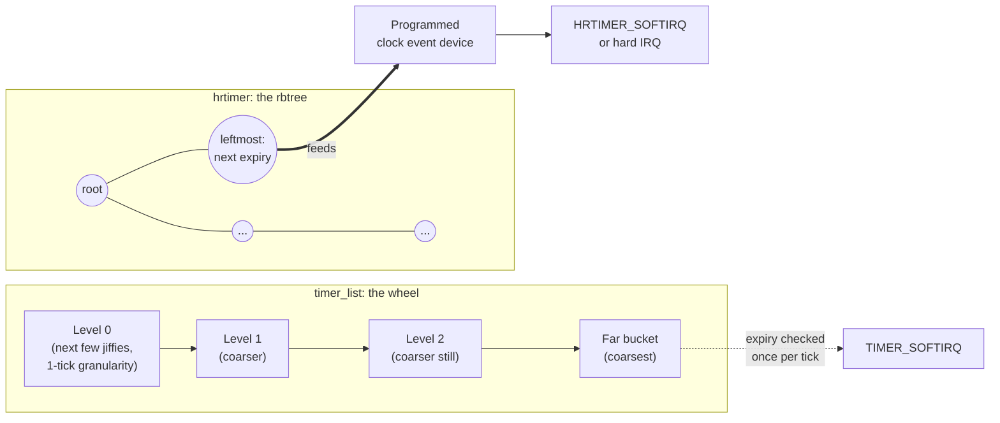

# Timers and High-Resolution Timers

The timer wheel's deliberate imprecision, hrtimers with real deadlines, and which one a driver should choose.

The kernel ships two entirely separate timer subsystems because it has two entirely different
requirements. "Do this in about a second, and I do not care about ten milliseconds either way" is an
enormously cheaper problem than "do this in exactly 250 microseconds" — and building one mechanism to
satisfy both would make the common case pay for the rare one. `timer_list`, the timer wheel, exists for
the first kind of request; `hrtimer`, backed by a red-black tree, exists for the second. Almost every
question about "which timer API do I want" collapses to: does this deadline actually matter?

## `timer_list`: the timer wheel

A `struct timer_list` is placed into one of several **cascading levels**, each level covering a wider
range of future time at coarser granularity — the nearer levels bucket by single ticks, the further-out
levels bucket by increasingly many ticks at once. `kernel/time/timer.c` (verified at v6.18) states the
design goal for this scheme directly, in its own top-of-file comments:

> Contrary to the original timer wheel implementation, which aims for 'exact' expiry of the timers, this
> implementation removes the need for recascading the timers into the lower array levels... This is an
> optimization of the original timer wheel implementation for the majority of the timer wheel use cases:
> timeouts. The vast majority of timeout timers (networking, disk I/O ...) are canceled before expiry.

That is the key property, stated by the code itself rather than inferred: **adding and removing a timer
is O(1)**, with no sorting and no per-tick recascading work, because the wheel does not need to be exact.
This matters enormously because the overwhelming majority of kernel timers are **cancelled before they
ever fire** — every network retransmission timeout that gets an ACK before it expires, every I/O timeout
that gets satisfied by the device — and a data structure that is cheap to insert into and cheap to remove
from beats one that is cheap to walk in expiry order, because expiry order almost never matters for a
timer that never actually reaches its deadline. Once that is understood, the rest of the wheel's design —
bucket by distance, get coarser further out, don't bother sorting within a bucket — is close to obvious.

## The imprecision is deliberate

A `timer_list` set for one second from now may fire meaningfully late — tens of milliseconds late is
entirely within the wheel's contract, and that lateness grows with how far out the timer was armed. This
is not a bug the kernel is quietly living with; it is the trade the wheel makes on purpose in exchange for
O(1) insertion and deletion. `round_jiffies` (and its `_relative`/`_up` variants) goes further and
actively *encourages* rounding a timer's expiry to a tick boundary shared with other timers, specifically
so that unrelated timers across the system **coalesce**: several drivers each asking to be woken "sometime
around the next second" can be satisfied by one wakeup instead of several, which lets the CPU stay in a
deep idle state longer between interrupts. Power efficiency is a feature of the wheel's imprecision, not a
side effect tolerated despite it.

## The API

- **`timer_setup(timer, callback, flags)`** — initializes a `struct timer_list` with its callback. The
  callback receives the `struct timer_list *` itself, and reaches driver state through
  [`container_of`](../04-kernel-architecture-and-idioms/container-of-and-embedded-structs.md), the same
  idiom [Workqueues](./workqueues.md#the-model) uses for `work_struct`.
- **`mod_timer(timer, expires)`** — arms or re-arms the timer for `expires` (an absolute jiffies value).
  Per its own kernel-doc comment, `mod_timer(timer, expires)` is defined as equivalent to `timer_delete(timer);
  timer->expires = expires; add_timer(timer);`, just done more efficiently as one operation.
- **The delete API — verify the current name, do not write from memory.** Older documentation and older
  code call this `del_timer_sync()`. At v6.18, `include/linux/timer.h` no longer declares that name at
  all; the current API is:
  - **`timer_delete_sync(timer)`** — cancels the timer and, per its kernel-doc, waits for a running
    callback to finish on another CPU before returning. Its own documentation is explicit about a
    limitation that matters: "Callers must prevent restarting of the timer, otherwise this function is
    meaningless." If the callback itself can re-arm the timer, `timer_delete_sync()` can return while the
    timer is armed again.
  - **`timer_shutdown_sync(timer)`** — the function to reach for on a genuine teardown path (module unload,
    device removal): it cancels the timer and *permanently* prevents it from being armed again — any
    further `mod_timer()`/`add_timer()` call against a shut-down timer is a silent no-op rather than a
    resurrection. This is the one to use when a structure holding the timer is about to be freed, precisely
    because it closes the re-arm race `timer_delete_sync()` on its own does not.
  - `timer_delete(timer)` and `timer_shutdown(timer)` are the non-`_sync` counterparts: they cancel (or
    shut down) without waiting for an in-flight callback, safe to call from contexts that must not block.

The same lifetime hazard [Workqueues](./workqueues.md#the-lifetime-bug-everyone-writes-once) describes
applies here, stated identically because it is identically shaped: freeing the structure that embeds a
`timer_list` while the timer is still armed, or while its callback may still be running on another CPU, is
a use-after-free the moment the wheel (or a CPU already running the callback) touches that memory. The
fix is the same shape too — `timer_shutdown_sync()` (or, when re-arming is provably impossible,
`timer_delete_sync()`) before the free, on every teardown path, every time.

## `hrtimer`: real deadlines

An `hrtimer` is ordered in a red-black tree — via a `timerqueue_node` wrapping an `rb_node`, keyed on
absolute expiry time — with the tree's leftmost node feeding a programmable clock event device armed for
exactly that moment. The data structure differs from the wheel for a reason that follows directly from
the requirement: an hrtimer's expiry is meant to be **precise**, not approximate, so the kernel must
always be able to answer "what is the single next thing that has to fire," in order, and a tree that keeps
its minimum element cheap to find is what that question needs. The cost is real — O(log n) insertion and
deletion, against the wheel's O(1) — and the kernel pays it deliberately, in exchange for the guarantee the
wheel cannot make: an hrtimer does not fire meaningfully early, and its resolution is nanoseconds rather
than a jiffy.

## Which one to use

| Situation | Use |
|---|---|
| A timeout that will usually be cancelled before it fires (retransmit timers, I/O timeouts, most driver watchdogs) | `timer_list` |
| A deadline that must actually be met — audio/video timing, real-time-ish scheduling, hardware protocols with tight windows | `hrtimer` |
| Periodic work that may sleep (talks to a device, takes a mutex, allocates with `GFP_KERNEL`) | A delayed workqueue (`queue_delayed_work`, see [Workqueues](./workqueues.md#delayed-and-cancellable-work)) — a bare timer callback runs in softirq/hard-IRQ context and may not sleep |

The rough threshold worth keeping in mind: once required accuracy is finer than about a jiffy (a few
milliseconds at typical `HZ` values, and considerably less at `HZ=1000`), the wheel's imprecision stops
being a nuisance and starts being a correctness problem, and that is the point to reach for `hrtimer`
instead. This is also why [`usleep_range`](./delays-and-sleeps.md#usleep_range-and-why-it-takes-a-range)
is built directly on `hrtimer` (`schedule_hrtimeout_range()` under the hood) rather than on the wheel —
it is more precise than `msleep` for exactly the structural reason this page has been building up to.

## Timer slack

`PR_SET_TIMERSLACK` (a `prctl()` operation, confirmed present in `include/uapi/linux/prctl.h` at v6.18)
sets a per-task slack value in nanoseconds: the kernel is permitted to delay that task's timer expiries by
up to the slack amount, specifically so it can batch them against other timers waking around the same
time. This is the same coalescing idea `round_jiffies` applies to the wheel, but exposed per-task and
tunable at runtime rather than baked into one timer's call site. A power-conscious system sets timer slack
generously for background/batch processes — work that has no real deadline and benefits from being woken
alongside whatever else is already about to run — while leaving latency-sensitive tasks at the default so
their timers are not deliberately delayed.

## Where timers run

Both wheel and hrtimer callbacks normally run in **softirq context** — `TIMER_SOFTIRQ` for the wheel,
`HRTIMER_SOFTIRQ` for hrtimers (both confirmed in `include/linux/interrupt.h` at v6.18) — which is the
same restricted context [Softirqs](./softirqs.md) and [Hard IRQ Context](./hardirq-context.md) already
establish the rules for: no sleeping, no blocking allocation, no mutex. An hrtimer armed with an
`HRTIMER_MODE_..._HARD` flag (`HRTIMER_MODE_ABS_HARD`, `HRTIMER_MODE_REL_HARD`, and their `_PINNED`
variants, all confirmed in `include/linux/hrtimer.h`) runs its callback directly in **hard-IRQ context**
instead — even less room, since a softirq at least runs with hardware interrupts enabled. Worth restating
in this context specifically: a timer callback reads, syntactically, like an ordinary function call — it
is easy to forget it is not running in a context that can afford to call something that sleeps, and the
same `CONFIG_DEBUG_ATOMIC_SLEEP` splat this folder has described elsewhere is exactly what catches a timer
callback that tries anyway.

## Per-CPU, and migration

Both timer flavors are **per-CPU**: `kernel/time/timer.c` keeps a `struct timer_base` per CPU, and an
hrtimer set on one CPU normally fires on that same CPU rather than wherever happens to be convenient. This
explains an entire class of "why did my timer fire on a different core than the one that armed it"
confusion — ordinarily it does not, unless that CPU goes away. When a CPU is taken offline,
`timers_dead_cpu()` (`kernel/time/timer.c`, verified at v6.18) migrates every timer queued on that CPU's
wheel onto another CPU's base via `migrate_timer_list()`, so a driver never has to handle "my timer's CPU
disappeared and it just silently never fired" itself — the migration is unconditional, not something a
caller opts into.

*Two timer subsystems, two data structures: one optimised for cheap cancellation, one for precise
expiry.*

<KernelFacts
  structure={[["struct timer_list", "include/linux/timer.h"], ["struct hrtimer", "include/linux/hrtimer.h"]]}
  path="mod_timer() → wheel bucket → TIMER_SOFTIRQ → callback; hrtimer_start() → rbtree → clock event programmed → HRTIMER_SOFTIRQ or hard IRQ → callback"
  observe="sudo cat /proc/timer_list | head -40"
  trap="The timer wheel is optimised for timers that never fire. Most kernel timers are timeouts that get cancelled, which is why adding and removing one is O(1) and why the expiry granularity is deliberately loose." />

## References

- [*Timers Howto*](https://docs.kernel.org/timers/timers-howto.html) — the in-tree guidance on which
  timer or delay to use; the authority for this page's decision table and
  [Delays and Sleeps](./delays-and-sleeps.md)'s.
- [*hrtimers and beyond: Transformation of the Linux time(r) system*](https://docs.kernel.org/timers/hrtimers.html)
  — the design rationale for a separate high-resolution subsystem alongside the wheel.
- <Src file="kernel/time/timer.c" symbol="mod_timer" /> — the wheel insertion path, where the
  bucket-granularity scheme is implemented.
- LWN, [*Reinventing the timer wheel*](https://lwn.net/Articles/646950/) (Jonathan Corbet, June 3, 2015)
  — coverage of Thomas Gleixner's non-cascading wheel redesign; it explains why the current wheel's
  cascading behavior looks different from the one described in older kernel-internals books.
