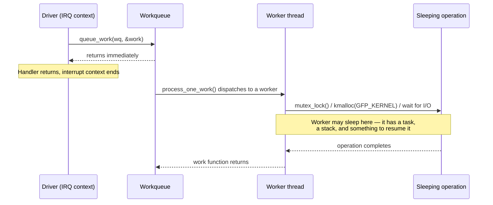

# Workqueues

Deferred work in process context, so it may sleep — plus the cancel-versus-free lifetime bug everyone writes once.

[Softirqs](./softirqs.md) and [tasklets](./tasklets-and-their-replacement.md) defer work out of hard-IRQ
context, but they land it somewhere still atomic: interrupts enabled, preemption in play, but no
`schedule()`, no mutex, no `GFP_KERNEL`, no blocking on I/O — the same restrictions [Hard IRQ
Context](./hardirq-context.md#the-rules-each-derived) derives, minus the "no task" part specifically. A
workqueue removes that remaining restriction by moving the work one step further: instead of running on
the interrupt-exit path or a softirq's execution slot, the work runs in an honest kernel thread, with a
real `task_struct` and a real stack. A kernel thread is process context, and process context may sleep —
allocate with `GFP_KERNEL` and let reclaim do its thing, take a mutex and wait for it, issue I/O and block
until it completes. That single capability is why most driver deferred work — the kind that has to talk to
a device, wait on a completion, or touch memory that might need to be paged in — ends up on a workqueue
rather than a softirq or a tasklet.

## The model

A **work item** is a function plus a `struct work_struct` embedded in the caller's own structure — the
same [`container_of`](../04-kernel-architecture-and-idioms/container-of-and-embedded-structs.md) idiom
folder 04 covers, used here to get from the `work_struct` the callback receives back to whatever driver
state it is attached to:

```c
struct my_device {
    struct work_struct work;
    /* driver-specific fields */
};

static void my_work_fn(struct work_struct *work)
{
    struct my_device *dev = container_of(work, struct my_device, work);
    /* do the deferred work here, in process context */
}

INIT_WORK(&dev->work, my_work_fn);
```

Queueing (`queue_work()`, or `schedule_work()` for the shared system queue) hands the `work_struct` to a
**workqueue** — `struct workqueue_struct`, defined in `kernel/workqueue.c` — which is not itself a thread
but a policy object: it says which pool of worker threads may run this work, how many of them may run it
concurrently, and under what flags. A **worker pool** is where the actual kernel threads live; a worker
pulls a work item off its workqueue's list and calls `process_one_work()`, which is the function that
finally calls the driver's callback, in process context, with no lock held on its behalf and no
restriction on what the callback may do.

## Concurrency-managed workqueues

Before the current design — **concurrency-managed workqueues**, cmwq — each `workqueue_struct` owned its
own dedicated worker thread per CPU, whether or not that workqueue ever had work queued. A machine with a
few dozen `alloc_workqueue()` callers running, most of them idle most of the time, was still paying for a
few dozen live kernel threads per CPU, most of them asleep and pinned in `ps` output for no work actually
being done.

cmwq replaced per-workqueue thread pools with **shared per-CPU worker pools**. `system_percpu_wq` and any
other `WQ_PERCPU` workqueue (see below) draw their workers from one of these shared pools rather than
owning threads outright; a worker is created on demand, when the pool has queued work and no already-idle
worker to hand it to, and can go back to being reclaimed once it has been idle long enough. The point is
the one sentence worth remembering: **a workqueue used to cost a thread per queue per CPU, unconditionally;
it now costs nothing until work actually exists on it.**

The other half of cmwq is the **concurrency manager**: as long as a worker in a pool is runnable, that pool
keeps at most one of its workers actually executing on the CPU, so ordinary short work items serialize
naturally without needing their own lock for exclusion. The moment a running worker goes to sleep — inside
a mutex, waiting on I/O, whatever the callback legitimately blocked on — the pool notices via a scheduler
hook and immediately wakes or creates another worker to keep processing the rest of the pool's queued work,
so one work item sleeping does not stall every other item queued behind it on the same pool. This is what
"concurrency-managed" means concretely: concurrency is kept at exactly the level needed to make forward
progress, expanding when a worker blocks and contracting again once it doesn't need to.

## The default queues

Every driver can reach for a shared, always-present workqueue instead of allocating its own. At v6.18
(`kernel/workqueue.c`, `workqueue_init_early()`) the canonical names and what `schedule_work()`-family
helpers target have shifted from older documentation still in circulation — worth stating precisely rather
than from memory:

| Queue | For | Notes |
|---|---|---|
| `system_percpu_wq` | General-purpose deferred work, one worker pool per CPU | The target of `schedule_work()`/`schedule_work_on()`. Work here should be **short** — it shares its pool with every other caller of `schedule_work()` on the system, and one long-running item delays everyone else queued behind it until the concurrency manager creates a fresh worker. |
| `system_wq` | Legacy alias for `system_percpu_wq` | Still exported (`EXPORT_SYMBOL(system_wq)`) and functionally identical — same `"events"` pool, same `WQ_PERCPU` flags — but `include/linux/workqueue.h` marks it in comment: *"use system_percpu_wq, this will be removed."* Older code and older documentation call it `system_wq`; new code should not. |
| `system_highpri_wq` | Work items that need to preempt ordinary work on the same CPU | Served by a highpri worker pool with an elevated nice level; for `WQ_HIGHPRI`-class urgency, not for volume. |
| `system_long_wq` | Work items expected to run for a while | Same per-CPU pool shape as `system_percpu_wq`, kept separate specifically so a long-running item doesn't sit in the same queue as everyone expecting a fast turnaround. |
| `system_unbound_wq` / `system_dfl_wq` | CPU-heavy or long work that need not stay on the CPU that queued it | `WQ_UNBOUND`, not concurrency-managed the same way — the scheduler, not the workqueue code, decides which CPU runs each worker. At v6.18 both names are exported and both are allocated as `"events_unbound"`; `system_dfl_wq` is the newer name for the same role. |
| `system_freezable_wq` | Deferred work that must pause across suspend/hibernate | Otherwise equivalent to `system_percpu_wq`; participates in the freezer so a work item doesn't run mid-suspend against a partially-quiesced device. |

The rule that matters operationally: **work queued on any `system_*` queue should be short**, because it
is sharing a pool — and therefore a bound on how much concurrency cmwq will spin up — with every other
subsystem that reaches for the same default. A driver with genuinely long or CPU-heavy work should not
lean on the shared queues at all; it should allocate its own.

## Your own workqueue

`alloc_workqueue(fmt, flags, max_active, ...)` creates a dedicated workqueue with its own name (`fmt` is a
`printf`-style format string) and its own `WQ_*` flags:

- **`WQ_UNBOUND`** — work is not tied to the CPU that queued it; the scheduler places the worker instead
  of a fixed per-CPU pool. Correct for long-running or CPU-heavy work where cache locality to the queueing
  CPU matters less than not starving whatever else that CPU is doing.
- **`WQ_MEM_RECLAIM`** — guarantees the workqueue has at least one **rescuer thread**, created up front and
  kept in reserve, so the queue can still make forward progress if the system is under enough memory
  pressure that ordinary worker creation (which itself allocates) cannot proceed. This flag is **required**
  for any work item that can be queued from a memory-reclaim path — writeback, for instance, which is
  exactly why [Writeback and `fsync`](../08-memory-management/writeback-and-fsync.md) queues onto a
  `WQ_MEM_RECLAIM` workqueue. Forgetting it on a reclaim-path workqueue is not a performance bug; under
  sufficient memory pressure it is a deadlock — the workqueue needs a new worker to make progress, creating
  a worker needs memory, and the memory shortage is the reason the work was queued in the first place.
- **`WQ_HIGHPRI`** — queues to the highpri pool: elevated nice level, and highpri work runs ahead of
  ordinary work queued on the same CPU.
- **`WQ_FREEZABLE`** — participates in the suspend/hibernate freezer, same as `system_freezable_wq` above.
- **`max_active`** — for a per-CPU (`WQ_PERCPU`-shaped) workqueue, the ceiling on in-flight work items *per
  CPU*; for an unbound one, the ceiling for the whole system (distributed across NUMA nodes internally). `0`
  requests the default. This is a concurrency cap, not a queue-depth cap — work beyond the cap still
  queues, it just does not start running until a slot frees up.

## Delayed and cancellable work

- **`INIT_DELAYED_WORK(dwork, fn)`** — like `INIT_WORK`, but for a `struct delayed_work`, which wraps a
  `work_struct` with a `timer_list` that fires before the work is actually queued.
- **`queue_delayed_work(wq, dwork, delay)`** — arms the timer; the work item is queued onto `wq` only once
  `delay` (in jiffies) has elapsed, not before.
- **`cancel_work(work)`** / **`cancel_delayed_work(dwork)`** — cancel a pending item. Precisely: if the
  callback is *already running* on some worker, these return without waiting for it — `cancel_delayed_work()`'s
  own doc comment says as much: "The work callback function may still be running on return." Safe to call
  from any context, including an IRQ handler.
- **`cancel_work_sync(work)`** / **`cancel_delayed_work_sync(dwork)`** — cancel *and wait*. Per
  `kernel/workqueue.c`'s doc comment on `cancel_work_sync()`: on return, `@work` "is guaranteed to be not
  pending or executing on any CPU as long as there aren't racing enqueues" — it flushes the currently
  running instance to completion before returning. Must be called from a sleepable context (it can block).
- **`flush_workqueue(wq)`** — waits for every work item *currently* queued on `wq` to finish, but says
  nothing about items queued after the flush call started.

The difference between the plain and `_sync` forms is exactly the axis the next section turns into a bug:
`cancel_work()` can return while the callback is still running on some worker; `cancel_work_sync()` cannot
return until it isn't.

## The lifetime bug everyone writes once

The shape: a driver embeds a `work_struct` in a structure, queues the work, and later frees that structure
— on device removal, module unload, or error teardown — without first making certain the work is not still
queued or running. If it is, the worker thread is either about to call, or is presently executing,
`container_of(work, struct my_device, work)` against memory that no longer belongs to that structure. The
freed memory can already have been reused for something else by the time the worker touches it.

The fix is one call, placed correctly: `cancel_work_sync(&dev->work)` (or `cancel_delayed_work_sync()` for
a `delayed_work`) on the teardown path, **before** the free, every single time a structure holding a
`work_struct` is about to be released and any path exists that could still have queued or be running that
work.

Why it is hard to diagnose without already knowing this pattern: the fault does not happen at `kfree()`.
It happens later, whenever the worker thread gets scheduled and dereferences the now-dangling pointer —
which can be microseconds or, under light load, much longer after the free. `CONFIG_KASAN` will report a
real use-after-free, but the report's backtrace points into `process_one_work()` and the generic
workqueue machinery, not into the driver's own teardown path that actually caused it. Reading a KASAN
splat that blames `kernel/workqueue.c` and concluding the bug is in the workqueue subsystem, rather than in
whichever driver forgot the sync cancel, is the exact wrong turn this section exists to prevent.

## Workqueue versus threaded IRQ versus kthread

All three give process context — the choice between them is about shape, not capability:

| Mechanism | Tied to an interrupt? | Lifetime | Best for |
|---|---|---|---|
| Workqueue | No — anything can queue work | Transient: exists only while work is queued | Bursty, short-to-medium deferred work with no natural thread of its own |
| [Threaded IRQ](./threaded-irqs.md) | Yes — one thread per registered interrupt | Lives as long as the interrupt is requested | Work that is a direct, ongoing consequence of a specific interrupt firing |
| Dedicated `kthread` | No | Long-lived, typically for the life of the driver/subsystem | An open-ended loop — polling, a state machine that runs continuously — that isn't naturally "one item of work per trigger" |

If the work only exists because a specific IRQ just fired and the primary handler needs somewhere to hand
off to, that is a threaded IRQ, not a workqueue reached for out of habit. If the work is a genuine ongoing
loop rather than discrete items, a dedicated kernel thread fits better than repeatedly re-queueing the same
work item. Bursty work with no fixed relationship to one interrupt line — the common case for most driver
housekeeping — is what workqueues are for.

<Lab host="qemu" title="A module that defers work three ways" time="30 min">

**Not executed for this page.** `qemu-system-x86_64` is not installed in the sandbox this page was written
in — there is no way to build, boot, and load a kernel module here — so, per this project's established
practice (see [Finding Locking
Bugs](../09-concurrency-and-locking/finding-locking-bugs.md)), no
`dmesg` output has been fabricated to fill the gap. What follows is the lab as designed, precise enough to
build and run against a v6.18-ish kernel, not a transcript of a run that didn't happen.

1. **Write a module** that creates one `debugfs` file, `defer_demo`, whose `write` callback dispatches on
   the written value:
   - `0` — do the "work" inline, in the write handler itself (ordinary process context — the syscall path
     of whatever process did the write).
   - `1` — `INIT_WORK` a `work_struct` and `schedule_work()` it onto `system_percpu_wq`.
   - `2` — `INIT_WORK` a second `work_struct` and `queue_work()` it onto the module's own
     `alloc_workqueue("defer_demo_wq", WQ_UNBOUND, 0)`.

   Have the shared "work" function (called from all three paths, or three near-identical copies) log
   `current->comm`, `current->pid`, and `in_interrupt()` via `pr_info()`.

2. **Build and load the module**, then `dmesg -C` to clear the ring buffer for a clean run.

3. **Trigger each path**: `echo 0 > /sys/kernel/debug/defer_demo`, then `1`, then `2`, checking `dmesg`
   after each. Expected shape of the log lines: path `0` reports the writing process's own `comm`/`pid`;
   paths `1` and `2` report a `kworker/...` thread's `comm` and a different `pid`, each with
   `in_interrupt()` false in all three cases — none of this runs in interrupt context, which is worth
   confirming, not assuming.

4. **Add `msleep(50)` to the work function** and re-trigger. Path `1` and `2` should simply take longer and
   succeed — sleeping is exactly what process context permits. For contrast, temporarily route the same
   sleeping call through a `tasklet_schedule()`-based path instead (or reuse a small test tasklet from
   [Tasklets](./tasklets-and-their-replacement.md#the-api)) with `CONFIG_DEBUG_ATOMIC_SLEEP=y` enabled:
   that path should produce a "BUG: sleeping function called from invalid context" splat in `dmesg`, the
   same class of report [Finding Locking
   Bugs](../09-concurrency-and-locking/finding-locking-bugs.md) reads
   in detail — softirq/tasklet context cannot sleep, and the debug config exists specifically to catch a
   call that tries to.

5. **Deliberately reproduce the lifetime bug**: queue work via path `2` with a `msleep(2000)` in the
   callback, then unload the module (`rmmod`) while the work is still sleeping, *without* a
   `cancel_work_sync()` in the module's exit function first. This should produce a use-after-free — the
   module's `.text` and the `struct workqueue_struct` it owned are gone by the time the worker resumes and
   tries to run the (now-unmapped) callback function pointer, which a `CONFIG_KASAN` or `CONFIG_DEBUG_KOBJECT_RELEASE`-instrumented
   kernel will report, or which will otherwise crash outright.

6. **Add the fix**: call `cancel_work_sync(&priv->unbound_work)` in the module's exit function, before
   `destroy_workqueue()`, and re-run step 5. The `rmmod` should now block until the sleeping work finishes,
   then unload cleanly — no splat, no crash, because nothing dereferences module memory after it's gone.

**If it fails:** the atomic-sleep splat in step 4 needs `CONFIG_DEBUG_ATOMIC_SLEEP=y` in the running
kernel's config — check with `zcat /proc/config.gz | grep DEBUG_ATOMIC_SLEEP` first. And the crash in step
5 *is* the lab succeeding, not a failure to debug around — it is the lifetime bug, produced on purpose, so
that step 6's fix has something real to fix.

</Lab>



*The handoff from a context that may not sleep to one that may, which is the whole purpose of a
workqueue.*

<KernelFacts
  structure={[["struct work_struct", "include/linux/workqueue.h"], ["struct workqueue_struct", "kernel/workqueue.c"]]}
  path="schedule_work() → queue_work_on() → worker pool → process_one_work() → your function, in process context"
  observe="ps -eo pid,comm | grep kworker | head && ls /sys/devices/virtual/workqueue/"
  trap="Freeing the structure that holds a `work_struct` without `cancel_work_sync()` first is a use-after-free that KASAN will report from inside the workqueue code, pointing nowhere near your driver. Every teardown path that can race with queued work needs the sync cancel." />

## References

- [*Concurrency Managed Workqueue (cmwq)*](https://docs.kernel.org/core-api/workqueue.html) — the
  definitive documentation: the design this page's "Concurrency-managed workqueues" section summarizes,
  every `WQ_*` flag including `WQ_PERCPU`/`WQ_UNBOUND`, and the `WQ_MEM_RECLAIM` requirement stated in the
  kernel's own words.
- <Src file="kernel/workqueue.c" symbol="process_one_work" /> — where a work item is actually executed,
  with the concurrency-management hooks (`worker_set_flags`, wake/create-on-sleep) visible in the same
  function.
- <Src file="include/linux/workqueue.h" symbol="cancel_work_sync" /> — the cancellation semantics, stated
  precisely in the header/source comment this page quotes.
- LWN, [*Working on workqueues*](https://lwn.net/Articles/403891/), Jonathan Corbet, September 7, 2010
  — the design rationale for cmwq; the shared-pool, on-demand-worker model it describes is still what
  v6.18 runs, though the system queue names themselves (`system_percpu_wq`/`system_dfl_wq` alongside the
  older `system_wq`/`system_unbound_wq` aliases) have been renamed since this article was written.
