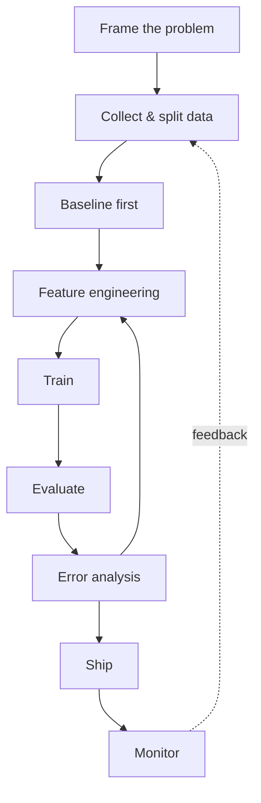

# The ML Workflow

Every ML project — a Kaggle competition, a production fraud model, a research paper — runs the same loop. Modelling gets the most attention because it's the most fun to write about, but it is a small slice of the actual work. Problem framing, data quality, and evaluation discipline decide whether the project ever produces something useful; the model is often the easy part.

:::info[Key idea]
Modelling is the small part; problem framing, data, and evaluation decide whether the project works.
:::

## Frame the problem

Before touching data: what decision does this prediction change? If nobody's behaviour changes based on the output, the project has no value regardless of accuracy. Write down: what is predicted, what action follows from each possible prediction, and what it costs to be wrong in each direction. A fraud model that flags too aggressively costs customer trust; one that flags too rarely costs money directly — these costs shape which metric matters, long before any code is written (see [Evaluation Metrics for Classification](./evaluation-metrics-classification.md)).

## Collect and split data

Gather what's available, then immediately set aside a test set you will not look at again until the very end. Splitting late — after you've already eyeballed the full dataset — is a common, subtle form of leakage. See [Train/Validation/Test Splits](./train-validation-test-splits.md) for the full discipline.

## Baseline first, always

Before any real model: what does the dumbest possible predictor score? Predict the majority class; predict the mean; use one obvious rule. If your fancy model can't beat that baseline by a meaningful margin, something is wrong with the framing, the data, or the model — and you want to know that before investing weeks in architecture search.

## Feature engineering

Transform raw data into a form the model can use — encoding categories, scaling numerics, extracting dates. Covered fully in [Data Preprocessing and Features](./data-preprocessing-and-features.md).

## Train

Fit the model's parameters to the training data by minimising a loss function ([Loss Functions](./loss-functions.md), [Gradient Descent](./gradient-descent.md)).

## Evaluate

Measure performance on held-out data using metrics chosen during problem framing, not after seeing results ([Evaluation Metrics for Classification](./evaluation-metrics-classification.md), [Evaluation Metrics for Regression](./evaluation-metrics-regression.md)).

## Error analysis

Look at what the model gets wrong, not just the aggregate score. A single number can hide that the model fails entirely on one important segment while looking fine on average.

## Iterate

Use error analysis to decide the next move: more data, a different feature, a different model family, more regularisation. This is a loop, not a checklist — you return to framing if error analysis reveals the problem was mis-specified.

## Ship, then monitor

A model that isn't deployed produces no value. Once shipped, the data distribution it sees in production will drift from what it was trained on — monitoring closes the loop back to data collection. The full production discipline is in [Production & MLOps](../07-production-mlops/from-notebook-to-production.md).



The dashed edge is the one teams forget: production monitoring should feed back into data collection, because the world the model sees in production is the best source of the next iteration's training data.

## Common ways teams skip a step and pay for it

- **Skip the baseline** → weeks spent tuning a model that turns out to be worse than predicting the mean.
- **Skip error analysis** → ship a model that's 95% accurate overall but useless on the 5% segment that matters most to the business.
- **Skip monitoring** → the model silently degrades for months before anyone notices, because nobody was watching for it.

## Code: the whole loop in miniature

```python title="ml_workflow_demo.py"
import numpy as np
from sklearn.datasets import make_classification
from sklearn.model_selection import train_test_split
from sklearn.dummy import DummyClassifier
from sklearn.linear_model import LogisticRegression
from sklearn.metrics import accuracy_score, classification_report

# 1. Collect & split
X, y = make_classification(n_samples=1000, n_features=10, weights=[0.9, 0.1], random_state=0)
X_train, X_test, y_train, y_test = train_test_split(X, y, test_size=0.2, stratify=y, random_state=0)

# 2. Baseline first, always
baseline = DummyClassifier(strategy="most_frequent").fit(X_train, y_train)
baseline_acc = accuracy_score(y_test, baseline.predict(X_test))
print(f"baseline accuracy: {baseline_acc:.3f}")

# 3. Train the real model
model = LogisticRegression(max_iter=500).fit(X_train, y_train)
model_acc = accuracy_score(y_test, model.predict(X_test))
print(f"model accuracy: {model_acc:.3f}")

# 4. Evaluate properly, not just accuracy
print(classification_report(y_test, model.predict(X_test)))

# 5. Error analysis: which examples does it get wrong?
preds = model.predict(X_test)
wrong = np.where(preds != y_test)[0]
print(f"misclassified {len(wrong)} of {len(y_test)} test examples")
```

Notice the baseline's accuracy on a 90/10 imbalanced dataset is already ~90% — a real model that only matches the baseline has learned nothing, which is exactly why step 2 exists before step 3.

## See also

- [What Is Machine Learning](./what-is-machine-learning.md) — the three ingredients this workflow assembles.
- [Train/Validation/Test Splits](./train-validation-test-splits.md) — the discipline behind step 2.
