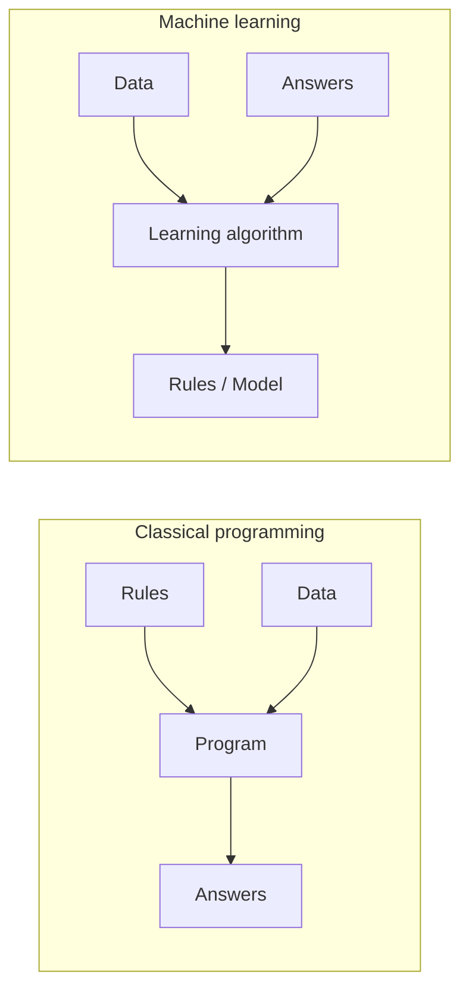

# What Is Machine Learning

Traditional software is a set of rules a person wrote down: if the email contains "viagra", mark it spam. Machine learning flips that. Instead of writing the rules, you show the system many examples of inputs and the outputs you wanted, and an optimisation procedure searches for a function that reproduces those outputs — and, if you did it right, generalises to inputs it has never seen. Everything in this knowledge base is a variation on that one move: **specify the objective, let optimisation find the rule.**

:::info[Key idea]
ML replaces "write the rules" with "specify the objective and let optimisation find the rules" — and every technique in this section exists to make that search work reliably.
:::

## Rules-based vs. learned systems

A rules-based spam filter looks like this: a person enumerates patterns (`"viagra"`, `"click here"`, sender reputation lists) and combines them with hand-tuned weights or boolean logic. It is transparent, debuggable, and completely dependent on the person's foresight. It breaks the moment spammers invent a pattern nobody wrote a rule for.

A learned spam filter looks like this: collect a few thousand emails labelled spam/not-spam, choose a model family (say, logistic regression over word-count features), and let an optimiser choose the weights that minimise classification error on that labelled set. Nobody wrote "if it contains X, it's spam" — the model discovered which words correlate with spam by counting.

The trade: the learned system adapts to patterns nobody anticipated, at the cost of needing labelled data and being harder to audit — you can't point to a single line and say "this is why it flagged the email."

## The three ingredients

Every ML system needs exactly three things:

1. **Data** — examples of the input space, often paired with the outputs you want (labels).
2. **A model** — a parameterised function family (a line, a decision tree, a neural network) capable of representing many different input→output mappings depending on its parameters.
3. **An objective** — a number that says how good a particular setting of the parameters is, which an optimisation procedure tries to improve.

Training is the loop: measure the objective on the data with the current parameters, adjust the parameters to improve it, repeat. Everything else — regularisation, architectures, optimisers — exists to make that loop converge to something useful.



The diagram is the whole idea: classical programming takes rules and data to produce answers; machine learning takes data and (some) answers to produce the rules.

## Where ML wins and where it loses to a for-loop

ML is the wrong tool when a short, correct rule already exists: computing tax brackets, validating an email format, sorting a list. Reach for it when:

- The rule is too complex or too subtle for a person to write down explicitly (recognising handwritten digits, ranking search results).
- The rule changes over time and you'd rather retrain than rewrite (fraud patterns, user preferences).
- You have abundant examples but no clean theory of the underlying relationship (protein folding, click-through prediction).

A for-loop that works is always cheaper to build, debug, and maintain than a model that works. Try the deterministic solution first; it's usually a stronger baseline than people expect.

## AI vs. ML vs. deep learning

These three terms nest, and the nesting is the entire point:

- **Artificial intelligence** is the broadest umbrella — any technique that makes a system act as if it has some intelligence, including hand-written expert systems and search algorithms that involve no learning at all.
- **Machine learning** is the subset of AI where the behaviour comes from fitting parameters to data, rather than being hand-coded.
- **Deep learning** is the subset of ML where the model family is a neural network with multiple layers — it is a specific choice of model, not a different paradigm.

Every deep learning system is a machine learning system; not every machine learning system is deep learning (a decision tree is ML, but has no "depth" in the neural-network sense); not every AI system involves learning at all (a chess engine that does pure minimax search with no learned evaluation function is AI without ML).

## Worked example: hand-written rules vs. a learned classifier

```python title="spam_rules_vs_learned.py"
import re

emails = [
    ("Buy cheap V1AGRA now click here!!!", 1),
    ("Meeting moved to 3pm, see you there", 0),
    ("You won! Claim your prize, click here", 1),
    ("Can you review my PR before EOD?", 0),
    ("Limited time offer, buy now, discount", 1),
    ("Lunch tomorrow? Let me know", 0),
]

# --- Hand-written rules: a human enumerated these patterns ---
SPAM_PATTERNS = [r"v[i1]agra", r"click here", r"buy (cheap|now)", r"limited time", r"won!"]

def rules_based_classifier(text: str) -> int:
    lowered = text.lower()
    return int(any(re.search(p, lowered) for p in SPAM_PATTERNS))

# --- Learned classifier: nobody wrote a single pattern ---
from sklearn.feature_extraction.text import CountVectorizer
from sklearn.linear_model import LogisticRegression

texts, labels = zip(*emails)
vectorizer = CountVectorizer()
X = vectorizer.fit_transform(texts)
model = LogisticRegression().fit(X, labels)

for text, label in emails:
    rules_pred = rules_based_classifier(text)
    learned_pred = model.predict(vectorizer.transform([text]))[0]
    print(f"{label} | rules={rules_pred} learned={learned_pred} | {text[:40]}")
```

The rules-based function required a person to anticipate `"v1agra"`, `"click here"`, and every other phrase. The learned classifier saw only `(text, label)` pairs and discovered, via `LogisticRegression`'s fit to word-count features, which words push the prediction toward spam — no pattern was ever written by hand.

## Vocabulary

| Term | Meaning |
|---|---|
| Feature | A measured or derived input variable fed to the model (e.g. word count, pixel value) |
| Label | The correct output for a training example, when supervision is available |
| Sample | One (features, label) pair — one row of the dataset |
| Model | The parameterised function family being fit (e.g. "a logistic regression classifier") |
| Parameter | A value learned from data during training (e.g. a regression weight) |
| Hyperparameter | A value chosen before training and held fixed during it (e.g. learning rate, tree depth) |
| Inference | Running the trained model on a new input to produce a prediction |

## See also

- [Learning Paradigms](./learning-paradigms.md) — how the type of supervision available changes which family of algorithms applies.
- [The ML Workflow](./the-ml-workflow.md) — the end-to-end loop a real project runs, from framing to monitoring.
