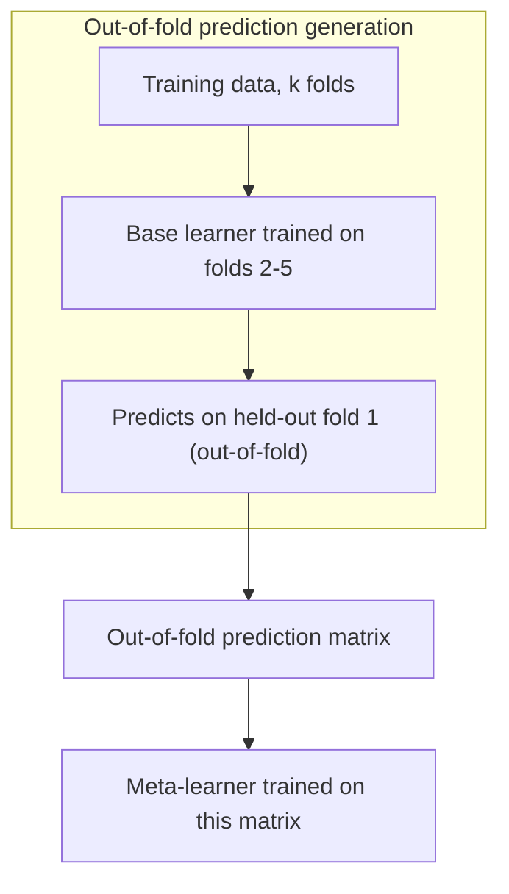

# Ensembles and Stacking

Bagging and boosting are both ensembles of the *same* base learner. This page covers combining genuinely *different* models — a linear model, a tree ensemble, and a neural network, say — which only helps to the extent those models fail in different ways.

:::info[Key idea]
An ensemble helps in proportion to how uncorrelated its members' errors are — identical models averaged give you nothing.
:::

<Figure
  src="/img/ml/classical/bagging-vs-boosting.png"
  alt="Bagging shown as independent parallel trees feeding an average, and boosting as a chain of trees each correcting the previous"
  caption="The structural difference. Bagging trains independently and in parallel, attacking variance; boosting trains sequentially with each model correcting its predecessor, attacking bias. That dependency is also why boosting cannot be parallelised across trees."
/>

## The three families

**Bagging** ([Random Forests and Bagging](./random-forests-and-bagging.md)): parallel, same base learner, reduces variance. **Boosting** ([Gradient Boosting](./gradient-boosting.md)): sequential, same base learner, reduces bias. **Stacking**: combines predictions from *different* model types via a learned combination rule.

## Voting: hard vs. soft

**Hard voting**: each model casts a discrete vote for a class, majority wins. **Soft voting**: average the predicted *probabilities* across models, then take the argmax — generally performs better because it uses the models' confidence, not just their final decision.

## Weighted averaging

A simple extension: instead of equal weights, weight each model's contribution by its individual validation performance — a stronger model counts for more.

## Stacking: base learners plus a meta-learner

Train several diverse **base learners** on the training data; then train a **meta-learner** whose inputs are the base learners' predictions and whose target is the original label. The meta-learner learns how to *combine* the base models' opinions, rather than combining them with a fixed rule like averaging.

## Why the meta-learner must be trained on out-of-fold predictions

This is the entire trick, and getting it wrong silently ruins the ensemble. If the meta-learner is trained on the base learners' predictions *on the same data those base learners were trained on*, the base learners' predictions will be overly accurate (they've already seen the answers) — the meta-learner will then learn to trust base learners' training-set overconfidence, which does not transfer to new data. The fix: generate each base learner's predictions on data *it did not see* during its own training, using cross-validation — each base learner predicts on the fold it was held out from, and only those honest, out-of-fold predictions feed the meta-learner.



## Blending vs. stacking

**Blending** is a simplified variant: hold out a single validation set (instead of full k-fold), train base learners on the remainder, and train the meta-learner on the base learners' predictions for that one held-out set — simpler to implement, uses less data for the meta-learner's training signal.

## Diversity as the actual currency

A stacked ensemble of five near-identical gradient boosting models tuned slightly differently gains almost nothing over a single one, because their errors are highly correlated (same [Random Forests and Bagging](./random-forests-and-bagging.md)'s $\rho\sigma^2$ variance floor applies here too). A stack combining a linear model, a tree ensemble, and a neural network — each with a different inductive bias, therefore different error patterns — gains meaningfully more, even if each individual model is slightly weaker on its own.

## Cost: latency, memory, debuggability

An ensemble multiplies serving cost by however many models it contains, multiplies memory footprint the same way, and makes debugging a bad prediction harder (which of $N$ models is responsible?) — real costs that must be weighed against the (often modest) accuracy gain.

## When a single well-tuned model is the right call

If latency or interpretability matter, or if the accuracy gain from stacking is only a fraction of a percentage point, a single well-tuned model is usually the better production choice — ensembling is most worth its cost in offline settings (competitions, batch scoring) where the marginal accuracy is the only thing that matters.

## Code: VotingClassifier and StackingClassifier over diverse base models

```python title="ensembles_demo.py"
import numpy as np
from sklearn.datasets import make_classification
from sklearn.linear_model import LogisticRegression
from sklearn.ensemble import RandomForestClassifier, VotingClassifier, StackingClassifier, GradientBoostingClassifier
from sklearn.svm import SVC
from sklearn.model_selection import cross_val_score, KFold

X, y = make_classification(n_samples=1000, n_features=20, random_state=0)

base_models = [
    ("logreg", LogisticRegression(max_iter=500)),
    ("forest", RandomForestClassifier(n_estimators=100, random_state=0)),
    ("svm", SVC(probability=True, random_state=0)),
]

voting = VotingClassifier(estimators=base_models, voting="soft")
stacking = StackingClassifier(estimators=base_models, final_estimator=LogisticRegression(),
                               cv=5)  # cv=5 ensures out-of-fold predictions feed the meta-learner

for name, model in [("voting", voting), ("stacking", stacking)] + base_models:
    scores = cross_val_score(model, X, y, cv=5)
    print(f"{name:10s}: {scores.mean():.4f} +/- {scores.std():.4f}")

# --- Correlation of base-model errors: why the diverse trio helps ---
preds = {}
for name, model in base_models:
    fold_preds = np.zeros(len(y))
    for train_idx, val_idx in KFold(5, shuffle=True, random_state=0).split(X):
        model.fit(X[train_idx], y[train_idx])
        fold_preds[val_idx] = model.predict(X[val_idx])
    preds[name] = (fold_preds != y).astype(int)  # 1 = error

error_matrix = np.array(list(preds.values()))
print("\nerror correlation matrix (lower off-diagonal = more diverse, more useful to stack):")
print(np.round(np.corrcoef(error_matrix), 3))
```

## When to reach for this

| | |
|---|---|
| Data size | any, but the meta-learner needs enough data to train reliably |
| Feature count | inherited from base learners |
| Interpretability | low — a black box on top of black boxes |
| Training cost | sum of all base learners, plus cross-validation overhead for stacking |
| Inference cost | sum of all base learners' inference cost |

## See also

- [Random Forests and Bagging](./random-forests-and-bagging.md) — ensembling identical learners, for contrast.
- [Train/Validation/Test Splits](../00-foundations/train-validation-test-splits.md) — the cross-validation discipline stacking depends on.
