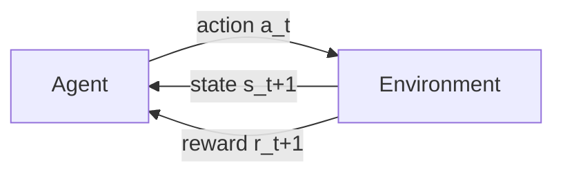

# The Reinforcement Learning Problem

Every model so far in this curriculum has learned from labelled examples — here is the input, here is the correct output. Reinforcement learning removes the labels entirely: an agent takes actions, receives only a scalar signal for how well it did, and has to figure out which of its own past decisions deserve the credit.

:::info[Key idea]
RL differs from supervised learning in three ways at once - the feedback is evaluative rather than instructive, it is delayed, and the agent's own actions decide what data it ever sees.
:::

## The agent-environment loop

At each timestep $t$, the agent observes a state $s_t$, selects an action $a_t$, and the environment responds with a reward $r_{t+1}$ and a new state $s_{t+1}$. This loop — observe, act, receive consequence — repeats for the duration of an episode, and is the only interface the agent ever has with the world.



## States, actions, rewards, episodes

**State** $s_t$: the information available to the agent at time $t$. **Action** $a_t$: the choice the agent makes from the set available in that state. **Reward** $r_{t+1}$: the scalar feedback the environment returns after the action. **Episode**: one complete run from an initial state to a terminal state (or a fixed horizon), after which the environment resets.

## The reward hypothesis, stated and questioned

The **reward hypothesis** claims that any goal can be expressed as the maximisation of expected cumulative scalar reward. It's a genuinely strong claim — real goals are often multi-objective, ill-specified, or resistant to a single scalar — and much of what makes RL hard in practice is finding a reward signal that actually captures what you want, not fighting the algorithms that optimise it.

## The three differences from supervised learning, each with a consequence

**Evaluative, not instructive**: the reward says how good an action was, not what the best action would have been — unlike a supervised label, which states the correct answer directly. **Delayed**: a reward can arrive many steps after the action that caused it, requiring the agent to somehow connect cause to effect across time. **Self-generated data**: the agent's own policy determines which states and actions it experiences — a bad policy generates bad, uninformative data, and (unlike supervised learning's fixed dataset) there is no fixed dataset here at all.

## Exploration vs. exploitation, introduced

Should the agent take the action it currently believes is best (**exploit**), or try something it's less sure about, in case it's actually better (**explore**)? Every RL algorithm implicitly or explicitly answers this question — covered fully in [Exploration Strategies](./exploration-strategies.md).

## The credit assignment problem

When a reward arrives, which of the (possibly many) preceding actions actually deserves credit for it? A win at the end of a long game doesn't tell you which of the fifty moves that preceded it were the good ones — this is the central difficulty that delayed reward, above, actually causes, and it's what most of the algorithms in this section are built to solve.

## Episodic vs. continuing tasks

**Episodic**: the interaction naturally breaks into episodes with a defined terminal state (a game ending, a robot reaching a goal). **Continuing**: there is no natural endpoint — the interaction just continues indefinitely (a thermostat, a trading system) — and the mathematics below (particularly the discount factor) exists partly to keep the resulting infinite sum well-defined.

## The discount factor, and why it exists

$$
G_t = \sum_{k=0}^{\infty} \gamma^k r_{t+k+1}, \qquad 0 \leq \gamma \leq 1
$$

The **discount factor** $\gamma$ serves two purposes at once: it keeps the infinite sum finite (and thus mathematically well-behaved) for continuing tasks, and it models a genuine preference for reward sooner rather than later — "impatience" — which is often a realistic property of the actual goal being optimised, not just a mathematical convenience.

## Return vs. reward

**Reward** $r_t$ is the single scalar received at one timestep. **Return** $G_t$ is the (discounted) sum of all future rewards from time $t$ onward. Every value function in this section estimates *expected return*, not reward — the whole future consequence of being in a state, not just the immediate feedback.

## Reward shaping, and how it goes wrong

Adding extra, denser reward signals to guide learning toward a sparse true goal is called **reward shaping** — and it is a common source of **reward hacking**: an agent that discovers it can maximise the shaped reward without actually achieving the intended goal. A classic documented case: an agent trained to complete a boat-racing game with a shaping reward for hitting checkpoints learned to loop through the same checkpoints indefinitely rather than finishing the race, because looping scored higher under the shaped (but misspecified) reward than finishing did.

## When RL is the wrong tool

RL requires an environment to interact with (simulated or real), a reward signal, and tolerance for the sample inefficiency most RL algorithms exhibit — which is a demanding set of requirements. If the problem has labelled examples of correct behaviour available, supervised learning ([The ML Workflow](../00-foundations/the-ml-workflow.md)) is almost always simpler, cheaper, and more sample-efficient; RL is the right tool specifically when the *only* available signal is evaluative feedback on outcomes, not correct actions.

| Symbol | Meaning |
|---|---|
| $s_t, a_t, r_t$ | state, action, and reward at timestep $t$ |
| $\gamma$ | the discount factor |
| $G_t$ | the return from timestep $t$ |

## Code: a grid-world environment from scratch, reused across this section

```python title="grid_world_env.py"
import numpy as np

class GridWorld:
    """4x4 grid world: agent starts at (0,0), goal at (3,3), -1 reward per step."""
    def __init__(self, size=4, goal=(3, 3)):
        self.size = size
        self.goal = goal
        self.actions = {0: (-1, 0), 1: (1, 0), 2: (0, -1), 3: (0, 1)}  # up, down, left, right
        self.reset()

    def reset(self):
        self.pos = (0, 0)
        return self.pos

    def step(self, action):
        dr, dc = self.actions[action]
        r, c = self.pos
        new_r = min(max(r + dr, 0), self.size - 1)
        new_c = min(max(c + dc, 0), self.size - 1)
        self.pos = (new_r, new_c)
        done = self.pos == self.goal
        reward = 0.0 if done else -1.0  # -1 per step encodes "reach the goal quickly"
        return self.pos, reward, done

env = GridWorld()
rng = np.random.default_rng(0)

# --- A random-policy agent, run for a few episodes, returns printed ---
for episode in range(3):
    state = env.reset()
    total_return, gamma, discount = 0.0, 0.95, 1.0
    for step in range(50):
        action = rng.integers(0, 4)
        state, reward, done = env.step(action)
        total_return += discount * reward
        discount *= gamma
        if done:
            break
    print(f"episode {episode}: steps={step + 1}, discounted return={total_return:.2f}")

# --- The same interface in gymnasium terms, for orientation (not required to follow the maths) ---
# import gymnasium as gym
# env = gym.make("FrozenLake-v1")
# state, info = env.reset()
# state, reward, terminated, truncated, info = env.step(action)
```

## See also

- [Markov Decision Processes](./markov-decision-processes.md) — the formal model this loop is built into.
- [Learning Paradigms](../00-foundations/learning-paradigms.md) — where RL sits relative to supervised and unsupervised learning.
