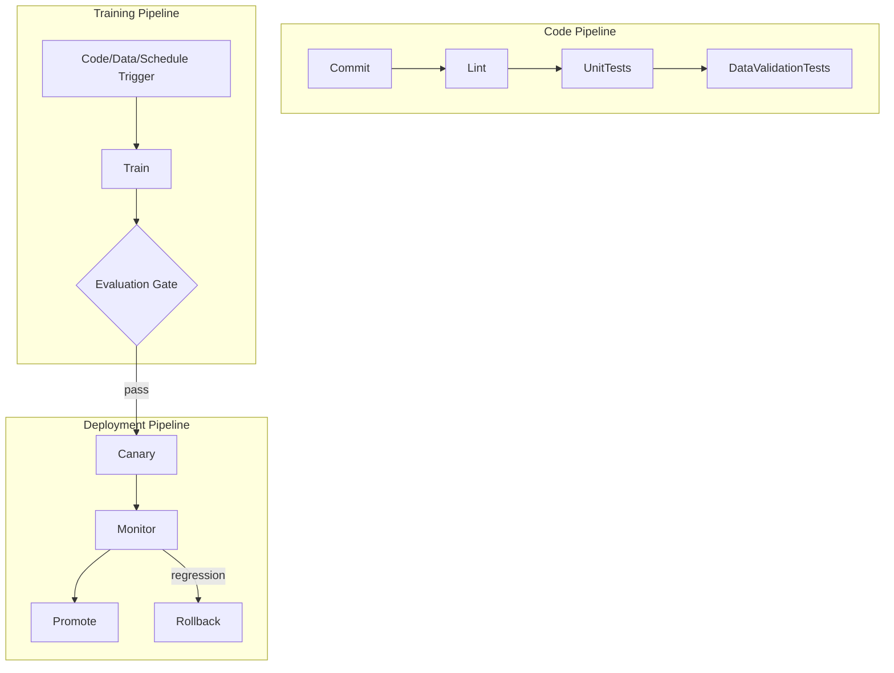

# CI/CD for ML

Automating the path from a commit to a deployed model, with gates that can actually stop a bad one — not automation for its own sake, but a system where "commit" doesn't mean "deployed," and a real evaluation gate stands between the two.

:::info[Key idea]
ML CI/CD has three pipelines, not one - code, training, and deployment - and each needs its own trigger and its own gate.
:::

<Figure
  src="/img/ml/mlops/ml-test-pyramid.png"
  alt="A four-tier test pyramid with unit tests at the base, then data validation, integration tests and model quality gates"
  caption="The classical test pyramid plus a tier that does not exist in ordinary software: data validation. Most production ML failures are data failures, and no amount of unit testing on the transform code catches them."
/>

## What differs from software CI/CD

Standard software CI/CD tests code against a fixed, deterministic expectation — the same input should always produce the same output, and a test either passes or fails unambiguously. ML systems add: **data as an input** (correctness depends on data the CI system doesn't fully control), **non-deterministic outputs** ([Reproducibility](./reproducibility.md)'s natural run-to-run variance, even when seeded imperfectly), and **statistical quality gates** (pass/fail decided by a metric threshold with sampling noise, not a binary assertion) — all requiring CI/CD practices beyond what standard software testing assumes.

## The code pipeline: lint, type check, unit tests, data validation tests

The most standard-software-like of the three pipelines: lint and type-check on every commit, unit tests for individual functions, and — the ML-specific addition — tests for the [Data Pipelines and Contracts](./data-pipelines-and-contracts.md)'s validation logic itself (does the contract checker correctly catch a known-bad input).

## Testing ML code specifically

**Preprocessing functions**: unit-testable like any pure function — given a known input, does it produce the known correct output. **Shape contracts**: assert tensor shapes at key points in the model, catching a broken reshape or a mismatched dimension immediately rather than deep inside a cryptic runtime error. **The overfit-one-batch smoke test**: can the model overfit a single small batch to near-zero loss — if it can't, something in the training loop is broken, and this is far faster to run than a full training job. **A tiny end-to-end training run**: a few steps on a tiny synthetic dataset, checking the full pipeline runs without crashing — not evaluating quality, just confirming the mechanics work.

## The training pipeline: triggered by code, data, or schedule

Distinct from the code pipeline, the **training pipeline** actually runs training, triggered by a code change (new model logic), a new dataset version ([Data Versioning and Lineage](./data-versioning-and-lineage.md)), or a schedule (routine retraining, or [Data and Concept Drift](./data-and-concept-drift.md)'s triggered retraining).

## The evaluation gate, and promotion only on passing it

Every training pipeline run feeds directly into [Offline Evaluation](./offline-evaluation.md)'s automated evaluation suite — a model that fails the gate simply does not get promoted to the registry, regardless of how the training run otherwise looked. This gate is what makes automated retraining ([Data and Concept Drift](./data-and-concept-drift.md)'s Level 2 maturity) safe to run unattended.

## The deployment pipeline: canary, monitor, promote or roll back

A separate pipeline handles taking an evaluation-gate-passed, registered model and actually deploying it: [Online Evaluation and A/B Testing](./online-evaluation-and-ab-testing.md)'s canary release, automated monitoring during the canary window, and either promotion to full rollout or automatic rollback based on the observed guardrail metrics.



## Artefact promotion rather than rebuilding per environment

The exact artefact that passed staging evaluation should be the exact artefact promoted to production — rebuilding or retraining separately for each environment risks a subtle difference between what was tested and what actually gets deployed, defeating the purpose of the gate entirely.

## Secrets and data access in CI

Training pipelines often need access to sensitive data and credentials — CI systems need the same secrets-management discipline as any production system (scoped, rotated credentials, never hardcoded or logged), a genuine security surface that's easy to underestimate for "just a training job."

## Keeping the pipeline fast enough that people use it

A CI/CD pipeline that takes hours to give feedback gets bypassed under pressure ("I'll just deploy manually this once") — keeping the fast-feedback code pipeline genuinely fast (seconds to low minutes) is what keeps it actually used, even if the full training pipeline necessarily takes longer.

## A minimal setup worth having on day one

1. Lint and unit tests on every commit (the code pipeline, fast).
2. An overfit-one-batch smoke test and a tiny end-to-end training run in CI.
3. An automated evaluation gate any training run must pass before promotion.
4. A one-command rollback, tested and known to work before it's needed under pressure.

| Symbol | Meaning |
|---|---|
| evaluation gate | the automated pass/fail check between training and promotion |
| smoke test | a fast, minimal check that the pipeline mechanics work at all |

## Code: a CI workflow with lint, tests, data validation, and a training smoke test

```yaml title=".github/workflows/ml-ci.yml"
name: ML CI
on: [push, pull_request]

jobs:
  code-pipeline:
    runs-on: ubuntu-latest
    steps:
      - uses: actions/checkout@v4
      - name: Install dependencies
        run: pip install -r requirements.txt
      - name: Lint
        run: ruff check .
      - name: Unit tests
        run: pytest tests/unit --maxfail=1
      - name: Data validation tests
        run: pytest tests/data_validation --maxfail=1
      - name: Training smoke test
        run: python scripts/smoke_test_training.py
```

```python title="smoke_test_training.py"
import numpy as np
import torch
import torch.nn as nn

def overfit_one_batch_test(model, X, y, n_steps=200, loss_threshold=0.01):
    """If the model can't overfit one small batch, the training loop is broken somewhere."""
    optimizer = torch.optim.Adam(model.parameters(), lr=0.01)
    for _ in range(n_steps):
        optimizer.zero_grad()
        loss = nn.functional.mse_loss(model(X), y)
        loss.backward()
        optimizer.step()
    assert loss.item() < loss_threshold, f"failed to overfit one batch: final loss={loss.item():.4f}"
    print(f"overfit-one-batch smoke test PASSED: final loss={loss.item():.5f}")

def tiny_end_to_end_test(train_fn, n_synthetic_samples=50):
    """A few steps on tiny synthetic data, checking the FULL pipeline runs without crashing."""
    X_synthetic = np.random.default_rng(0).normal(0, 1, (n_synthetic_samples, 4))
    y_synthetic = np.random.default_rng(0).integers(0, 2, n_synthetic_samples)
    result = train_fn(X_synthetic, y_synthetic, n_steps=5)  # tiny, mechanics-only run
    assert result is not None, "training pipeline returned no result"
    print("tiny end-to-end pipeline test PASSED")

if __name__ == "__main__":
    model = nn.Sequential(nn.Linear(4, 8), nn.ReLU(), nn.Linear(8, 1))
    X = torch.randn(8, 4)
    y = torch.randn(8, 1)
    overfit_one_batch_test(model, X, y)

    def fake_train_fn(X, y, n_steps):
        return {"final_loss": 0.5, "n_steps": n_steps}
    tiny_end_to_end_test(fake_train_fn)
```

## See also

- [Offline Evaluation](./offline-evaluation.md) — the evaluation gate this page's training pipeline is built around.
- [Model Registry and Packaging](./model-registry-and-packaging.md) — where a gate-passing artefact gets promoted for deployment.
