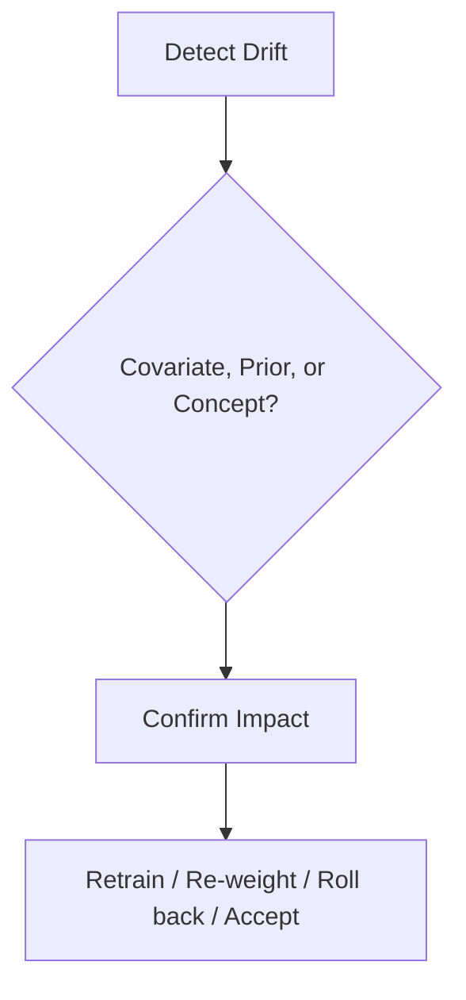

# Data and Concept Drift

The world moved and the model did not. A model is a snapshot of relationships learned from historical data — when the world underlying those relationships changes, the model's assumptions quietly stop holding, and performance degrades in a way no error message will ever announce.

:::info[Key idea]
Distinguish a change in the inputs from a change in the input-output relationship, because they call for different responses.
:::

## Covariate shift, prior shift, and concept drift, each defined

**Covariate shift**: $p(x)$ changes, but $p(y \mid x)$ stays the same — the input distribution shifts (more users from a new region), but the underlying relationship between features and label is unchanged. **Prior shift**: $p(y)$ changes on its own (the base rate of fraud rises during a specific event), independent of any change in features. **Concept drift**: $p(y \mid x)$ itself changes — the *relationship* between inputs and the correct output changes (a spam classifier's notion of "spam" evolves as spammers adapt their tactics). Distinguishing which of these is happening matters directly: covariate shift can sometimes be corrected by re-weighting, while genuine concept drift requires the model to actually learn something different.

## Sudden, gradual, incremental, and recurring drift patterns

**Sudden**: an abrupt, one-time change (a new product launch, a policy change). **Gradual**: a slow transition from one relationship to another over time. **Incremental**: many small, continuously accumulating changes. **Recurring**: a pattern that cycles back (seasonal effects, day-of-week patterns) — not truly "drift" in the sense of permanent change, but needs to be distinguished from genuine drift so seasonal cycles aren't mistaken for a persistent shift requiring intervention.

## Detecting input drift without labels: PSI, KL divergence, Kolmogorov-Smirnov

Because input drift ($p(x)$ changing) doesn't require waiting for labels, it can be detected immediately from unlabelled live data alone, using several standard statistics per feature: **PSI** (Population Stability Index, below), **KL divergence** ([Information Theory](../00-foundations/information-theory.md)'s measure of distributional difference), and the **Kolmogorov-Smirnov (KS) test** (comparing empirical cumulative distributions directly, without binning). Each is applied per-feature, comparing the live distribution against the training-time reference distribution.

$$
\text{PSI} = \sum_i (p_i - q_i) \ln\left(\frac{p_i}{q_i}\right)
$$

where $p_i, q_i$ are the proportions of data falling into bin $i$ for the reference and current distributions respectively — a standard, widely-used rule of thumb treats PSI above roughly 0.2 as indicating significant drift, though thresholds should still be tuned per feature and per application.

## Multivariate drift detection, and the domain-classifier trick

Per-feature tests can miss drift that only shows up in the *joint* relationship between features (each individual feature's marginal distribution looks fine, but their correlation structure has shifted). The **domain-classifier trick**: train a classifier to distinguish "old" data from "new" data directly — if it can do so with meaningfully better-than-chance accuracy, a genuine multivariate distribution shift exists, even if no single feature's univariate test flagged anything.

## Detecting concept drift when labels arrive late

Once delayed labels eventually arrive ([Monitoring and Observability](./monitoring-and-observability.md)), tracking the model's actual accuracy over time directly reveals concept drift — a steady decline in accuracy on recent data, with input distributions ($p(x)$) that look stable, points specifically at the input-output relationship having changed, not the inputs themselves.

## Choosing thresholds without drowning in false alarms

Overly sensitive drift thresholds fire constantly on ordinary sampling noise, producing the same alert-fatigue problem [Monitoring and Observability](./monitoring-and-observability.md) already flagged — thresholds should be calibrated against the metric's *historical* variance under known-stable conditions, not set arbitrarily.

## Drift is not automatically a problem

Detecting drift is not the same as confirming it's harmful — some drift has no measurable effect on the metric that actually matters, particularly if it occurs in a feature the model weighs lightly. Confirming actual performance impact (via delayed labels, or a proxy metric) before spending effort responding is worth doing explicitly, rather than reflexively retraining on every detected shift.

## Responses: retrain, re-weight, roll back, or accept

**Retrain**: on fresh data reflecting the new distribution — the default response to confirmed concept drift. **Re-weight**: for covariate shift specifically, re-weighting training examples to match the new input distribution can sometimes correct performance without a full retrain. **Roll back**: if the drift traces to a recent, reversible upstream change. **Accept**: if the drift's measured impact is negligible, the honest response can simply be to keep monitoring rather than intervene.

## Scheduled vs. triggered retraining

**Scheduled**: retrain on a fixed cadence (weekly, monthly), regardless of whether drift has actually been detected — simple, predictable, but potentially wasteful (retraining when nothing has changed) or too slow (drift happening faster than the schedule). **Triggered**: retrain specifically when drift crosses a defined threshold — more responsive, but requires the detection and threshold-tuning discipline above to be trustworthy enough to act on automatically.

## The retraining pipeline, and validating the retrained model before promotion

A retrained model is not automatically better — it must pass through the exact same [Offline Evaluation](./offline-evaluation.md) gate as any new model before promotion, including the regression check against the currently-deployed model. Automated retraining without an automated, trustworthy evaluation gate is a recipe for automatically deploying a worse model.

## Feedback loops, where the model's own outputs change the data it later sees

A recommendation model's own recommendations shape what users click on, which becomes the training data for the *next* version of the same model — a feedback loop where the model's past decisions influence its own future training distribution, potentially reinforcing and amplifying its existing biases or blind spots over successive retraining cycles, independent of any external drift.



| Symbol | Meaning |
|---|---|
| PSI | Population Stability Index |
| KS statistic | Kolmogorov-Smirnov test statistic |

## Code: PSI and KS from scratch on a synthetic stream with an injected shift

```python title="drift_detection_demo.py"
import numpy as np
from scipy.stats import ks_2samp
from sklearn.linear_model import LogisticRegression

def compute_psi(reference: np.ndarray, current: np.ndarray, n_bins: int = 10) -> float:
    bin_edges = np.quantile(reference, np.linspace(0, 1, n_bins + 1))
    bin_edges[0], bin_edges[-1] = -np.inf, np.inf
    ref_counts, _ = np.histogram(reference, bins=bin_edges)
    cur_counts, _ = np.histogram(current, bins=bin_edges)
    ref_props = np.clip(ref_counts / len(reference), 1e-6, None)
    cur_props = np.clip(cur_counts / len(current), 1e-6, None)
    return np.sum((cur_props - ref_props) * np.log(cur_props / ref_props))

rng = np.random.default_rng(0)
reference = rng.normal(50, 10, 1000)

# --- A stream where a shift is injected partway through ---
stable_stream = rng.normal(50, 10, 500)
shifted_stream = rng.normal(65, 10, 500)  # mean shifted by 1.5 standard deviations

psi_stable = compute_psi(reference, stable_stream)
psi_shifted = compute_psi(reference, shifted_stream)
ks_stat_stable, ks_p_stable = ks_2samp(reference, stable_stream)
ks_stat_shifted, ks_p_shifted = ks_2samp(reference, shifted_stream)

print(f"stable window:  PSI={psi_stable:.3f}, KS stat={ks_stat_stable:.3f}, p={ks_p_stable:.3f}")
print(f"shifted window: PSI={psi_shifted:.3f}, KS stat={ks_stat_shifted:.3f}, p={ks_p_shifted:.4f}")
print(f"PSI > 0.2 threshold: stable={psi_stable > 0.2}, shifted={psi_shifted > 0.2}")

# --- A domain classifier catching a multivariate shift a per-feature test would miss ---
n = 500
feature_a_old = rng.normal(0, 1, n)
feature_b_old = feature_a_old + rng.normal(0, 0.1, n)  # correlated with feature_a
feature_a_new = rng.normal(0, 1, n)                     # SAME marginal distribution as old
feature_b_new = -feature_a_new + rng.normal(0, 0.1, n)  # but correlation has FLIPPED sign

X_old = np.stack([feature_a_old, feature_b_old], axis=1)
X_new = np.stack([feature_a_new, feature_b_new], axis=1)
X_combined = np.vstack([X_old, X_new])
y_domain = np.concatenate([np.zeros(n), np.ones(n)])  # 0=old, 1=new

domain_classifier = LogisticRegression().fit(X_combined, y_domain)
domain_accuracy = domain_classifier.score(X_combined, y_domain)
print(f"\ndomain classifier accuracy: {domain_accuracy:.3f}  "
      f"(near 0.5 = no shift; well above 0.5 = shift the per-feature marginals alone would miss)")
```

## See also

- [Monitoring and Observability](./monitoring-and-observability.md) — the always-on measurement drift detection is built on top of.
- [CI/CD for ML](./ci-cd-for-ml.md) — where triggered retraining gets wired into an automated pipeline.
