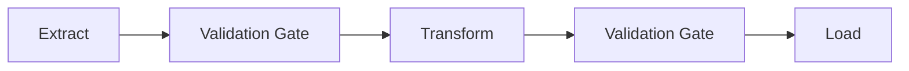

# Data Pipelines and Contracts

The model did not break. The upstream team renamed a column, and the model kept running — silently feeding a now-empty (or misaligned) feature into every prediction, with no error, no crash, and no obvious symptom until someone notices the metrics have quietly degraded.

:::info[Key idea]
A data contract turns a silent, delayed model failure into a loud, immediate pipeline failure.
:::

## Batch vs. streaming ingestion

**Batch**: data arrives (and is processed) in discrete chunks on a schedule — an hourly file drop, a nightly database export. **Streaming**: data arrives continuously, processed as it appears (event-by-event or in small micro-batches). Most ML pipelines are batch by default; streaming is justified specifically when freshness requirements ([Feature Stores](./feature-stores.md)'s online store) demand it, since streaming infrastructure is meaningfully more complex to build and operate correctly.

## The ETL/ELT distinction, and why it matters for features

**ETL** (Extract, Transform, Load): transform data *before* loading it into the destination store. **ELT** (Extract, Load, Transform): load raw data first, transform afterward, typically within the destination system itself. For ML features specifically, ELT's advantage is preserving raw data for re-deriving features differently later (a new feature definition, a bug fix in a transformation) without re-extracting from the original source — a real advantage when feature definitions evolve, which they routinely do.

## Idempotency and re-runnability

A pipeline stage is **idempotent** if running it twice with the same input produces the same result as running it once — critical for safe retries after a failure. A non-idempotent stage (one that appends rather than overwrites, say) can silently duplicate data on a retry, corrupting downstream training data in a way that's often only discovered much later.

## Orchestration concepts (DAGs, scheduling, backfills, retries)

Pipeline stages are typically expressed as a **DAG** (Directed Acyclic Graph) of dependent tasks, run on a **schedule**, with an orchestrator handling **retries** on transient failure and **backfills** (re-running historical dates when logic changes and past outputs need regenerating). Understanding these four concepts is enough to reason about essentially any pipeline orchestration tool, regardless of which specific one a team uses.



## Data contracts: schema, types, ranges, nullability, freshness

A **data contract** is an explicit, checkable specification of what a dataset must look like: column names and types, allowed value ranges, which columns may be null, and how fresh the data must be. Making these expectations explicit and machine-checkable is what turns an implicit, undocumented assumption (that the upstream team happens not to have broken yet) into something a pipeline can actually enforce.

## Validating on arrival rather than at training time

Checking the contract *when data arrives* — not later, when a training run happens to touch it — means a broken contract fails immediately, close to its actual cause, with a clear error pointing at the violated expectation. Checking only at training time means the failure surfaces far downstream, disconnected from its actual root cause, often long after the breaking change was introduced.

## Handling contract violations: fail, quarantine, or default, and how to choose

**Fail**: stop the pipeline entirely — correct when the violation makes the data actively unsafe to use (a critical column entirely missing). **Quarantine**: set aside violating rows, process the rest — correct when violations are expected to be a small, non-critical fraction (a few malformed records in a large batch). **Default**: substitute a sensible default value — correct only when a principled default genuinely exists and silently substituting it won't itself introduce misleading signal into training.

## Schema evolution and backwards compatibility

Schemas change over time — new columns get added, old ones deprecated. A **backwards-compatible** change (adding an optional column) can be handled without breaking existing consumers; a **breaking** change (renaming or removing a column, changing a type) requires either a migration period with both schemas supported, or an explicit, coordinated cutover — silently making a breaking change without either is exactly the failure mode this page opens with.

## Partitioning and late-arriving data

Data is typically partitioned by time (one partition per day) for efficient processing and backfilling. **Late-arriving data** — records that should belong to an already-processed partition but arrive after it closed — requires an explicit policy: reprocess the partition, accept the record into a later one (misattributing its true timestamp), or drop it — each choice has different implications for training-data correctness that should be a deliberate decision, not an accident of pipeline timing.

## The six pipeline failures that surface as model degradation

1. A renamed or reordered column silently misaligning with the expected schema.
2. A type change (int to string) breaking downstream numeric processing.
3. A units or scale change (dollars to cents) with no accompanying alert.
4. Silent null-rate increase in a feature previously always populated.
5. A join key change causing silent row loss or duplication.
6. An upstream logic change altering feature semantics without a version bump.

Every one of these is invisible to a model that just keeps predicting on whatever it's given — the model has no way to know its inputs no longer mean what they used to.

| Symbol | Meaning |
|---|---|
| DAG | the dependency graph of pipeline stages |
| contract | the explicit, checkable specification a dataset must satisfy |

## Code: schema-and-range validation, failing loudly on real breakages

```python title="data_contract_demo.py"
import pandas as pd
import numpy as np

class ContractViolation(Exception):
    pass

CONTRACT = {
    "user_id": {"dtype": "int64", "nullable": False},
    "age": {"dtype": "int64", "nullable": False, "min": 0, "max": 120},
    "income": {"dtype": "float64", "nullable": True, "min": 0},
    "label": {"dtype": "int64", "nullable": False, "allowed": {0, 1}},
}

def validate(df: pd.DataFrame, contract: dict) -> tuple[pd.DataFrame, pd.DataFrame]:
    missing_columns = set(contract) - set(df.columns)
    if missing_columns:
        raise ContractViolation(f"missing required columns: {missing_columns}")

    violations = pd.Series(False, index=df.index)
    for column, rules in contract.items():
        series = df[column]
        if str(series.dtype) != rules["dtype"]:
            raise ContractViolation(f"column '{column}' has dtype {series.dtype}, expected {rules['dtype']}")
        if not rules["nullable"]:
            violations |= series.isna()
        if "min" in rules:
            violations |= series < rules["min"]
        if "max" in rules:
            violations |= series > rules["max"]
        if "allowed" in rules:
            violations |= ~series.isin(rules["allowed"]) & series.notna()

    clean, quarantined = df[~violations], df[violations]
    return clean, quarantined

# --- A batch with three deliberate contract violations ---
raw = pd.DataFrame({
    "user_id": [1, 2, 3, 4],
    "age": [25, 150, 40, -5],          # row 2: out-of-range, row 4: negative
    "income": [50000.0, 60000.0, np.nan, 70000.0],
    "label": [0, 1, 0, 2],              # row 4: label outside {0, 1}
})

clean, quarantined = validate(raw, CONTRACT)
print(f"clean rows: {len(clean)}, quarantined rows: {len(quarantined)}")
print(quarantined)

# --- A renamed column, failing loudly rather than silently ---
renamed = raw.rename(columns={"income": "annual_income"})
try:
    validate(renamed, CONTRACT)
except ContractViolation as e:
    print(f"\ncaught renamed-column violation loudly: {e}")
```

## See also

- [Data Versioning and Lineage](./data-versioning-and-lineage.md) — tracking exactly which validated dataset version a model was trained on.
- [Data Preprocessing and Features](../00-foundations/data-preprocessing-and-features.md) — the transformation logic this page's pipelines apply after validation.
