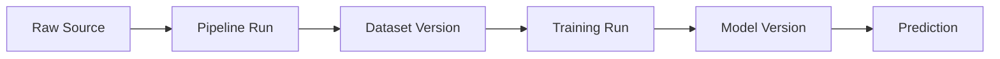

# Data Versioning and Lineage

Which exact rows produced the model currently serving traffic? For most teams, the honest answer is "we don't know" — the code is in Git, but the data that trained the model has moved on, been updated, or been silently overwritten since. A model is a function of code *and* data, and versioning only the code reproduces nothing.

:::info[Key idea]
A model is a function of code *and* data, so versioning only the code reproduces nothing.
:::

## Why Git alone fails for datasets

Git is designed for text, tracked as line-based diffs, with full history kept locally — none of which suits large binary or tabular datasets: diffs are meaningless for most data formats, full history quickly becomes enormous, and cloning a repository would mean downloading every historical dataset version ever committed. Data needs a different storage strategy, even while staying referenced from the same commit history that tracks code.

## Content-addressed storage for data

Store each dataset (or file) under a key derived from a hash of its own content — identical content always produces the identical key, and any change to the content produces a different key automatically. This gives natural deduplication (unchanged data across versions is stored once) and an unambiguous way to verify a given file is exactly the bytes it claims to be.

## Pointer files committed to Git, blobs stored elsewhere

The standard pattern: commit a small **pointer file** to Git (containing the content hash and metadata) while the actual data **blob** lives in separate, appropriately-scaled storage (object storage, a data lake). Git tracks which dataset version corresponds to which code commit, without ever having to store the data itself — solving Git's binary-data problem while keeping data and code versions linked.

## Immutable snapshots vs. mutable tables

**Immutable snapshot**: a dataset version, once created, never changes — new data means a new version. **Mutable table**: the table is updated in place (upserts, deletes) — simpler operationally, but a training run's "the data as of last Tuesday" becomes unrecoverable unless the table format explicitly supports time travel (below). Immutable snapshots trade storage cost for reproducibility guarantees that mutable tables don't offer by default.

## Dataset versions as first-class training inputs

Just as a training script takes a code commit as an implicit input, it should take a **dataset version** as an explicit one — recorded alongside the code version in [Experiment Tracking](./experiment-tracking.md), so a training run can be regenerated later from the exact same recorded inputs, not "whatever the data happened to look like when someone re-runs it."

## Lineage: tracing a prediction back through model, dataset, and pipeline run



**Lineage** is the ability to answer, for any live prediction: which model version produced it, which dataset version trained that model, which pipeline run produced that dataset, and which raw source fed that pipeline. Without this chain, debugging a bad prediction or a compliance question ("what data influenced this decision") has no reliable starting point.

## The tools landscape, described by mechanism rather than brand

**DVC**-style tools: Git-like pointer-file versioning for data, as described above. **lakeFS**-style tools: Git-like branching and versioning applied at the object-storage layer directly. **Table-format time travel** (Delta Lake, Iceberg): the table format itself retains historical versions, queryable by timestamp or version number, without needing a separate versioning layer at all. All three solve the same underlying problem (recoverable historical dataset state) via different mechanisms — pick based on what storage layer the rest of the stack already uses.

## Labelling and label versioning, and re-labelled data as a silent change

Labels change too — a labelling guideline gets refined, an error gets corrected, a human annotator disagrees with a prior one. A dataset with the *same* feature values but *different* labels, from a re-labelling pass, is a genuinely different training input and needs its own version — silently retraining on "the same dataset" that actually has updated labels is exactly the kind of untracked change this page exists to prevent.

## Deletion requests versus immutable snapshots, and how that tension is usually resolved

Privacy regulations (deletion requests, "right to be forgotten") can conflict directly with immutable-snapshot versioning — a snapshot is, by design, meant not to change. The usual resolution: apply deletions going forward (in new snapshots and in any active online systems) while retaining a documented, access-controlled policy for what happens to already-created historical snapshots, rather than promising true immutability *and* full ad-hoc deletion simultaneously, which are in real tension.

## A minimum viable versioning setup

1. Hash every dataset file; store the hash alongside the training run's metadata.
2. Never overwrite a dataset in place — write new versions, keep old ones addressable.
3. Record the dataset version (hash or pointer) in [Experiment Tracking](./experiment-tracking.md) for every run.
4. Assert the expected dataset version at evaluation time, failing loudly on mismatch.

| Symbol | Meaning |
|---|---|
| pointer file | small Git-tracked reference to a data blob stored elsewhere |
| lineage | the traceable chain from raw source to live prediction |

## Code: hash-based dataset fingerprinting, asserted at evaluation time

```python title="data_versioning_demo.py"
import hashlib
import pandas as pd
import json

def fingerprint_dataset(df: pd.DataFrame) -> str:
    """Content-addressed hash: identical data always produces the identical fingerprint."""
    content_bytes = pd.util.hash_pandas_object(df, index=True).values.tobytes()
    return hashlib.sha256(content_bytes).hexdigest()[:16]

def save_run_metadata(dataset_hash: str, code_commit: str, path: str = "run_metadata.json"):
    metadata = {"dataset_hash": dataset_hash, "code_commit": code_commit}
    with open(path, "w") as f:
        json.dump(metadata, f)
    return metadata

def assert_dataset_matches(df: pd.DataFrame, expected_hash: str):
    actual_hash = fingerprint_dataset(df)
    if actual_hash != expected_hash:
        raise ValueError(
            f"dataset mismatch: training was run on {expected_hash}, "
            f"evaluation is using {actual_hash} — refusing to proceed"
        )
    print(f"dataset version verified: {actual_hash}")

# --- Training time: fingerprint the dataset, record it alongside the code version ---
train_df = pd.DataFrame({"feature_a": [1, 2, 3], "label": [0, 1, 0]})
dataset_hash = fingerprint_dataset(train_df)
metadata = save_run_metadata(dataset_hash, code_commit="a3f9c21")
print(f"recorded training run metadata: {metadata}")

# --- Evaluation time: assert the dataset actually matches what was recorded ---
assert_dataset_matches(train_df, metadata["dataset_hash"])

# --- A silently modified dataset caught by the fingerprint check ---
modified_df = train_df.copy()
modified_df.loc[0, "feature_a"] = 999
try:
    assert_dataset_matches(modified_df, metadata["dataset_hash"])
except ValueError as e:
    print(f"\ncaught the mismatch: {e}")
```

## See also

- [Experiment Tracking](./experiment-tracking.md) — where dataset versions get recorded alongside every training run.
- [Reproducibility](./reproducibility.md) — the broader set of layers this page's data versioning is one piece of.
