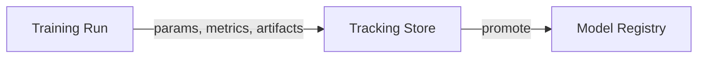

# Experiment Tracking

The best result ever achieved on a project, and no memory of exactly how it was produced — which hyperparameters, which data version, which code state. Without disciplined tracking, this happens constantly, and it's completely avoidable: log everything about every run, or the run effectively did not happen.

:::info[Key idea]
Log parameters, metrics, code version, data version, and environment for every run, or the run did not happen.
:::

## What to log, exhaustively

**Parameters**: every hyperparameter and configuration choice. **Metrics per step**: not just a final number, but the trajectory (loss, accuracy over training steps), which is often what actually reveals a problem. **Artefacts**: the model file, plots, confusion matrices, sample predictions. **Code version**: the exact Git commit. **Data version**: [Data Versioning and Lineage](./data-versioning-and-lineage.md)'s dataset fingerprint. **Environment**: library versions, hardware. **Seed**: for [Reproducibility](./reproducibility.md). **Wall time**: how long the run actually took, informing [Training Infrastructure and Cost](./training-infrastructure-and-cost.md). Missing any one of these can silently make a later "why was this run different" question unanswerable.

## Run organisation: experiments, runs, tags, nested runs

An **experiment** groups related **runs** (different hyperparameter configurations of the same underlying task) — providing a natural unit for comparison. **Tags** allow ad-hoc categorisation (a run's purpose, its author, its status) beyond the fixed experiment/run hierarchy. **Nested runs** let a single logical experiment (a hyperparameter sweep) contain many child runs, keeping the sweep's individual trials organised under one parent.

## Comparing runs, and what a good comparison answers

A good run comparison should directly answer: which configuration performed best on the metric that matters, what changed between the best and second-best run, and whether the difference is large enough to matter given [Reproducibility](./reproducibility.md)'s natural run-to-run variance — not just "which number is bigger," which can be noise.

## Metrics per step vs. per run

Logging only the final metric hides the training trajectory — a run that overfit late, or that was still improving when it was cut off, looks identical to a cleanly-converged one if only the final number is recorded. Logging metrics *per step* (or per epoch) preserves the shape of training, which is often diagnostically more useful than the endpoint alone.

## Artefacts: model files, plots, confusion matrices, sample predictions

Beyond scalar metrics, saving the actual model file, diagnostic plots, a confusion matrix, and a sample of representative predictions (especially wrong ones) alongside each run makes it possible to inspect *what the model actually did*, not just how it scored — invaluable when a metric looks fine but something is still qualitatively off.

## Autologging and its blind spots

Many tracking tools offer **autologging** — automatically capturing parameters and metrics from a recognised training framework's calls, with no manual instrumentation. Convenient, but it has blind spots: custom metrics, non-standard training loops, or anything computed outside the recognised framework calls won't be captured automatically and still needs explicit logging.

## The tools landscape by mechanism

**MLflow**: a tracking server storing runs, parameters, metrics, and artefacts, with a model registry built on top. **Weights & Biases (W&B)**: a hosted tracking service with similar core capabilities plus richer visualisation and collaboration features. **A plain SQLite/CSV baseline**: for a small project or solo work, a simple local database or even a structured CSV file logging the same fields (parameters, metrics, commit, data hash) is often genuinely sufficient — the mechanism (a durable, queryable record of every run) matters more than the specific tool.



## The discipline problem: tracking only works if it is automatic

Manual, remember-to-log-it tracking degrades over time — under deadline pressure, logging is exactly the kind of step that gets skipped "just this once." Tracking that's wired directly into the training script's execution path (so logging happens as a side effect of running training at all, not as a separate manual step) is the only version that reliably survives real usage.

## From tracked run to model registry

A tracked run is a *candidate* — [Model Registry and Packaging](./model-registry-and-packaging.md) is the step where a specific run's artefact gets promoted into something versioned, staged, and eligible for deployment, closing the loop from "an experiment happened" to "a servable model exists."

| Symbol | Meaning |
|---|---|
| run | one training execution with its logged parameters, metrics, and artefacts |
| experiment | a group of related runs |

## Code: a minimal SQLite tracking layer, then the same run with MLflow

```python title="experiment_tracking_demo.py"
import sqlite3
import json
import time

def init_tracking_db(path="tracking.db"):
    conn = sqlite3.connect(path)
    conn.execute("""
        CREATE TABLE IF NOT EXISTS runs (
            run_id TEXT PRIMARY KEY, params TEXT, metrics TEXT,
            git_sha TEXT, data_hash TEXT, wall_time REAL
        )
    """)
    return conn

def log_run(conn, run_id, params, metrics, git_sha, data_hash, wall_time):
    conn.execute(
        "INSERT INTO runs VALUES (?, ?, ?, ?, ?, ?)",
        (run_id, json.dumps(params), json.dumps(metrics), git_sha, data_hash, wall_time),
    )
    conn.commit()

# --- A real (tiny) training loop, instrumented with the minimal tracker ---
conn = init_tracking_db(":memory:")
params = {"n_estimators": 100, "max_depth": 5}
start = time.perf_counter()

from sklearn.datasets import make_classification
from sklearn.ensemble import RandomForestClassifier
from sklearn.model_selection import train_test_split

X, y = make_classification(n_samples=500, n_features=10, random_state=0)
X_train, X_test, y_train, y_test = train_test_split(X, y, random_state=0)
model = RandomForestClassifier(**params, random_state=0)
model.fit(X_train, y_train)
metrics = {"test_accuracy": model.score(X_test, y_test)}
wall_time = time.perf_counter() - start

log_run(conn, run_id="run_001", params=params, metrics=metrics,
         git_sha="a3f9c21", data_hash="d8e2f10a", wall_time=wall_time)

row = conn.execute("SELECT * FROM runs WHERE run_id = ?", ("run_001",)).fetchone()
print(f"logged run: {row}")

# --- The same run instrumented with MLflow, for comparison ---
# import mlflow
# with mlflow.start_run():
#     mlflow.log_params(params)
#     mlflow.log_metrics(metrics)
#     mlflow.set_tag("git_sha", "a3f9c21")
#     mlflow.sklearn.log_model(model, "model")
```

## See also

- [Reproducibility](./reproducibility.md) — the seed and environment details that belong in every logged run.
- [Model Registry and Packaging](./model-registry-and-packaging.md) — promoting a tracked run into a versioned, deployable artefact.
