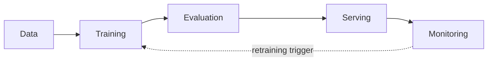

# From Notebook to Production

The model scores 0.94 in the notebook, and nobody can use it. This is the single most common gap in applied machine learning — not a modelling problem, but a systems problem, and this section exists entirely to close it.

:::info[Key idea]
Production ML is a systems problem in which the model is a small component - most of the failure surface is in data, interfaces, and time.
:::

## What "in production" actually requires

A model isn't in production merely because it runs once successfully. It needs to be **reproducible** (the exact result can be regenerated from recorded inputs), **servable** (something else can call it reliably, repeatedly, under load), **monitorable** (its behaviour over time is observable), and **revertible** (a bad version can be rolled back quickly). A notebook typically satisfies none of these by default.

## The notebook-to-service gap, enumerated

A notebook runs top-to-bottom, once, with global state and out-of-order cell execution possible. A service needs to run the *same* logic thousands of times, concurrently, with well-defined inputs and outputs, no hidden global state, and no dependency on which cells happened to run in which order during development. Closing this gap is mostly disciplined software engineering, not machine learning.

## The hidden-technical-debt argument, and which of its failure modes are still real

The well-known "hidden technical debt in machine learning systems" framing identified ML-specific debt sources beyond ordinary code debt: entanglement (changing one input changes everything downstream), correction cascades (patches on top of patches), and glue code binding disparate tools together. Years later, these remain accurate — better tooling has reduced some friction, but the underlying structural risks (a model output silently feeding into another model's training data, a pipeline of loosely-coupled scripts) are still exactly as real.

## The ML lifecycle as a loop



Production ML is not a one-way pipeline ending at deployment — it's a loop, where monitoring a deployed model's behaviour feeds back into when and how it gets retrained, covered fully in [Data and Concept Drift](./data-and-concept-drift.md).

## Team shape and ownership boundaries

Who owns what varies by organisation, but the recurring failure pattern is a hard hand-off with no shared interface: a data science team hands a `.pkl` file "over the wall" to an engineering team with no agreed contract for inputs, outputs, or retraining cadence. The healthier pattern makes the interface explicit regardless of team structure — [Model Registry and Packaging](./model-registry-and-packaging.md)'s versioned artefact is exactly that explicit interface.

## Maturity levels: manual, automated training, automated retraining

**Level 0 (manual)**: a data scientist manually trains, evaluates, and hands off a model, entirely by hand, each time. **Level 1 (automated training)**: training itself is a reproducible, triggerable pipeline, but retraining still requires a human decision to run it. **Level 2 (automated retraining)**: the pipeline retrains, evaluates, and (conditionally) promotes new models automatically, triggered by [CI/CD for ML](./ci-cd-for-ml.md)'s schedule or drift signal. Most teams should not jump straight to Level 2 — it requires trustworthy automated evaluation gates first.

## What to build first, and what is premature

Build first: a reproducible training script, a versioned model artefact, and a basic evaluation gate. Premature (until genuinely needed): a full feature store for a single model, automated retraining before evaluation is trustworthy, or a custom serving platform when a simple batch job would do. Most of this section's later pages describe capabilities that are valuable *eventually*, not necessarily on day one.

## A pre-production readiness checklist

1. Can the current model be regenerated from a recorded commit, dataset version, and environment?
2. Is there an automated evaluation gate the model must pass before being served?
3. Is there a way to roll back to the previous model version quickly?
4. Is there any monitoring on the model's live inputs or outputs?
5. Does anyone other than the original author know how to operate this?

## The honest case for not deploying a model at all

Sometimes the right answer is a simple rule-based system, or no automated decision at all — a model is only worth the operational cost above if it earns back that cost in value, and a well-understood heuristic that's easy to debug can genuinely outperform a marginally-more-accurate model that nobody can maintain or trust when it misbehaves.

## Code: a notebook cell versus the same logic as a versioned, tested module

```python title="notebook_cell_before.py"
# --- Representative notebook cell: works, but has no interface, no tests, no versioning ---
import pandas as pd
from sklearn.ensemble import RandomForestClassifier

df = pd.read_csv("data.csv")            # hardcoded path, no schema check
df = df.dropna()                        # silent row loss, no logging
X = df[["age", "income", "score"]]      # column names hardcoded inline
y = df["label"]
model = RandomForestClassifier(n_estimators=100)
model.fit(X, y)
print(model.score(X, y))                # evaluated on the training set itself
```

```python title="training_module_after.py"
from dataclasses import dataclass
import pandas as pd
from sklearn.ensemble import RandomForestClassifier
from sklearn.model_selection import train_test_split

REQUIRED_COLUMNS = ["age", "income", "score", "label"]

@dataclass
class TrainingResult:
    model: RandomForestClassifier
    train_accuracy: float
    test_accuracy: float
    n_rows_dropped: int

def load_and_validate(path: str) -> pd.DataFrame:
    df = pd.read_csv(path)
    missing = set(REQUIRED_COLUMNS) - set(df.columns)
    if missing:
        raise ValueError(f"missing required columns: {missing}")  # loud failure, not silent
    return df

def train(path: str, n_estimators: int = 100, random_state: int = 0) -> TrainingResult:
    df = load_and_validate(path)
    n_before = len(df)
    df = df.dropna(subset=REQUIRED_COLUMNS)
    n_dropped = n_before - len(df)

    X, y = df[["age", "income", "score"]], df["label"]
    X_train, X_test, y_train, y_test = train_test_split(X, y, test_size=0.2, random_state=random_state)

    model = RandomForestClassifier(n_estimators=n_estimators, random_state=random_state)
    model.fit(X_train, y_train)

    return TrainingResult(
        model=model,
        train_accuracy=model.score(X_train, y_train),
        test_accuracy=model.score(X_test, y_test),  # evaluated on held-out data, not training data
        n_rows_dropped=n_dropped,
    )

if __name__ == "__main__":
    result = train("data.csv")
    print(f"train acc={result.train_accuracy:.3f}, test acc={result.test_accuracy:.3f}, "
          f"rows dropped={result.n_rows_dropped}")
```

## See also

- [The ML Workflow](../00-foundations/the-ml-workflow.md) — the modelling process this section wraps with production concerns.
- [CI/CD for ML](./ci-cd-for-ml.md) — automating the path this page describes manually.
