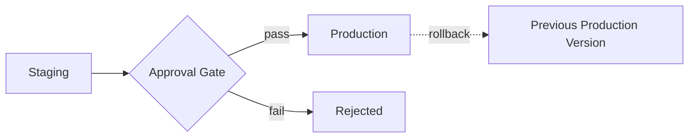

# Model Registry and Packaging

The file called `model_final_v2_actually_final.pkl` — every team has one, and it's a symptom, not a joke. A model artefact is only genuinely useful with the preprocessing, schema, and metadata needed to call it correctly; package those together properly, or ship a bug the moment they drift apart.

:::info[Key idea]
A model artefact is only useful with the preprocessing, schema, and metadata needed to call it correctly - package those together or ship a bug.
:::

## What a model artefact must contain

Beyond the raw weights: the **preprocessing** logic (so serving reconstructs the exact same input transformation training used — directly [Deploying Vision Models](../04-computer-vision/deploying-vision-models.md)'s preprocessing-parity concern, generalised beyond vision), the **input and output schema**, a **version**, and **training metadata** (which run produced it, on which dataset version). A bare weights file with none of this is a bug waiting to happen the moment anyone other than its author tries to use it.

## Serialisation formats

**Pickle**: Python's native serialisation, convenient but with a serious **security problem** — a pickled file can execute arbitrary code on load, making it unsafe to load from any untrusted source. **Safetensors**: a format specifically designed to avoid pickle's arbitrary-code-execution risk, storing only tensor data. **TorchScript**: PyTorch's own serialisation for deployment outside a full Python environment. **ONNX**: a framework-agnostic format for cross-runtime portability, as in [Deploying Vision Models](../04-computer-vision/deploying-vision-models.md).

## Never load an untrusted pickled artefact

This bears restating plainly: loading a `.pkl` file from an unverified source is equivalent to running unverified code — treat pickled model files with the same suspicion as an unverified executable, and prefer safetensors or another non-executable format wherever the artefact's provenance isn't fully trusted.

## The model registry: versions, stages, lineage back to a run

A **model registry** tracks every trained model version, its **stage** (staging, production, archived), and its **lineage** back to the exact [Experiment Tracking](./experiment-tracking.md) run that produced it — turning "which model is currently live, and where did it come from" into a directly answerable query, rather than institutional memory.

## The promotion workflow, with an approval gate



A model moves through explicit **stages** — typically staging (available for further testing) then production (actively serving) — with an **approval gate** between them, whether that gate is automated ([Offline Evaluation](./offline-evaluation.md)'s suite) or a human sign-off, or both.

## Immutable versions, mutable aliases

Each registered model **version** is immutable once created — it never changes. An **alias** (like "production" or "latest-stable") is a mutable *pointer* to whichever version currently holds that role. This separation is what makes rollback simple: moving the "production" alias back to a previous immutable version, rather than needing to somehow "undo" changes to a mutable artefact.

## Rollback as a first-class operation

Rollback should be a single, fast, well-tested operation — not an improvised recovery under pressure during an incident. If promoting a new model is automated, reverting the promotion needs to be exactly as automated and exactly as fast, or the asymmetry becomes a real operational risk precisely when speed matters most.

## Containerising a model service

Packaging the model artefact together with its serving code and exact runtime dependencies into a container image gives a single, reproducibly-deployable unit — directly extending [Reproducibility](./reproducibility.md)'s environment-pinning discussion to the deployed service itself, not just the training run.

## Dependency pinning, and the environment mismatch that breaks inference

A model trained with one library version and served with a different one can silently produce different outputs — the same numerical or default-behaviour differences [Reproducibility](./reproducibility.md) flagged for training apply equally, often more severely, at inference time, where there's no obvious "training run" to compare against when something looks wrong.

## A model card recording intended use and known limitations

A **model card** documents, in plain language: what the model is intended to be used for, what data it was trained on, its known limitations and failure modes, and its evaluated performance across relevant slices — the accountability documentation [Responsible AI and Failure Modes](./responsible-ai-and-failure-modes.md) requires, and a genuinely useful reference for anyone deciding whether to reuse the model for a new purpose.

| Symbol | Meaning |
|---|---|
| version | an immutable, registered model artefact |
| alias | a mutable pointer to a specific version (e.g. "production") |

## Code: packaging a model with schema validation, refusing on mismatch

```python title="model_registry_demo.py"
import json
import pickle
import hashlib
from pathlib import Path
from sklearn.datasets import make_classification
from sklearn.pipeline import Pipeline
from sklearn.preprocessing import StandardScaler
from sklearn.linear_model import LogisticRegression

def package_model(pipeline: Pipeline, schema: dict, version: str, output_dir: str):
    out_path = Path(output_dir) / version
    out_path.mkdir(parents=True, exist_ok=True)

    with open(out_path / "model.pkl", "wb") as f:
        pickle.dump(pipeline, f)

    metadata = {
        "version": version,
        "schema": schema,
        "model_hash": hashlib.sha256(pickle.dumps(pipeline)).hexdigest()[:16],
    }
    with open(out_path / "metadata.json", "w") as f:
        json.dump(metadata, f, indent=2)
    return out_path

class SchemaValidationError(Exception):
    pass

def load_and_validate(artefact_dir: str, expected_input_columns: list[str]):
    artefact_dir = Path(artefact_dir)
    with open(artefact_dir / "metadata.json") as f:
        metadata = json.load(f)

    registered_columns = metadata["schema"]["input_columns"]
    if registered_columns != expected_input_columns:
        raise SchemaValidationError(
            f"schema mismatch: artefact expects {registered_columns}, caller provided {expected_input_columns}"
        )

    with open(artefact_dir / "model.pkl", "rb") as f:
        pipeline = pickle.load(f)  # safe here only because we produced this artefact ourselves
    return pipeline, metadata

# --- Train and package a model with its schema ---
X, y = make_classification(n_samples=200, n_features=4, random_state=0)
pipeline = Pipeline([("scaler", StandardScaler()), ("classifier", LogisticRegression())])
pipeline.fit(X, y)

schema = {"input_columns": ["age", "income", "score", "tenure"], "output": "binary_label"}
artefact_path = package_model(pipeline, schema, version="v1.2.0", output_dir="/tmp/model_registry")
print(f"packaged model at: {artefact_path}")

# --- Loading with the correct schema succeeds ---
loaded_pipeline, metadata = load_and_validate(artefact_path, ["age", "income", "score", "tenure"])
print(f"loaded model version {metadata['version']}, hash {metadata['model_hash']}")

# --- Loading with a mismatched schema refuses, rather than silently misaligning columns ---
try:
    load_and_validate(artefact_path, ["age", "income", "score"])  # missing "tenure"
except SchemaValidationError as e:
    print(f"\nrefused to load on schema mismatch: {e}")
```

## See also

- [Experiment Tracking](./experiment-tracking.md) — the run a registered model version traces its lineage back to.
- [Serving Patterns](./serving-patterns.md) — where a registered, packaged model actually gets deployed.
