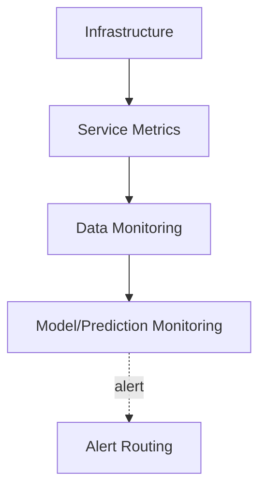

# Monitoring and Observability

Models fail silently. They keep returning confident, plausible-looking answers that are simply wrong, with no crash, no error, nothing that would trip a standard software alert — the only way to catch this is to watch the inputs and predictions continuously, because the ground truth needed to know an answer was wrong often arrives late, or never.

:::info[Key idea]
Monitor the inputs and the predictions continuously, because ground truth arrives late or never.
:::

## The four layers: infrastructure, service, data, model

**Infrastructure**: CPU, memory, disk, network — standard systems monitoring, not ML-specific. **Service**: latency, error rate, throughput — standard API monitoring. **Data**: are the inputs the model is receiving what's expected. **Model**: are the predictions the model is producing what's expected. The first two layers are well-understood from general software operations; the latter two are specifically what ML systems need beyond that baseline.

## Service metrics as table stakes

Latency, error rate, and throughput — the standard monitoring triad for any served API, and a prerequisite before ML-specific monitoring is worth building at all. If the service itself isn't reliably observable at this basic level, data and model monitoring will be built on an unreliable foundation.

## Input monitoring: schema violations, missing rates, range violations, distribution statistics

Continuously tracking the same properties [Data Pipelines and Contracts](./data-pipelines-and-contracts.md) validates at ingestion, but now on *live serving inputs*: schema violations, the rate of missing values per feature, out-of-range values, and summary distribution statistics (mean, variance, quantiles) per feature over time — catching an upstream change that broke the contract, applied at inference time rather than only at training-data ingestion.

## Prediction monitoring: output distribution, confidence distribution, class balance

Track the model's *output* distribution over time too — the distribution of predicted classes, the distribution of confidence scores. A sudden shift in either (predictions skewing heavily toward one class, average confidence dropping) is often visible well before any labelled ground truth confirms an actual accuracy problem.

## Performance monitoring when labels are delayed

When ground-truth labels eventually arrive (a loan default confirmed months later, a fraud case resolved after investigation), join them back to the original predictions to compute *true* performance metrics retrospectively — necessarily delayed, but still the most direct signal available once it exists.

## Proxy metrics when labels never arrive

For some tasks, ground truth may never arrive at all (a recommendation the user never acted on either way). In that case, **proxy metrics** — click-through rate, downstream engagement, any correlated but imperfect signal — are the best available substitute, understood explicitly as approximations rather than ground truth.

## Logging predictions for later joining with outcomes

Every production prediction should be logged with enough context (the input, the prediction, a timestamp, an identifier) to be joined with a later-arriving outcome — without this logging in place from the start, delayed-label performance monitoring above is simply impossible to retrofit after the fact.

## A sampling strategy for high-volume logging

Logging every single prediction at high request volume can itself become a cost and storage burden — a deliberate sampling strategy (log a representative fraction, or oversample specific interesting cases like low-confidence predictions) balances monitoring coverage against that cost.

## Alert design: thresholds that fire on real problems, and alert fatigue as the failure mode

A good alert threshold fires on genuine problems and stays silent otherwise — too sensitive, and **alert fatigue** sets in (people start ignoring alerts because most are false alarms, exactly when a real one eventually needs attention). Thresholds derived from a metric's historical variance (rather than an arbitrary fixed number) tend to distinguish genuine anomalies from ordinary noise more reliably.

## Dashboards worth having

A small number of well-chosen dashboards — one for service health, one for input/prediction distributions, one for delayed-performance metrics — beats a sprawling collection nobody actually looks at regularly. Dashboard value comes from being checked, not from existing.

## The incident runbook for a model regression

A documented, rehearsed procedure for what to do when monitoring flags a real problem: who's notified, how to check whether it's a data issue or a model issue, how to roll back ([Model Registry and Packaging](./model-registry-and-packaging.md)'s rollback operation), and how to communicate the incident — improvised incident response under pressure is slower and more error-prone than a rehearsed one.

## Privacy constraints on logging inputs

Logging raw prediction inputs for monitoring can itself create a privacy or compliance liability if those inputs contain sensitive personal information — monitoring pipelines need the same data-handling discipline (redaction, access control, retention limits) as any other system touching that data, not an exemption because the purpose is "just monitoring."



| Symbol | Meaning |
|---|---|
| proxy metric | an available but imperfect substitute for a delayed or unobtainable true label |
| alert fatigue | the failure mode where over-sensitive alerts get ignored |

## Code: input and prediction monitoring against a stored training reference

```python title="monitoring_demo.py"
import numpy as np
import pandas as pd

def compute_reference_stats(df: pd.DataFrame, numeric_columns: list[str]) -> dict:
    return {col: {"mean": df[col].mean(), "std": df[col].std()} for col in numeric_columns}

def monitor_batch(batch: pd.DataFrame, reference_stats: dict, expected_columns: list[str],
                   n_std_threshold: float = 3.0) -> list[dict]:
    alerts = []

    missing_cols = set(expected_columns) - set(batch.columns)
    if missing_cols:
        alerts.append({"type": "schema_violation", "detail": f"missing columns: {missing_cols}"})

    for col, stats in reference_stats.items():
        if col not in batch.columns:
            continue
        missing_rate = batch[col].isna().mean()
        if missing_rate > 0.05:
            alerts.append({"type": "missing_rate", "column": col, "rate": round(missing_rate, 3)})

        batch_mean = batch[col].mean()
        z_score = abs(batch_mean - stats["mean"]) / (stats["std"] + 1e-8)
        if z_score > n_std_threshold:
            alerts.append({
                "type": "distribution_shift", "column": col,
                "reference_mean": round(stats["mean"], 3), "batch_mean": round(batch_mean, 3),
                "z_score": round(z_score, 2),
            })
    return alerts

# --- Establish a reference from training-time data ---
rng = np.random.default_rng(0)
training_data = pd.DataFrame({
    "age": rng.normal(40, 12, 1000),
    "income": rng.normal(60000, 15000, 1000),
})
reference_stats = compute_reference_stats(training_data, ["age", "income"])

# --- A healthy live batch: no alerts expected ---
healthy_batch = pd.DataFrame({"age": rng.normal(40, 12, 200), "income": rng.normal(60000, 15000, 200)})
print("healthy batch alerts:", monitor_batch(healthy_batch, reference_stats, ["age", "income"]))

# --- A shifted live batch: income distribution has drifted significantly ---
shifted_batch = pd.DataFrame({"age": rng.normal(40, 12, 200), "income": rng.normal(90000, 15000, 200)})
print("\nshifted batch alerts:", monitor_batch(shifted_batch, reference_stats, ["age", "income"]))
```

## See also

- [Data and Concept Drift](./data-and-concept-drift.md) — the deeper statistical tests behind the distribution-shift alerts this page introduces.
- [Online Evaluation and A/B Testing](./online-evaluation-and-ab-testing.md) — the guardrail metrics this monitoring feeds into during a live experiment.
