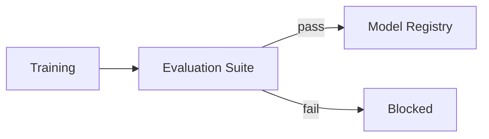

# Offline Evaluation

One aggregate number hides every failure that matters. A model at 94% accuracy can be failing badly on a 5% subgroup, systematically wrong in a specific, predictable direction, or actively worse than the model it's replacing on the exact cases that matter most — none of which a single headline metric will ever reveal.

:::info[Key idea]
Build an evaluation suite, not a metric - slices, invariants, and regression tests that a single accuracy number cannot express.
:::

## Why the headline metric is insufficient

A single aggregate metric ([Evaluation Metrics for Classification](../00-foundations/evaluation-metrics-classification.md)) is a weighted average across the entire evaluation set — it can stay flat, or even improve, while performance on a specific important subgroup degrades badly, as long as that subgroup is a small enough fraction of the total. The aggregate number is a summary, not a diagnosis.

## Slice-based evaluation: performance per segment

Compute the metric separately for meaningful **slices** of the data — by demographic group, by input length, by data source, by any dimension plausibly correlated with different failure behaviour — rather than only over the whole set. Finding which slices matter usually requires domain knowledge about where the model is likely to behave unevenly, combined with actually looking at where errors cluster.

## The frozen golden set, and rules for changing it

A **golden set** is a fixed, curated evaluation set used consistently across model versions, so metric changes over time reflect genuine model changes, not shifting evaluation criteria. Changing the golden set should be rare, deliberate, and versioned — silently swapping in a different evaluation set makes historical metric comparisons meaningless.

## Behavioural testing for models

Beyond aggregate metrics: **invariance tests** (the prediction should not change under a transformation that shouldn't matter — a name change in a resume screener, a synonym swap in a sentiment classifier). **Directional expectation tests** (the prediction should move in a known direction under a specific input change — increasing income should not decrease a loan-approval score, all else equal). **Minimum-functionality tests** (simple, unambiguous cases the model must get right — a targeted unit-test-like check).

## Regression tests against the currently deployed model, not just against a threshold

Testing only "does this exceed a fixed threshold" misses a common failure: a new model that's slightly better on the aggregate metric but has regressed on a specific slice or behavioural test the previous model passed. Comparing directly against the *currently deployed* model, example by example, surfaces this kind of targeted regression that a threshold check alone cannot.

## Error analysis as a scheduled activity

Systematically reviewing a sample of the model's actual errors — not just their count, but their nature — on a regular cadence (not only when something visibly breaks) surfaces failure patterns that no automated metric captures on its own: a specific input format the model handles poorly, a systematic bias in a particular direction.

## Confidence intervals on metrics, and sample-size requirements

A metric computed on a finite evaluation set is itself an estimate with uncertainty — reporting a bare point estimate ("accuracy: 0.847") without a confidence interval invites over-interpreting differences that are within the set's natural sampling noise. The evaluation set needs to be large enough that the resulting interval is narrow enough to distinguish the comparisons that actually matter.

$$
\hat{p} \pm z \sqrt{\frac{\hat{p}(1-\hat{p})}{n}}
$$

The standard confidence interval for a proportion (such as accuracy), where $n$ is the evaluation set size — directly showing that a small evaluation set produces a wide, often uselessly uninformative interval.

## Comparing two models honestly (paired tests on the same examples)

Comparing two models' aggregate metrics computed on different evaluation samples conflates the models' actual difference with sampling noise between the two samples. A **paired test** — both models evaluated on the *exact same* examples, differences analysed per-example — removes that confound and gives a much more sensitive, honest comparison.

## Baselines that must always be reported

A random baseline, a majority-class baseline, and (where one exists) the currently-deployed model's own metric — reported alongside every new model's result, so a metric is interpreted relative to what's actually achievable and what's already in production, not in isolation.

## Assembling all of this into a single command that either passes or fails

The end goal: a single, automated evaluation command that runs the full suite (aggregate metric, slices, behavioural tests, regression comparison) and exits with a clear pass/fail — this is exactly the gate [CI/CD for ML](./ci-cd-for-ml.md) wires into an automated promotion pipeline.



| Symbol | Meaning |
|---|---|
| golden set | the fixed, versioned evaluation set used across model versions |
| slice | a meaningful subgroup of the evaluation data, evaluated separately |

## Code: a reusable evaluation harness with slices, behavioural tests, and a regression gate

```python title="offline_evaluation_demo.py"
import numpy as np
from sklearn.datasets import make_classification
from sklearn.linear_model import LogisticRegression
from sklearn.model_selection import train_test_split
from scipy.stats import norm

def confidence_interval(accuracy: float, n: int, z: float = 1.96) -> tuple[float, float]:
    margin = z * np.sqrt(accuracy * (1 - accuracy) / n)
    return accuracy - margin, accuracy + margin

def evaluate_with_slices(model, X, y, slice_mask, slice_name):
    overall_acc = model.score(X, y)
    slice_acc = model.score(X[slice_mask], y[slice_mask]) if slice_mask.sum() > 0 else None
    lo, hi = confidence_interval(overall_acc, len(y))
    print(f"overall accuracy: {overall_acc:.3f} (95% CI: [{lo:.3f}, {hi:.3f}])")
    if slice_acc is not None:
        print(f"slice '{slice_name}' accuracy: {slice_acc:.3f} (n={slice_mask.sum()})")
    return overall_acc, slice_acc

# --- Train a model and a synthetic "slice" (e.g. a demographic subgroup proxy) ---
X, y = make_classification(n_samples=1000, n_features=10, random_state=0)
X_train, X_test, y_train, y_test = train_test_split(X, y, random_state=0)
model = LogisticRegression().fit(X_train, y_train)
slice_mask = X_test[:, 0] > 0  # a synthetic slice defined by one feature

evaluate_with_slices(model, X_test, y_test, slice_mask, "feature_0_positive")

# --- Behavioural tests: invariance and minimum-functionality ---
def invariance_test(model, x, perturbation_fn, tolerance=0.0):
    original_pred = model.predict(x.reshape(1, -1))[0]
    perturbed_pred = model.predict(perturbation_fn(x).reshape(1, -1))[0]
    assert original_pred == perturbed_pred, "invariance test failed: prediction changed unexpectedly"

sample = X_test[0]
invariance_test(model, sample, lambda x: x + np.array([0, 0, 0, 0, 0, 0, 0, 0, 0, 1e-6]))
print("\ninvariance test passed: negligible perturbation on an irrelevant feature")

# --- Regression gate: fail if the new model is worse than the champion on ANY slice ---
def regression_gate(new_model, champion_model, X, y, slice_mask, tolerance=0.02):
    new_slice_acc = new_model.score(X[slice_mask], y[slice_mask])
    champion_slice_acc = champion_model.score(X[slice_mask], y[slice_mask])
    regressed = new_slice_acc < champion_slice_acc - tolerance
    return not regressed, new_slice_acc, champion_slice_acc

champion = LogisticRegression().fit(X_train, y_train)  # stand-in for the currently deployed model
passed, new_acc, champion_acc = regression_gate(model, champion, X_test, y_test, slice_mask)
print(f"\nregression gate: {'PASS' if passed else 'FAIL'} "
      f"(new={new_acc:.3f}, champion={champion_acc:.3f})")
```

## See also

- [Evaluation Metrics for Classification](../00-foundations/evaluation-metrics-classification.md) — the metric definitions this page's aggregate numbers are built from.
- [Online Evaluation and A/B Testing](./online-evaluation-and-ab-testing.md) — the next gate, measuring what offline evaluation cannot.
