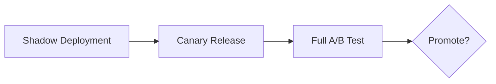

# Online Evaluation and A/B Testing

The offline metric improved, and the business metric did not. This gap is common enough to expect it as the default outcome, not a surprising exception — offline metrics are proxies, and only a genuine online experiment measures the thing actually being optimised for.

:::info[Key idea]
Offline metrics are proxies; only an online experiment measures the thing you actually care about.
:::

## Why offline and online results diverge

**Feedback loops**: a deployed model's predictions can change future user behaviour, which then changes the data the model sees next — an effect no static offline evaluation set can capture. **Distribution shift**: live traffic drifts from the offline evaluation set over time ([Data and Concept Drift](./data-and-concept-drift.md)). **Proxy mismatch**: the offline metric (accuracy, F1) is rarely the actual business goal (revenue, retention, satisfaction) — it's a proxy chosen because it's measurable offline, and proxies can diverge from what they're meant to approximate.

## Shadow deployment: run the new model, serve the old one

Run the new model on live traffic *in parallel* with the currently-serving model, logging its predictions without ever actually serving them to users — a zero-risk way to observe how the new model would behave on genuinely live data before it affects anyone, catching gross problems before any real exposure.

## Canary releases and progressive rollout

Serve the new model to a small percentage of real traffic (a **canary**), monitor closely, and progressively increase that percentage if metrics hold — limiting the blast radius of an undetected problem to a small fraction of users at each stage, rather than exposing everyone at once.

## A/B tests: the randomisation unit, and the trap of randomising by request instead of by user

An **A/B test** randomly assigns traffic to the current model (control) or the new model (treatment), comparing outcomes. The **randomisation unit** matters critically: randomising by *request* rather than by *user* means the same user can see both variants across different requests — contaminating the comparison, since a user's later behaviour may be influenced by an earlier request that landed in the other arm. Randomising consistently by user (or account) avoids this specific, common trap.

## Primary metric, guardrail metrics, and pre-registration

Choose one **primary metric** the test is actually judging success by, plus **guardrail metrics** that must not regress even if the primary metric improves (latency, error rate, an unrelated business metric) — and **pre-register** both before launching the test. Deciding the success metric *after* seeing results invites unconsciously picking whichever metric happened to look favourable.

## Sample size and test duration, computed before launching

$$
n \approx \frac{2 (z_{\alpha/2} + z_\beta)^2 \, p(1-p)}{\delta^2}
$$

The required sample size (per arm) for a two-proportion test, given a target **minimum detectable effect** $\delta$, baseline rate $p$, and desired significance/power — computed *before* launching, so the test runs for a pre-determined duration rather than an ad-hoc "until it looks done."

## Novelty and primacy effects

**Novelty effect**: users react differently to something new simply because it's new, independent of its actual merit — inflating early results in a way that fades. **Primacy effect**: users initially resist a change out of habit, understating a genuinely better variant's true effect until they adjust. Both distort short-duration test results in opposite directions, and are a reason to run tests long enough to let the initial reaction settle.

## Peeking, and why it inflates false positives

Checking a test's results repeatedly and stopping as soon as significance is reached ("peeking") inflates the false-positive rate substantially above the nominal significance level — each additional look is another chance for noise to cross the significance threshold by pure luck. Fixed test duration, decided in advance, or a properly-designed sequential testing method (not ad-hoc peeking) are the two valid alternatives.

## Interference between arms

If treatment and control users interact with each other (a marketplace, a social network), one arm's behaviour can leak into and contaminate the other — violating the independence assumption underlying standard A/B test statistics, and requiring specialised experimental designs (cluster randomisation, for instance) to address correctly.

## Interleaving for ranking systems

For ranking or recommendation systems specifically, **interleaving** — mixing results from both the control and treatment ranker into a single list shown to the same user, then attributing engagement to whichever ranker each clicked result came from — is often far more statistically sensitive than a standard between-user A/B test, detecting smaller true differences with much less traffic.

## Multi-armed bandits as the alternative to a fixed split

Rather than a fixed 50/50 (or other static) split for the whole test duration, a [Exploration Strategies](../06-reinforcement-learning/exploration-strategies.md)-style multi-armed bandit dynamically shifts traffic toward the better-performing arm as evidence accumulates — trading some statistical rigour (a fixed-split test's interpretation is cleaner) for reduced regret (less traffic wasted on the losing arm during the test itself).

## Reading a result honestly, including the null one

A test that finds no significant difference is not a failed test — it's informative evidence that the new model didn't help (at least on the metric and effect size tested), and reporting it honestly (rather than searching post-hoc for a subgroup where it "worked") is what keeps the whole experimentation process trustworthy over time.



| Symbol | Meaning |
|---|---|
| $\delta$ | the minimum detectable effect |
| $n$ | required sample size per arm |

## Code: a sample-size calculator, and simulating false-positive inflation from peeking

```python title="ab_testing_demo.py"
import numpy as np
from scipy.stats import norm

def sample_size_two_proportion(baseline_rate: float, min_detectable_effect: float,
                                 alpha: float = 0.05, power: float = 0.8) -> int:
    z_alpha = norm.ppf(1 - alpha / 2)
    z_beta = norm.ppf(power)
    p = baseline_rate
    n = 2 * (z_alpha + z_beta) ** 2 * p * (1 - p) / (min_detectable_effect ** 2)
    return int(np.ceil(n))

n_required = sample_size_two_proportion(baseline_rate=0.10, min_detectable_effect=0.02)
print(f"required sample size per arm: {n_required}")

# --- Simulate the false-positive inflation caused by repeated peeking ---
rng = np.random.default_rng(0)

def run_ab_test_with_peeking(n_peeks, true_rate=0.10, n_per_peek=100):
    """Both arms have the SAME true rate (no real effect) — any 'significant' result is a false positive."""
    control, treatment = [], []
    for _ in range(n_peeks):
        control.extend(rng.binomial(1, true_rate, n_per_peek))
        treatment.extend(rng.binomial(1, true_rate, n_per_peek))
        p_control, p_treatment = np.mean(control), np.mean(treatment)
        n = len(control)
        pooled = (p_control + p_treatment) / 2
        se = np.sqrt(2 * pooled * (1 - pooled) / n)
        z = (p_treatment - p_control) / se if se > 0 else 0
        if abs(z) > 1.96:  # "significant" at alpha=0.05
            return True  # stopped early on a false positive
    return False

n_trials = 500
false_positive_rate_no_peeking = np.mean([run_ab_test_with_peeking(n_peeks=1, n_per_peek=1000) for _ in range(n_trials)])
false_positive_rate_with_peeking = np.mean([run_ab_test_with_peeking(n_peeks=10, n_per_peek=100) for _ in range(n_trials)])

print(f"\nfalse-positive rate, single fixed-duration look: {false_positive_rate_no_peeking:.3f}  (should be near 0.05)")
print(f"false-positive rate, 10 peeks with early stopping: {false_positive_rate_with_peeking:.3f}  (inflated)")
```

## See also

- [Offline Evaluation](./offline-evaluation.md) — the gate an online test only runs after already passing.
- [Monitoring and Observability](./monitoring-and-observability.md) — the always-on measurement an A/B test's guardrail metrics feed into.
