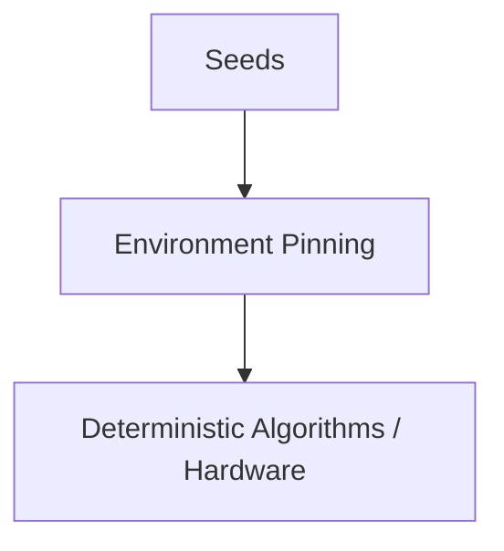

# Reproducibility

Same code, same data, different result. This should be alarming, and it usually traces to one of a small, well-understood set of non-determinism sources — reproducibility is layered, and the right response is deciding which layer actually matters before paying for the strictest possible guarantee.

:::info[Key idea]
Reproducibility is layered - seeds, environment, hardware - and you should decide which layer you actually need before paying for the strictest one.
:::

## The sources of non-determinism, ranked by how often they bite

**Unseeded RNGs**: the single most common cause — any random number generator (weight init, shuffling, dropout) left unseeded. **Data order**: shuffling with a different seed, or a data loader with non-deterministic iteration order. **Library versions**: a minor version bump changing a default or an internal algorithm. **Non-deterministic GPU kernels**: some CUDA operations are non-deterministic by default, for performance reasons, even with a fixed seed. **Parallel reduction order**: floating-point addition isn't associative, so summing values in a different order (as parallel workers naturally do) produces tiny numerical differences. **Hardware**: different GPU architectures can produce different floating-point results for the identical computation. Roughly in this order of how often each one is actually the culprit.

## Seeding correctly: Python, NumPy, PyTorch, CUDA, and DataLoader workers

Setting `random.seed()` alone is a common, incomplete fix — a genuinely reproducible run needs Python's `random`, NumPy's RNG, PyTorch's CPU *and* CUDA RNGs, and (separately) each `DataLoader` worker process's own RNG state, since worker processes don't automatically inherit the parent process's seed.

## Deterministic-algorithm modes and their performance cost

Frameworks like PyTorch offer a "deterministic algorithms" mode, forcing every operation to use a deterministic implementation even where a faster non-deterministic one exists — this closes the non-deterministic-GPU-kernel gap directly, at a real, sometimes substantial, throughput cost. Whether that cost is worth paying depends entirely on which reproducibility guarantee (below) is actually needed.

## Environment pinning: lockfiles and containers

Library version differences are addressed by **lockfiles** (exact, pinned dependency versions, not just version ranges) and, for full environment reproducibility including system libraries and hardware drivers, **containers** — a lockfile alone doesn't pin the underlying OS or CUDA toolkit version, which containers do.

## Exact reproducibility vs. statistical reproducibility, and which one you actually need

**Exact reproducibility**: bit-identical output, every time, requiring every layer above addressed simultaneously — genuinely expensive, and rarely actually necessary. **Statistical reproducibility**: results that are consistent *in distribution* across runs — similar final metrics, similar behaviour, even if not bit-identical — usually the actually useful guarantee, achievable with far less effort (seeding, without necessarily deterministic-algorithm mode).

## Reporting mean and standard deviation across seeds rather than a single number

A single run's metric is one sample from a distribution of possible outcomes under different seeds — reporting only that one number silently hides how much of the reported improvement is real signal versus run-to-run noise. Reporting mean ± standard deviation across several seeds is the honest way to represent a result, and is directly what determines whether an observed improvement is meaningful at all.

## Reproducibility as a debugging tool, not bureaucracy

The most immediately practical use of reproducibility discipline: when a training run behaves strangely, the ability to re-run it *exactly* and observe the same behaviour is what makes systematic debugging possible at all — without it, every debugging attempt introduces new randomness that might itself explain away (or introduce) the symptom being investigated, exactly the situation [Debugging Neural Networks](../02-deep-learning/debugging-neural-networks.md) needs reproducibility to avoid.

## A practical checklist by strictness level

| Level | What's needed |
|---|---|
| Debugging a specific run | seed everything, deterministic-algorithm mode |
| Comparing two configurations honestly | seed everything, multiple seeds, report mean ± std |
| Regulatory/audit exact reproduction | seeding + lockfile + container + deterministic mode, all four |



| Symbol | Meaning |
|---|---|
| seed | the fixed initial state of a random number generator |
| lockfile | an exact, pinned record of every dependency version |

## Code: a complete set_seed helper, and the spread with and without it

```python title="reproducibility_demo.py"
import random
import numpy as np
import torch

def set_seed(seed: int):
    random.seed(seed)
    np.random.seed(seed)
    torch.manual_seed(seed)
    torch.cuda.manual_seed_all(seed)  # no-op if no GPU present, safe to call regardless

def worker_init_fn(worker_id):
    """Passed to DataLoader(worker_init_fn=...) so each worker's RNG is also seeded."""
    seed = torch.initial_seed() % (2**32)
    np.random.seed(seed)
    random.seed(seed)

def tiny_training_run(seed=None):
    if seed is not None:
        set_seed(seed)
    model = torch.nn.Linear(4, 1)
    x = torch.randn(20, 4)
    y = torch.randn(20, 1)
    optimizer = torch.optim.SGD(model.parameters(), lr=0.1)
    for _ in range(10):
        optimizer.zero_grad()
        loss = torch.nn.functional.mse_loss(model(x), y)
        loss.backward()
        optimizer.step()
    return loss.item()

# --- Without seeding: three runs, different final losses ---
unseeded_losses = [tiny_training_run() for _ in range(3)]
print(f"unseeded final losses: {[f'{l:.4f}' for l in unseeded_losses]}  (should differ)")

# --- With seeding: three runs, identical final losses ---
seeded_losses = [tiny_training_run(seed=42) for _ in range(3)]
print(f"seeded final losses:   {[f'{l:.4f}' for l in seeded_losses]}  (should be identical)")

# --- Reporting a result across five seeds, mean and standard deviation ---
five_seed_losses = [tiny_training_run(seed=s) for s in range(5)]
print(f"\nfive-seed result: {np.mean(five_seed_losses):.4f} ± {np.std(five_seed_losses):.4f}")
```

## See also

- [Experiment Tracking](./experiment-tracking.md) — where the seed used for each run should be recorded.
- [Debugging Neural Networks](../02-deep-learning/debugging-neural-networks.md) — the debugging workflow reproducibility makes reliable.
