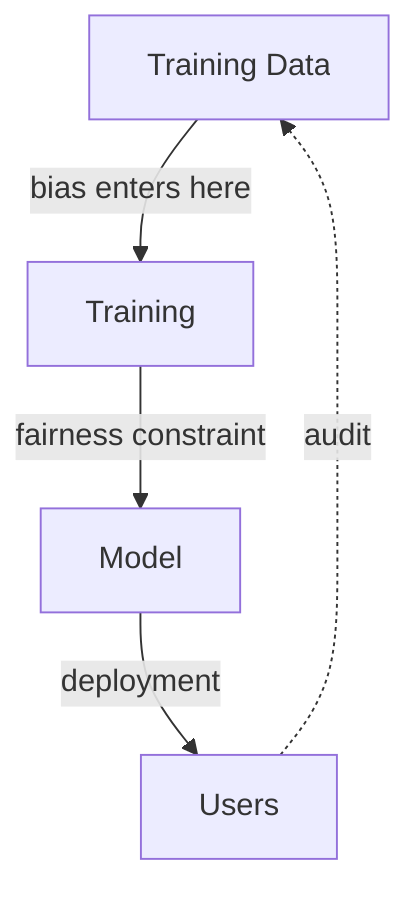

# Responsible AI and Failure Modes

The ways a working model causes harm, and the ones an engineer can actually engineer against. Fairness, privacy, and security are design constraints with concrete, testable properties — not a review step bolted on at the end, and not something achieved by good intentions alone.

:::info[Key idea]
Fairness, privacy, and security are design constraints with concrete tests - not a review step at the end.
:::

## Bias sources: historical, representation, measurement, aggregation, deployment

**Historical bias**: the training data reflects real-world inequities that existed before the model — a model trained on biased historical hiring decisions learns to reproduce that bias. **Representation bias**: some groups are systematically under- or over-represented in the training data. **Measurement bias**: the features or labels themselves measure different things for different groups (a proxy that's a worse proxy for one group than another). **Aggregation bias**: a single model applied uniformly to groups with genuinely different underlying relationships performs worse for whichever group the model implicitly fits less well. **Deployment bias**: the model performs as designed, but the way it's actually *used* in practice differs from its intended, validated use case.

## Fairness definitions, and the impossibility result

**Demographic parity**: the positive prediction rate should be equal across groups. **Equalised odds**: the true-positive and false-positive rates should be equal across groups. **Calibration within groups**: among predictions of a given score, the actual outcome rate should be the same across groups. A well-known **impossibility result** proves that (except in degenerate special cases) these definitions cannot all be satisfied simultaneously when base rates genuinely differ across groups — there is no universally "correct" fairness definition; choosing one is an explicit, consequential decision, not a solved technical problem.

## Choosing a definition from the decision context

Which fairness definition is appropriate depends on the actual decision being made and its consequences — a loan-approval system and a medical-screening system may reasonably prioritise different definitions, because the cost asymmetry between false positives and false negatives differs, and because the intended remedy for unfairness differs. This choice should be made deliberately and documented, not defaulted to whichever definition is easiest to compute.

## Measuring disparity per group, and the sample-size problem in small groups

Computing any fairness metric separately per demographic group runs into the same [Offline Evaluation](./offline-evaluation.md)'s slice-based evaluation challenge — a small group's metric estimate has wide uncertainty from limited sample size alone, and an apparent disparity in a small group may not be statistically distinguishable from noise without confidence intervals reported alongside it.

## Mitigations at each stage

**Pre-processing**: modify the training data itself (re-weighting, re-sampling) before training. **In-processing**: incorporate a fairness constraint or penalty directly into the training objective. **Post-processing**: adjust the model's decision threshold per group after training, without retraining the model itself — often the simplest to implement, though it can raise its own questions about applying different thresholds to different groups.

## Privacy: PII handling, data minimisation, and what a model can memorise

Personally identifiable information (PII) requires explicit handling policy throughout the pipeline — collection, storage, and especially what a trained model can leak back out. **Data minimisation**: collect and retain only what's genuinely needed, reducing exposure if something does go wrong. Neural networks, particularly large ones trained with limited data or many epochs, can **memorise** specific training examples verbatim, which becomes directly relevant to the next two risks.

## Membership inference and training-data extraction, stated concretely

**Membership inference**: an attacker determines whether a specific individual's data was part of the training set at all, purely by querying the trained model — a privacy leak even without extracting any content. **Training-data extraction**: an attacker recovers actual verbatim training examples (sensitive text, an image) from a trained model's outputs — a documented, real risk, particularly for large models trained on less-curated data.

## Differential privacy at a conceptual level, and its accuracy cost

**Differential privacy** adds carefully calibrated noise during training such that the trained model's output is provably insensitive to whether any single individual's data was included or excluded — a strong, mathematically precise privacy guarantee. The cost: the added noise directly reduces model accuracy, and the privacy/accuracy trade-off (controlled by a privacy budget parameter) needs to be chosen deliberately based on how sensitive the data actually is.

## Security: adversarial examples, data poisoning, model extraction, prompt injection

**Adversarial examples**: inputs deliberately, often imperceptibly, perturbed to cause a misclassification — a genuine security concern for models exposed to adversarial users. **Data poisoning**: an attacker injects malicious examples into the training data to corrupt the trained model's behaviour. **Model extraction**: an attacker reconstructs a functionally similar copy of a model by querying it repeatedly — a real risk for models exposed via a public API. **Prompt injection for LLM systems**: covered fully in [Security](../langchain/10-deployment/security.md) — malicious input designed to override an LLM system's intended instructions.

## Interpretability as an accountability requirement

Beyond debugging value, interpretability is often an explicit accountability and compliance requirement — being able to explain *why* a model made a specific consequential decision, in terms a human can evaluate, is sometimes a legal or regulatory necessity, not merely a nice-to-have engineering convenience.

## Documentation: model cards and dataset datasheets

[Model Registry and Packaging](./model-registry-and-packaging.md)'s model card, and its data-side counterpart, a **datasheet** documenting a dataset's provenance, collection methodology, and known limitations — both exist specifically so someone deciding whether to reuse a model or dataset for a new purpose has the information needed to judge whether it's actually appropriate for that purpose.

## An audit checklist to run before launch

1. Has the fairness definition appropriate to this decision context been explicitly chosen and documented?
2. Has per-group performance been measured with confidence intervals accounting for small-group sample sizes?
3. Is there a documented PII handling and data minimisation policy?
4. Has the model been tested against realistic adversarial inputs relevant to its exposure?
5. Do a model card and dataset datasheet exist and accurately reflect the model's actual limitations?



| Symbol | Meaning |
|---|---|
| demographic parity | equal positive-prediction rate across groups |
| equalised odds | equal true/false-positive rates across groups |

## Code: per-group fairness metrics disagreeing, and a threshold-adjustment mitigation

```python title="responsible_ai_demo.py"
import numpy as np
from sklearn.linear_model import LogisticRegression
from sklearn.metrics import confusion_matrix

rng = np.random.default_rng(0)
n = 2000

# --- Synthetic dataset with an engineered disparity between two groups ---
group = rng.integers(0, 2, n)  # 0 or 1
base_feature = rng.normal(0, 1, n)
# Group 1 has a systematically lower base rate, engineered into the labels
true_label = (base_feature + rng.normal(0, 1, n) + np.where(group == 1, -0.8, 0.0) > 0).astype(int)
X = np.stack([base_feature, group], axis=1)

model = LogisticRegression().fit(X[:, :1], true_label)  # trained WITHOUT group as a feature
scores = model.predict_proba(X[:, :1])[:, 1]
predictions = (scores > 0.5).astype(int)

def group_metrics(y_true, y_pred, group_mask):
    tn, fp, fn, tp = confusion_matrix(y_true[group_mask], y_pred[group_mask]).ravel()
    return {
        "positive_rate": (tp + fp) / group_mask.sum(),
        "tpr": tp / (tp + fn) if (tp + fn) > 0 else None,
        "fpr": fp / (fp + tn) if (fp + tn) > 0 else None,
    }

metrics_group0 = group_metrics(true_label, predictions, group == 0)
metrics_group1 = group_metrics(true_label, predictions, group == 1)
print("group 0:", {k: round(v, 3) for k, v in metrics_group0.items()})
print("group 1:", {k: round(v, 3) for k, v in metrics_group1.items()})
print(f"\ndemographic parity gap (positive rate): "
      f"{abs(metrics_group0['positive_rate'] - metrics_group1['positive_rate']):.3f}")
print(f"equalised odds gap (TPR): {abs(metrics_group0['tpr'] - metrics_group1['tpr']):.3f}")

# --- Post-processing mitigation: per-group threshold adjustment, accuracy cost measured ---
def find_threshold_for_target_rate(scores_subset, target_rate):
    return np.quantile(scores_subset, 1 - target_rate)

overall_positive_rate = predictions.mean()
threshold_group1 = find_threshold_for_target_rate(scores[group == 1], overall_positive_rate)
adjusted_predictions = predictions.copy()
adjusted_predictions[group == 1] = (scores[group == 1] > threshold_group1).astype(int)

original_accuracy = (predictions == true_label).mean()
adjusted_accuracy = (adjusted_predictions == true_label).mean()
adjusted_gap = abs(
    group_metrics(true_label, adjusted_predictions, group == 0)["positive_rate"]
    - group_metrics(true_label, adjusted_predictions, group == 1)["positive_rate"]
)
print(f"\nafter threshold adjustment: demographic parity gap={adjusted_gap:.3f} "
      f"(was {abs(metrics_group0['positive_rate'] - metrics_group1['positive_rate']):.3f})")
print(f"accuracy cost: {original_accuracy:.3f} -> {adjusted_accuracy:.3f}")
```

## See also

- [Offline Evaluation](./offline-evaluation.md) — the slice-based evaluation infrastructure fairness auditing reuses directly.
- [Security](../langchain/10-deployment/security.md) — prompt injection and LLM-specific security risks, covered in depth.
